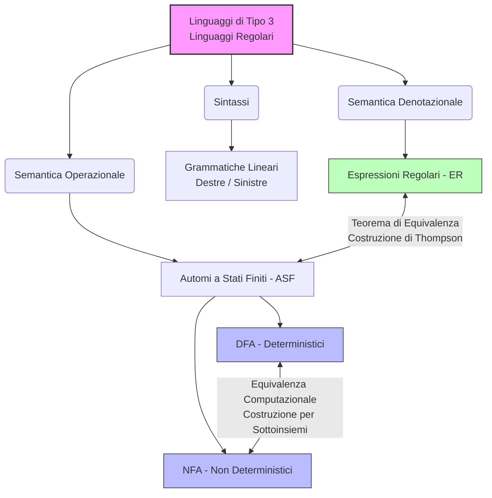
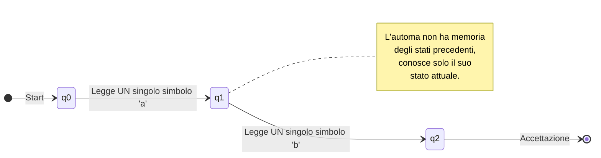
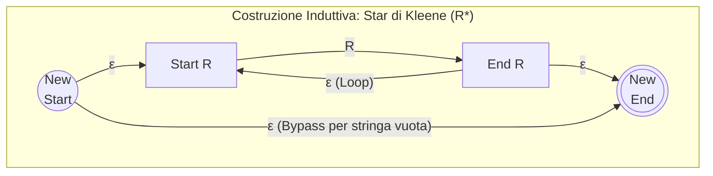

### Panoramica Teorica
All'interno della Gerarchia di Chomsky, i **Linguaggi Regolari** (o Linguaggi di Tipo 3) costituiscono la classe più ristretta, rigida e fondamentale della teoria della computazione. Questa classe descrive l'insieme dei linguaggi formali che possono essere generati da grammatiche con stringenti restrizioni sintattiche sulle regole di produzione (forma lineare destra o sinistra).

Da un punto di vista sistemico, i linguaggi regolari sono il limite inferiore della capacità computazionale: i modelli astratti che li riconoscono operano in assenza totale di memoria ausiliaria. L'informazione computazionale è interamente codificata nello stato corrente del sistema, impedendo a tali modelli di tenere traccia di relazioni di bilanciamento, dipendenze annidate o di effettuare conteggi (i cosiddetti "conteggi intrecciati"). Essi sono, tuttavia, lo strumento d'elezione per l'analisi lessicale (tokenizzazione) nello sviluppo di compilatori e per il pattern matching di regolarità strutturali semplici.

---

## Cosa sono i linguaggi regolari e quali sono le caratteristiche del relativo automa (specificando quanti simboli vengono letti per volta)?

I **linguaggi regolari** sono linguaggi formali generabili da grammatiche di Tipo 3, riconoscibili da Automi a Stati Finiti (ASF) e descrivibili compiutamente attraverso il formalismo algebrico delle Espressioni Regolari (ER). La loro natura è strettamente legata all'impossibilità di "contare": la mancanza di una memoria di lavoro esterna impedisce loro di riconoscere pattern come $a^n b^n$, che richiederebbero di memorizzare il numero di occorrenze di un simbolo per confrontarlo con un altro.

Il relativo automa riconoscitore, l'**Automa a Stati Finiti (ASF)**, riflette questa limitazione. Un ASF è una macchina astratta dotata unicamente di una memoria finita e intrinseca, che corrisponde allo **stato** in cui la macchina si trova in un dato istante.

Per quanto concerne l'assimilazione dell'input, la dinamica operativa dell'automa è strettamente sequenziale e limitata: la macchina elabora la stringa in ingresso **rigorosamente simbolo per simbolo**. Questo significa che, a ogni transizione computazionale (step), l'automa è in grado di leggere esattamente **un solo simbolo** alla volta dall'alfabeto di input. Sulla base di quest'unico simbolo in ingresso e dello stato di controllo corrente, la funzione di transizione determina il passaggio univoco (nel caso deterministico) o molteplice (nel caso non deterministico) allo stato o agli stati successivi.

---

## C'è differenza di potenza di calcolo tra DFA e NFA? Spiega le differenze in termini di taglia e numero di stati.

Da un punto di vista dell'Informatica Teorica, la risposta è tassativa: **non c'è alcuna differenza di potenza di calcolo tra un Automa a Stati Finiti Deterministico (DFA) e uno Non Deterministico (NFA)**. Entrambi i formalismi riconoscono esattamente la medesima classe, ovvero quella dei Linguaggi Regolari. L'NFA non è in grado di risolvere problemi intrinsecamente più complessi o di decidere linguaggi che un DFA non possa decidere. 

La differenza fondamentale risiede, invece, nell'**espressività** e nella **complessità spaziale (taglia o dimensione dell'automa)**. 
Un NFA adotta un modello di computazione "in parallelo": a fronte di uno stato e di un singolo simbolo, la macchina può diramare l'esecuzione transitando verso un insieme molteplice di stati (la funzione di transizione mappa su $2^Q$, l'insieme potenza degli stati), "clonando" virtualmente se stessa per esplorare più percorsi simultaneamente. Questa flessibilità permette agli NFA di essere strutturalmente molto più compatti, intuitivi e facili da progettare rispetto ai DFA equivalenti.

La traduzione di un NFA in un DFA avviene tramite un algoritmo deterministico noto come **Costruzione per Sottoinsiemi (Subset Construction)**. Il principio sistemico alla base è che il DFA simula il parallelismo dell'NFA memorizzando, nel suo singolo stato corrente, l'intero *insieme* degli stati in cui i "cloni" dell'NFA si troverebbero. 
Tale processo comporta un'esplosione combinatoria della taglia:
* Se un NFA possiede $|Q| = n$ stati, il DFA equivalente, nel caso pessimo, dovrà mappare l'intero insieme potenza dell'NFA.
* Di conseguenza, il numero di stati del DFA può crescere in modo esponenziale, arrivando fino a **$2^n$ stati**.

In sintesi, l'introduzione del non determinismo al livello 3 della Gerarchia di Chomsky non genera un salto di classe computazionale, ma offre una compressione esponenziale della topologia dell'automa.

---

## Dimostrazione dell'equivalenza tra un automa a stati finiti e un'espressione regolare.

Le Espressioni Regolari (ER) costituiscono il formalismo denotazionale e algebrico per la classe di Tipo 3. Il teorema di equivalenza stabilisce una simmetria perfetta: un linguaggio $L$ è riconosciuto da un DFA se e solo se esiste un'espressione regolare $R$ tale che $L = L(R)$. La dimostrazione costruttiva di questa equivalenza (nella direzione ER $\rightarrow$ NFA) avviene per **induzione strutturale** sulla complessità dell'espressione, avvalendosi di $\epsilon$-NFA (automi con transizioni spontanee che non alterano la potenza di calcolo). 

La dimostrazione si articola costruendo automi dotati sistematicamente di un solo stato iniziale privo di archi in ingresso e un solo stato finale privo di archi in uscita.

**Spiegazione Concettuale:**
Il processo si fonda sulla scomposizione dell'espressione nei suoi operatori atomici (Base) e successivi assemblaggi logici (Passo Induttivo). Ogni operatore (Unione, Concatenazione, Star di Kleene) viene mappato su uno specifico pattern architetturale (pattern di Thompson) che integra i sotto-automi tramite transizioni vuote ($\epsilon$), garantendo la modularità.

**Formalismo e Dimostrazione Costruttiva:**

**1. Casi Base:**
Si dimostra banalmente che per gli elementi atomici $\epsilon$, $\emptyset$, o per un simbolo $a \in \Sigma$, esistono automi minimali a due stati (uno iniziale e uno accettante):
* Per $\epsilon$: connessi da un arco etichettato $\epsilon$.
* Per $\emptyset$: nessun arco connette i due stati.
* Per $a$: connessi da un singolo arco etichettato $a$.

**2. Passo Induttivo (Composizione degli Operatori):**
Assumendo per ipotesi induttiva che per due espressioni regolari $R$ e $S$ esistano i rispettivi automi simulatori, si dimostra la costruttibilità dei tre operatori relazionali :

* **Unione ($R+S$):** Si introducono un nuovo stato iniziale e un nuovo stato finale globale. Dal nuovo stato iniziale partono due $\epsilon$-transizioni in parallelo verso gli stati iniziali dei sotto-automi $R$ e $S$. Dagli stati accettanti di $R$ e $S$, due $\epsilon$-transizioni convergono verso il nuovo stato finale.
* **Concatenazione ($RS$):** Si innesta l'automa $R$ in serie all'automa $S$. Lo stato finale di $R$ viene collegato mediante una $\epsilon$-transizione allo stato iniziale di $S$.
* **Chiusura di Kleene / Star ($R^*$):** Si richiede un nuovo stato iniziale e uno finale. Per implementare la ricorsione illimitata, dallo stato finale del sotto-automa $R$ si genera un arco di ritorno (feedback loop) tramite $\epsilon$-transizione verso il suo stato iniziale. Per modellare l'accettazione della stringa vuota (iterazione zero), si stende un'ulteriore $\epsilon$-transizione diretta (bypass) dal nuovo stato iniziale globale direttamente al nuovo stato finale globale, scavalcando interamente il blocco $R$.

