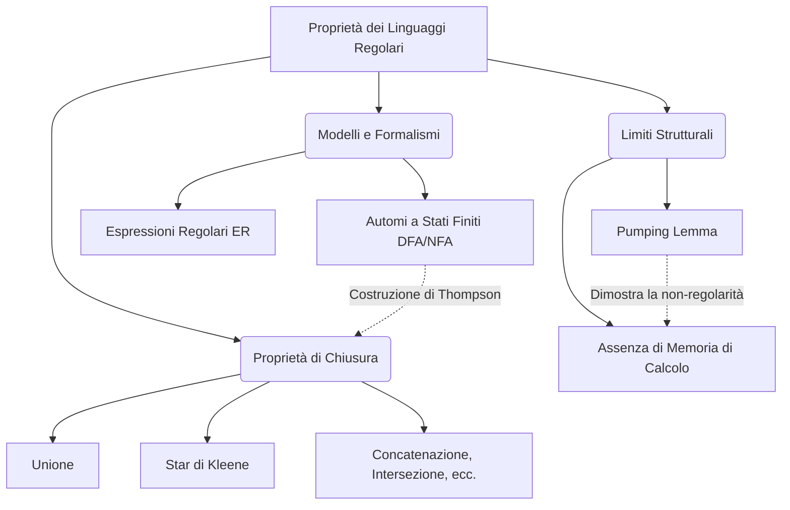
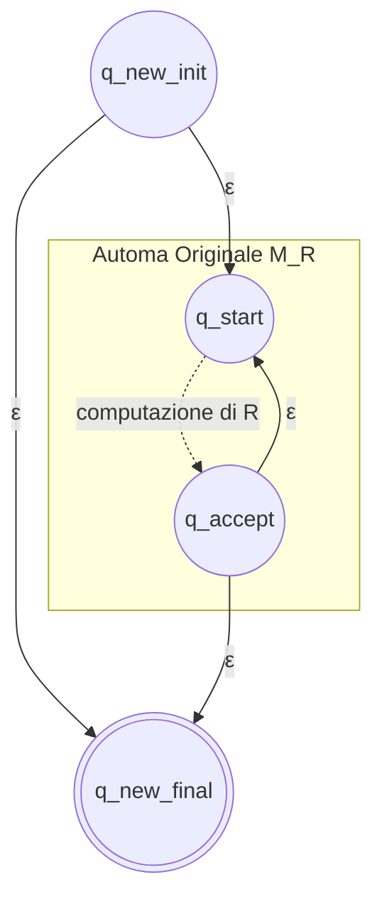
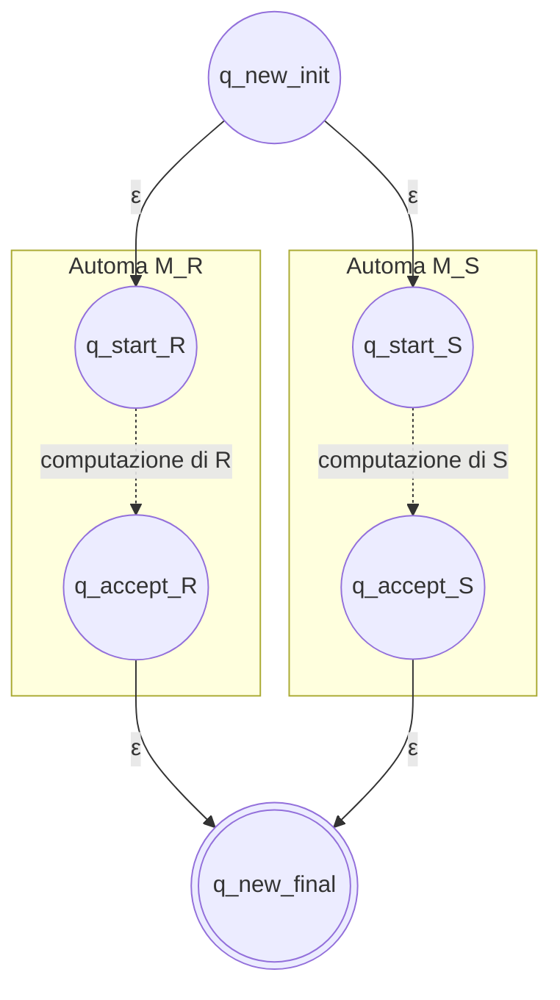

**Panoramica Teorica**

Nello studio della Gerarchia di Chomsky, i linguaggi di Tipo 3, ovvero i **Linguaggi Regolari**, rappresentano il livello fondazionale e più restrittivo della teoria della computazione. Da una prospettiva sistemica, questi linguaggi descrivono processi che possono essere risolti da architetture dotate di un controllo a stati finiti ma **completamente prive di memoria ausiliaria**. Questa assenza di uno spazio di archiviazione (come una pila o un nastro) implica che i modelli riconoscitori associati—gli Automi a Stati Finiti (ASF)—non siano in grado di "contare" o tracciare dipendenze annidate e bilanciate. Un automa finito si limita a transire da uno stato all'altro in funzione dell'input corrente, rendendo i linguaggi regolari lo strumento matematico perfetto per il *pattern matching* e per l'analisi lessicale nei compilatori. 

La robustezza di questa classe linguistica si riflette nelle sue **proprietà di chiusura**: i linguaggi regolari si mantengono inalterati (ovvero, il risultato delle operazioni genera un linguaggio ancora regolare) sotto l'applicazione di numerose trasformazioni insiemistiche e algebriche, tra cui l'unione, la concatenazione, la Star di Kleene, l'intersezione e la complementazione. Tuttavia, l'assenza intrinseca di memoria pone dei limiti drastici alla loro espressività, limiti che vengono formalizzati in modo rigoroso tramite il *Pumping Lemma*, una condizione necessaria che governa la struttura di ogni stringa sufficientemente lunga all'interno del linguaggio.

---

## Enunciato e spiegazione del Pumping Lemma per linguaggi regolari

**Spiegazione Concettuale**
Il Pumping Lemma rappresenta l'espressione formale del limite cognitivo di una macchina a stati finiti. Qualsiasi hardware o sistema informatico dotato di un numero finito di stati, qualora venga sottoposto a una sequenza di input di lunghezza superiore al numero dei suoi stati interni, si troverà inevitabilmente a dover "riutilizzare" una porzione di memoria già visitata. In termini logici, ciò innesca un ciclo (loop) nel flusso di esecuzione. 

Poiché la macchina non dispone di un contatore esterno per ricordare quante volte ha percorso questo ciclo, essa non è in grado di distinguere una singola esecuzione del ciclo da una sua ripetizione arbitraria. Ne consegue che, se una stringa contenente tale ciclo viene accettata, il sistema dovrà necessariamente accettare anche tutte le stringhe generate "pompando" (ripetendo o rimuovendo) il ciclo stesso all'infinito. 
Questo principio viene impiegato tipicamente in un processo di dimostrazione per assurdo (come un "gioco a due" strategico) per smentire la regolarità di un linguaggio: qualora si riesca a dimostrare che il pompaggio di un inevitabile ciclo genera una stringa che viola le regole del linguaggio, si certifica l'assenza di regolarità e la necessità di una memoria superiore.

**Formalismo e Dimostrazione**
*Enunciato del Pumping Lemma:*
Sia $L$ un linguaggio regolare. Allora esiste una costante intera $n > 0$ (dipendente da $L$, detta costante di pumping) tale che ogni stringa $w \in L$ con $|w| \ge n$ può essere scomposta in tre sottostringhe, $w = xyz$, tali che siano rispettate rigorosamente tre condizioni :
1. $y \neq \epsilon$ (ovvero $|y| \ge 1$).
2. $|xy| \le n$.
3. $\forall k \ge 0, \ xy^kz \in L$.

*Dimostrazione tramite il Principio della Colombaia (Pigeonhole Principle):*
Se $L$ è regolare, ammette un Automa a Stati Finiti deterministico (DFA) minimale che lo riconosce, dotato di esattamente $n$ stati. Consideriamo una stringa $w = a_1 a_2 \dots a_m \in L$ tale che $m \ge n$.
Elaborando la stringa $w$, l'automa parte dallo stato iniziale $q_0$ ed esegue $m$ transizioni, attraversando un totale di $m + 1$ stati. 
Poiché $m \ge n$, si ha che $m + 1 > n$. Per il Principio della Colombaia, se si devono allocare $m+1$ elementi in $n$ contenitori, almeno un contenitore deve ospitare più di un elemento. Pertanto, l'automa deve inevitabilmente transitare almeno due volte per uno stesso stato $p_i = p_j$ (con $0 \le i < j \le n$), palesando un ciclo.
La scomposizione della stringa è la seguente:
* $x$: il prefisso che conduce da $q_0$ al primo ingresso nello stato ciclico $p_i$.
* $y$: la sottostringa consumata nel ciclo tra $p_i$ e il suo ritorno in $p_j$ (poiché consuma transizioni, $y \neq \epsilon$; siccome il ciclo si chiude entro le prime $n$ transizioni, $|xy| \le n$).
* $z$: il suffisso che conduce dal ciclo allo stato finale di accettazione.
Ripetendo il percorso ciclico $k$ volte, la computazione riemergerà sempre in $p_i$ e da lì seguirà infallibilmente $z$ verso l'accettazione, dimostrando che $xy^kz \in L$.

*Esempio applicativo di Indecidibilità Regolare:*
Per dimostrare che il linguaggio dei quadrati perfetti $L = \{1^k \mid k \text{ è un quadrato perfetto}\}$ non è regolare, supponiamo per assurdo lo sia e scegliamo $w = 1^{n^2}$. Frazionando $w=xyz$, sappiamo che $1 \le |y| \le n$. Pompando con $k=2$, la nuova stringa è $xy^2z$, avente dimensione $n^2 + |y|$. Poiché $n^2 < n^2 + |y| \le n^2 + n$, e sapendo che il successivo quadrato perfetto matematico è $(n+1)^2 = n^2 + 2n + 1$, la stringa pompata cade nello spazio vuoto tra due quadrati perfetti, dimostrando l'assurdo e la non regolarità del linguaggio.

---

## Dimostrare la chiusura dei linguaggi regolari rispetto all'operazione Star di Kleene

**Spiegazione Concettuale**
La "Star di Kleene" (chiusura) è un operatore che modella la ripetizione indefinita—da zero a infinite volte—di un pattern computazionale. Da un punto di vista dell'architettura di sistema, dimostrare la chiusura rispetto a questa operazione significa poter prendere una macchina $A$ (che computa un singolo task) e inglobarla in una super-macchina capace di eseguire quel task ricorsivamente, in loop continui, oltre alla possibilità di ignorarlo del tutto (accettando istantaneamente l'input nullo). 

Per attuare questa simulazione architetturale senza aggiungere capacità di memoria (mantenendoci nei confini della regolarità), ci avvaliamo dell'astrazione degli $\epsilon$-NFA (Automi Non Deterministici con transizioni spontanee). Le $\epsilon$-transizioni agiscono come "salti liberi" nel grafo di controllo che non consumano i simboli della stringa di input. Esse ci permettono di creare circuiti di retroazione (feedback loop) che re-indirizzano l'esito finale dell'automa verso il suo punto d'ingresso iniziale, implementando la ricorsività in totale compatibilità con il modello a stati finiti.

**Formalismo e Dimostrazione (Costruzione di Thompson)**
Sia $L$ un linguaggio regolare. In quanto tale, esiste un automa a stati finiti che lo riconosce. Per simmetria con l'algebra delle espressioni regolari (che attesta che se un'espressione $R$ è regolare, lo è anche $R^*$ ), dimostriamo costruttivamente l'equivalenza generando l'automa per la Star di Kleene.

Sia $M_R = (Q, \Sigma, \delta, q_{start}, \{q_{accept}\})$ un $\epsilon$-NFA che accetta $L(R)$. 
Costruiamo un nuovo automa $M_{R^*} = (Q', \Sigma, \delta', q_{new\_init}, \{q_{new\_final}\})$ nel seguente modo :
1. Si creano due nuovi stati esclusivi: un nuovo stato iniziale $q_{new\_init}$ e un nuovo stato finale $q_{new\_final}$.
2. Si inserisce una $\epsilon$-transizione da $q_{new\_init}$ al vecchio stato iniziale $q_{start}$ di $M_R$ per avviare la normale computazione.
3. Per garantire la ripetizione in loop, dallo stato accettante $q_{accept}$ di $M_R$ si traccia una $\epsilon$-transizione di ritorno (feedback) verso il vecchio stato iniziale $q_{start}$.
4. Per consentire la terminazione del singolo blocco processato, si aggiunge una $\epsilon$-transizione da $q_{accept}$ di $M_R$ verso il nuovo stato finale $q_{new\_final}$.
5. Per garantire l'accettazione della stringa vuota (ripetizione zero volte della Star), si applica una $\epsilon$-transizione diretta dal nuovo stato iniziale $q_{new\_init}$ al nuovo stato finale $q_{new\_final}$, bypassando totalmente l'automa $M_R$.

L'automa risultante, pur facendo uso del non determinismo $\epsilon$, è matematicamente equivalente ad un DFA e riconosce rigorosamente il linguaggio $L^*$, provandone la regolarità costruttiva.

---

## Dimostrare che l'unione di due linguaggi regolari genera un linguaggio regolare

**Spiegazione Concettuale**
L'operazione logica di unione ($L_1 \cup L_2$) corrisponde concettualmente al parallelismo condizionale (uno scenario logico di *OR*): una stringa di input viene considerata valida se soddisfa il modello comportamentale della macchina $M_1$ *oppure* della macchina $M_2$. 
Poiché un Automa a Stati Finiti "standard" legge l'input linearmente, sembrerebbe incapace di testare la stringa su due modelli differenti in contemporanea senza possedere memoria. Tuttavia, grazie all'impiego del non determinismo strutturale, possiamo fondere le due macchine in un unico macro-sistema capace di esplorare simultaneamente più rami computazionali ("clonazione" della macchina ai bivi). Inviando la computazione in parallelo verso entrambi i sub-automi, e aggregando i loro esiti, il sistema globale garantisce la corretta classificazione di appartenenza alla disgiunzione logica, rimanendo strettamente nella classe regolare.

**Formalismo e Dimostrazione (Costruzione di Thompson)**
Siano $L_1$ e $L_2$ due linguaggi regolari. Esisteranno pertanto due $\epsilon$-NFA, rispettivamente $M_{R} = (Q_R, \Sigma, \delta_R, q_{start\_R}, \{q_{accept\_R}\})$ e $M_{S} = (Q_S, \Sigma, \delta_S, q_{start\_S}, \{q_{accept\_S}\})$ che li riconoscono.
In parallelo all'algebra delle Espressioni Regolari (ove $L(E_1 + E_2) = L(E_1) \cup L(E_2)$ ), dimostriamo la chiusura costruendo un nuovo $\epsilon$-NFA $M_{U}$ per l'unione $R + S$.

La costruzione procede come segue:
1. Si definiscono un nuovo stato iniziale unificato $q_{new\_init}$ e un nuovo stato finale unificato $q_{new\_final}$.
2. Dal nuovo stato iniziale $q_{new\_init}$, si innescano due $\epsilon$-transizioni simultanee (ramificazione non deterministica): una diretta verso lo stato iniziale di $M_R$ ($q_{start\_R}$) e l'altra verso lo stato iniziale di $M_S$ ($q_{start\_S}$).
3. I due automi originali operano in totale parallelismo senza subire alterazioni interne.
4. Dagli stati accettanti originali di entrambi i sub-automi ($q_{accept\_R}$ e $q_{accept\_S}$), si tracciano $\epsilon$-transizioni in uscita che convergono unicamente verso il nuovo stato finale $q_{new\_final}$.

Questa macro-struttura garantisce che, se la stringa in input possiede un cammino valido in almeno uno dei due sub-automi originari, l'$\epsilon$-NFA globale generato riuscirà a transire nel nuovo stato finale. Avendo costruito un automa finito valido per l'unione, il teorema di chiusura rispetto all'unione è rigorosamente dimostrato.

