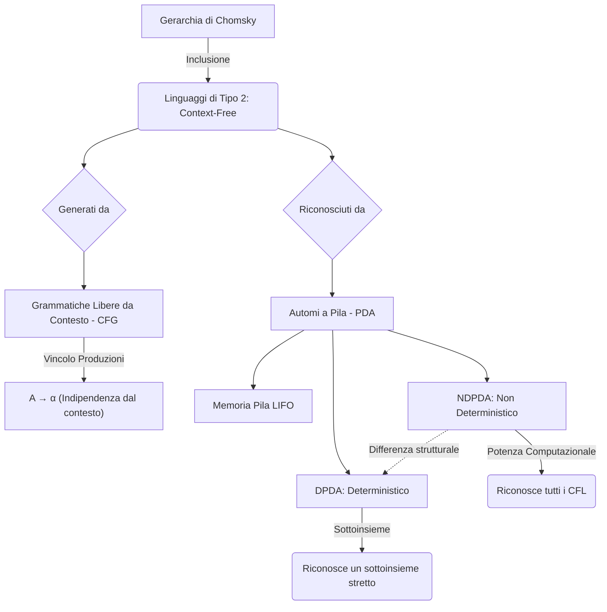
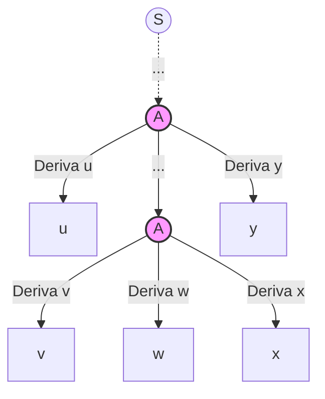

**Panoramica Teorica**
All'interno della Gerarchia di Chomsky, i Linguaggi Liberi da Contesto (CFL, o Linguaggi di Tipo 2) occupano un livello di astrazione e potenza computazionale intermedio, strettamente inclusi nei linguaggi dipendenti dal contesto (Tipo 1) e contenenti come sottoinsieme proprio i linguaggi regolari (Tipo 3). 
A livello generativo, questi linguaggi sono definiti da Grammatiche Libere da Contesto (CFG), la cui peculiarità sintattica impone che ogni produzione assuma la forma $A \to \alpha$, dove $A$ è un singolo simbolo non terminale e $\alpha$ è una sequenza di terminali e/o non terminali. Tale vincolo garantisce l'assoluta "indipendenza dal contesto": la variabile $A$ può essere sostituita ovunque compaia, senza alcuna dipendenza dai prefissi o suffissi adiacenti.

A livello riconoscitivo, il modello computazionale associato ai CFL è l'Automa a Pila (Push Down Automata, PDA). A differenza degli Automi a Stati Finiti, confinati a una memoria intrinseca nello stato, i PDA possiedono una memoria di lavoro illimitata accessibile rigorosamente tramite politica LIFO (Last In, First Out). Questa architettura conferisce alla macchina la capacità sistemica di "contare due cose" simultaneamente instaurando un legame funzionale tra esse (come nel caso del bilanciamento $a^n b^n$ o del riconoscimento di stringhe palindrome), ovviando all'incapacità combinatoria del modello regolare. Tuttavia, tale architettura risulta insufficiente per problemi computazionali che richiedono conteggi tripartiti (es. $a^n b^n c^n$) o strutture intrecciate.

---

## Enunciato e spiegazione del Pumping Lemma per linguaggi liberi dal contesto (CFL)

Il Pumping Lemma per i Linguaggi Liberi dal Contesto rappresenta la condizione necessaria primordiale affinché un linguaggio appartenga alla classe di Tipo 2, e funge da strumento logico per smentirne, per contraddizione, l'appartenenza. 

**Spiegazione Concettuale**
Da un punto di vista analitico, il Lemma può essere interpretato come un gioco strategico e logico tra due entità: un ipotetico avversario che asserisce la natura *Context-Free* del linguaggio e noi che vogliamo confutarla. Se un linguaggio è generabile da una grammatica libera da contesto, esso deve possedere una regolarità strutturale nascosta nelle stringhe sufficientemente lunghe. Nello specifico, isolando una stringa che superi una certa lunghezza critica di "saturazione" (la costante di pumping), l'albero sintattico che la deriva deve essere così profondo da forzare la ripetizione di pattern. 
Ciò si traduce nella possibilità di estrapolare due frammenti centrali e distinti all'interno della stringa, i quali possono essere iterati (pompati verso l'alto) o collassati (pompati verso il basso) simultaneamente per un numero arbitrario di volte. Affinché il linguaggio si confermi libero da contesto, ogni perturbazione indotta da questo pompaggio simultaneo deve generare una nuova stringa che risieda ancora inequivocabilmente all'interno del linguaggio originale. Se si individua anche solo un caso in cui il pompaggio spezza la simmetria o le proporzioni della stringa esiliandola dal linguaggio, si giunge a un assurdo che attesta la non regolarità contestuale del linguaggio (es. $L = \{0^n 1^n 2^n \mid n \ge 1\}$ in cui il pompaggio altera la triplice proporzione logica).

**Formalismo ed Enunciato Matematico**
Sia $L$ un Linguaggio Libero da Contesto. Esiste una costante intera $n$ (che dipende strettamente dalla grammatica di $L$) tale che per ogni stringa $z \in L$ avente lunghezza $|z| \ge n$, esiste sempre una fattorizzazione di $z$ in 5 sottostringhe, $z = uvwxy$, che rispetta inderogabilmente le seguenti tre proprietà:
1. $|vwx| \le n$: La regione centrale pompabile e il suo nucleo possiedono una limitazione superiore di lunghezza. Questo assicura che le due porzioni di pompaggio non siano arbitrariamente distanti.
2. $vx \ne \epsilon$: Almeno uno dei due segmenti di pompaggio ($v$ o $x$) non è vuoto. Ciò garantisce che il pompaggio produca effettivamente nuove stringhe e modifichi la lunghezza.
3. $\forall i \ge 0, uv^i w x^i y \in L$: Ripetendo $i$ volte (o eliminando, con $i=0$) le porzioni $v$ e $x$, la stringa perturbata appartiene ancora al linguaggio $L$.

---

## Perché nel Pumping Lemma c’è la ripetizione di un simbolo non terminale? Spiega il concetto tramite il Principio della Piccionaia applicato all'altezza dell'albero di derivazione

La genesi teorica delle stringhe $v$ e $x$ del Pumping Lemma riposa sulle proprietà topologiche degli alberi sintattici (Parse Trees), osservabili convertendo la grammatica nella Forma Normale di Chomsky (CNF). In CNF, le produzioni assumono una forma binaria stretta ($A \to BC$ o $A \to a$), rendendo l'albero di derivazione un albero strettamente binario.

**Il Principio della Piccionaia e l'Altezza dell'Albero**
Sia $m$ la cardinalità dell'insieme dei simboli non terminali $V$ della grammatica. A causa del fattore di diramazione binario, l'albero può generare al massimo una stringa di lunghezza $2^m - 1$ senza che alcun simbolo non terminale si ripeta lungo alcun cammino che va dalla radice a una foglia. 
Tuttavia, il Lemma richiede di valutare stringhe di lunghezza critica $|z| \ge n$, dove convenzionalmente $n = 2^m$. Generare una stringa terminale di lunghezza $2^m$ o superiore richiede una frontiera fogliare più ampia, il che impone all'albero di acquisire un'altezza superiore a $m$. 

A questo punto subentra il **Principio della Piccionaia** (Pigeonhole Principle): se esiste un cammino nell'albero di lunghezza superiore a $m$, e gli "scomparti" (le etichette univoche dei non terminali) sono solo $m$, almeno un simbolo non terminale (chiamiamolo $A$) deve **necessariamente ripetersi** lungo quel medesimo cammino.

**Conseguenze Logiche (Flusso Causa-Effetto):**
1. **L'occorrenza inferiore (più vicina alle foglie):** Questo nodo $A$ deriva esclusivamente una porzione centrale terminale, che denotiamo con la stringa $w$.
2. **L'occorrenza superiore (più vicina alla radice):** Questo nodo $A$ originario deriva una stringa terminale più lunga, che ingloba $w$ affiancata da due frammenti laterali terminali, da cui $vwx$.
3. Poiché il non terminale $A$ è formalmente in grado di derivare se stesso inserendo ai lati i frammenti $v$ e $x$ (ossia $A \Rightarrow^* vAx$), la logica generativa autorizza l'automa a innescare un ciclo (loop) ricorsivo sulla grammatica. Sostituendo ricorsivamente l'occorrenza di $A$ con se stessa, si accumulano copie multiple e simmetriche di $v$ e $x$, dimostrando inconfutabilmente l'asserzione $\forall i \ge 0, uv^i w x^i y \in L$.

---

## Un automa a pila deterministico è sempre equivalente a uno non deterministico? Smentisci l'affermazione dimostrando con un linguaggio separatore, come i palindromi

**Risposta Rigorosa:** No, l'affermazione è falsa. A differenza della classe dei linguaggi regolari, in cui l'introduzione del non determinismo non altera la potenza computazionale (NFA e DFA sono rigorosamente equivalenti tramite la Costruzione per Sottoinsiemi) nella classe dei linguaggi di Tipo 2 si assiste a una frattura strutturale incolmabile. L'Automa a Pila Non Deterministico (NDPDA) è **strettamente più potente** della sua variante Deterministica (DPDA). L'insieme dei linguaggi riconosciuti dai DPDA è un sottoinsieme proprio della classe dei CFL.

**Il Linguaggio Separatore: I Palindromi Senza Marcatore ($ww^R$)**
L'inadeguatezza del DPDA si evince analizzando il linguaggio formale dei palindromi pari privi di carattere separatore centrale, definito come $L = \{ww^R \mid w \in \Sigma^*\}$.
La meccanica di riconoscimento per una stringa simmetrica richiede che la macchina accumuli (tramite operazione di *push*) la prima metà della stringa sulla pila. Successivamente, giunta esattamente a metà dell'input, la macchina deve commutare il proprio stato interno per iniziare a scaricare la pila (*pop*), verificando che la seconda metà corrisponda all'immagine speculare della prima.

* **Il fallimento del DPDA:** Un automa a pila deterministico per compiere una mossa (e quindi una transizione) necessita di un input chiaro per determinare *quando* cessare il push e avviare il pop. Nella stringa $ww^R$, non esiste alcun carattere speciale (es. $c$ in $wcw^R$) che informi la macchina del superamento della metà esatta. Il DPDA non possiede facoltà predittive né oracoli; trovandosi di fronte al medesimo alfabeto, non sa deterministicamente in quale istante l'input transita da $w$ a $w^R$. Per tale motivo, il linguaggio $ww^R$ sfugge alla capacità del DPDA.
* **La risoluzione tramite NDPDA:** Il non determinismo dota l'automa della capacità di "clonare" lo stato della computazione. L'automa a pila non deterministico effettua un guessing: in ogni istante della lettura, genera parallelamente un ramo di computazione che assume di non aver raggiunto la metà (continuando il push) e un ramo che assume di trovarsi esattamente a metà (avviando il pop). La stragrande maggioranza di questi rami "scommetterà" in maniera errata e il loro calcolo divergerà (o fallirà per mismatch durante il pop); tuttavia, esattamente un clone indovinerà la metà esatta della stringa. Svuotando coerentemente la pila e consumando tutto l'input, quel ramo sopravviverà portando all'accettazione globale della stringa. 

Questa asimmetria dimostra che esistono linguaggi liberi da contesto che precludono risoluzioni deterministiche dirette, separando irrimediabilmente l'architettura NDPDA da quella DPDA.