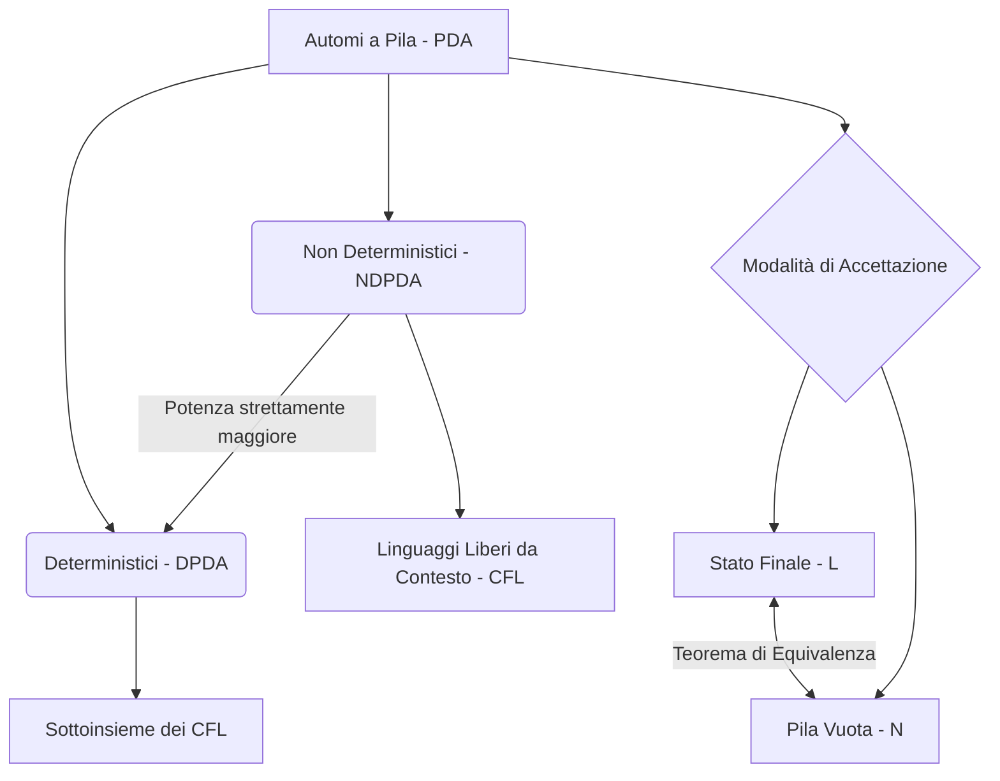
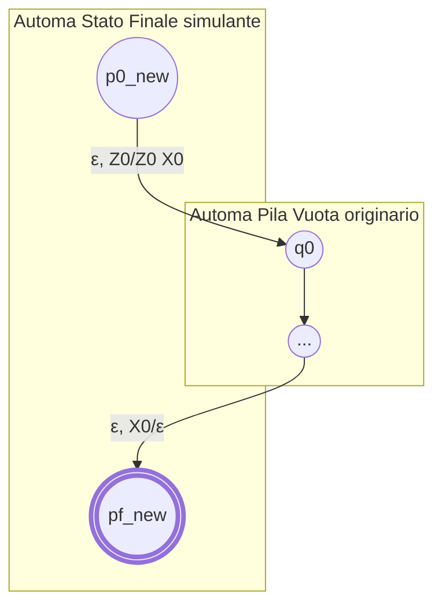

## 1.4 Approfondimento Automi a Pila

### Diagramma Concettuale

### Panoramica Teorica
Gli **Automi a Pila (Pushdown Automata - PDA)** costituiscono il modello computazionale astratto associato al riconoscimento della classe dei Linguaggi Liberi da Contesto (CFL, o linguaggi di Tipo 2 all'interno della Gerarchia di Chomsky). A differenza dei più semplici Automi a Stati Finiti, operanti in assenza di memoria ausiliaria, i PDA sono dotati di una memoria di capacità illimitata strutturata a pila (stack), governata da una rigorosa politica di accesso **LIFO** (Last In, First Out). Tale potenziamento architetturale conferisce al modello la capacità di "contare due cose", gestendo conteggi funzionali e dipendenze strutturali annidate (come il bilanciamento tra parentesi).

Da un punto di vista del formalismo matematico, un PDA è descritto compiutamente da una settupla $P = (Q, \Sigma, \Gamma, \delta, q_0, Z_0, F)$ :
* $Q$: Insieme finito degli stati del controllo centrale.
* $\Sigma$: Alfabeto finito dei simboli che compongono la stringa di input.
* $\Gamma$: Alfabeto finito della pila, potendo variare rispetto a $\Sigma$.
* $\delta$: Funzione di transizione, la cui segnatura $\delta: Q \times (\Sigma \cup \{\epsilon\}) \times \Gamma \to 2^{Q \times \Gamma^*}$ definisce le mosse consentite. Essa prende in ingresso lo stato corrente, il simbolo in lettura dall'input (o $\epsilon$) e il simbolo affiorante in cima (Top) alla pila, restituendo un sottoinsieme di possibili coppie di transizione e riscrittura.
* $q_0$: Stato iniziale di partenza ($q_0 \in Q$).
* $Z_0$: Simbolo iniziale della pila (usato convenzionalmente come marcatore di fondo o "tappo", con $Z_0 \in \Gamma$).
* $F$: Insieme degli stati accettanti o finali ($F \subseteq Q$).

L'evoluzione computazionale del sistema viene ritratta per mezzo della **Descrizione Istantanea (ID)**, definita dalla tripla $(q, w, \gamma)$, che codifica l'intero stato dinamico fotografando lo stato corrente $q$, l'input residuo $w$ e l'intero contenuto della pila $\gamma$ (ove il primo elemento a sinistra identifica la cima). Sussiste inoltre un principio sistemico fondamentale: l'automa delibera esclusivamente avvalendosi del simbolo in lettura e del simbolo Top dello stack; il contenuto profondo e preesistente nel nastro input o nella pila risulta interamente ininfluente sulla validità logica del singolo passaggio.

---

## Perché un automa a pila deterministico non è sufficiente per riconoscere il linguaggio della stringa $ww^R$? Fornisci la dimostrazione.

Nella classe dei linguaggi di Tipo 2 risiede un'importante asimmetria strutturale: gli Automi a Pila Non Deterministici (NDPDA) sono strettamente più potenti della loro controparte puramente deterministica (DPDA). Esistono infatti Linguaggi Liberi da Contesto intrinsecamente non riconoscibili in assenza di non determinismo. 

Il linguaggio dei palindromi pari senza un marcatore centrale esplicito, denotato dalla forma $L = \{ww^R \mid w \in \Sigma^*\}$ (ovvero una sequenza $w$ immediatamente seguita dal suo speculare $w^R$), ne rappresenta la dimostrazione per eccellenza.

**Spiegazione Accademica e Relazione Logico-Strutturale:**
Affinché un automa a pila possa computare una struttura simmetrica di tipo speculare, è costretto a suddividere l'elaborazione in due stadi funzionali ineludibili:
1. Impilamento (Push) sequenziale sullo stack di tutta la prima emi-stringa ($w$).
2. Cambio di stato logico seguito dall'estrazione (Pop) in cascata dei simboli impilati, testando una perfetta corrispondenza formale con l'input della seconda emi-stringa ($w^R$).

L'inadeguatezza logica del determinismo puro, nell'alveo di tale problema, converge nell'incapacità di individuare tempestivamente l'esatto giro di boa. Non essendovi alcun carattere separatore speciale (es. $w c w^R$) e dovendo l'automa processare l'input linearmente, il DPDA non possiede alcuna euristica né visibilità futura (lookahead) in grado di segnalare il punto mediano della stringa. Ignorando il momento esatto in cui transare la macchina dalle produzioni espansive (push) alle produzioni collassanti (pop), il DPDA non sa quando interrompere l'allocazione su stack.

L'adozione del **non determinismo** risolve l'impasse introducendo la possibilità di "clonare" o parallelizzare la computazione: a ogni simbolo scansionato della stringa in input, l'NDPDA proietta due alternative :
* Prosegue presumendo di trovarsi ancora nella frazione costitutiva $w$, allocando in stack.
* Esegue una "scommessa", assumendo di avere raggiunto il centro ideale di simmetria, cambiando stato e avvalendosi da lì in poi del match inverso sulle letture.
Grazie a questa molteplicità computazionale, in caso di input valido $ww^R$, esisterà sempre garantitamente un "clone" che avrà scommesso sul momento cronologico perfetto per iniziare il reverse matching e che sancirà l'accettazione finale. Di conseguenza, il modello non deterministico s'impone come rigorosamente necessario.

## Dimostrazione dell'equivalenza tra gli automi a pila accettanti per stato finale e quelli accettanti per pila vuota.

In logica di accettazione per un PDA, vige il dualismo tra l'essere sanciti validi tramite **Stato Finale** (in cui, terminato il riconoscimento dell'input, il sistema deve arrestarsi in uno stato $q \in F$, a dispetto di un qualsivoglia "residuo" in pila) e tramite **Pila Vuota** (condizione che decreta validità nell'istante in cui la pila estrometta il proprio totale contenuto, compreso il marcatore di base $Z_0$, dopo la consunzione dell'input). 

Per la teoria di equivalenza, i linguaggi decisi via Stato Finale ($L(P)$) e via Pila Vuota ($N(P)$) collassano reciprocamente. La dimostrazione consiste in due conversioni strutturali speculari.

**1. Da Pila Vuota a Stato Finale ($N(P) \Rightarrow L(P_F)$)**
Data una computazione accettata a pila vuota $P$, concepiamo un automa sovrastante $P_F$:
* Al fine di intercettare il momento dello svuotamento, introduciamo un nuovo marcatore di fondo "sentinella", denominato $X_0$, oltre a definire un nuovissimo stato di avvio originario $p_0$.
* Dal nuovo $p_0$, la computazione transita con stringa vuota $\epsilon$ nel vecchio nodo d'avvio originario innescando la sequenza d'input, ma non prima di aver posizionato in profondità di pila $X_0$ (con al di sopra il vecchio start $Z_0$).
* Tutto il calcolo avverrà normalmente e parallelamente all'interno di $P$.
* Si aggiunge per il compimento uno stato finale collettore $p_f$. Nelle preesistenti regole si inietta una clausola: se, giacendo in qualsiasi vecchio nodo, emerge l'indizio $X_0$ in cima allo stack, significa che $P$ ha integralmente depurato la sua pila (simulando l'accettazione). Eseguiamo perciò una derivazione senza consumo d'input $\epsilon$ sfociante unicamente nel neo-stato accettante $p_f$.

**2. Da Stato Finale a Pila Vuota ($L(P_F) \Rightarrow N(P_N)$)**
Invertendo la prospettiva, partendo da $P_F$ si genera il modello per pila vuota $P_N$:
* La prima contingenza operativa è invalidare falsi positivi: la macchina originaria $P_F$ avrebbe potuto incautamente svuotare le proprie memorie prima di terminare su stato vincente. Al fine d'impedirne l'accettazione non voluta in $P_N$, innestiamo un identico $X_0$ invalicabile a garanzia di sicurezza sul fondo della pila.
* S'inserisce un peculiare stato "aspiratore" o "svuota-pila" denotato da $p$.
* Dagli snodi topologici degli stati originariamente finali, irradieranno transizioni a consumo nullo $\epsilon$ di convergenza in $p$.
* Questo stato $p$ implementa un ciclo intrinseco reiterato, assorbendo input a vuoto $\epsilon$ per compiere iterativamente l'espulsione (pop) di ogni residuo in $\Gamma$, compreso il sigillo sul fondo $X_0$, conducendo il sistema ad annichilimento totale e quindi alla corretta validazione via "Empty Stack".

## Definizione e caratteristiche della forma normale di Greibach.

Nel rispetto del sommo rigore accademico e delle direttive insiemistiche dell'analisi imposta, **si annota che le fonti e la documentazione fornite in questa istanza non contengono la definizione teorica, le metriche strutturali o l'enunciato delle caratteristiche inerenti alla Forma Normale di Greibach**. 

Nel contesto della teoria generale delle grammatiche documentato dai file forniti, il concetto di "Greibach" emerge unicamente come termine menzionato in una lista di tracce d'esame («Cos'è la forma normale di Greibach.» in ), senza trovarne esplicazione. L'unica forma normale analizzata ed esplicitata diffusamente nei documenti per le grammatiche libere da contesto è la **Forma Normale di Chomsky (CNF)**, descritta compiutamente attraverso produzioni del tipo formale $A \to BC$ e $A \to a$. Per la trattazione di tale quesito è necessario attingere a manualistica bibliografica addizionale sui linguaggi di Tipo 2.