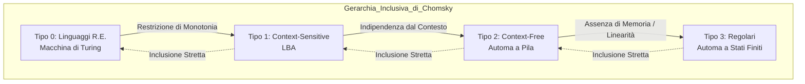
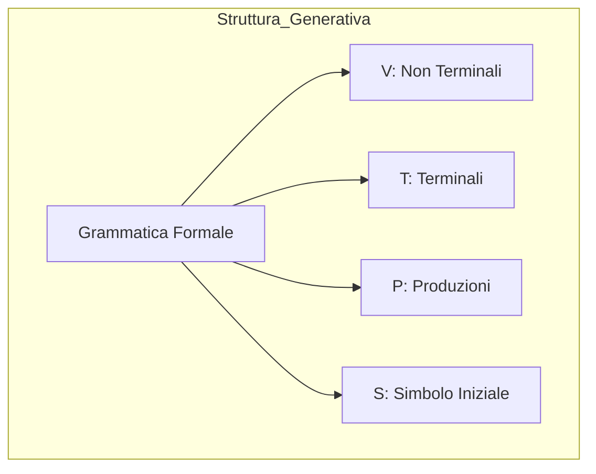
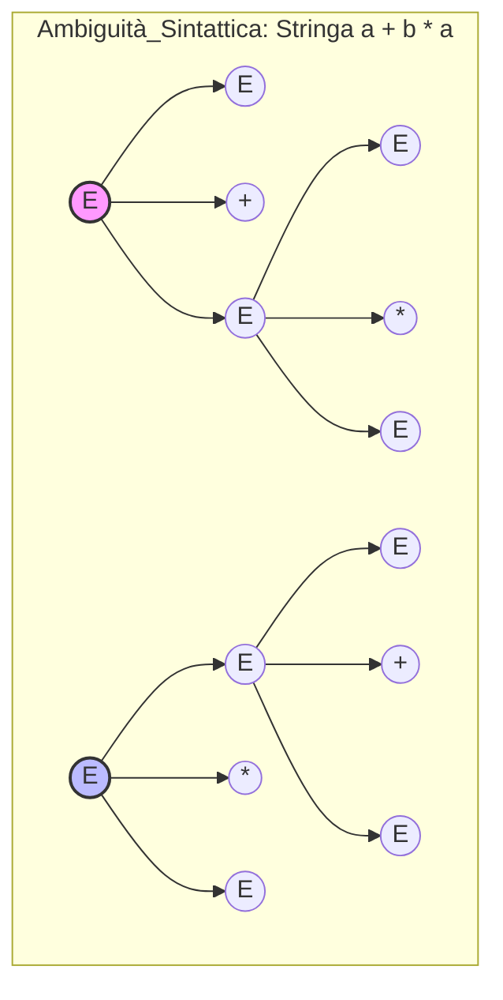

# 1.5 Teoria delle Grammatiche e Gerarchia di Chomsky

### Diagramma Concettuale

### Panoramica Teorica
La classificazione dei linguaggi formali richiede sistemi generativi non ambigui, fondamentali per l'interpretazione deterministica. Una **Grammatica** è una quadrupla $G = (V, T, P, S)$, in cui $V$ è il vocabolario dei simboli non terminali, $T$ è l'alfabeto dei terminali, $S \in V$ è l'assioma di partenza e $P$ è l'insieme delle produzioni.

Il linguista Noam Chomsky ha teorizzato una gerarchia inclusiva ($L_3 \subset L_2 \subset L_1 \subset L_0$) che classifica la complessità dei linguaggi imponendo restrizioni strutturali progressivamente più severe sulla forma delle produzioni in $P$. A ciascun livello di astrazione grammaticale corrisponde, per il teorema di equivalenza strutturale, un preciso modello di automa riconoscitore, delineando un parallelismo perfetto tra la capacità generativa della sintassi e la complessità spaziale/temporale del calcolo computazionale necessario per decidere il problema standard dell'appartenenza $\omega \in L$.

---

## Cosa si intende per linguaggi e grammatiche ambigue?

Una grammatica libera da contesto (CFG) si definisce rigorosamente **ambigua** se esiste almeno una stringa terminale $w \in L(G)$ che ammette due o più **alberi sintattici (parse trees) distinti e non isomorfi**. 

In termini operazionali, per il teorema delle derivazioni canoniche, questa condizione è equivalente ad affermare che la grammatica è ambigua se e solo se esiste una stringa generabile che possiede due **derivazioni canoniche sinistre (leftmost) distinte**, o simmetricamente due derivazioni destre distinte. È cruciale sottolineare che la semplice esistenza di derivazioni "miste" che collassano nel medesimo albero sintattico non costituisce ambiguità, poiché l'ambiguità risiede unicamente nella presenza di gerarchie strutturali fondamentalmente diverse per la medesima frase.

In molti casi applicativi (come nei compilatori), l'ambiguità sintattica è un difetto eliminabile. Essa può essere rimossa stratificando le produzioni, ovvero introducendo nuovi simboli non terminali per imporre precedenze fisse alle operazioni (ad esempio, distinguendo tra espressioni, termini e fattori per le operazioni aritmetiche). 

Esistono tuttavia entità più patologiche: i **linguaggi intrinsecamente ambigui**. Un linguaggio si definisce tale se *non esiste alcuna grammatica non ambigua* in grado di generarlo. Qualsiasi costrutto sintattico ideato per delineare tale linguaggio produrrà inevitabilmente ambiguità su alcune stringhe di sovrapposizione. Un classico esempio è il linguaggio $L = \{a^n b^n c^m d^m \mid n,m \ge 1\} \cup \{a^n b^m c^n d^m \mid n,m \ge 1\}$; le stringhe aventi la forma $a^n b^n c^n d^n$ appartengono a entrambe le declinazioni strutturali dell'unione e possiederanno sempre due conformazioni di derivazione incompatibili.

*Formalismo e Indecidibilità:* Stabilire algoritmicamente se una grammatica CFG generica passata in input sia ambigua o meno costituisce un **problema indecidibile**; non può esistere alcuna Macchina di Turing totale (algoritmo risolutore generale) in grado di eseguire tale verifica su una grammatica arbitraria.

---

## Spiega una caratteristica distintiva dei linguaggi context-free.

La caratteristica distintiva fondamentale dei linguaggi liberi dal contesto (CFL, Livello $L_2$) rispetto al livello sottostante (Linguaggi Regolari, $L_3$) risiede nella loro intrinseca capacità computazionale di **mantenere memoria di un conteggio correlato**, comunemente espresso come la capacità di "contare due cose" contemporaneamente. 

Mentre gli automi a stati finiti (ASF) operano senza una memoria ausiliaria e non possono trattenere traccia di quantità illimitate o bilanciamenti i linguaggi context-free sfruttano un modello computazionale associato noto come **Automa a Pila (Push Down Automaton - PDA)**. L'integrazione di una memoria illimitata accessibile tramite una rigorosa politica **LIFO (Last In, First Out)** permette ai CFL di risolvere problemi di dipendenza e bilanciamento annidato. Esempi paradigmatici sono il bilanciamento di parentesi o il riconoscimento di stringhe palindrome ($w = w^R$), in cui il sistema "ricorda" la prima metà della stringa nello stack per poi decostruirla simmetricamente verificando la seconda metà.

A livello puramente sintattico, la caratteristica differenziale si manifesta nella forma limitata delle produzioni $P$. In una CFG, ogni regola assume la forma $A \Rightarrow \beta$, dove $A \in V$ è un singolo non terminale e $\beta \in (V \cup T)^+$. L'aggettivo "context-free" (libero dal contesto) sancisce proprio che la riscrittura della variabile $A$ è determinata esclusivamente dalla variabile stessa, indipendentemente dai simboli (il contesto $\gamma$ o $\delta$) che la precedono o la seguono nella forma sentenziale corrente.

*Formalismo: Separazione di potenza non deterministica:* 
A differenza di quanto accade per i linguaggi regolari (dove NFA e DFA sono matematicamente equivalenti per la costruzione a sottoinsiemi ), nei linguaggi liberi da contesto l'introduzione del non determinismo genera un salto prestazionale netto. I Non-Deterministic PDA (NDPDA) sono strettamente più potenti dei PDA deterministici (DPDA), il che rende la classe generale dei CFL non interamente processabile in regime strettamente deterministico.

---

## È possibile verificare se due grammatiche context-free generano lo stesso linguaggio? Dimostra che questo problema è indecidibile.

**Risposta:** No, non è possibile. Stabilire se due grammatiche libere da contesto $G_1$ e $G_2$ siano equivalenti (ovvero se generano l'esatto medesimo linguaggio formale, $L(G_1) = L(G_2)$) è un problema logico che la Teoria della Computabilità classifica come rigorosamente **indecidibile**. 

Ciò implica l'assoluta inesistenza di alcun algoritmo (Macchina di Turing convergente) in grado di valutare due grammatiche CFG arbitrarie e restituire in tempo finito un responso "Sì/No" universale.

*Spiegazione accademica e schema della dimostrazione per riduzione:*
Nell'Informatica Teorica, l'indecidibilità di una classe di problemi non viene provata analizzando ogni possibile algoritmo, ma sfruttando la potente tecnica della **Riduzione**. La logica della riduzione impone di prendere un problema cardine la cui indecidibilità è già stata provata e accettata come assioma (come il Problema della Fermata o il Problema di Corrispondenza di Post) e dimostrare che esso può essere mappato algoritmicamente sul nuovo problema sotto esame.

Nel caso delle grammatiche, il problema radice tipicamente impiegato è il **Problema di Corrispondenza di Post (PCP)**. Il PCP chiede di stabilire se, dati due insiemi finiti e ordinati di stringhe $A$ e $B$, esista una sequenza arbitraria di indici tale per cui la concatenazione delle stringhe di $A$ produca un output strutturalmente identico alla concatenazione delle stringhe corrispondenti in $B$. Essendo il PCP un problema indecidibile a causa della potenziale necessità di esplorare combinazioni di lunghezza illimitata senza garanzia di terminazione lo si può ridurre al problema dell'equivalenza tra grammatiche secondo la seguente logica formale:

1. Per assurdo, ipotizziamo esista un algoritmo universale $H$ capace di decidere l'equivalenza tra due qualsiasi CFG, $G_1$ e $G_2$.
2. Esiste un procedimento costruttivo che mappa in modo effettivo ogni istanza del PCP nella costruzione di due specifiche grammatiche libere da contesto, le cui produzioni codificano le liste di stringhe $A$ e $B$. 
3. Per le proprietà di questa costruzione, l'intersezione dei linguaggi o le relazioni di equivalenza tra le grammatiche così generate nasconderebbero la soluzione per l'istanza originale del PCP. In particolare, si può modellare il problema in modo che le due grammatiche generino lo stesso linguaggio se e solo se l'istanza del PCP non ammette una soluzione (coerenza dell'esito).
4. Se potessimo fornire queste due grammatiche in input al nostro fantomatico algoritmo $H$, otterremmo una risposta deterministica. Ma ciò significherebbe aver indirettamente risolto il Problema di Corrispondenza di Post.
5. Poiché sappiamo per dimostrazione di Cantor/Turing che il PCP è irresolubile (in virtù dell'asimmetria di cardinalità tra funzioni e algoritmi e delle diagonalizzazioni) l'esistenza di $H$ costituisce un assurdo logico. 

Pertanto, il problema decisionale sull'equivalenza formale di due grammatiche Context-Free deve per forza essere **indecidibile**.

---

## Descrivi le caratteristiche delle grammatiche per i linguaggi di tipo 0, 1, 2 e 3 secondo la Gerarchia di Chomsky.

La Gerarchia di Chomsky stratifica le capacità computazionali in quattro livelli di inclusione stretta ($L_3 \subset L_2 \subset L_1 \subset L_0$). Di seguito l'analisi formale e tassonomica di ogni livello grammaticale:

* **Livello $L_0$ (Linguaggi Generali, Ricorsivamente Enumerabili):**
 * **Vincoli sulle Produzioni ($P$):** Non sussiste alcuna restrizione strutturale sulla forma delle produzioni. Una regola $\alpha \Rightarrow \beta$ è lecita col solo vincolo minimale che la testa $\alpha$ contenga almeno un simbolo non terminale appartenente a $V$.
 * **Automa Riconoscitore:** Macchina di Turing (MdT), dotata di nastro infinito bidirezionale e testina read/write autonoma.
 * **Capacità Computazionale:** Esprime il massimo grado teorico di computabilità (Turing-completo). È l'unico livello capace di "contare infinite cose". Genera insiemi R.E., associati a problemi semi-decidibili (in caso di non appartenenza l'automa è suscettibile a divergenza e loop infiniti).

* **Livello $L_1$ (Linguaggi Dipendenti dal Contesto - Context-Sensitive):**
 * **Vincoli sulle Produzioni ($P$):** Grammatiche strettamente *monotone*. Per ogni produzione $\alpha \Rightarrow \beta$, è richiesto il rispetto della limitazione di monotonicità $|\alpha| \le |\beta|$. In ogni passaggio di derivazione, la forma sentenziale si espande o resta identica, vietando rigorosamente contrazioni. In ottica contestuale, le regole appaiono come $\gamma A \delta \Rightarrow \gamma B \delta$ (la sostituzione di $A$ dipende dai prefissi/suffissi $\gamma$ e $\delta$).
 * **Automa Riconoscitore:** Automa Linearmente Limitato Non Deterministico (LBA). Una MdT il cui nastro è circoscritto linearmente rispetto all'input ($k \cdot n$) tra due delimitatori di barriera non valicabili.
 * **Capacità Computazionale:** Possiedono la complessa attitudine a "contare tre cose" correlate (es. generazione perfetta di triplette crescenti come $0^n 1^n 2^n$). Il problema della fermata, a differenza delle MT generali, per gli LBA è decidibile grazie alla limitazione di configurazioni basata sul principio della piccionaia.

* **Livello $L_2$ (Linguaggi Liberi da Contesto - Context-Free):**
 * **Vincoli sulle Produzioni ($P$):** Forma asimmetrica ristretta $A \Rightarrow \beta$. Il nucleo a sinistra deve constare in un simbolo singolare $A \in V$, e il corpo $\beta$ è una composizione $\in (V \cup T)^+$ con $|\beta| \ge 1$. L'espansione è astratta dal circondario simbolico della stringa in mutazione.
 * **Automa Riconoscitore:** Automa a Pila (PDA). Automa a stati finiti integrato con un nastro verticale LIFO.
 * **Capacità Computazionale:** Architettura adatta a contare ed isolare due proprietà (es. annidamenti logici o specularietà palindromica). Gode di asimmetria tra versioni deterministiche e non deterministiche.

* **Livello $L_3$ (Linguaggi Regolari):**
 * **Vincoli sulle Produzioni ($P$):** Elevata rigidità posizionale. Le produzioni sono lineari (destre o sinistre). Nel caso lineare destro ammettono unicamente $A \Rightarrow aB$ (simbolo terminale concatenato a un non terminale finale) o $A \Rightarrow a$ (terminalizzazione pura), con $A, B \in V$ e $a \in T$. Tali regole equivalgono isomorficamente alla sintassi dell'Algebra delle Espressioni Regolari (ER).
 * **Automa Riconoscitore:** Automa a Stati Finiti (DFA / NFA). Macchina lettrice in avanti, sprovvista di memoria periferica esterna allo stato corrente.
 * **Capacità Computazionale:** Incapaci di contare qualsivoglia occorrenza ("non sanno contare nulla") e proni al cedimento sul Pumping Lemma in presenza di cicli di compensazione strutturati. DFA e NFA detengono la medesima potenza di astrazione.

---

## Come viene gestita la produzione A -> epsilon nelle grammatiche?

La produzione verso la stringa vuota ($A \to \epsilon$) corrisponde all'eliminazione spontanea di una categoria sintattica durante il processo di derivazione e richiede apposite metodologie di gestione.

**Nelle Grammatiche Context-Free (CFG) e nella Forma Normale:**
Nel passaggio verso la **Forma Normale di Chomsky (CNF)** (dove i costrutti ammessi sono strettamente $A \to BC$ o $A \to a$), le $\epsilon$-produzioni costituiscono un'anomalia che deve essere rimossa. L'algoritmo le gestisce in via compensativa:
* Si individuano i non terminali che annullano (es. $A \to \epsilon$).
* Se una regola si avvale di $A$ (ad esempio $B \to XAY$), l'algoritmo "simula" l'avvenuta caduta di $A$ a monte, iniettando nella grammatica una nuova produzione accorciata $B \to XY$.
* *Eccezione dell'Assioma:* Se l'intero linguaggio formale prevede la generazione della stringa vuota (cioè $\epsilon \in L(G)$), il procedimento perimetrale crea un nuovo assioma generativo radice $S_0$ definito come $S_0 \to S \mid \epsilon$, aggirando il divieto nelle produzioni subordinate.

**Nel Livello Superiore (Tipo 1 / Context-Sensitive):**
Nelle grammatiche di Tipo 1, le regole della forma $A \to \epsilon$ sono **intrinsecamente proibite** dalle restrizioni dimonotonicità. Il postulato fondativo dei linguaggi context-sensitive impone che per ogni $\alpha \Rightarrow \beta$, la dimensione si conservi o aumenti ($|\alpha| \le |\beta|$). Essendo la stringa vuota di dimensione 0, la sua derivazione diretta violerebbe il divieto che impedisce l'accorciamento della forma sentenziale. 

**Sul piano computazionale degli Automi ($\epsilon$-NFA):**
A livello dell'hardware logico che funge da riconoscitore (come per gli Automi a Stati Finiti), la produzione epsilon è modellata come **transizione spontanea** (negli $\epsilon$-NFA). La macchina logica è autorizzata a fluttuare tra stati asincronamente senza consumare ("leggere") alcun carattere del token in input. Operativamente, l'automa domina questi fenomeni ricorrendo alla **$\epsilon$-chiusura (ECLOSE)**, calcolando preventivamente la propagazione induttiva di tutti i rami di stato che la macchina può occupare transitando a costo zero. Questa formulazione è di importanza critica nei layer operativi dei compilatori (Costruzione di Thompson) per assemblare automi da espressioni regolari (ad esempio operatore Star) e si dimostra che la presenza di mosse $\epsilon$ non perturba né innalza in alcun modo la potenza del formalismo a stati finiti originale.