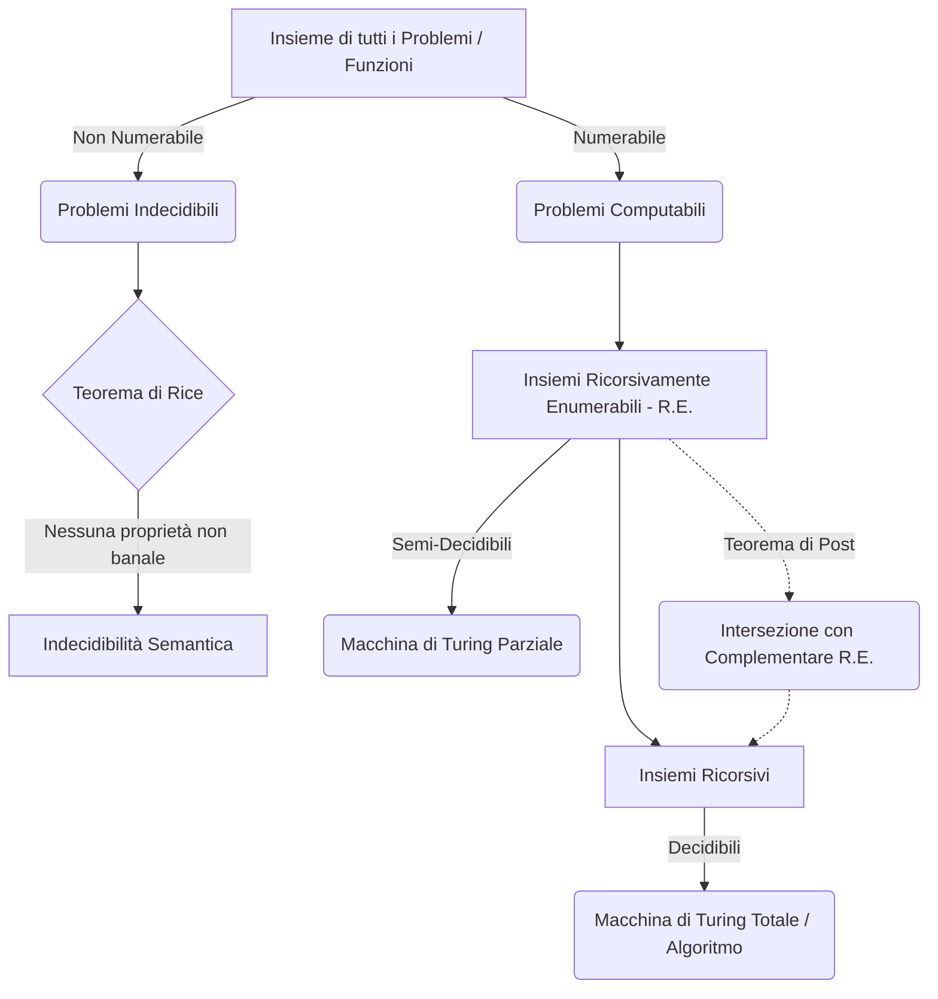
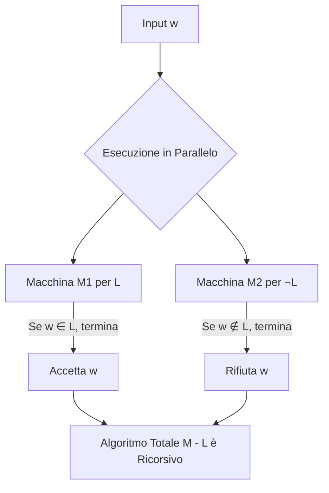

### Panoramica Teorica: I Fondamenti della Decidibilità e i Limiti del Calcolo

Lo studio della computabilità non si limita a definire ciò che una macchina può calcolare, ma traccia un confine ontologico invalicabile tra ciò che è algoritmicamente conoscibile e ciò che sfugge a qualsiasi meccanismo di calcolo. Questo orizzonte degli eventi computazionali è governato da una profonda asimmetria insiemistica: mentre l'insieme dei problemi (intesi come funzioni da $\mathbb{N}$ in $\mathbb{N}$) possiede la cardinalità del continuo ($c = 2^{\aleph_0}$), l'insieme dei programmi (o Macchine di Turing) è strettamente numerabile ($\aleph_0$). Da questa discrepanza deriva l'esistenza assiomatica di problemi intrinsecamente **indecidibili**.

In questa cornice, la Teoria degli Insiemi si fonde con la teoria degli algoritmi: un problema **decidibile** corrisponde a un **insieme ricorsivo**, governato da una funzione caratteristica totale (un algoritmo che termina sempre). Un problema **semidecidibile** corrisponde a un **insieme ricorsivamente enumerabile (R.E.)**, governato da una funzione parziale (un semi-algoritmo che diverge per le istanze negative). Le relazioni tra queste classi e i teoremi di impossibilità semantica (come il Teorema di Rice) costituiscono l'architettura portante dell'Informatica Teorica.

---

## Enunciato e dimostrazione del Teorema di Rice, definendo rigorosamente cosa si intende per 'proprietà'

Il Teorema di Rice rappresenta il limite assoluto dell'analisi automatica del software. Da una prospettiva sistemica, esso sancisce l'impossibilità di costruire un programma (come un compilatore o un analizzatore statico) capace di determinare una qualsiasi caratteristica comportamentale o semantica di un altro programma analizzandone esclusivamente il codice sorgente.

**L'Ontologia della "Proprietà"**
Per comprendere il teorema, è vitale tracciare una demarcazione netta tra sintassi e semantica. Nel nostro formalismo:
* Definiamo **proprietà** un predicato logico che individua un insieme specifico di **funzioni ricorsive parziali**. Una proprietà è un concetto puramente *semantico* (ad esempio: "la funzione calcola il quadrato dell'input" o "la funzione converge per almeno un valore").
* Denotiamo con $F$ tale insieme di funzioni.
* Denotiamo con $I_F$ l'insieme degli **indici** (i numeri di Gödel, ovvero le Macchine di Turing o i programmi sorgente) che calcolano le funzioni appartenenti a $F$. Formalmente: $I_F = \{x \mid \varphi_x \in F\}$.

Una proprietà si definisce **banale** se è posseduta da *tutte* le funzioni ricorsive parziali ($F$ coincide con l'intero insieme delle funzioni) oppure da *nessuna* ($F = \emptyset$).

**Enunciato del Teorema di Rice:**
Sia $F$ un insieme di funzioni ricorsive parziali. L'insieme degli indici $I_F$ è **ricorsivo** (ovvero la proprietà è decidibile algoritmicamente) se e solo se $F$ è una proprietà **banale**. 
Di converso, **nessuna proprietà non banale delle funzioni ricorsive parziali è decidibile**.

### Dimostrazione Formale del Teorema di Rice
La prova si sviluppa per assurdo, appoggiandosi al Teorema di Ricorsione (o punto fisso di Kleene), il quale garantisce l'esistenza di programmi capaci di operare sul proprio stesso codice.

1. **Ipotesi di partenza:** Assumiamo che $F$ sia una proprietà *non banale*. Questo garantisce l'esistenza di almeno due funzioni ricorsive parziali, $f$ e $g$, tali che $f \in F$ e $g \notin F$.
2. **Ipotesi di assurdo:** Supponiamo per assurdo che l'insieme degli indici $I_F$ sia un insieme **ricorsivo** (decidibile).
3. **Costruzione della funzione selettrice:** Sfruttando la decidibilità di $I_F$, definiamo una nuova funzione $h(t, x)$ che agisce da "switch" analizzando l'appartenenza dell'indice $t$ a $I_F$:
 $$h(t, x) = \begin{cases} g(x) & \text{se } t \in I_F \\ f(x) & \text{se } t \notin I_F \end{cases}$$
 Poiché l'appartenenza a $I_F$ è decidibile per ipotesi, l'algoritmo che calcola $h$ è effettivo, rendendo $h(t, x)$ una funzione ricorsiva parziale valida.
4. **Applicazione del Teorema di Ricorsione:** Poiché $h$ è ricorsiva parziale, per il Teorema di Ricorsione esiste un indice (punto fisso) $n \in \mathbb{N}$ tale per cui $\varphi_n(x) = h(n, x)$.
5. **Deduzione dell'assurdo:** Sostituendo $t$ con il punto fisso $n$ nella nostra funzione selettrice, otteniamo un paradosso logico insolubile basato su due scenari mutuamente esclusivi :
 * **Caso 1:** Se assumiamo che $n \in I_F$, allora per definizione di $h$, $\varphi_n(x) = g(x)$. Tuttavia, noi sappiamo che $g \notin F$. Ma se $\varphi_n$ computa esattamente $g$, allora anche $\varphi_n \notin F$, il che implica matematicamente che l'indice $n \notin I_F$. Ne deriva l'assurdo: $n \in I_F \implies n \notin I_F$.
 * **Caso 2:** Se assumiamo che $n \notin I_F$, allora $\varphi_n(x) = f(x)$. Sappiamo che $f \in F$, quindi $\varphi_n \in F$. Questo costringe l'indice $n$ ad appartenere a $I_F$. Ne deriva l'assurdo: $n \notin I_F \implies n \in I_F$.
6. **Conclusione:** Essendo incorsi in una contraddizione in entrambi i rami, l'ipotesi per assurdo decade. L'insieme degli indici $I_F$ di una proprietà non banale non può mai essere ricorsivo.

---

## Dimostrare che un insieme è ricorsivo se e solo se sia l’insieme stesso che il suo complementare sono ricorsivamente enumerabili

Questa relazione, nota in letteratura come **Teorema di Post**, stabilisce un profondo legame strutturale tra la decidibilità assoluta (ricorsività) e la semidecidibilità simmetrica (enumerabilità ricorsiva). 

Da un punto di vista sistemico, un semi-algoritmo (che definisce un insieme R.E.) rappresenta un'entità di calcolo zoppa: esplora l'infinito e si arresta solo se trova un'istanza positiva, altrimenti si perde nello spazio delle configurazioni. Se noi possediamo due di queste entità zoppe — una addestrata a riconoscere le verità (l'insieme $L$) e l'altra addestrata a riconoscere le falsità (il complemento $\overline{L}$) — la loro esecuzione concorrente colma reciprocamente le lacune computazionali, generando un decisore perfetto (un algoritmo totale).

### Dimostrazione Formale del Teorema di Post
Dobbiamo dimostrare la doppia implicazione logica tra la ricorsività di un linguaggio $L$ e l'enumerabilità ricorsiva di $L$ e $\overline{L}$ (il suo complemento).

1. **Implicazione Diretta ($\implies$):** Se $L$ è un insieme ricorsivo, per definizione esso ammette un algoritmo (funzione caratteristica totale) che lo decide. Anche il suo complemento $\overline{L}$ è intrinsecamente ricorsivo, in quanto basta invertire l'output ("sì" in "no" e viceversa) dell'algoritmo originario. Essendo sia $L$ che $\overline{L}$ insiemi ricorsivi, ed essendo la classe degli insiemi ricorsivi un sottoinsieme stretto degli insiemi R.E. (poiché ogni funzione totale è anche una funzione parziale), si deduce banalmente che entrambi sono R.E..

2. **Implicazione Inversa ($\impliedby$):** Siano $L$ e $\overline{L}$ due insiemi Ricorsivamente Enumerabili. 
 * Per la definizione di insiemi R.E., esistono due Macchine di Turing (semi-algoritmi): una macchina $M_1$ che riconosce $L$ (ovvero si ferma e accetta se l'input appartiene a $L$) e una macchina $M_2$ che riconosce $\overline{L}$ (si ferma e accetta se l'input non appartiene a $L$).
 * Costruiamo un nuovo costrutto algoritmico, una Macchina di Turing $M$ a due nastri, capace di simulare in parallelo l'esecuzione di $M_1$ e $M_2$ sullo stesso input $w$.
 * Fornendo in input la stringa $w$, per il Principio del Terzo Escluso della logica classica, sappiamo che $w$ deve rigorosamente appartenere a $L$ oppure a $\overline{L}$.
 * Se $w \in L$, la macchina $M_1$ (dopo un numero finito di step) convergerà e accetterà. A questo punto, il nostro simulatore $M$ si arresta accettando l'input.
 * Se $w \notin L$, allora necessariamente $w \in \overline{L}$. In questo caso, la macchina $M_2$ convergerà in un tempo finito. Il simulatore $M$ rileva la terminazione di $M_2$, si arresta e formalmente **rifiuta** la stringa.
 * Poiché la stringa $w$ porterà immancabilmente all'arresto o di $M_1$ o di $M_2$, la macchina combinata $M$ non divergerà mai in un loop infinito. Essa costituisce una Macchina di Turing totale (un decisore infallibile) per $L$. Di conseguenza, $L$ è provato essere un insieme ricorsivo.

---

## Dimostrazione di equivalenza tra le due definizioni alternative di un insieme ricorsivamente enumerabile (R.E.)

Nell'informatica teorica, un insieme R.E. può essere approcciato da due prospettive duali: una analitica (soggetta al riconoscimento) e una sintetica (soggetta alla generazione pura). Il teorema che segue dimostra che possedere un semi-algoritmo che riconosce un insieme è computazionalmente equivalente a possedere una funzione infallibile che "genera" o enumera gli elementi di quell'insieme.

**Definizioni di base:**
Un insieme $A \subseteq \mathbb{N}$ è R.E. se soddisfa indifferentemente una di queste due definizioni :
* **(a) Definizione Analitica:** $A$ è il **dominio** di una funzione ricorsiva parziale $f$. ($A$ è l'insieme degli elementi per cui la macchina non diverge).
* **(b) Definizione Sintetica:** $A$ è il **codominio** di una funzione ricorsiva totale $g$. ($A$ è l'insieme dei valori "sputati" fuori dall'algoritmo enumeratore $g$ al variare degli input $0, 1, 2, \dots$).

### Dimostrazione Formale di Equivalenza ((a) $\iff$ (b))

**Fase 1: Dimostriamo che (a) $\implies$ (b)**
Assumiamo che $A \neq \emptyset$ e che $A = \text{dom}(f)$, dove $f$ è un semi-algoritmo. Vogliamo costruire una funzione totale $g$ tale che $\text{cod}(g) = A$. 
Il rischio maggiore qui è che, simulando $f(0), f(1), f(2)\dots$ sequenzialmente, se $f(0)$ diverge, la nostra generazione si blocca per sempre, non scoprendo mai eventuali convergenze su $f(1)$ o $f(2)$. Per aggirare questo problema si utilizza una tecnica di schedulazione del tempo di CPU nota come **Dove-Tailing** (a coda di rondine), che intreccia l'esecuzione per evitare i rami infiniti.
* *Fase 1:* Simuliamo 1 passo di computazione su $f(0)$. Se la funzione termina immediatamente, inseriamo l'input $0$ in una lista $L$.
* *Fase 2:* Eseguiamo un 2° passo su $f(0)$ e 1 passo su $f(1)$. Se una qualsiasi di queste computazioni termina, inseriamo il relativo input nella lista $L$.
* *Fase n+1:* Eseguiamo un passo aggiuntivo di simulazione su tutte le funzioni avviate precedentemente $f(0), f(1), \dots, f(n-1)$ e compiamo il primo passo esplorativo su $f(n)$. Ogni input $i$ che porta a terminazione in questa fase viene accodato alla lista $L$.

A questo punto, avendo una lista $L$ che si popola in tempo finito degli elementi convergenti, definiamo la nostra funzione totale generatrice $g$:
* $g(0)$ restituisce il primissimo elemento inserito in $L$.
* $g(x+1)$ restituisce il valore minimo $y$ ($\mu y$) che è stato inserito in $L$ nella fase $x+1$ e che non era già presente. In questo modo $g$ mappa ordinatamente i numeri naturali agli elementi di $L$. 
Poiché $g$ non diverge mai, è una funzione ricorsiva totale. Poiché essa estrae progressivamente tutti e soli gli input che convergono per $f$, il suo codominio equivale rigorosamente ad $A$ ($\text{cod}(g) = \text{dom}(f) = A$).

**Fase 2: Dimostriamo che (b) $\implies$ (a)**
Ipotizziamo ora l'inverso: possediamo una funzione generatrice infallibile (ricorsiva totale) $g$ tale che $A = \text{cod}(g)$. Vogliamo costruire un riconoscitore parziale $f$ per cui $A = \text{dom}(f)$.
Costruiamo la funzione parziale $f$ in questo modo:
1. Dato un valore incognito $x$ in input, $f$ deve stabilire se $x \in A$.
2. La funzione $f$ innesca internamente l'enumeratore totale $g$, generando iterativamente e progressivamente $g(0), g(1), g(2), \dots$.
3. Per ogni $g(y)$ generato, $f$ lo confronta con il suo input $x$. Se $g(y) = x$, l'algoritmo $f$ si arresta immediatamente con successo e restituisce l'indice $y$ (quindi $f(x) = y$).
4. Se $x \notin A$ (ovvero $x$ non appartiene al codominio di $g$), l'equivalenza $g(y) = x$ non si verificherà mai. La ricerca di $f$ proseguirà linearmente verso l'infinito. La computazione diverge in modo perpetuo.

Essendo che $f$ converge se e solo se $x$ fa parte delle emissioni di $g$, ne consegue che la funzione ricorsiva parziale $f$ ha come proprio dominio esattamente l'insieme $A$. Da cui $\text{dom}(f) = \text{cod}(g) = A$.