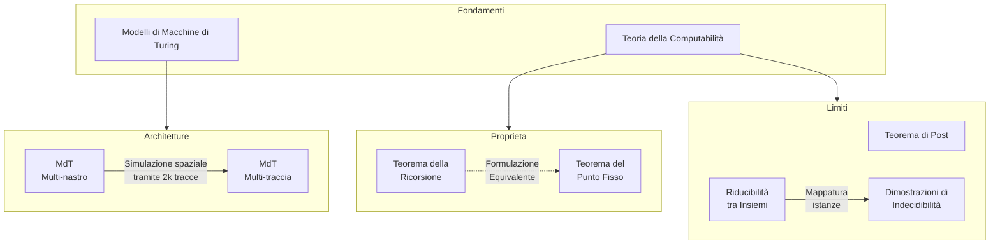
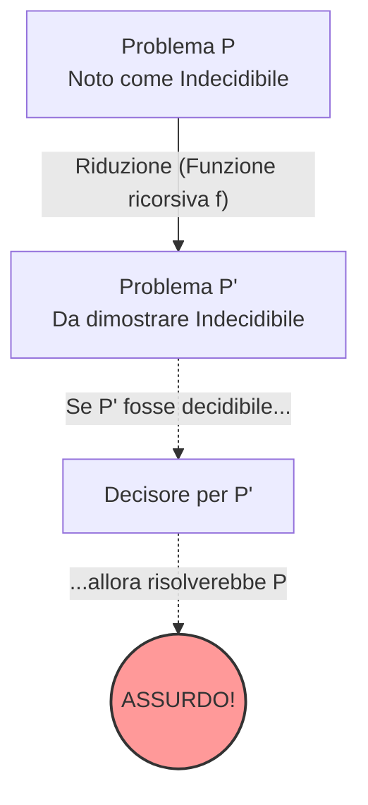

## 2.2 Teoremi Avanzati e Macchine di Turing

### Diagramma Concettuale

### Panoramica Teorica

Lo studio della computabilità avanzata indaga la natura intrinseca dei problemi computazionali e le capacità espressive dei formalismi di calcolo. In questo contesto, le Macchine di Turing (MdT) non fungono unicamente da automi per il riconoscimento di linguaggi formali di Tipo 0, ma assurgono a paradigma strutturale per la valutazione della calcolabilità di funzioni. L'analisi si sposta dalla mera computazione sequenziale all'introspezione logica del codice stesso: le funzioni possono operare sui propri indici numerici e i formalismi possono essere manipolati attraverso la tecnica della Gödelizzazione. Questo dominio è governato da rigidi teoremi di struttura, quali il Teorema della Ricorsione e il Teorema di Post, i quali definiscono le demarcazioni precise tra ciò che è algoritmicamente risolvibile (decidibile), parzialmente calcolabile (semidecidibile) o intrinsecamente insolubile (indecidibile). Tali limitazioni impongono lo studio delle equivalenze computazionali tramite simulazioni strutturali, al fine di validare o confutare l'impatto di variazioni architetturali sull'effettivo potere di calcolo dei sistemi.

---

## Enunciato e dimostrazione del Teorema della Ricorsione

Il Teorema della Ricorsione (o Teorema del Punto Fisso di Kleene) evidenzia la capacità di un formalismo computazionale di auto-referenziarsi, dimostrando l'esistenza di programmi che operano sul proprio codice.

Il teorema postula che un programma, durante la sua esecuzione, può conoscere e utilizzare la propria codifica o il proprio indice numerico. Affinché ciò avvenga, la funzione calcolata non deve subire alterazioni semantiche quando tale indice viene fornito come parametro.

**Formalismo:**
L'enunciato formale (definito come "Versione 1" nella letteratura in esame) dichiara che:
Sia $g(z, x_1, \dots, x_m)$ una funzione ricorsiva parziale di $m+1$ argomenti. Allora esiste necessariamente un indice $n \in \mathbb{N}$ tale che si verifichi l'uguaglianza:
$$\varphi_n^{(m)}(x_1, \dots, x_m) = g(n, x_1, \dots, x_m)$$
In questa formulazione, la funzione astratta $g$ accetta un parametro aggiuntivo $z$. Il teorema garantisce che è sempre possibile "fissare" tale parametro $z$ allo stesso valore dell'indice $n$ della funzione generata, realizzando di fatto un'equazione in cui l'indice $n$ viene internalizzato nel calcolo, eliminando una variabile ma mantenendo la coerenza operativa.

## Enunciato e dimostrazione del Teorema del Punto Fisso

Il Teorema del Punto Fisso costituisce la seconda formulazione equivalente del Teorema della Ricorsione. Se la prima versione enfatizza l'auto-riferimento operativo, questa formulazione si concentra sulla stabilità degli indici sottoposti a trasformazioni.

Geometricamente, un punto fisso per una trasformazione $T$ è un elemento del dominio tale che $T(x) = x$. Nell'informatica teorica, data una trasformazione sull'insieme degli indici, esiste sempre un programma la cui semantica non viene alterata dalla trasformazione stessa.

**Formalismo:**
L'enunciato (definito come "Versione 2") afferma che:
Sia $f(z)$ una funzione ricorsiva *totale*. Allora esiste un intero $n \in \mathbb{N}$ tale che:
$$\varphi_{f(n)}(x) = \varphi_n(x) \quad \forall x \in \mathbb{N}$$
Qui, $f(n)$ e $n$ sono *due indici differenti* che puntano alla *stessa funzione logica*. L'applicazione della trasformazione $f$ sull'indice $n$ restituisce un nuovo indice che computa la medesima semantica originaria.

## Come si simula il comportamento di una Macchina di Turing multi-nastro utilizzando una Macchina di Turing multi-traccia?

L'estensione architetturale della Macchina di Turing canonica verso modelli multi-traccia o multi-nastro non altera in alcun modo la potenza di calcolo (il sistema rimane confinato ai linguaggi di tipo 0), ma richiede una rigorosa dimostrazione di equipotenza per simulazione strutturale.

* **MdT Multi-traccia:** Consiste in un singolo nastro fisico suddiviso in $k$ corsie parallele o "tracce". Possiede *una sola testina* che legge istantaneamente un vettore colonna di $k$ simboli.
* **MdT Multi-nastro:** Presenta $k$ nastri indipendenti, ciascuno servito dalla *propria testina autonoma*, permettendo letture e spostamenti asincroni tra i diversi supporti di memoria.

**Meccanismo di Simulazione:**
Il Teorema di Equivalenza stabilisce che una MdT con $k$ nastri indipendenti può essere fedelmente simulata da una singola MdT equipaggiata con un unico nastro fisico frammentato in $2k$ tracce. La mappatura avviene secondo questo schema:
1. **Tracce dispari (contenuto):** Memorizzano pedissequamente i simboli effettivamente presenti sui $k$ nastri originari.
2. **Tracce pari (posizione testine):** Agiscono da registri posizionali virtuali. Su queste tracce viene apposto uno speciale marcatore (es. una bandierina logica) per denotare in quale precisa cella virtuale staziona la testina indipendente di quel corrispettivo nastro.

Per emulare un singolo passo di calcolo della macchina multi-nastro, la testina unica della macchina multi-traccia è costretta ad eseguire uno "sweep" (spazzolamento) sul nastro: avanza e retrocede per scovare le posizioni dei marcatori su tutte le tracce pari, raccoglie l'informazione del simbolo letto dalla traccia dispari sovrastante, aggiorna lo stato interno complessivo, e compie un ulteriore scorrimento per sovrascrivere i nuovi simboli e spostare i marcatori virtuali. Questa tecnica riduce il parallelismo spaziale a una serializzazione temporale, mantenendo identico il potere di computabilità.

## Enunciato e significato del Teorema di Post

Il Teorema di Post è una pietra miliare della topologia degli insiemi applicata alla computabilità, poiché sancisce una relazione vincolante tra lo status di decidibilità di un insieme (o linguaggio) e quello del suo complemento.

**Enunciato:**
Un linguaggio $L$ (o un insieme $A$) è *ricorsivo* se e solo se sia $L$ che il suo complemento $\overline{L}$ (o $A^c$) sono contemporaneamente insiemi *ricorsivamente enumerabili* (R.E.).

**Significato Logico e Costruttivo:**
L'importanza risiede nel fatto che se un insieme è R.E. ma non ricorsivo, il teorema obbliga logicamente il suo complemento a cadere al di fuori della classe R.E. (sarà non-R.E.). Delle molteplici allocazioni teoriche, solo alcune coppie $(L, \overline{L})$ sono ammesse: entrambi ricorsivi, entrambi non-R.E., o una profonda asimmetria (uno R.E. puro, l'altro non-R.E.).

La dimostrazione è costruttiva:
1. Se due insiemi complementari sono R.E., devono esistere due Macchine di Turing "semialgoritmiche", $M_1$ per $L$ e $M_2$ per $\overline{L}$.
2. È possibile architettare una terza macchina $M$ che simuli in parallelo l'esecuzione di $M_1$ e $M_2$ sullo stesso input $w$.
3. Per il principio del terzo escluso, la stringa $w$ deve necessariamente appartenere a $L$ o a $\overline{L}$.
4. Di conseguenza, infallibilmente o $M_1$ accetterà arrestandosi (confermando $w \in L$), o $M_2$ accetterà arrestandosi (confermando $w \in \overline{L}$).
Poiché la macchina congiunta $M$ si arresterà *sempre* fornendo un esito netto senza poter mai divergere all'infinito, essa costituisce un algoritmo totale e risolutivo. Questo prova che il linguaggio di partenza non era solo semidecidibile, ma propriamente decidibile (ricorsivo).

## Spiega il concetto di riducibilità tra insiemi e come funziona la tecnica di riduzione per dimostrare l'indecidibilità dei problemi

La teoria della riduzione è l'impianto metodologico che permette di correlare la difficoltà di problemi computazionali diversi e di mappare i gradi di indecidibilità.

**Riducibilità tra Insiemi:**
Dati due insiemi numerici $A$ e $B$, si dice che $A$ è riducibile a $B$ ($A \le B$) se esiste una trasformazione definita da una *funzione ricorsiva* $f$ tale che l'appartenenza di un elemento al primo insieme è biunivocamente legata all'appartenenza della sua trasformazione al secondo insieme.
**Formalismo:**
$$\forall x \in \mathbb{N} \quad (x \in A \iff f(x) \in B)$$
Tale relazione gode di transitività e riflessività. In ottica di classificazione, questo assicura che se possediamo un algoritmo decisore per $B$ (cioè $B$ è ricorsivo), allora, trasducendo l'input con $f$, possediamo un decisore anche per $A$ (che risulta a sua volta ricorsivo). Due insiemi che si riducono a vicenda ($A \equiv B$) condividono lo stesso grado gerarchico di indecidibilità nell'ambito della *Gerarchia Aritmetica*.

**Tecnica di Riduzione per dimostrare l'Indecidibilità:**
Qualora l'applicazione della diagonalizzazione diretta di Cantor risulti impraticabile a causa della distanza semantica tra l'oggetto del problema e la manipolazione autologica, si ricorre alla tecnica della riduzione per assurdo.

Il flusso logico per dimostrare che un nuovo problema $P'$ è indecidibile segue questi passi:
1. **Selezione del Capostipite:** Si individua un problema $P$ già asseverato come indecidibile (ad esempio, il Problema della Fermata o il Problema di Corrispondenza di Post).
2. **Mappatura Algoritmica:** Si definisce una funzione algoritmica di traduzione $R$ che mappa costruttivamente qualsiasi istanza di $P$ in una specifica istanza di $P'$, conservando rigorosamente la coerenza dell'esito ($P$ ha esito positivo $\iff R(P)$ ha esito positivo).
3. **Deduzione dell'Assurdo:** Si postula per assurdo l'esistenza di un decisore infallibile per $P'$. Sfruttando la traduzione $R$, si potrebbe instradare un'istanza insolubile di $P$ all'interno di $P'$ e risolverla grazie all'ipotetico decisore. Poiché ciò implicherebbe la risoluzione di un problema di cui è già stata provata la non calcolabilità (es. decidere se una Macchina si fermerà), l'esistenza del decisore per $P'$ risulta contraddittoria. Ergo, $P'$ deve essere indecidibile.

*Esempio notevole:* Stabilire se un programma in un certo frangente chiami una particolare funzione (problema $P'$) può essere agganciato al Problema della Fermata. L'algoritmo di riduzione innesterà fittiziamente la chiamata alla funzione proprio all'atto della terminazione del programma analizzato; in tal guisa, la chiamata alla funzione avverrà *se e solo se* il programma converge, trasferendo la tara dell'indecidibilità dall'arresto al trace di esecuzione.