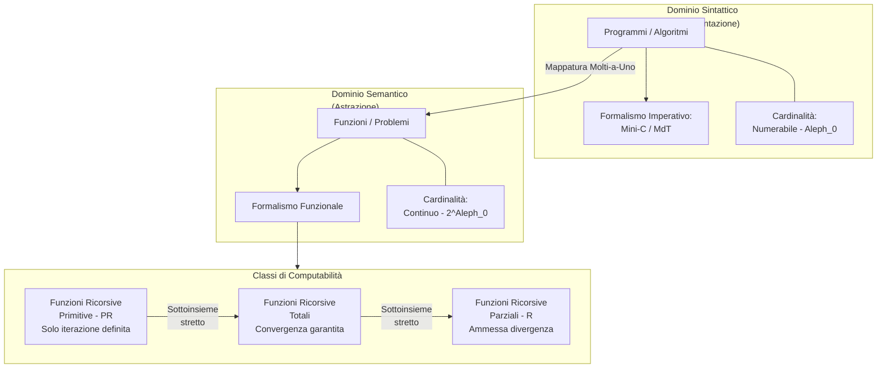
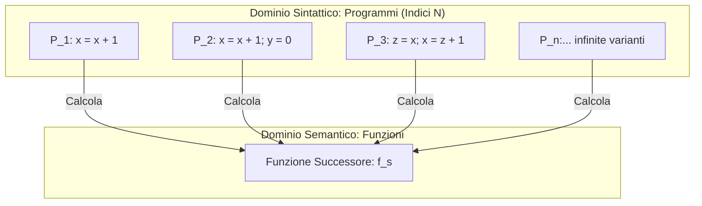

### Panoramica Teorica
Lo studio della teoria della computazione si fonda su una dicotomia essenziale tra l'ente astratto che definisce un problema e lo strumento meccanico designato a risolverlo. Il passaggio dai modelli operazionali (come le Macchine di Turing o i linguaggi imperativi come il Mini-C) ai modelli denotazionali (come il formalismo delle funzioni ricorsive) richiede una netta separazione concettuale tra la sintassi del calcolo e la sua semantica. 

Un programma codifica la sequenza di passi algoritmici, mentre la funzione matematica associata modella la pura relazione di mappatura tra input e output. Poiché l'insieme dei programmi è numerabile e l'insieme delle funzioni ha la cardinalità del continuo, i teoremi di Cantor dimostrano l'esistenza di funzioni indecidibili, ovvero non associabili ad alcun programma.

---

## Qual è la differenza fondamentale tra funzioni e programmi?

La distinzione tra funzioni e programmi si configura come l'opposizione formale tra **semantica** (il *cosa*) e **sintassi** (il *come*).

Un **programma** (o algoritmo) è un'entità sintattica, operazionale e costruttiva. È definito come una sequenza finita di istruzioni non ambigue, interpretabili da un agente di calcolo, che manipolano uno stato per giungere a un risultato. I programmi appartengono al dominio dell'implementazione: la loro essenza è legata al tempo di esecuzione, allo spazio di memoria (le variabili in Mini-C o il nastro nella MdT) e all'ordine delle operazioni. Essendo codificabili come stringhe finite di testo, l'insieme di tutti i programmi possibili possiede la cardinalità del numerabile, denotata con $\aleph_0$.

Una **funzione**, al contrario, è un'entità semantica denotazionale. Essa modella il problema computazionale come una mappatura matematica $f: \mathbb{N} \to \mathbb{N}$, astraendo dai passi intermedi e dall'hardware sottostante. L'insieme di tutte le funzioni possiede la cardinalità del continuo ($c = 2^{\aleph_0}$).

**In sintesi:** Il programma è il veicolo meccanico (soggetto a vincoli sintattici e cardinalità discreta), mentre la funzione è l'orizzonte logico-matematico del problema (dominio continuo e infinito).

---

## Spiega la differenza tra una funzione totale e una funzione primitiva (basata su composizione, combinazione, esponenziazione e ripetizione).

Per comprendere questa differenza, è necessario analizzare l'architettura del formalismo funzionale e gli operatori che determinano i limiti di convergenza del calcolo.

Una **Funzione Ricorsiva Primitiva (PR)** è una funzione costruita a partire da un nucleo di funzioni atomiche base (Proiezione, Identità, Zero, Successore) utilizzando rigorosamente ed *esclusivamente* tre operatori: Composizione, Combinazione ed Esponenziazione (o Ricorsione Primitiva).
L'operatore cardine in questo contesto è l'**Esponenziazione**, che corrisponde all'iterazione definita, ovvero a un costrutto del tipo `for`. Poiché un ciclo `for` è strutturalmente vincolato a terminare dopo un numero esatto e predeterminato di passi, una funzione primitiva è, per sua intima natura, incapace di divergere.

Una **Funzione Ricorsiva Totale** è una definizione più ampia: indica una qualsiasi funzione ricorsiva (anche costruita con operatori più potenti) che possiede la garanzia di **convergere (fermarsi) sempre**, per qualunque valore valido del suo dominio. Tutte le funzioni primitive sono automaticamente funzioni totali, ma l'inverso è falso.

La differenza sostanziale emerge quando si introduce l'operatore di **Ripetizione** (o Minimizzazione, denotato con $\mu$), che modella l'iterazione indefinita, equivalente a un costrutto `while`. L'aggiunta della Ripetizione espande la classe PR originando la classe delle **Funzioni Ricorsive Parziali (R)**, capaci di esprimere semi-algoritmi e computazioni infinite.
Esistono calcoli che terminano *sempre* (quindi sono funzioni totali) ma che crescono con una rapidità combinatoria tale da non poter essere limitati da cicli `for` annidati, richiedendo obbligatoriamente l'uso di un ciclo `while` (Minimizzazione).

**Formalismo e Dimostrazione (Funzione di Ackermann):**
La prova inconfutabile della differenza tra funzione totale e primitiva è fornita dalla *Funzione di Ackermann*. Essa è dimostrata essere una funzione ricorsiva totale (in quanto termina sempre decrescendo progressivamente i suoi parametri), ma non è una funzione ricorsiva primitiva. La sua struttura a ricorsione multipla (es. $A(x,y+1,n+1) = A(x, A(x,y,n+1), n)$) genera uno spazio delle configurazioni incalcolabile per i soli operatori PR, rendendo l'uso della minimizzazione/ripetizione strettamente necessario per la sua simulazione.

---

## Quanti programmi esistono per calcolare una data funzione ricorsiva parziale? Dimostra che sono Aleph_0 spiegando l'aggiunta di istruzioni ininfluenti.

Per ogni data funzione ricorsiva parziale calcolabile, esiste un numero infinito numerabile ($\aleph_0$) di programmi in grado di calcolarla.

Questa affermazione si dimostra attraverso il concetto di "istruzioni ininfluenti" (o *dummy instructions*) e le proprietà dell'enumerazione effettiva (Gödelizzazione).
Nel momento in cui si traduce una funzione semantica $\varphi$ in un codice sorgente (ad esempio, in linguaggio Mini-C), generiamo un programma specifico $P_x$ a cui è associato un unico e preciso indice numerico (Numero di Gödel) $x$.

Tuttavia, la sintassi dei linguaggi di programmazione o la struttura delle Macchine di Turing permette l'inserimento di operazioni che alterano l'impronta strutturale del codice, ma non modificano in alcun modo l'evoluzione semantica dello stato e, di conseguenza, l'output finale del calcolo.
Esempi di queste ridondanze sintattiche in un formalismo imperativo includono:
* Aggiungere cicli morti (es. un blocco condizionale che non viene mai innescato).
* Includere assegnamenti neutri e iterati all'infinito (es. `X = X + 0`, oppure copiare una variabile in una variabile temporanea mai utilizzata).
* Aggiungere stati irraggiungibili in una Macchina di Turing.

Ogni singola aggiunta di un'istruzione ininfluente genera una stringa di codice sorgente fisicamente e sintatticamente diversa. Essendo diversa, il teorema fondamentale dell'aritmetica su cui si basa la Gödelizzazione produrrà un indice intero differente (es. $x_1, x_2, x_3, \dots$).
Poiché il numero di istruzioni inutili concatenabili è illimitato (soggetto solo alla limitazione del numerabile della sintassi testuale), è possibile derivare una sequenza infinita discreta di indici.

**Formalismo Teorico:**
Sia data una enumerazione di Gödel accettabile. Per il Teorema di Gödelizzazione, si stabilisce che:
Se $\varphi$ è una funzione ricorsiva parziale computabile da un programma con indice $x$, allora l'insieme $I_{\varphi} = \{ i \in \mathbb{N} \mid \varphi_i = \varphi_x \}$ ha cardinalità $|I_{\varphi}| = \aleph_0$. Ad una singola funzione corrispondono perciò infiniti indici.

---

## Perché la mappatura tra programmi e funzioni è molti-a-uno?

La mappatura tra l'insieme dei programmi e l'insieme delle funzioni è **molti-a-uno** (o suriettiva, limitatamente al sottoinsieme delle funzioni computabili) come diretta conseguenza combinata dei teoremi di cardinalità e del teorema della ridondanza sintattica appena dimostrato.

Il ragionamento sistemico è il seguente:
1. **Surplus Sintattico:** Come dimostrato in precedenza, l'inserimento sistematico di istruzioni ininfluenti fa sì che infiniti programmi distinti collassino sullo stesso identico comportamento semantico. Da un punto di vista dell'analisi funzionale, il compilatore teorico mappa infiniti indici $\mathbb{N}$ (codici generati) verso un singolo punto dello spazio semantico (la funzione matematica risolta).
2. **Impossibilità della Biunivocità:** Se la mappatura fosse uno-a-uno (biunivoca), ciò implicherebbe che a ogni programma corrisponda una e una sola funzione esclusiva. Ma siccome le funzioni possibili sono espresse dalla cardinalità del continuo ($c = 2^{\aleph_0}$) e i programmi totali sono limitati dal numerabile ($\aleph_0$), non c'è "abbastanza codice" per coprire tutte le funzioni.
3. **Il Collasso Mappativo:** Il dominio di partenza (tutti gli algoritmi/programmi, di taglia $\aleph_0$) viene "sprecato" in raggruppamenti infiniti che puntano alla medesima destinazione (la singola funzione ricorsiva parziale). Questo comporta che la stragrande maggioranza delle funzioni matematiche resti del tutto priva di programmi in grado di mapparle (conducendo al concetto di funzione non computabile), mentre quelle poche fortunate funzioni computabili fungano da "attrattori" per infiniti programmi sintatticamente variati, generando una struttura molti-a-uno perfetta e inflessibile.