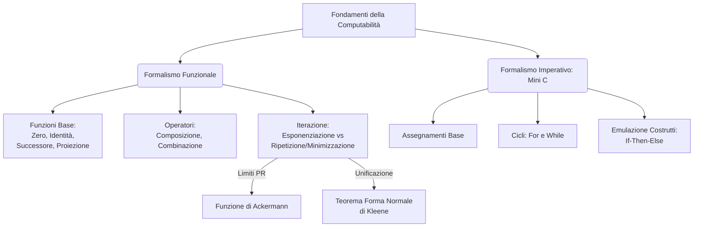
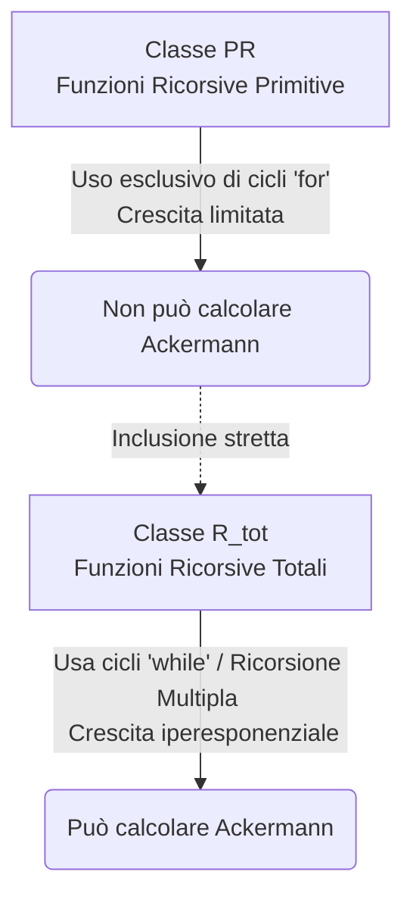

### Panoramica Teorica
Nell'ambito dell'Informatica Teorica, la definizione rigorosa di ciò che è effettivamente calcolabile (computabile) si fonda sull'equivalenza strutturale di modelli astratti differenti, in accordo con la Tesi di Church. Da un lato, il **formalismo funzionale** definisce il calcolo come l'applicazione e la composizione di funzioni matematiche pure, prive di stati o effetti collaterali, partendo da un nucleo di funzioni elementari. Dall'altro, il **formalismo imperativo**, esemplificato dal linguaggio minimale **Mini C**, modella la computabilità attraverso una sequenza di istruzioni che alterano lo stato della memoria (variabili) tramite costrutti di controllo del flusso. 

Nonostante l'apparente divergenza paradigmatica, l'espressività di questi modelli converge perfettamente. La complessità computazionale e la capacità di generare divergenza (loop infiniti) non risiedono nella molteplicità delle istruzioni, ma nell'impiego di specifici operatori di iterazione indefinita. In questa prospettiva, l'analisi degli operatori funzionali, la normalizzazione dei programmi (Teorema di Kleene) e lo studio di funzioni a crescita iper-esponenziale (Funzione di Ackermann) rivelano i confini esatti tra ciò che è calcolabile con risorse limitate a priori (iterazione definita) e ciò che richiede un potenziale di calcolo illimitato (iterazione indefinita).

---

## Definisci le operazioni base della computabilità: funzioni zero, identità, successore, insieme a composizione, combinazione, esponenziazione e ripetizione.

L'approccio funzionale alla computabilità si articola attraverso la definizione di "atomi" computazionali (funzioni base) e "molecole" (operatori), che permettono di assemblare calcoli di complessità arbitraria. La distinzione cruciale risiede tra le operazioni che garantiscono sempre la terminazione (costruendo la classe delle Funzioni Ricorsive Primitive, PR) e quelle che introducono la possibilità di divergenza (definendo la classe delle Funzioni Ricorsive Parziali, R).

**Le Funzioni Base**
Queste funzioni operano sul dominio dei numeri naturali $\mathbb{N}$ e costituiscono i fondamenti incrollabili del sistema:
* **Funzione di Proiezione:** Agisce come un selettore di dati. Ricevendo in ingresso una tupla di elementi, ne isola e restituisce uno specifico, scartando gli altri. Un caso degenere ma fondamentale è la proiezione zero, che prende una tupla vuota e funge da "cancellazione" del dato.
* **Funzione Identità:** Rappresenta l'assenza di alterazione. Riceve un valore e lo restituisce intatto nel codominio.
* **Funzione Zero:** È la funzione generatrice dell'elemento neutro additivo. A partire da un input vuoto, inietta nel sistema il valore zero.
* **Funzione Successore:** Rappresenta il motore dell'incremento quantitativo. Prende un numero e lo mappa al suo intero successivo.

**Gli Operatori Costruttivi**
Per generare logica computazionale, le funzioni base vengono manipolate tramite operatori di ordine superiore:
* **Composizione:** Stabilisce una relazione di sequenzialità causale tra funzioni, analoga a una pipeline informatica. L'output di una funzione diviene l'input della successiva.
* **Combinazione:** Modella l'esecuzione parallela. Permette di valutare simultaneamente due funzioni su domini distinti, aggregando i risultati in una nuova tupla.
* **Esponenziazione (Iterazione Definita):** Costituisce l'equivalente funzionale del costrutto imperativo `for`. Essa reitera l'applicazione di una funzione per un numero di volte *rigorosamente predeterminato* da un parametro di input. Se una qualsiasi delle computazioni intermedie dovesse divergere, l'intera esponenziazione divergerebbe.
* **Ripetizione o Minimizzazione (Iterazione Indefinita):** Costituisce l'equivalente del costrutto imperativo `while`. Questo operatore non conosce a priori quanti passi saranno necessari. Ricerca il minimo numero di iterazioni affinché l'ultimo elemento della computazione soddisfi una condizione di guardia (nello specifico, raggiunga il valore 1). Se tale condizione non si verifica mai, l'operatore genera divergenza.

> **Formalismo Matematico:**
> * *Proiezione:* $p_k^n: \mathbb{N}^n \to \mathbb{N}$ tale che $p_k^n(x_1, \dots, x_n) = x_k$. La proiezione zero è $p_0: \mathbb{N} \to ()$.
> * *Identità:* $I: \mathbb{N} \to \mathbb{N}$ con $I(x) = x$.
> * *Zero:* $Z: () \to \mathbb{N}$ con $Z() = 0$.
> * *Successore:* $S: \mathbb{N} \to \mathbb{N}$ con $S(x) = x + 1$.
> * *Composizione:* $(g \diamond f)(x_1, \dots, x_r) = g(f(x_1, \dots, x_r))$.
> * *Combinazione:* $(f \times g)(\vec{x}, \vec{y}) = (f(\vec{x}), g(\vec{y}))$.
> * *Esponenziazione:* $f_E(\vec{x}, 0) = \vec{x}$ e $f_E(\vec{x}, y) = f^y(\vec{x})$.
> * *Minimizzazione:* $\mu_y(g(\vec{x}, y)=1)$ restituisce il $\min\{y \mid g(\vec{x}, y) = 1\}$, divergendo se l'insieme è vuoto.

---

## In quanti modi è possibile definire la funzione successore?

Sebbene concettualmente l'operazione di successione rappresenti univocamente l'incremento unitario di una quantità, all'interno dei fondamenti della computabilità essa è definibile attraverso i due prismi strutturali che validano la Tesi di Church. 

1. **Modalità Funzionale (Denotativa):** Nel calcolo delle funzioni ricorsive, il successore non è un'istruzione che altera uno stato preesistente, ma un'entità atomica generatrice. È una delle quattro funzioni base, che mappa staticamente un elemento del dominio al successivo nel codominio.
2. **Modalità Imperativa (Operazionale):** Nel linguaggio Mini C, la funzione successore è realizzata tramite la modifica distruttiva dello stato della memoria. Essa corrisponde all'istruzione di incremento unitario, che rientra tra le uniche tre forme di assegnazione basilari concesse dalla sintassi del linguaggio. 

L'equivalenza tra questi due modi di definizione è il fulcro della dimostrazione di simulabilità tra il formalismo Mini-C e le Funzioni Ricorsive: il costrutto imperativo viene direttamente tradotto e sostituito dalla funzione atomica durante i passaggi di induzione strutturale.

> **Formalismo Matematico / Sintattico:**
> * *Definizione Funzionale:* $S(x) = x + 1$.
> * *Definizione Imperativa (Mini C):* `<ide> = <ide> + 1`.

---

## Come è possibile implementare un costrutto if-then-else nel linguaggio Mini C, dato che non è previsto nativamente?

Il linguaggio Mini C è progettato per dimostrare l'essenzialità assoluta della computazione. A livello nativo, è privo sia di istruzioni condizionali esplicite (`if-then-else`) sia di istruzioni di salto incondizionato (`goto`). Sulla base del Teorema di Jacopini-Böhm, la programmazione strutturata necessiterebbe teoricamente di questi costrutti per dirsi completa; tuttavia, in Mini C, l'assenza di un `if-then-else` non intacca la Turing-Completezza del linguaggio, poiché tale meccanismo logico può essere perfettamente emulato.

La strategia risolutiva si fonda sull'uso del costrutto di iterazione definita (il ciclo `for`). Sfruttando la peculiarità sintattica per cui un ciclo viene eseguito da 1 fino a un valore limite, è possibile mappare il flusso condizionale su una valutazione booleana. 

L'implementazione richiede due fasi logiche:
1. **Risoluzione Booleana:** Si suppone preliminarmente di aver sintetizzato gli operatori logici fondamentali (NOT, AND, OR) attraverso manipolazioni algebriche e cicli `for` annidati, in modo che l'espressione booleana di controllo si risolva rigorosamente in un valore binario (0 oppure 1).
2. **Esecuzione Mutuamente Esclusiva:** Si codificano due cicli `for` sequenziali. Il primo utilizzerà come limite superiore l'esito dell'espressione booleana. Il secondo utilizzerà come limite il negato (NOT) della medesima espressione. Di conseguenza, per ogni valutazione, solo uno dei due limiti varrà 1 (attivando l'esecuzione del blocco interno), mentre l'altro varrà 0 (inibendo del tutto il ciclo, poiché la variabile di controllo partirebbe da 1, risultando istantaneamente fuori limite).

> **Formalizzazione Sintattica (Macro-emulazione):**
> Per emulare il costrutto logico `if <bool_expr> then <istr1> else <istr2>`, si inietta nel codice la seguente traduzione:
> `for variabile_dummy = 1 to <bool_expr> { <istr1> }`
> `for variabile_dummy = 1 to not(<bool_expr>) { <istr2> }`.

---

## Enunciato e significato del Teorema della Forma Normale di Kleene.

Il Teorema della Forma Normale di Kleene rappresenta un apice teorico nella comprensione della struttura interna degli algoritmi. Il suo significato filosofico e computazionale risiede nel concetto di **"appiattimento" (normalizzazione) della complessità di controllo**.

Ogni programma reale è tipicamente costituito da una selva di cicli annidati, chiamate a funzioni e diramazioni logiche. Il Teorema di Kleene afferma che questa topologia complessa è strutturalmente superflua: qualunque funzione calcolabile, a prescindere dalla quantità di cicli "while" o ricorsioni in essa innestati, può essere riscritta in una forma normalizzata in cui compare **un unico, singolo ciclo di iterazione indefinita (minimizzazione)** racchiuso tra operazioni che garantiscono sempre la terminazione.

Questo dimostra che la fonte ultima di ogni divergenza computazionale e della natura "parziale" (semi-decidibile) delle funzioni risiede unicamente in questo singolo passo di minimizzazione. Tutte le altre operazioni di manipolazione del dato (pre-elaborazione dell'input e post-elaborazione dell'output) possono essere compresse all'interno di funzioni ricorsive totali.

> **Enunciato Formale:**
> Esistono una funzione ricorsiva totale universale $U$ e, per ogni $n$, una funzione ricorsiva totale indicatrice $T_n$ tali che, per ogni funzione ricorsiva parziale $\varphi_i^{(n)}$ di $n$ variabili, essa è esprimibile come:
> $$\varphi_i^{(n)}(x_1, \dots, x_n) = U(\mu_z(T_n(x_1, \dots, x_n, z, i) = 1))$$
> *Dove:*
> * $T_n$ vale 1 se la variabile $z$ codifica la storia di una computazione terminante e corretta del programma $i$ sugli input $\vec{x}$, altrimenti vale 0.
> * $\mu_z$ (Minimizzazione) itera indefinitamente cercando il minimo $z$ (la computazione valida).
> * $U$ astrae e decodifica il risultato esatto dal log computazionale $z$.

---

## Cos'è la Funzione di Ackermann e qual è la sua rilevanza computazionale?

La Funzione di Ackermann è una funzione matematica definita su numeri naturali la cui natura è basata su una struttura di **ricorsione multipla**. A differenza delle funzioni aritmetiche tradizionali che dipendono dai casi base per decrescere linearmente, le chiamate ricorsive di Ackermann sono innestate l'una all'interno dell'altra come argomenti.

**Rilevanza Computazionale:**
La rilevanza di questa funzione è immensa per la teoria della gerarchia delle classi funzionali. Storicamente, si poteva ipotizzare che l'operatore di Minimizzazione (il ciclo `while`) servisse *esclusivamente* a modellare programmi difettosi o divergenti (semi-algoritmi) e che, per risolvere problemi che terminano sempre (algoritmi), fossero sufficienti i cicli iterativi definiti (`for`, ovvero la classe delle Funzioni Ricorsive Primitive - PR).

La Funzione di Ackermann distrugge questa presunzione. Essa è una **Funzione Ricorsiva Totale**: per ogni input immesso, essa convergerà sempre a un risultato in tempo finito. Tuttavia, la sua velocità di crescita asintotica è talmente esplosiva (iper-esponenziale) da sovrastare qualsiasi calcolo esprimibile tramite soli cicli definiti innestati. Per calcolare Ackermann è intrinsecamente obbligatorio ricorrere all'operatore di Minimizzazione (o alla ricorsione multipla). 

Come corollario formale, la funzione di Ackermann dimostra che l'insieme delle Funzioni Ricorsive Primitive è un sottoinsieme *stretto* delle Funzioni Ricorsive Totali ($PR \subsetneq R_{tot}$), certificando che l'iterazione indefinita è un requisito architettonico indispensabile anche per programmi totalmente convergenti.

> **Formalizzazione Matematica:**
> La funzione si articola su tre casi base e un caso generale di ricorsione innestata ($n \ge 2$):
> * $A(x,y,0) = x+1$.
> * $A(x,y,1) = x+y$.
> * $A(x,y,2) = x \cdot y$.
> * $A(x,0,n+1) = 1$.
> * $A(x,y+1,n+1) = A(x, A(x,y,n+1), n)$.