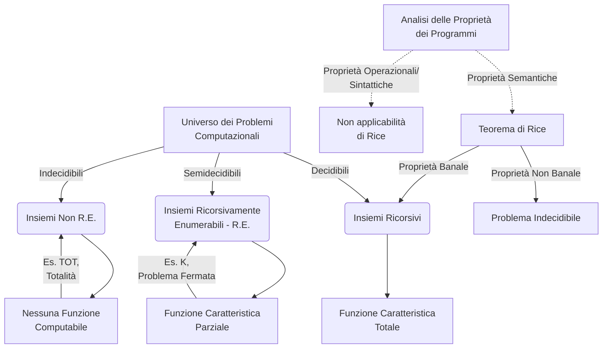
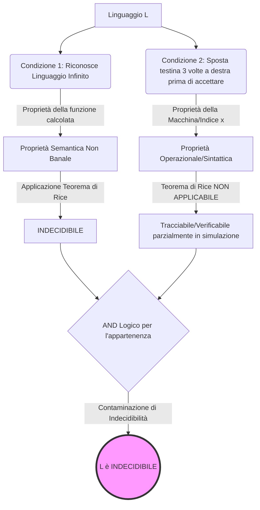

# 2.5 Esercizi Specifici su Linguaggi e Insiemi 1

### Diagramma Concettuale

### Panoramica Teorica

Nello studio dei fondamenti della computabilità, la classificazione dei problemi decisionali si riflette nella Teoria degli Insiemi tramite la caratterizzazione dei sottoinsiemi dei numeri naturali $\mathbb{N}$ (in virtù della Gödelizzazione, che mappa ogni costrutto informatico in $\mathbb{N}$). Un problema è considerato **decidibile** se l'insieme ad esso associato è **Ricorsivo**, ovvero se la sua funzione caratteristica è ricorsiva totale. È considerato **semidecidibile** se l'insieme è **Ricorsivamente Enumerabile (R.E.)**, ovvero se la sua funzione caratteristica è ricorsiva parziale (ammette divergenza per le istanze negative). Se un problema non ammette alcuna funzione computabile in grado di enumerarne gli elementi o verificarne le istanze in modo coerente, esso ricade nella classe degli insiemi **Non R.E.**.

Lo strumento analitico fondamentale per discriminare la decidibilità dei linguaggi che descrivono il comportamento delle Macchine di Turing (MdT) è il **Teorema di Rice**. Esso impone una demarcazione netta tra le proprietà *semantiche* (estensionali, relative alla funzione calcolata, ovvero all'insieme $F$) e le proprietà *sintattiche* o *operazionali* (intensionali, relative allo specifico algoritmo o indice $I_F$). Qualsiasi proprietà semantica non banale risulta intrinsecamente indecidibile. L'approccio risolutivo a questa tipologia di esercizi richiede pertanto di: identificare l'oggetto della richiesta, separare l'estensione logica dall'implementazione operazionale e applicare i teoremi di base (Turing, Post, Rice) per collocare l'insieme nella corretta gerarchia di decidibilità.

---

## L'insieme degli indici delle funzioni totali (Insieme TOT) è ricorsivo, R.E. o non R.E.?

Dal punto di vista concettuale, l'insieme TOT aggrega tutti i numeri di Gödel (indici) associati a Macchine di Turing che si arrestano per qualsiasi input fornito, ovvero che calcolano funzioni ricorsive totali. Valutare l'appartenenza di un indice a questo insieme equivale a risolvere il **Problema della Totalità**, che si interroga sull'assenza di cicli infiniti e divergenze sull'intero dominio di definizione di una funzione.

Dal momento che il Problema della Fermata (Halting Problem) su un singolo e specifico input è già di per sé indecidibile e dimostrato essere un insieme R.E. ma non ricorsivo la verifica della totalità impone un controllo di terminazione esteso a "infiniti input" per la medesima funzione. La natura di questa richiesta genera una complessità asintotica insostenibile per qualsiasi paradigma di calcolo basato su Macchine di Turing. Come vedremo nel formalismo logico, l'insieme TOT si colloca al di fuori dell'enumerabilità effettiva: esso **non è né ricorsivo né Ricorsivamente Enumerabile (Non R.E.)**.

**Dimostrazione Formale dell'Appartenenza alla Classe Non R.E.**
Per dimostrare formalmente che $TOT = \{x \mid \varphi_x \text{ è totale}\}$ non è R.E., procediamo per assurdo :
1. Supponiamo per assurdo che $TOT$ sia un insieme Ricorsivamente Enumerabile (R.E.).
2. Per il teorema sull'equivalenza definitoria degli insiemi R.E., se $TOT \neq \emptyset$ ed è R.E., allora deve esistere una funzione ricorsiva totale $f$ tale che $TOT$ coincida esattamente con il suo codominio: $TOT = \text{cod}(f)$.
3. Costruiamo una nuova funzione matematica $g$ avvalendoci di $f$, definendola come: $g(x) = \varphi_{f(x)}(x) + 1$.
4. Analizziamo le proprietà di $g$: poiché $f$ è totale, essa restituisce un indice valido per ogni $x$. Inoltre, poiché tale indice appartiene a $TOT$, la funzione $\varphi_{f(x)}$ è garantita essere totale. La composizione di funzioni totali unita all'incremento unitario (successore) garantisce che anche $g$ sia una funzione ricorsiva totale.
5. Essendo $g$ totale, essa possiede certamente un suo indice di Gödel, diciamo $y$, che deve per forza appartenere all'insieme $TOT$ ($y \in TOT$).
6. Poiché abbiamo stabilito che l'intero insieme $TOT$ è generato dal codominio di $f$, deve necessariamente esistere un particolare input $\bar{x}$ tale per cui $f(\bar{x}) = y$.
7. Calcoliamo ora il valore della funzione $g$ proprio nel punto $\bar{x}$: 
 $g(\bar{x}) = \varphi_{f(\bar{x})}(\bar{x}) + 1$
 Sostituendo l'indice $y$, otteniamo:
 $g(\bar{x}) = \varphi_y(\bar{x}) + 1$.
8. Tuttavia, sapendo che $y$ è per definizione l'indice che codifica la funzione $g$ stessa, l'espressione $\varphi_y(\bar{x})$ calcola per definizione esattamente $g(\bar{x})$. 
9. Sostituendo ulteriormente, giungiamo alla formula finale: $g(\bar{x}) = g(\bar{x}) + 1$.
Questo risultato costituisce una manifesta e inopinabile contraddizione algebrica. L'assurdo fa collassare l'ipotesi iniziale: il problema della totalità è strutturalmente così arduo da non poter essere nemmeno semidecidibile.

---

## Analizza la decidibilità e la classe del linguaggio L delle Macchine di Turing che accettano numeri antropomorfi

Concettualmente, ci troviamo di fronte alla richiesta di classificare il linguaggio formato dalle codifiche di quelle Macchine di Turing che accettano una specifica classe di stringhe, che per questo esercizio rappresentano "numeri antropomorfi" (interi $n$ in cui $n$ ed $n^2$ terminano con la stessa cifra). 

L'analisi sistemica del problema impone di isolare l'oggetto della computazione. Il fatto che un numero sia o non sia antropomorfo è un attributo puramente matematico delle stringhe in input. Il fatto che una Macchina di Turing $M$ riconosca, e dunque accetti, l'insieme di tali stringhe, attiene direttamente al linguaggio generato dall'automa, ossia $L(M)$. Il linguaggio riconosciuto da una macchina coincide con la classe delle stringhe che fanno parte del dominio per cui la funzione ricorsiva parziale $\varphi_x$ associata alla macchina diverge non fatalmente, e giunge in uno stato finale. Stiamo quindi investigando una **proprietà semantica**, una proprietà della funzione calcolata e non della sua architettura operazionale interna.

Tale proprietà può essere catalogata secondo il dualismo del Teorema di Rice: è una proprietà banale o non banale?. Una proprietà è banale se appartiene a nessuna funzione o a tutte le funzioni dell'universo computazionale. Chiaramente, possiamo ipotizzare e costruire una Macchina di Turing che processa un numero, ne calcola il quadrato (es. in nastro ausiliario), preleva le ultime cifre e le confronta, accettando in caso affermativo. Tale macchina possiederà questa proprietà. Parallelamente, la funzione vuota $\emptyset$ o una macchina che accetta ogni stringa (come $\Sigma^*$) violeranno la restrizione. Esistendo dunque alcune funzioni che godono della proprietà ed altre che non ne godono, la proprietà semantica indagata è **non banale**. 

In virtù di questa classificazione tassonomica, il linguaggio $L$ in questione risulta **indecidibile**, in quanto il Teorema di Rice sancisce irrevocabilmente l'impossibilità di riconoscere algoritmicamente alcuna proprietà non banale delle funzioni ricorsive parziali analizzandone esclusivamente il codice sorgente (l'indice).

**Formalismo Logico-Matematico:**
* Sia $F$ la proprietà semantica definita come: $F = \{ f \mid \text{dom}(f) = \{n \in \mathbb{N} \mid n \equiv n^2 \pmod{10}\} \}$ (assumendo codifiche decimali per le cifre terminali).
* Sia $I_F = \{ x \mid \varphi_x \in F \}$ l'insieme degli indici di Gödel delle macchine che accettano tali linguaggi. Questo insieme corrisponde al linguaggio $L$ in questione.
* Poiché $F \neq \emptyset$ (esiste l'algoritmo calcolatore descritto sopra) e $F \neq \text{Insieme di tutte le Funzioni Ricorsive Parziali}$ (la funzione identità $I(x)$ non gode di questa proprietà per il dominio completo), la proprietà è per definizione non banale.
* Per il Teorema di Rice: $I_F$ è ricorsivo $\iff F$ è banale.
* Poiché $F$ è non banale, $I_F$ non è ricorsivo. Il linguaggio $L$ è pertanto indecidibile.

---

## Analizza la decidibilità del linguaggio L formato dalle macchine di Turing che riconoscono un linguaggio infinito ma spostano la testina a destra per tre volte prima di accettare

Questo quesito introduce una combinazione strutturalmente asimmetrica per forzare una riflessione sui limiti dell'applicazione dei meta-teoremi della computabilità. Il predicato di appartenenza per il linguaggio $L$ è la congiunzione ($\land$) di due sotto-proprietà :
1. **"Riconosce un linguaggio infinito"**: come descritto in precedenza, l'infinità del dominio riconosciuto da una funzione è chiaramente un tratto relazionale dell'output. È una **proprietà semantica ed estensionale** appartenente alla funzione ricorsiva calcolata, ed essendo non banale (alcune macchine accettano domini infiniti, altre finiti o vuoti), essa rientra a pieno titolo sotto l'egida del Teorema di Rice.
2. **"Sposta la testina a destra per tre volte prima di accettare"**: questo è il nucleo di rottura del quesito. Questa condizione non pone alcun vincolo *su cosa* la macchina stia calcolando, ma vincola strettamente il *come* lo calcola. È una traccia di computazione, una metrica basata sull'evoluzione delle Descrizioni Istantanee (ID). Ricade perentoriamente tra le **proprietà sintattiche o operazionali (intensionali)** associate allo specifico indice del programma (la Macchina $X$), e non all'insieme di funzioni astratte.

*Perché questa distinzione è cruciale?* Il Teorema di Rice ha un vincolo fondamentale che viene comunemente frainteso: **non è assolutamente applicabile alle proprietà intensionali**. Non si può invocare Rice per decidere questioni che concernono il comportamento interno di uno specifico programma, proprio perché esistono infiniti indici/programmi che implementano la *stessa* funzione $f$ (Teorema di Gödelizzazione/Equivalenza per infinite varianti) ma che lo fanno attraverso "scatolotti sintattici" differenti (ad esempio, alcuni muoveranno la testina tre volte a destra scartando stati ininfluenti, altri no).

Tuttavia, il problema chiede di stabilire la decidibilità per la congiunzione complessa dell'intero linguaggio $L$. 
Sebbene noi si possa algoritmicamente verificare la proprietà operazionale (possiamo simulare l'automa tramite una Macchina di Turing Universale fino all'istante dell'accettazione e contare i movimenti della testina registrando le transizioni $\{R\}$ senza cadere in loop di indecidibilità globale su questa singola metrica limitata) la prima condizione rimane insormontabile. Non c'è alcun modo algoritmico per stabilire preliminarmente, o a posteriori, se il dominio processato da quella determinata macchina sia infinito. Poiché risolvere $L$ impone di determinare l'intersezione logica in cui la condizione indecidibile è mandatoria, il linguaggio combinato eredita l'intrattabilità della componente semantica, risultando complessivamente **indecidibile**.

