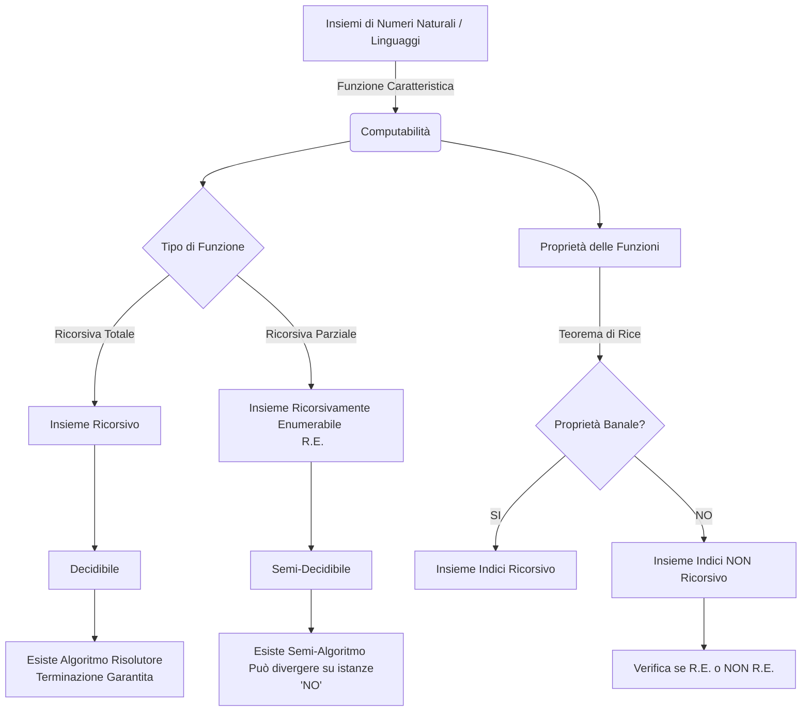
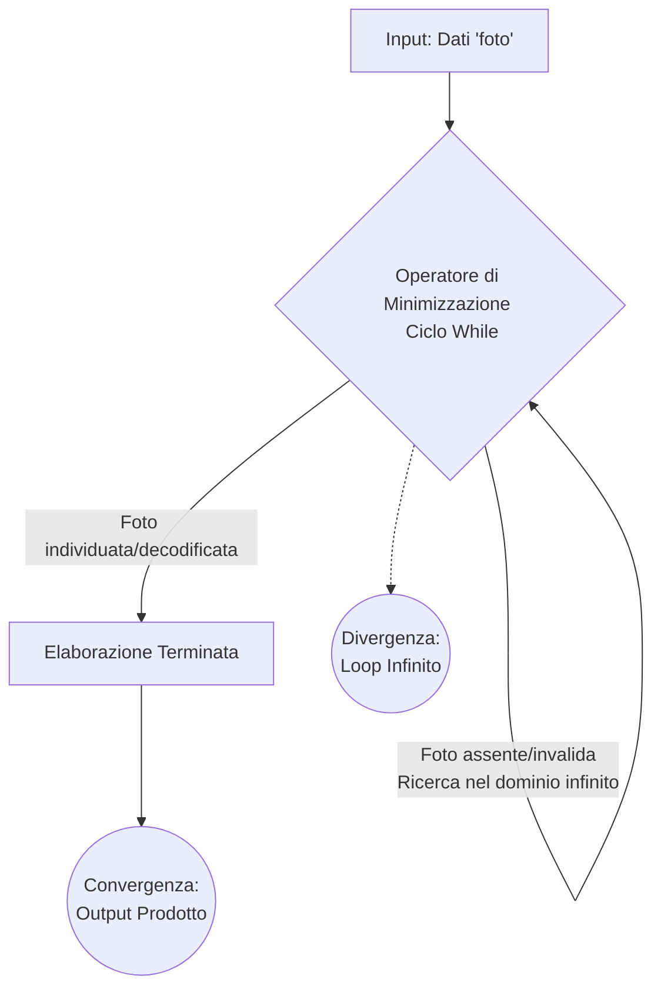

### Panoramica Teorica: Decidibilità, Indecidibilità e Classificazione degli Insiemi
Nello studio dei fondamenti dell'Informatica Teorica, la classificazione dei linguaggi formali e dei problemi decisionali si fonda sull'analisi della computabilità delle loro funzioni caratteristiche. Grazie al procedimento di Gödelizzazione, è possibile stabilire una corrispondenza biunivoca ed effettiva tra i programmi (o Macchine di Turing) e i numeri naturali $\mathbb{N}$. Questo ci permette di traslare lo studio dei problemi computazionali nello studio di sottoinsiemi di $\mathbb{N}$. 

Un problema decisionale si definisce **decidibile** se il corrispondente linguaggio (o insieme) è **Ricorsivo**. Ciò implica che la sua funzione caratteristica sia una *funzione ricorsiva totale*: esiste, in altre parole, un algoritmo (una Macchina di Turing che si ferma sempre) in grado di stabilire in tempo finito sia l'appartenenza che la non appartenenza di un elemento all'insieme.
Qualora l'insieme sia caratterizzato da una *funzione ricorsiva parziale*, esso prende il nome di **Ricorsivamente Enumerabile (R.E.)**. In questo scenario, il problema è **semidecidibile**: la Macchina di Turing funge da *semi-algoritmo*, ovvero garantisce la terminazione (e l'accettazione) se l'elemento appartiene all'insieme, ma può incorrere in una divergenza (loop infinito) se l'elemento non vi appartiene.

Infine, lo strumento analitico supremo per la classificazione delle proprietà semantiche dei programmi è il **Teorema di Rice**. Esso sancisce che ogni insieme di indici che definisce una proprietà *non banale* delle funzioni ricorsive parziali è intrinsecamente non ricorsivo (indecidibile). 

Di seguito, applichiamo questi concetti strutturali all'analisi di tre casi di studio specifici.

---

## Dimostra se il linguaggio L = {x | $\phi_x(0)$ converge} è ricorsivo, R.E. o non R.E.

La classificazione di questo linguaggio richiede un'analisi in due fasi: prima determineremo la sua ricorsività (decidibilità) e, successivamente, la sua enumerabilità (semidecidibilità). 

**Analisi della Ricorsività tramite il Teorema di Rice**
Il linguaggio $L = \{x \mid \phi_x(0) \downarrow\}$ rappresenta l'insieme degli indici di tutti i programmi che, ricevendo in input il valore $0$, terminano la loro computazione (convergono). 
Per stabilire se $L$ sia ricorsivo, dobbiamo valutare se la proprietà $F = \{f \mid f(0) \downarrow\}$ sia una proprietà semantica (relativa alla funzione calcolata e non alla sintassi del codice) e se sia *non banale*. 
Evidentemente, si tratta di una proprietà semantica. Inoltre, essa è non banale: esistono funzioni ricorsive parziali che convergono su input $0$ (ad esempio, la funzione identità o la funzione zero ) ed esistono funzioni che divergono su input $0$ (ad esempio, un programma strutturato con un ciclo iterativo indefinito `while(true)` fin dal primo passo).
Essendo una proprietà semantica non banale, per il **Teorema di Rice**, l'insieme degli indici $I_F$ associato a tale proprietà non è mai un insieme ricorsivo. Di conseguenza, il problema è indecidibile.

**Analisi della Ricorsiva Enumerabilità (R.E.)**
Assodato che $L$ non è ricorsivo, dobbiamo determinare se esso sia almeno Ricorsivamente Enumerabile (R.E.). Un insieme è R.E. se esiste un semi-algoritmo in grado di accettare gli elementi corretti in tempo finito.
In questo caso, la risposta è affermativa. Possiamo sfruttare il Teorema di Esistenza della Funzione Ricorsiva Universale, che postula l'esistenza di una Macchina di Turing Universale $U$ in grado di simulare qualsiasi altro programma. 
La logica del semi-algoritmo è la seguente: ricevendo in input un generico indice $x$, la macchina universale estrae il programma associato $P_x$ e ne simula l'esecuzione passandogli specificamente l'input $0$. 
Se $P_x(0)$ converge in un numero finito di passi, la macchina universale terminerà la simulazione accettando l'indice $x$. Se $P_x(0)$ diverge, la macchina universale divergerà a sua volta insieme alla simulazione. Poiché per ogni $x \in L$ la macchina si arresta, abbiamo costruito un riconoscitore valido. Pertanto, **il linguaggio $L$ è R.E. ma non ricorsivo**.

**Formalizzazione del Semi-Algoritmo:**
Sia $U(x, y)$ la Macchina di Turing Universale. Il linguaggio $L$ è il dominio della seguente funzione ricorsiva parziale $g(x)$:
$$g(x) = U(x, 0)$$
Se $\phi_x(0) \downarrow$, allora $g(x) \downarrow$ (l'indice $x$ viene accettato).
Se $\phi_x(0) \uparrow$, allora $g(x) \uparrow$ (l'indice $x$ provoca divergenza).
Essendo $L = \text{dom}(g)$, ed essendo $g$ una funzione ricorsiva parziale, per definizione $L$ è un insieme Ricorsivamente Enumerabile.

---

## Classifica il linguaggio L = {<x,y> | per ogni z, $\phi_x(z) = \phi_y(z)$} specificando se è decidibile o meno.

Il linguaggio $L = \{\langle x,y \rangle \mid \forall z, \phi_x(z) = \phi_y(z)\}$ descrive il problema dell'**Equivalenza tra Macchine di Turing**. Ci si chiede se due programmi $x$ e $y$ calcolino la medesima funzione ricorsiva parziale per ogni possibile input $z$.

**Indecidibilità (Non Ricorsività)**
Da un punto di vista strutturale, stabilire se due macchine calcolano la stessa funzione richiede una verifica sull'intero dominio dei numeri naturali $\mathbb{N}$. Come visto per il *Problema della Correttezza* e il *Problema della Totalità*, l'analisi di comportamenti funzionali che quantificano universalmente ("$\forall z$") sull'estensione dei domini è intrinsecamente indecidibile. Esistono infiniti algoritmi per infiniti input e, potendo le funzioni divergere su alcuni di questi input, il calcolo algoritmico esaustivo è logicamente impossibile. Il problema è dunque **indecidibile**.

**Non Ricorsiva Enumerabilità (Non R.E.)**
A differenza del problema precedente, questo linguaggio non è nemmeno semidecidibile (Non R.E.). Per dimostrare che una stringa $\langle x,y \rangle$ appartiene a $L$, un ipotetico semi-algoritmo dovrebbe verificare che $\phi_x(z) = \phi_y(z)$ per $z = 0, 1, 2, \dots \infty$. 
Anche adottando tecniche di simulazione parallela (*Dove-Tailing* ), la macchina non potrebbe mai arrestarsi dichiarando l'appartenenza all'insieme, poiché il dominio degli input $z$ da testare è infinito. Non esisterà mai un istante di tempo in cui la macchina potrà affermare di aver controllato *tutti* gli $z$ con esito positivo. L'introduzione del quantificatore universale ($\forall$) su computazioni parziali posiziona questo problema al di fuori della portata dei semi-algoritmi, rendendolo non ricorsivamente enumerabile.

**Conclusione Formale:**
Il linguaggio $L$ non ammette funzione caratteristica totale (non è ricorsivo) e non è il dominio di alcuna funzione ricorsiva parziale convergente per i casi "Sì" (non è R.E.). Pertanto, **$L$ non è né decidibile né semidecidibile**.

---

## Supponendo che la funzione F = 'guarda foto' sia una funzione ricorsiva parziale, come sarebbe strutturato logicamente il suo algoritmo?

Se classifichiamo un processo empirico $F = \text{'guarda foto'}$ come una **funzione ricorsiva parziale**, stiamo operando una precisa dichiarazione sulla sua natura computazionale. Nell'Informatica Teorica, le funzioni ricorsive parziali rappresentano la classe $R$, che coincide con la capacità computazionale delle Macchine di Turing generiche (di primo tipo).

**Struttura Logica del Semi-Algoritmo**
L'aspetto definitorio di una funzione ricorsiva parziale è che essa non garantisce la terminazione per ogni input dell'universo computazionale. Pertanto, l'implementazione logica del processo $F$ non è un *algoritmo* (che termina sempre e comunque), ma un **semi-algoritmo**.

Logicamente, la struttura differirebbe dall'uso esclusivo di operatori di iterazione definita (es. `for` o esponenziazione $E$, tipici delle Funzioni Ricorsive Primitive di classe PR, che garantiscono la totalità ). Il processo necessiterebbe invece dell'operatore di **Ripetizione ($R$)** o **Minimizzazione ($\mu$)**. 
Nel paradigma imperativo del Mini-C, questo operatore corrisponde al costrutto iterativo indefinito `while`. 

**Flusso Operazionale:**
1. **Inizializzazione e Input:** La funzione riceve l'entità target (la codifica della 'foto').
2. **Iterazione Indefinita (Operatore $\mu$ / Loop `while`):** L'agente di calcolo esegue un'esplorazione (ad esempio, ricerca la foto in una memoria infinita, o tenta di decodificarla). Il ciclo è governato da una condizione di test che ricerca un punto di saturazione specifico (es. `while(non trovata) { cerca_prossima }`).
3. **Esiti possibili (Biforcazione Computazionale):**
 * **Convergenza (Input valido):** Se l'entità è presente e conforme (fa parte del dominio della funzione parziale ), l'operatore di minimizzazione individua il valore $k$ per cui la condizione si verifica. Il ciclo si arresta, e la funzione termina restituendo l'output desiderato (l'esito della 'visione').
 * **Divergenza (Input invalido):** Se l'entità è assente o corrotta (non appartiene al dominio), la guardia del ciclo non viene mai soddisfatta. Poiché non esiste un vincolo temporale superiore, la macchina persiste nella ricerca all'infinito, entrando in un loop divergente ($\uparrow$).

**Conclusione Formale:**
Affermare che $F$ è una funzione ricorsiva parziale implica strutturalmente che il programma progettato per eseguirla non possiede un meccanismo di *timeout* o di gestione dell'errore (che lo renderebbe una funzione ricorsiva *totale* ). Esso è un riconoscitore puro che risponde positivamente (in tempo finito) solo se l'operazione ha successo, ma che condanna la macchina a calcolare infinitamente qualora l'input cada al di fuori del dominio di accettazione.