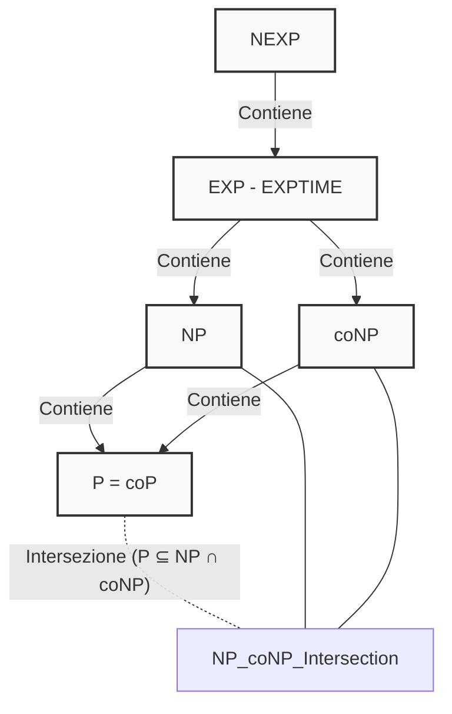
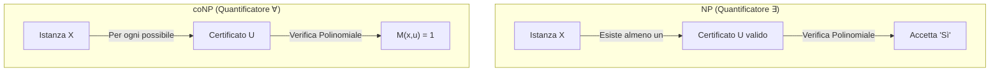

## Panoramica Teorica: La Complessità Temporale e le Classi Decisionali
L'analisi della complessità indaga le risorse (tempo e spazio) necessarie nel *caso pessimo*. I problemi vengono formalizzati come **problemi decisionali** (output "Sì/No").

Tale approccio è assiomatico: la risoluzione decisionale funge da limite inferiore (Lower Bound) per la risoluzione funzionale, fungendo da "paracadute" universale per l'intrattabilità. Le macro-classi di complessità temporale (P, NP, coNP) definiscono l'architettura dei limiti del calcolo, misurando il numero di transizioni compiute da una Macchina di Turing (MdT) in funzione della dimensione $n$ dell'input. Queste classi rimangono stabili al variare del formalismo grazie alla **Tesi di Church Forte**, la quale asserisce che qualsiasi modello computazionale realistico può essere simulato da una Macchina di Turing deterministica introducendo un rallentamento (overhead) al più polinomiale.

---

## Qual è la differenza fondamentale tra la classe P e la classe NP?

La differenza fondamentale tra P ed NP risiede nella distinzione tra la *risoluzione* di un problema e la *verifica* di una soluzione proposta.

**Spiegazione Concettuale:**
La classe **P (Polynomial Time)** è formata dall'insieme dei linguaggi decisionali per cui esiste una Macchina di Turing Deterministica (DTM) capace di decidere l'appartenenza in un tempo limitato superiormente da un polinomio, ovvero $P = \bigcup_{k \ge 1} DTIME(n^k)$. Essa raggruppa i problemi computazionalmente "trattabili".

La classe **NP (Non-Deterministic Polynomial Time)**, invece, contiene i problemi decisionali risolvibili in tempo polinomiale da una Macchina di Turing **Non Deterministica** (NDTM), formalizzata come $NP = \bigcup_{k \ge 1} NTIME(n^k)$. Il non determinismo dota la macchina della capacità di "clonarsi" a ogni bivio decisionale, esplorando parallelamente lo spazio delle soluzioni.

La differenza sostanziale emerge analizzando la **seconda definizione equivalente di NP**, incentrata sul concetto di **certificato polinomiale**. Un problema è in NP se, fornita una potenziale soluzione (il *certificato* $u$), è possibile *verificarne* la correttezza tramite una Macchina di Turing deterministica (verificatore) in un tempo polinomiale rispetto alla dimensione dell'input originario $x$. 

L'equivalenza tra le due definizioni è strutturale: in un albero di esplorazione non deterministico di altezza polinomiale, il singolo cammino dalla radice fino a una foglia di accettazione costituisce esattamente il "certificato" verificabile deterministicamente. Di conseguenza, mentre i problemi in P vengono risolti "da zero" in modo efficiente possedendo un certificato "vuoto", i problemi in NP (come la 3-Colorabilità o l'Independent Set) necessitano dell'oracolo non deterministico per generare l'assegnamento corretto, ma solo di un decisore polinomiale standard per validarlo.

In sintesi, vale la relazione gerarchica d'inclusione $P \subseteq NP$, in quanto ogni automa deterministico è un caso particolare di automa non deterministico privo di scelte multiple, ma la determinazione dell'uguaglianza rigorosa (P = NP) rimane il più grande quesito aperto della disciplina.

---

## Qual è la relazione teorica e strutturale tra la classe NP e la classe coNP?

La classe **coNP** non coincide con il complemento insiemistico generico di NP, ma è rigorosamente definita come l'insieme dei linguaggi il cui complemento appartiene a NP: $CoNP = \{L \mid \bar{L} \in NP\}$. La relazione tra queste due classi è caratterizzata da una profonda **asimmetria dei quantificatori logici** durante l'approccio alla verifica.

**Spiegazione Concettuale:**
Se valutiamo la computazione tramite certificati, per dimostrare che un'istanza appartiene a un linguaggio in **NP** è sufficiente il quantificatore esistenziale ($\exists u$). Serve trovare *esattamente un* singolo assegnamento valido che funga da prova (ad esempio, un singolo cammino accettante per dimostrare la soddisfacibilità in SAT). 

Al contrario, per dimostrare l'appartenenza a **coNP**, entra in gioco il quantificatore universale ($\forall u$). Si rende imperativo dimostrare che la proprietà è verificata *per la totalità* dei possibili certificati. L'esempio prototipico è il problema TAUT (Tautologie) o UNSAT (formule insoddisfacibili): per certificare che una formula è una tautologia o non è mai soddisfacibile, un decisore non può accontentarsi di un singolo caso, ma deve perlustrare l'intero albero di taglia esponenziale composto da tutti i possibili assegnamenti di verità. 

Questa massiccia asimmetria tra "esibire una prova" e "verificare la totalità dello spazio di ricerca" è la ragione strutturale per cui gli scienziati informatici ritengono fermamente che $NP \neq coNP$. Un'ulteriore peculiarità strutturale è che, se un problema è NP-Completo, il suo linguaggio complementare è assiomaticamente coNP-Completo.

---

## Perché le classi P e coP coincidono (coP = P)?

L'identità perfetta tra la classe P e il suo complemento coP è il risultato della natura simmetrica delle computazioni deterministiche ristrette nel tempo polinomiale.

**Spiegazione Concettuale:**
Per assioma, la classe **coP** è formata da tutti i linguaggi i cui complementari sono in P ($CoP = \{L \mid \bar{L} \in P\}$).
Se un linguaggio (problema decisionale) appartiene a P, significa che è supportato da una Macchina di Turing deterministica capace di restituire in tempo polinomiale un verdetto secco di accettazione ("Sì") o rifiuto ("No"). 

Poiché la macchina copre l'intero dominio processando un input in tempo asintotico determinabile, per riconoscere il linguaggio complementare $\bar{L}$ è sufficiente instradare l'output dell'algoritmo originario all'interno di una singola porta logica NOT (o invertire gli stati di accettazione e di scarto della Macchina di Turing). Questa operazione di inversione ha un costo computazionale costante $O(1)$. 

Il tempo complessivo di risoluzione rimane pertanto inalteratamente polinomiale. A differenza dell'asimmetria osservata in NP/coNP dettata dall'esistenza di certificati complessi, gli algoritmi in P si auto-verificano direttamente, possedendo di fatto un "certificato vuoto". Di conseguenza, l'assenza di disparità tra il dimostrare un "Sì" e dimostrare un "No" rende le classi perfettamente sovrapponibili, dimostrando formalmente che $P = coP$.

Unendo questa uguaglianza ai fondamenti per cui i linguaggi deterministici sono un sottoinsieme di quelli non deterministici ($P \subseteq NP$), e conseguentemente $P \subseteq coNP$, scaturisce la fondamentale intersezione teorica: $P \subseteq NP \cap coNP$.

---

## Dimostrare formalmente che la classe NP è chiusa rispetto all'operazione Stella di Kleene.

*Nota preliminare: Il quesito è annoverato nel materiale fornito come domanda d'esame frequente per il modulo "Teoria della Complessità: Tempo e Spazio". Poiché i documenti forniti delineano i concetti di Macchina di Turing Non Deterministica (NTM) le definizioni di NP e l'operatore Stella di Kleene per i linguaggi la dimostrazione che segue è ricostruita accademicamente attingendo a tali definizioni fornite dalle fonti, integrandole con il formalismo matematico standard esterno (non esplicitamente redatto nei file).*

**Spiegazione Concettuale e Dimostrazione (Formalismo Matematico):**
Un linguaggio $L^*$ (Stella di Kleene di $L$) è definito come l'insieme di tutte le stringhe formabili concatenando zero o più stringhe appartenenti ad $L$. Dobbiamo dimostrare che se $L \in NP$, allora anche $L^* \in NP$.

*Dimostrazione costruttiva tramite NTM:*
Sia $L \in NP$. Per definizione esiste una Macchina di Turing Non Deterministica $M$ che decide $L$ in un tempo polinomiale $p(n)$, dove $n$ è la lunghezza dell'input. Vogliamo costruire una nuova Macchina di Turing Non Deterministica $M^*$ che decida il linguaggio $L^*$ in tempo polinomiale.

Dato un input $w$ di lunghezza $n$, la macchina $M^*$ opererà sfruttando il non determinismo caratteristico di NP:
1. Se $w = \epsilon$ (stringa vuota), $M^*$ accetta immediatamente (poiché $\epsilon \in L^*$ per la definizione di Kleene Star).
2. Se $w \neq \epsilon$, $M^*$ "indovina" (esplora non deterministicamente clonandosi in branch multipli ) una scomposizione (partizione) dell'input $w$ in $k$ sottostringhe tali che $w = w_1 w_2 \dots w_k$, con $1 \le k \le n$. 
3. Per ogni sottostringa indovinata $w_i$, la macchina $M^*$ invoca la macchina $M$ come sub-routine (o oracolo polinomiale interno) per verificare se $w_i \in L$.
4. Se in un determinato ramo di computazione non deterministica la simulazione di $M$ accetta per **tutte** le $k$ sottostringhe, $M^*$ accetta la stringa $w$.

*Analisi della complessità temporale:*
Il processo di scomposizione non deterministica della stringa in $k$ pezzi richiede un tempo asintotico $O(n)$.
La fase di verifica invoca la macchina originaria $M$ esattamente $k$ volte. Poiché ogni sottostringa $w_i$ ha dimensione $|w_i| \le n$, il tempo impiegato da $M$ per la singola verifica è limitato superiormente da $p(n)$.
Il tempo totale in un cammino non deterministico (computazione in parallelo) è dominato dalla serie delle verifiche: $O(n) + k \cdot p(n)$.
Poiché $k \le n$, il tempo totale speso dal branch è al più $n \cdot p(n) + O(n)$.
Dal momento che la moltiplicazione di due polinomi ($n$ e $p(n)$) restituisce categoricamente un nuovo polinomio, la macchina $M^*$ decide $L^*$ in tempo polinomiale non deterministico. Di conseguenza, $L^* \in NP$, e la classe risulta chiusa rispetto all'operazione.