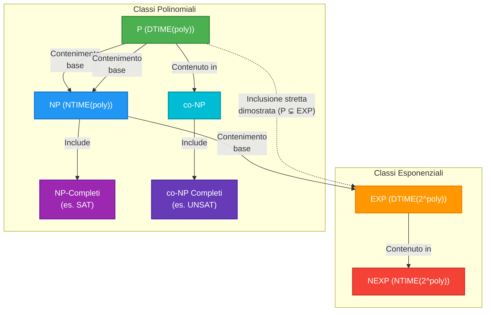
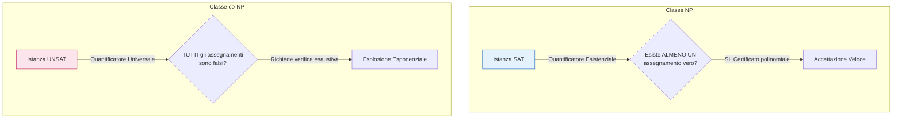

### Panoramica Teorica

Nello studio avanzato della Complessità Computazionale, la quantificazione delle risorse (tempo e spazio) non si limita alla misurazione dell'efficienza algoritmica, ma mira a stabilire i confini intrinseci di trattabilità dei problemi decisionali. L'architettura delle classi di complessità temporale si fonda sulla distinzione tra il modello di calcolo deterministico e quello non deterministico, analizzati nel contesto del "caso pessimo" (worst-case), il quale funge da limite superiore insuperabile per qualsiasi istanza.

Il passaggio dalle classi polinomiali ($P$, $NP$, $co\text{-}NP$) alle classi esponenziali ($EXP$, $NEXP$) delinea un incremento drammatico delle risorse necessarie, formalizzando matematicamente il confine tra problemi computazionalmente gestibili e problemi intrattabili. Mentre la classe $P$ modella l'insieme dei problemi per cui esiste una soluzione efficiente le classi $NP$ e $co\text{-}NP$ isolano l'asimmetria fondamentale tra la verifica di un'evidenza positiva (esistenza di una soluzione) e la verifica di un'evidenza negativa (universalità della non-soluzione). L'identificazione dei problemi **completi** per tali classi permette di mappare i vertici di difficoltà computazionale: se un problema completo collassasse in una classe inferiore, l'intera impalcatura teorica subirebbe un collasso strutturale. Infine, lo studio delle classi esponenziali fornisce l'ambiente necessario per dimostrare, tramite teoremi di separazione inequivocabili, che la gerarchia della complessità è strettamente espansiva, ponendo un limite fisico e logico alla capacità di calcolo.

---

## A quale classe di complessità appartiene il problema SAT? A quale classe appartiene invece il suo complementare UNSAT?

Il problema **SAT** (Satisfiability), ovvero la determinazione della soddisfacibilità di una formula booleana in Forma Normale Congiuntiva (CNF), appartiene alla classe **$NP$** (ed è, nello specifico, il prototipo dei problemi $NP$-Completi).
Al contrario, il suo problema complementare, **UNSAT** (l'insieme delle formule booleane *non* soddisfacibili), appartiene alla classe **$co\text{-}NP$** ed è noto per essere $co\text{-}NP$ completo.

La dicotomia strutturale tra le due classi risiede in una **totale asimmetria computazionale e logica legata ai certificati polinomiali**, determinata dalla natura dei quantificatori logici impiegati:
* **Per SAT (in $NP$):** L'appartenenza è governata da un **quantificatore esistenziale ($\exists$)**. Per dimostrare che una formula è soddisfacibile, un algoritmo non deterministico (o un Verificatore deterministico) necessita di esibire e verificare *esattamente un singolo certificato polinomiale*, ovvero un singolo assegnamento di verità alle variabili che renda vera la formula. La fase di verifica (valutare le clausole della CNF) è eseguibile agevolmente in tempo lineare.
* **Per UNSAT (in $co\text{-}NP$):** L'appartenenza è governata da un **quantificatore universale ($\forall$)**. Per certificare che una formula *non* è soddisfacibile, non è sufficiente esibire un singolo controesempio. Un ipotetico verificatore è costretto a provare e scartare *la totalità* degli assegnamenti di verità possibili. Poiché il numero di combinazioni è $2^n$ (dove $n$ è il numero di variabili), lo spazio dei certificati da analizzare esplode a livello esponenziale, rendendo inesistente un certificato "conciso" e polinomiale capace di dimostrare l'insoddisfacibilità nel paradigma di $NP$.

**Formalismo:**
Questa asimmetria è formalizzata nelle definizioni basate sul verificatore deterministico polinomiale $M$ e sul certificato $u$ di taglia limitata da un polinomio $p(|x|)$:
* **Classe $NP$:** $x \in L \iff \exists u \in \{0,1\}^{p(|x|)}$ tale che $M(x,u) = 1$.
* **Classe $co\text{-}NP$:** $x \in L \iff \forall u \in \{0,1\}^{p(|x|)}, M(x,u) = 1$.

---

## Cosa si intende per problema NP-Completo?

Un problema si definisce **NP-Completo** se soddisfa due rigorose condizioni formali:
1. **Appartenenza a $NP$:** $L' \in NP$, il che garantisce che ogni istanza positiva del problema ammetta un certificato di taglia polinomiale verificabile in tempo polinomiale da una Macchina di Turing deterministica.
2. **Essere NP-Hard (NP-Arduo):** Ogni possibile linguaggio $L$ appartenente alla classe $NP$ deve potersi ridurre a $L'$ in tempo polinomiale ($\forall L \in NP, L \le_p L'$).

La P-Riducibilità ($\le_p$) è il motore logico dell'NP-Completezza: essa impone che esista una funzione $f$, calcolabile in tempo polinomiale, capace di mappare in modo coerente ogni istanza $x \in L$ in un'istanza $f(x) \in L'$, tale per cui $x \in L \iff f(x) \in L'$. La P-Riducibilità gode di **transitività** ; per questo motivo, una volta dimostrata l'NP-Completezza del primo problema fondamentale tramite il **Teorema di Cook-Levin** (che dimostra la completezza del problema $TMSAT$ e conseguentemente di $SAT$), la completezza di qualsiasi nuovo problema viene provata riducendo un problema già noto come NP-Completo al nuovo problema in esame.

Le implicazioni strutturali di questa definizione sono formidabili: un problema NP-Completo incapsula la difficoltà dell'intera classe $NP$. Se si dovesse scoprire un algoritmo deterministico operante in tempo polinomiale per risolvere anche *un solo* problema NP-Completo, grazie alle proprietà di chiusura della riduzione, tale efficienza si propagherebbe a cascata su tutta la classe, dimostrando immediatamente che **$P = NP$**.

---

## Definisci le classi di complessità esponenziali EXP e NEXP

Le classi esponenziali accolgono i problemi intrattabili per i quali la potenza del tempo polinomiale si rivela inadeguata, ammettendo risorse temporali che crescono in maniera sproporzionata rispetto all'input.

* **Classe EXP (o EXPTIME):** È l'insieme dei problemi decisionali che possono essere risolti da una Macchina di Turing **deterministica** in un tempo delimitato superiormente da una funzione esponenziale rispetto alla taglia dell'input $n$. In termini logici, $EXP$ modella algoritmi che, ad esempio, sono costretti a esplorare esaustivamente interi spazi di ricerca senza scorciatoie non deterministiche.
* **Classe NEXP:** È l'esatto analogo non deterministico. Definisce l'insieme dei problemi decisionali risolvibili da una Macchina di Turing **non deterministica** in tempo esponenziale. La classe $NEXP$ si rapporta a $EXP$ con la medesima architettura con cui $NP$ si rapporta a $P$.

Da un punto di vista dell'inclusione logica, è evidente che $NP \subseteq EXP$. Infatti, le possibili stringhe binarie di un certificato polinomiale $p(n)$ sono in numero esponenziale ($2^{p(n)}$). Una macchina deterministica può risolvere un problema in $NP$ in tempo esponenziale banalmente iterando su *tutti* i certificati possibili e simulando le verifiche polinomiali linearizzando il non determinismo.

**Formalismo:**
$$EXP = \bigcup_{k \ge 1} DTIME(2^{n^k})$$ 
$$NEXP = \bigcup_{c \ge 1} NTIME(2^{n^c})$$ 

---

## Fornisci un esempio dimostrato di inclusione stretta tra due classi di complessità, spiegando perché P è strettamente contenuto in EXP.

Nel panorama della teoria della complessità, sebbene l'uguaglianza o disuguaglianza tra classi adiacenti (come $P$ e $NP$, o $NP$ e $EXP$) costituisca ancora un problema aperto e non dimostrato, è un risultato matematico certo e inoppugnabile che gli estremi della gerarchia temporale siano rigidamente e strettamente separati. Pertanto, vige l'inclusione stretta:
$$P \subsetneq EXP$$ 

**Motivazione dell'inclusione stretta:**
L'assioma fondamentale che guida questa separazione deriva dai teoremi di gerarchia temporale: **nessun problema che richiede intrinsecamente un tempo di calcolo esponenziale (il suo limite inferiore o *lower bound*) può mai essere compresso ed eseguito in un tempo polinomiale**. L'aumento esponenziale delle risorse garantisce un salto computazionale effettivo, abilitando la macchina a riconoscere classi di linguaggi strettamente più ampie.

**La formalizzazione e la Tecnica del Padding (Riempimento):**
Per dimostrare relazioni strutturali profonde relative alle classi esponenziali, i teorici ricorrono a potenti artifici di relativizzazione, come la **tecnica del Padding**. Sebbene non dimostri direttamente la separazione base, essa è essenziale per comprendere il comportamento delle variabili dimensionali tra regimi polinomiali ed esponenziali.
La tecnica consiste nell'aumentare artificialmente la dimensione di un input aggiungendo una sequenza inutile (un riempitivo, es. una stringa sterminata di '1').

Tramite il Padding, è possibile dimostrare formalmente che **se $EXP \neq NEXP$, allora $P \neq NP$**.

*Dimostrazione matematica (Per Assurdo):*
1. Assumiamo per assurdo che $P = NP$.
2. Prendiamo un linguaggio generico $L \in NEXP$ deciso da una macchina non deterministica in tempo $O(2^{|x|^c})$.
3. Costruiamo un linguaggio alterato (paddato): $L_{PAD} = \{\langle x, 1^{2^{|x|^c}} \rangle \mid x \in L\}$.
4. L'input originario $x$ è ora affiancato da un riempimento esponenziale. La nuova stringa ha dimensione totale $N \approx 2^{|x|^c}$.
5. Rispetto alla nuova dimensione in input $N$, l'algoritmo originario opera ora in tempo *polinomiale* non deterministico. Ne consegue che $L_{PAD} \in NP$.
6. Applicando l'ipotesi per assurdo ($P = NP$), deduciamo che $L_{PAD} \in P$.
7. Operando ora in "anti-padding", se esiste un decisore deterministico polinomiale per il massiccio input $N$, tale decisore impiegherà tempo deterministico *esponenziale* se ri-calcolato unicamente rispetto alla minuscola dimensione della stringa originaria $|x|$.
8. Ciò garantisce che l'appartenenza a $L$ può essere decisa in tempo deterministico esponenziale. Ergo, $L \in EXP$.
9. Abbiamo provato che un qualsiasi linguaggio in $NEXP$ è contenuto in $EXP$ ($NEXP \subseteq EXP$), risultando nel collasso $EXP = NEXP$.
10. Se partiamo dal postulato di disuguaglianza $EXP \neq NEXP$, giungiamo a una contraddizione generata unicamente dall'ipotesi $P = NP$.

Questo costrutto evidenzia logicamente la profonda separazione dimensionale: scalare il dominio temporale da polinomiale ad esponenziale (e viceversa tramite padding) altera irreversibilmente la classe di computabilità di appartenenza, consolidando la rigida inclusione propria $P \subsetneq EXP$.