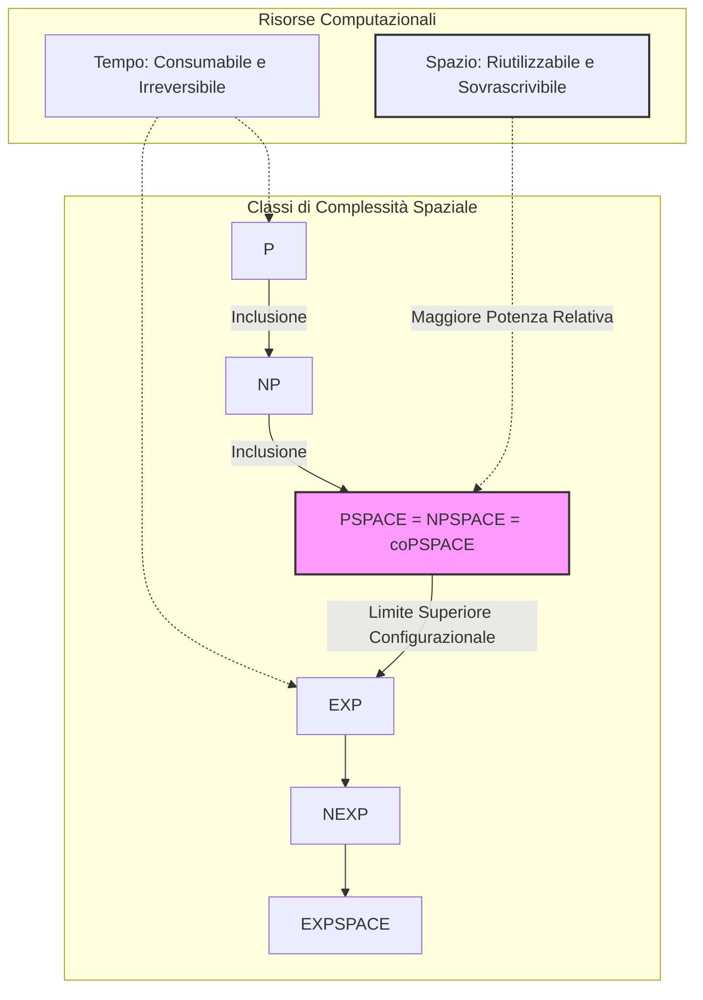
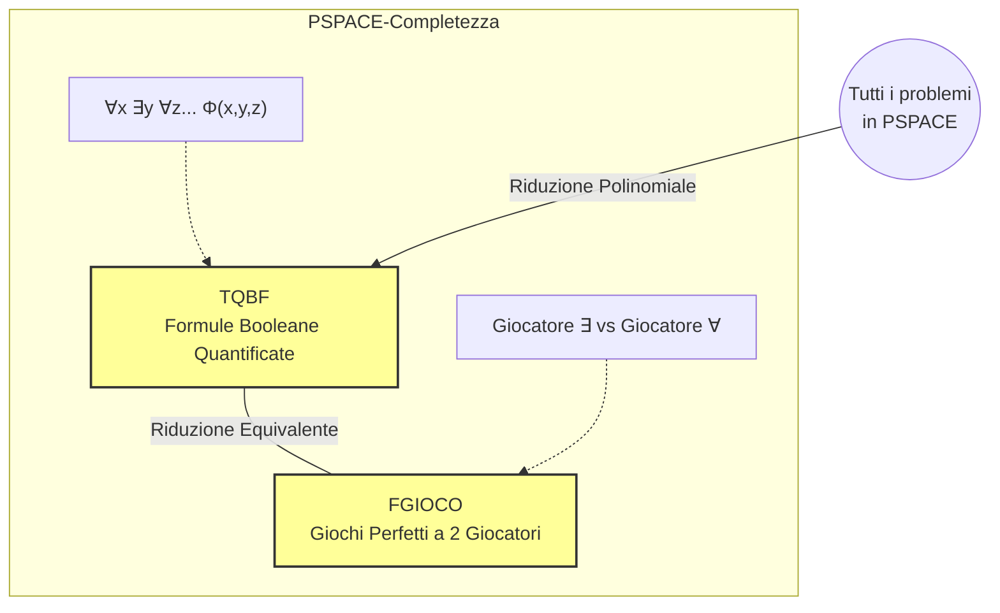

La teoria della complessità spaziale indaga il quantitativo di risorse di memoria necessarie per la risoluzione di un problema computazionale. Il paradigma fondante che differenzia l'analisi spaziale da quella temporale risiede in una proprietà assiomatica delle risorse: **lo spazio è riutilizzabile, mentre il tempo non lo è**. Una volta che una Macchina di Turing (MdT) compie una transizione, il "tick" temporale è irrevocabilmente speso; al contrario, le celle del nastro di lavoro possono essere sovrascritte infinite volte, conferendo allo spazio una potenza computazionale intrinsecamente superiore rispetto al tempo, a parità di ordine di grandezza.

Per strutturare rigorosamente questa branca, si valuta il numero massimo di celle che la MdT visita o utilizza (escludendo logicamente lo spazio originariamente occupato dall'input o destinato all'output) per un input di taglia $n$. Su questa base metrica si definiscono le due classi funzionali macroscopiche: $SPACE(f(n))$, per i linguaggi decisi da Macchine di Turing Deterministiche (DTM) limitate spazialmente da $f(n)$, e $NSPACE(f(n))$, la sua controparte per Macchine di Turing Non Deterministiche (NTM). L'interazione tra modelli deterministici e non deterministici nel dominio spaziale genera dinamiche di collasso strutturale radicalmente differenti rispetto a quelle postulate per la complessità temporale.

## Enunciato e dimostrazione del Teorema di Savitch.

Dal punto di vista concettuale, l'introduzione del non determinismo nella metrica temporale produce un "salto" di potenza computazionale enorme, che si manifesta nelle dicotomie (tuttora irrisolte) tra le classi $P$ e $NP$, o tra $EXP$ e $NEXP$. Il Teorema di Savitch affronta la medesima problematica traslata sulle risorse di memoria, rispondendo all'interrogativo se il non determinismo spaziale introduca un divario di potenza analogo. 

La risposta stabilita dal teorema è profondamente asimmetrica rispetto al tempo: nel contesto della complessità spaziale, **il non determinismo non aggiunge una potenza sostanziale**. Qualsiasi esplorazione ad albero generata da una macchina non deterministica può essere simulata e determinizzata riutilizzando la memoria, a patto di concedere un lieve overhead spaziale che si configura matematicamente in un elevamento al quadrato. Ne consegue che l'abisso computazionale ipotizzato tra determinismo e non determinismo si riduce, nello spazio, a una mera relazione polinomiale (quadratica), annullando le esplosioni esponenziali tipiche delle metriche temporali.

Esiste tuttavia un vincolo strutturale vitale: affinché la simulazione quadratica sia valida, la funzione limite deve essere almeno pari alla dimensione dell'input. Il teorema perde di validità se applicato a funzioni di spazio sub-lineari (come quelle logaritmiche alla base delle classi $L$ e $NL$), poiché in quei regimi asintotici la macchina non dispone nemmeno dello spazio per memorizzare l'intero input originario sul nastro di lavoro.

**Formalismo:**
**Enunciato del Teorema di Savitch:** Per ogni funzione $f: \mathbb{N} \to \mathbb{R}^+$ tale che $f(n) \ge n$, vale la seguente inclusione formale : 
$$NSPACE(f(n)) \subseteq SPACE(f(n)^2)$$

## Definisci la classe PSPACE e fornisci un esempio di linguaggio PSPACE-Completo.

La classe **PSPACE** rappresenta l'insieme di tutti i problemi decisionali (linguaggi) che possono essere risolti da una Macchina di Turing deterministica impiegando un quantitativo di memoria limitato superiormente da una funzione polinomiale rispetto alla dimensione dell'input. 

A causa delle dinamiche esposte dal Teorema di Savitch, l'elevamento al quadrato di una funzione polinomiale restituisce invariabilmente un'altra funzione polinomiale. Questa proprietà algebrica innesca un collasso strutturale formidabile: la classe spaziale polinomiale deterministica coincide perfettamente con la sua controparte non deterministica ($PSPACE = NPSPACE$). Inoltre, le classi spaziali risultano simmetriche rispetto alla complementazione, estendendo il collasso all'equivalenza $PSPACE = NPSPACE = coPSPACE$. 

Un problema si definisce **PSPACE-Completo** se appartiene a PSPACE ed è *PSPACE-Hard* (ovvero ogni altro problema in PSPACE si riduce ad esso in tempo polinomiale). I problemi completi per questa classe rappresentano il vertice dell'intrattabilità prima di sfociare nel tempo esponenziale puro, e sono tipicamente associati a calcoli che richiedono la verifica di alberi decisionali complessi e alternati.

**Esempi di Linguaggi PSPACE-Completi:**
1. **TQBF (True Quantified Boolean Formula):** È il linguaggio prototipico e paradigmatico per l'intera classe. Consiste nell'insieme di tutte le formule booleane chiuse (prive di variabili libere) che risultano logicamente vere. Le formule sono espresse in forma normale premessa, dove si sussegue un'alternanza illimitata di quantificatori universali ($\forall$) ed esistenziali ($\exists$) prima della matrice booleana (es. $\forall x \exists y [(x \lor y) \wedge (\bar{x} \lor \bar{y})]$). L'aspetto cruciale che lo pone oltre la Gerarchia Polinomiale (e quindi fuori da classi come $\Sigma_k^P$) è che il numero di quantificatori non è limitato da una costante prefissata $k$, ma scala con la dimensione dell'input.
2. **FGIOCO (Giochi strategici perfetti):** Questo linguaggio estrapola il concetto di TQBF e lo applica alla Teoria dei Giochi. Un'istanza di TQBF può essere simulata come una scacchiera competitiva in cui due giocatori perfetti (uno associato al quantificatore $\exists$, l'altro a $\forall$) compiono mosse per rendere la formula vera o falsa. $FGIOCO$ è l'insieme delle configurazioni per cui il giocatore $\exists$ possiede una strategia vincente garantita. Un'eccezione notevole riguarda i giochi ordinari (come gli scacchi): avendo un numero di configurazioni enorme ma strettamente finito e slegato da un parametro di input $n$, essi non sono PSPACE-completi, ma risiedono teoricamente in uno spazio costante $SPACE(1)$.

**Formalismo:**
La classe PSPACE è formalmente definita come l'unione di tutte le limitazioni polinomiali di spazio :
$$PSPACE = \bigcup_{c \ge 1} SPACE(n^c)$$
$$NPSPACE = \bigcup_{c \ge 1} NSPACE(n^c)$$

## Dimostrare che NPSPACE è contenuto in EXP (risultato equivalente all'inclusione di PSPACE in EXP).

Per dimostrare che l'intero dominio dello spazio polinomiale ($NPSPACE$ e, per equivalenza, $PSPACE$) è rigidamente confinato all'interno del tempo esponenziale ($EXP$), occorre analizzare la relazione profonda che lega i vincoli fisici di memoria al limite intrinseco della temporalità di calcolo. Il perno di questa dimostrazione si fonda sul concetto di **Descrizione Istantanea (ID)** (o configurazione), ovvero l'"istantanea" dello stato globale in cui si trova la macchina in un dato millisecondo. 

Affinché un problema decisionale sia decidibile e la stringa venga processata in una classe funzionale, la Macchina di Turing **deve convergere**, ovvero deve terminare e arrestarsi senza sprofondare in cicli infiniti. Da questa necessità deriva un corollario fondamentale: una macchina deterministica convergente non può, nel corso della sua computazione su un singolo input, visitare due volte la medesima identica configurazione. Se lo facesse, ripercorrerebbe la stessa esatta evoluzione logica, innescando un loop infinito irrisolvibile.

Il tempo massimo di esecuzione di un algoritmo è quindi strettamente limitato (upper bound) dal **numero totale di configurazioni fisicamente possibili** che la macchina può assumere per quel dato spazio. Se lo spazio a disposizione è limitato da un polinomio, calcolando combinatoriamente le variabili della macchina (stato, testina, e permutazione dei bit sul nastro), si ottiene una funzione di crescita esponenziale. Di conseguenza, una macchina che ricorre al massimo spazio polinomiale esplorerà al più un numero esponenziale di stati prima di doversi necessariamente arrestare, sancendo che qualsiasi calcolo in PSPACE richiede al più tempo esponenziale. Essendo $NPSPACE = PSPACE$ l'asserto è dimostrato.

**Formalismo e Dimostrazione Matematica:**
Sia data una Macchina di Turing operante in uno spazio polinomiale definito dalla funzione $f(n) = n^k$.
Il numero totale di Descrizioni Istantanee (ID) possibili è determinato dal prodotto di tre fattori combinatori :
1. Il numero finito di stati interni del controllo, indicato con $q$.
2. Il numero di posizioni in cui può trovarsi la testina sul nastro, che, essendo lo spazio limitato, è al massimo $n^k$.
3. Il numero di possibili contenuti sul nastro di lavoro. Assumendo un alfabeto binario, le combinazioni possibili per $n^k$ celle ammontano a $2^{n^k}$.

Il numero massimo di configurazioni distinte risulta essere :
$$\text{ID}_{max} = q \cdot n^k \cdot 2^{n^k}$$

La funzione limitante $q \cdot n^k \cdot 2^{n^k}$ è dominata dal termine esponenziale $2^{n^k}$. Affinché la macchina non entri in un loop infinito (garantendo la convergenza del decisore), il numero di passi temporali eseguiti deve essere strettamente minore o uguale al numero di configurazioni uniche. 
Questo implica che il tempo di computazione è limitato superiormente da una funzione esponenziale. Sotto l'inclusione generata dal Teorema di Savitch ($NPSPACE = PSPACE$), ciò dimostra formalmente che :
$$PSPACE \subseteq EXP \implies NPSPACE \subseteq EXP$$