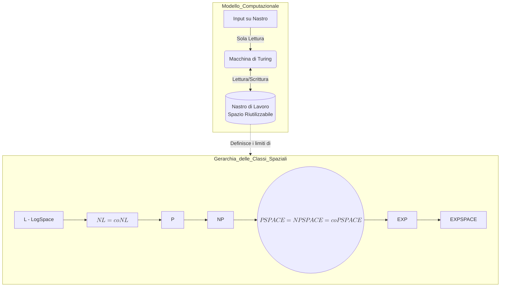
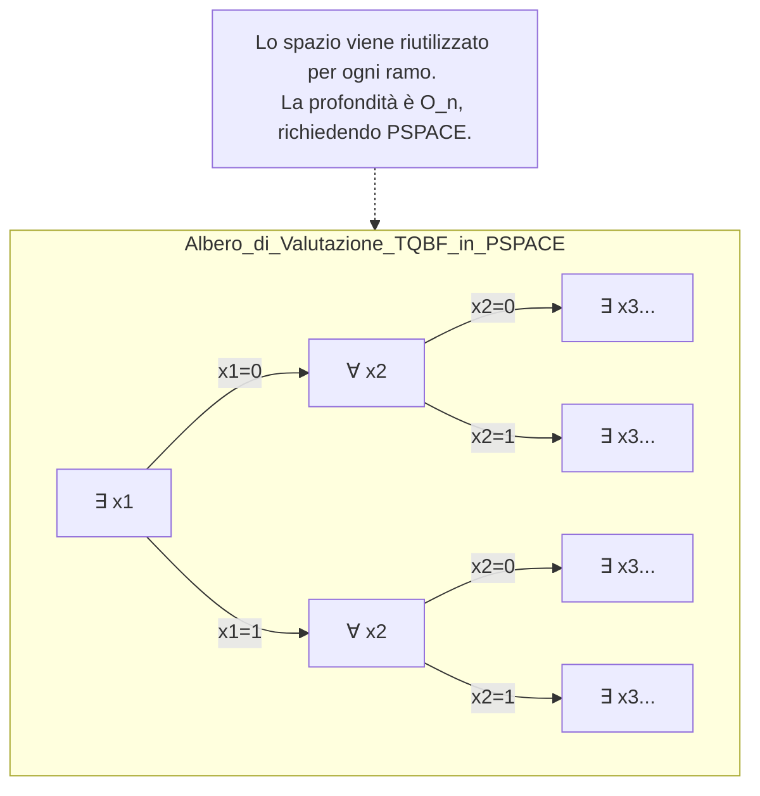

La complessità spaziale introduce un paradigma analitico profondamente differente rispetto alla complessità temporale. Mentre il tempo computazionale è una risorsa strettamente monotona e deperibile (un passo di calcolo eseguito è perso irreversibilmente), lo spazio gode di una proprietà strutturale fondamentale: **lo spazio è riutilizzabile**. Le celle del nastro di una Macchina di Turing (MdT) possono essere sovrascritte e riciclate per calcoli successivi, conferendo allo spazio un potere computazionale intrinsecamente superiore a parità di ordine di grandezza asintotico. 

Per misurare rigorosamente lo spazio, si adotta il modello della MdT dotata di un nastro di input in sola lettura e di un nastro di lavoro in lettura/scrittura; la complessità spaziale viene misurata conteggiando **esclusivamente il numero massimo di celle visitate sul nastro di lavoro** in funzione della dimensione dell'input $n$. Da questo assioma derivano le classi funzionali $SPACE(f(n))$ e $NSPACE(f(n))$, che raggruppano i problemi decisionali risolvibili rispettivamente da macchine deterministiche e non deterministiche confinate entro uno spazio $f(n)$.

---

## Qual è la complessità spaziale di una macchina che determina se il numero di elementi di un array in input è pari o dispari?

Per determinare la parità (pari o dispari) del numero di elementi di un array di dimensione $n$, la complessità spaziale sul nastro di lavoro è **costante**, ovvero $\mathcal{O}(1)$. 

Da un punto di vista strutturale, l'algoritmo non necessita di memorizzare l'intero array né di mantenere un contatore binario che arrivi fino a $n$ (il quale richiederebbe uno spazio logaritmico $\mathcal{O}(\log n)$ ). L'elaborazione procede leggendo l'input sequenzialmente (dal nastro in sola lettura) e l'unica informazione che il sistema deve preservare durante le transizioni è lo "stato di parità" corrente. Questo stato è rigorosamente binario (0 per pari, 1 per dispari). 

Nella formalizzazione della Macchina di Turing, questa informazione può essere interamente assorbita dal **controllo a stati finiti** (l'insieme $Q$) della macchina stessa. La macchina alternerà deterministicamente tra due stati interni (es. $q_{pari}$ e $q_{dispari}$) ad ogni elemento letto dal nastro di input, senza la necessità di scrivere alcun simbolo sul nastro di lavoro ausiliario. Poiché il quantitativo di memoria ausiliaria impiegata è nullo (o limitato a una singola cella per l'output), lo spazio consumato è indipendente dalla taglia $n$ dell'input.

**Formalismo:**
Appartenendo a $SPACE(1)$, e sapendo che per definizione la classe sub-lineare fondamentale è definita con spazio logaritmico, si deduce l'inclusione formale: 
$$SPACE(1) \subset SPACE(\log n) = L$$
Il problema della parità appartiene dunque in modo banale alla classe **L (LogSpace)**.

---

## Qual è la forma normale che descrive i problemi in PSPACE, e in che modo rappresenta un problema completo per questa classe?

La forma normale che cattura l'essenza computazionale della classe PSPACE è la **Forma Normale Premessa** (Prenex Normal Form) applicata alle Formule Booleane Quantificate Chiuse. Questo formalismo è alla base del problema archetipico PSPACE-Completo: il **TQBF (True Quantified Boolean Formula)**.

In questa forma normale, la struttura logica del problema impone che **tutti i quantificatori** (Esistenziale $\exists$ e Universale $\forall$) siano posizionati rigorosamente "a sinistra" (in testa) della formula, mentre il corpo della formula (la matrice $\Phi$) consiste in un'espressione booleana priva di quantificatori. 

Il TQBF è un problema completo per PSPACE in quanto ammette una profondità di innestamento illimitata dei quantificatori. Se il numero di alternanze tra quantificatori fosse limitato a una costante $k$, il problema verrebbe confinato ai gradini della **Gerarchia Polinomiale** (appartenendo a $\Sigma_k^P$ o $\Pi_k^P$). Tuttavia, nel TQBF il numero di quantificatori non è limitato, ma scala linearmente con la dimensione dell'input. La valutazione di tale formula richiede l'esplorazione di un albero di assegnamenti di verità di profondità polinomiale. Poiché, come stabilito inizialmente, lo spazio è riutilizzabile un algoritmo può esplorare un ramo (verificando un assegnamento), cancellare le memorie intermedie e riutilizzare le medesime celle per esplorare il ramo adiacente in logica di *backtracking*. Il tempo speso sarà esponenziale (classe EXP), ma lo spazio massimo allocato simultaneamente resterà strettamente vincolato dalla profondità dell'albero, ovvero polinomiale.

Inoltre, il TQBF gode di un isomorfismo strutturale con il problema **FGIOCO**, che modella i giochi strategici perfetti tra due giocatori. I quantificatori si alternano rappresentando le mosse avversarie: il giocatore $E$ ($\exists$) cerca di rendere la matrice vera, mentre il giocatore $A$ ($\forall$) cerca di renderla falsa. Stabilire se esiste una strategia vincente per $E$ equivale a decidere la veridicità del TQBF, confermando la PSPACE-Completezza.

**Formalismo:**
La forma normale di un'istanza TQBF è descritta come:
$$\Phi = Q_1 x_1 Q_2 x_2 \dots Q_k x_k (\varphi(x_1, \dots, x_k))$$
dove $Q_i \in \{\exists, \forall\}$ e $\varphi$ è una matrice in Forma Normale Congiuntiva (CNF). Il problema appartiene a $PSPACE$ ed è PSPACE-Arduo, costituendo il ponte per le riduzioni polinomiali dell'intera classe.

---

## Cos'è la classe coPSPACE e qual è la sua relazione con PSPACE?

La classe **coPSPACE** è l'insieme dei problemi decisionali (linguaggi) i cui complementari appartengono alla classe PSPACE. Relazionare coPSPACE a PSPACE significa svelare uno dei collassi strutturali più eleganti della teoria della complessità, in netta antitesi con ciò che accade per i limiti temporali.

Nella complessità temporale, sussiste una profonda asimmetria tra la ricerca di un certificato (quantificatore $\exists$, classe NP) e la verifica che nessun certificato esista (quantificatore $\forall$, classe coNP), portando alla forte presunzione che $NP \neq coNP$. Nelle classi di complessità spaziale, questa asimmetria viene annichilita. 

La relazione fondamentale scaturisce dall'applicazione del **Teorema di Savitch**. Il teorema dimostra che il non determinismo spaziale non aggiunge potenza sostanziale, postulando che ogni Macchina di Turing non deterministica che usa spazio $f(n)$ può essere simulata deterministicamente in spazio $f(n)^2$. Poiché il quadrato di un polinomio è ancora un polinomio, si ottiene l'uguaglianza primaria tra la classe polinomiale deterministica e quella non deterministica: $PSPACE = NPSPACE$.

Di conseguenza, siccome le classi spaziali deterministiche sono intrinsecamente simmetriche rispetto alla complementazione (basta invertire gli stati di accettazione e rifiuto, come dimostrato dalla chiusura sotto complementazione dei linguaggi spazialmente limitati ), la simmetria si propaga all'intero ecosistema polinomiale spaziale. Non c'è alcuna differenza di complessità spaziale asintotica tra il dimostrare che una formula QBF è vera e il dimostrare che è falsa.

**Formalismo:**
Il Teorema di Savitch: $NSPACE(f(n)) \subseteq SPACE(f(n)^2)$ per $f(n) \ge n$.
L'applicazione a vincoli polinomiali induce la catena di uguaglianze e il totale collasso strutturale:
$$PSPACE = NPSPACE = coNPSPACE = coPSPACE$$
Tale equivalenza sancisce che coPSPACE non è una classe distinta, ma rappresenta la medesima entità matematica e computazionale di PSPACE.