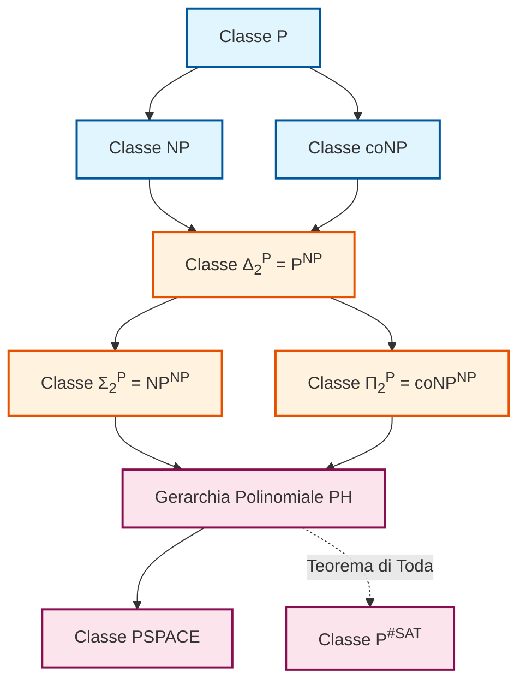
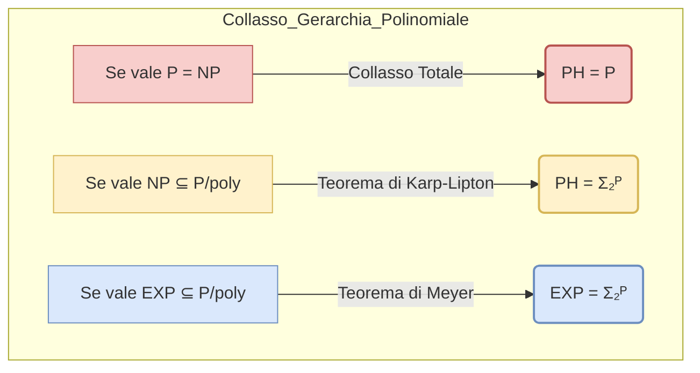
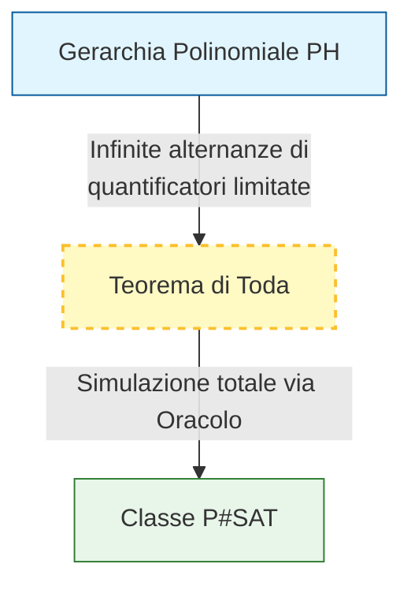

La teoria della complessità introduce il concetto di "oracolo" per analizzare e classificare i problemi computazionali la cui intrinseca difficoltà si colloca nello spazio intermedio tra le classi NP e PSPACE. Per formalizzare tale indagine, il modello di calcolo classico viene esteso definendo la **Macchina di Turing con Oracolo (Oracle Turing Machine)**. 

Dal punto di vista sistemico, questa architettura computazionale è dotata di due nastri distinti: un nastro di lavoro standard, delegato alle computazioni ordinarie della macchina, e un nastro di oracolo, adibito esclusivamente alla comunicazione con un'entità esterna idealizzata. La macchina chiamante prepara un'istanza decisionale sul nastro di oracolo e quest'ultimo, in un tempo computazionale pari a $O(1)$, fornisce la soluzione esatta ("Sì" o "No"). Attraverso l'invocazione di un oracolo in grado di risolvere istantaneamente problemi completi per una determinata classe (ad esempio NP), si definiscono nuove gerarchie che misurano cosa un algoritmo limitato (es. polinomiale deterministico) sia in grado di calcolare qualora la difficoltà dei sottoproblemi più ardui venga fattorizzata a costo nullo. L'introduzione degli oracoli non altera le metriche di complessità spaziale, ma permette una profonda stratificazione delle risorse temporali legate al non determinismo.

## Descrivi la struttura e lo scopo della Gerarchia Polinomiale

La Gerarchia Polinomiale (PH) è una complessa stratificazione di classi di complessità costruita iterativamente tramite l'utilizzo di Macchine di Turing con oracolo. Lo scopo fondamentale di questa struttura è fornire una classificazione granulare per quei problemi decisionali che richiedono livelli multipli di "backtracking innestato". Mentre la classe NP ammette un singolo livello di valutazione non deterministica (la generazione di un certificato e la sua verifica), i livelli superiori della gerarchia consentono di modellare computazioni in cui cicli decisionali non deterministici dipendono gerarchicamente l'uno dall'altro.

La struttura si articola su infiniti livelli o "gradini", in cui la potenza computazionale aumenta proporzionalmente alla complessità dell'oracolo interpellato. Convenzionalmente, l'oracolo impiegato appartiene sempre a una classe non deterministica, poiché l'uso di un oracolo deterministico verrebbe assimilato direttamente dalla macchina base senza apportare alcun salto di capacità espressiva. La gerarchia è ritenuta infinita e propria (ogni livello è strettamente contenuto nel successivo), e culmina essendo interamente e strettamente inclusa all'interno della classe PSPACE. 

Un elemento di indagine cruciale è il potenziale "collasso" della gerarchia: meta-teoremi strutturali dimostrano che se avvenissero uguaglianze nei livelli inferiori (ad esempio se valesse $P = NP$), i quantificatori perderebbero la loro efficacia e l'intera e infinita gerarchia collasserebbe su sé stessa, restituendo $PH = P$. Similmente, i Teoremi di Karp-Lipton e Meyer statuiscono che se classi come NP o EXP fossero assimilabili in architetture circuitali polinomiali ($P/poly$), l'intera impalcatura crollerebbe al secondo livello ($PH = \Sigma_2^P$). Tali collassi sono considerati indicatori di profonda irrazionalità computazionale, il che convalida l'ipotesi della rigidità e separatezza asimmetrica della gerarchia.

**Formalismo Logico e Matematico:**
La gerarchia si definisce induttivamente per un indice $k \ge 1$, a partire dal livello 1 ($P$, $NP$, $coNP$), nel seguente modo :
* $\Delta_k^P = P^{\Sigma_{k-1}^P}$
* $\Sigma_k^P = NP^{\Sigma_{k-1}^P}$
* $\Pi_k^P = coNP^{\Sigma_{k-1}^P}$
L'intera Gerarchia Polinomiale è la loro unione illimitata: $PH = \bigcup_{k} (\Sigma_k^P \cup \Pi_k^P)$.
Dal punto di vista della complessità descrittiva, ogni problema presente in un gradino $\Sigma_k^P$ ammette la **Forma Normale di Fagin** ($k\text{-}\exists\text{QBF}$). Essa impone una sintassi formale basata sull'alternanza di quantificatori booleani limitati strettamente a $k$ blocchi. Iniziando obbligatoriamente con il quantificatore Esistenziale per la classe $\Sigma_k^P$, si ha:
$$(\exists \vec{S}_1) (\forall \vec{S}_2) \dots (Q_k \vec{S}_k) (\Phi(\vec{S}_1, \dots, \vec{S}_k))$$
dove $\Phi$ è una matrice polinomiale verificabile deterministicamente e priva di quantificatori. Questa struttura ricalca l'interazione con l'oracolo, dove ogni alternanza rappresenta la delega computazionale a un livello gerarchico sottostante.

## Enunciato e implicazioni computazionali del Teorema di Toda

Il Teorema di Toda dimostra l'inclusione della Gerarchia Polinomiale (PH) all'interno di $P^{\#P}$, stabilendo che $PH \subseteq P^{\#P}$.

Il teorema dimostra che il dominio del conteggio trascende ampiamente la complessità del puro calcolo non deterministico isolato. Un problema appartenente alla classe #P (come la determinazione del numero esatto di assegnamenti che soddisfano una formula, e non la semplice esistenza di uno di essi) gode di una ricchezza strutturale tale da inglobare la complessità di qualsiasi costrutto decisionale annidato. 

L'implicazione sistemica è sbalorditiva: disporre del potere di risolvere un problema di conteggio in un singolo passo e connetterlo a un semplice algoritmo deterministico in tempo polinomiale è sufficiente per sbrogliare e collassare analiticamente le infinite ramificazioni e gli annidamenti di quantificatori che costituiscono l'intera Gerarchia Polinomiale.

**Formalismo Matematico:**
L'enunciato formale del Teorema di Toda è:
$$PH \subseteq P^{\#SAT}$$
Ciò indica che l'intera Gerarchia Polinomiale è inclusa nella classe dei problemi risolvibili da una macchina di Turing deterministica operante in tempo polinomiale, la quale è supportata da un oracolo capace di risolvere il problema funzionale #SAT.

## Cos'è la classe $\Delta_2^P$? Fornisci un esempio di problema completo per questa classe

La classe $\Delta_2^P$ costituisce il primo stadio ibrido posizionato al secondo livello della Gerarchia Polinomiale. Concettualmente, modella i problemi risolvibili da un'architettura che esegue un flusso logico sequenziale in tempo trattabile, ma che ha la facoltà di demandare sottoproblemi intrattabili (in NP) a un risolutore magico esterno.

A livello operativo, la macchina chiamante è strettamente deterministica, e il limite imposto sul tempo di calcolo assicura che il numero totale di invocazioni all'oracolo sia limitato superiormente da un polinomio. 
Una proprietà strutturale notevole di $\Delta_2^P$ risiede nella sua perfetta simmetria e chiusura rispetto alla complementazione logica: essa contiene trivialmente sia l'intera classe NP (risolvibile con una singola chiamata diretta) sia la classe coNP. La macchina, processando deterministicamente il risultato dell'oracolo (che è un output binario "Sì/No"), ha il potere di attuare l'inversione logica (operazione di NOT) in tempo costante. Questo dimostra che, dal punto di vista della macchina chiamante, interpellare un oracolo per un problema in NP o il suo duale in coNP risulta computazionalmente indistinguibile.

Un esempio paradigmatico di problema completo per questa classe è il **MAXSAT**, nella sua veste decisionale e lessicografica. (Un ulteriore esempio notabile che coinvolge un uso logaritmico della classe, $\Delta_2^P[O(\log n)]$, è la variante Max3Col per la colorazione ottima di grafi ).

**Formalismo Matematico:**
La classe è formalmente definita come:
$$\Delta_2^P = P^{NP}$$
In virtù delle proprietà di negazione algoritmica applicabili all'output dell'oracolo, si enuncia l'identità :
$$\Delta_2^P = co\Delta_2^P$$

## Cosa richiede il problema MaxSat e perché è classificato come $\Delta_2^P$-completo?

Il problema MAXSAT costituisce l'archetipo dell'ottimizzazione booleana calata in ambito decisionale all'interno del secondo livello della Gerarchia Polinomiale.
Il problema richiede, in fase preliminare, di imporre un ordinamento rigoroso tra le variabili di una formula in Forma Normale Congiuntiva (CNF) (es. da $x_1$ a $x_n$). Grazie a questo ordinamento, qualsiasi assegnamento di verità può essere interpretato come un vettore di bit e conseguentemente letto come un numero naturale in notazione binaria. Avendo la possibilità di quantificare matematicamente le soluzioni, il focus passa dalla mera soddisfacibilità (SAT) alla ricerca del "massimo assegnamento" ($\alpha'$) all'interno del sottoinsieme degli assegnamenti validi. La formulazione strettamente decisionale del problema pone quindi la seguente domanda specifica: *dato il massimo assegnamento $\alpha'$ in grado di soddisfare la formula, lo stato della prima variabile (o dell'ultima) è vero (1) o falso (0)?*.

L'appartenenza (e completezza) di questo problema alla classe $\Delta_2^P$ deriva in modo sistemico dalla strategia risolutiva obbligatoria, che ricalca l'algoritmo di **ricerca binaria**. 
La macchina di Turing deterministica base non dispone del potere per indovinare l'assegnamento simultaneamente, per cui deve costruire la soluzione esplorando iterativamente l'albero degli assegnamenti a partire dal bit più significativo. Fissando il primo bit a 1, la macchina interpella l'oracolo NP domandando: "Esiste un qualsiasi assegnamento soddisfacente il cui prefisso coincide con questo bit fissato?". 
Se l'oracolo NP risponde "Sì", il bit viene consolidato in modo irreversibile; se risponde "No", il bit viene commutato a 0, e il processo avanza verso il bit meno significativo successivo.
Questa iterazione causa-effetto si ripete per ogni variabile della formula, comportando un esatto numero di $O(n)$ chiamate sequenziali e condizionate all'oracolo (un ammontare polinomiale). Al termine di questa scansione deterministica dipendente da oracolo, la macchina isola l'intero assegnamento massimo e può rispondere in tempo $O(1)$ alla richiesta iniziale sul valore del singolo bit, sigillando la sua appartenenza alla classe $\Delta_2^P$.

## Cosa richiede il problema MaxCol e perché rientra nella classe $\Delta_2^P$ limitata a $O(\log n)$ interrogazioni all'oracolo?

Il problema MaxCol (formalmente noto come MAX3COL su grafi) è un problema di ottimizzazione parametrica traslato in ambito decisionale. Sulla base del problema della 3-colorabilità di un grafo, il problema richiede, previa l'assegnazione di un "peso" o priorità quantificabile ai nodi, di isolare la specifica colorazione valida che massimizza tale peso complessivo. Il quesito decisionale finale si riduce a stabilire se, in configurazione di peso massimo, un determinato nodo focale abbia assunto uno specifico colore bersaglio.

Questo costrutto rientra in una variante della classe $\Delta_2^P$ poiché richiede l'utilizzo sistematico di oracoli, ma esibisce un limite inferiore della spesa computazionale che ne raffina l'allocazione tassonomica. 
Per determinare il peso ottimo, la macchina non esegue una ricerca lineare o una dipendenza stretta sul vettore numerico delle variabili (come avviene nel MAXSAT), ma esegue piuttosto una ricerca di ottimizzazione sul valore scalare del peso. Utilizzando il paradigma algoritmico della ricerca dicotomica sul range dei pesi possibili, la macchina formula interrogazioni oracolari del tipo: "Esiste una 3-colorazione valida il cui peso aggregato superi la soglia $W$?".
Dato che il range dei pesi ammissibili è polinomialmente limitato rispetto alla dimensione del grafo, attuare una ricerca dicotomica su questo spazio richiede intrinsecamente un numero di dimezzamenti proporzionale al logaritmo del limite superiore. Pertanto, il problema esaurisce la sua risoluzione con un numero di chiamate all'oracolo NP confinato in un dominio logaritmico, inquadrandolo stabilmente all'interno della sottoclasse di complessità $\Delta_2^P[O(\log n)]$.

**Formalismo Matematico e Classificazione:**
MAX3COL è completo per la classe:
$$\Delta_2^P[\log n]$$
Ciò differenzia tale problema dai completi puri per $\Delta_2^P$, segregandolo in un livello di complessità in cui l'iterazione sulle interrogazioni decresce da una dipendenza lineare/polinomiale a una scala strettamente asintotica logaritmica sulla dimensione dell'input $n$.