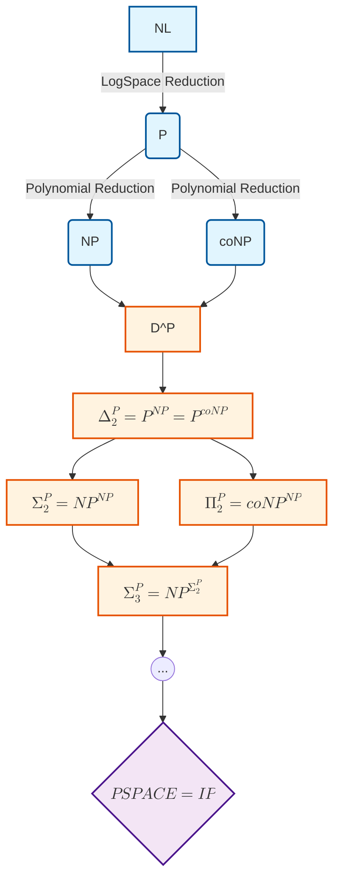
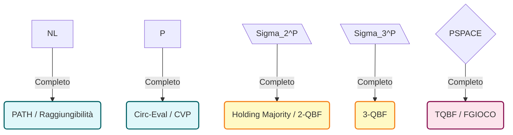

### Panoramica Teorica: Classi Avanzate e Completezza
Nello studio della teoria della complessità strutturale, una volta superata la dicotomia fondamentale tra le classi $P$ ed $NP$, si rende necessario classificare l'infinita granularità di problemi la cui difficoltà intrinseca si colloca tra $NP$ (problemi con certificato polinomiale) e $PSPACE$ (problemi risolvibili in spazio polinomiale). 

Il calcolo interrogativo si basa sul costrutto delle **Macchine di Turing con Oracolo (OTM)**. Un oracolo agisce come un "coprocessore" ideale in grado di risolvere una specifica classe di problemi (tipicamente una classe completa) in tempo costante $O(1)$. Questo paradigma permette di studiare architetture di calcolo basate su chiamate a subroutine di costo nullo, originando una stratificazione nota come **Gerarchia Polinomiale (PH)**. L'indagine di queste classi permette di quantificare l'esatto livello di "backtracking innestato" o di "alternanza quantificazionale" necessario per risolvere problemi decisionali e di ottimizzazione sofisticati.

---

## Qual è la posizione delle classi P con oracolo NP ($P^{NP}$) e P con oracolo coNP ($P^{coNP}$) all'interno della gerarchia polinomiale?

La posizione di una Macchina di Turing deterministica operante in tempo polinomiale e dotata di un oracolo per la classe $NP$, formalmente denotata come $P^{NP}$, definisce esattamente il **secondo livello deterministico della Gerarchia Polinomiale**, indicato con la notazione $\Delta_2^P$.

Da un punto di vista strutturale e cognitivo, un algoritmo appartenente a $\Delta_2^P$ possiede la capacità di effettuare un **numero polinomiale di interrogazioni** all'oracolo $NP$ durante la sua esecuzione. L'informazione chiave risiede nella profonda asimmetria tra il calcolo algoritmico e l'interrogazione oracolare: mentre l'oracolo esplora un intero albero di non-determinismo in un singolo passo, la macchina chiamante mantiene un flusso di esecuzione strettamente deterministico e sequenziale.

Rispondendo alla simmetria tra $P^{NP}$ e $P^{coNP}$, è fondamentale comprendere che queste due classi occupano **esattamente la medesima posizione** e, di fatto, coincidono totalmente:
$$P^{NP} = P^{coNP} = \Delta_2^P$$

**Spiegazione logico-sistemica:**
L'equivalenza scaturisce dalla natura binaria (decisionale) dell'oracolo. Quando una macchina in $P$ interroga un oracolo $NP$, l'oracolo risponde con "Sì" o "No" in tempo costante $O(1)$. Se la macchina base volesse risolvere un problema in $coNP$ (il complemento di un problema $NP$), le basterebbe porre il problema duale all'oracolo $NP$, ricevere la risposta e applicare un operatore logico di negazione (NOT logico) sull'esito. Poiché il ribaltamento di un singolo bit di output richiede un tempo $O(1)$ ed è perfettamente inglobabile nel tempo polinomiale della macchina base, l'accesso a un oracolo per $NP$ conferisce *gratuitamente* l'accesso a un oracolo per $coNP$, e viceversa. 
Per tale motivo, nella Gerarchia Polinomiale si definisce $\Delta_2^P$ come intrinsecamente chiuso rispetto al complemento ($\Delta_2^P = co\Delta_2^P$).

---

## Cos'è la classe $D^P$ (Difference Polynomial Time) e come si definisce?

La classe $D^P$ (Difference-P) è una peculiare classe ibrida che si interpone logicamente e strutturalmente fra il livello base $NP \cup coNP$ e il secondo livello logico-strutturale $\Delta_2^P$. 

Concettualmente, $D^P$ modella quei problemi decisionali in cui la validazione di un'istanza richiede di verificare **simultaneamente** due condizioni indipendenti e antitetiche: l'esistenza di un certificato (tipico di $NP$) e l'assenza assoluta di contro-certificati (tipico di $coNP$). 

La definizione operativa stabilisce che $D^P$ è generata mediante la **congiunzione logica (AND)** di un problema in $NP$ e di un problema in $coNP$. Un algoritmo per decidere un problema in $D^P$ può essere visto come una Macchina di Turing che esegue *esattamente due chiamate* distinte ad un oracolo in tempo logaritmico-polinomiale: una chiamata per validare la componente $NP$ e una per validare la componente $coNP$. Poiché questa procedura si esaurisce con un uso estremamente limitato dell'oracolo (solo due interrogazioni), $D^P$ si colloca stabilmente all'interno di $\Delta_2^P$, ma contiene strettamente l'unione di $NP$ e $coNP$.

**Formalismo:**
Matematicamente, la classe è definita come l'insieme dei linguaggi esprimibili come **differenza insiemistica** tra due linguaggi appartenenti ad $NP$:
$$D^P = \{L \mid L = L_1 \setminus L_2 \text{ tale che } L_1, L_2 \in NP\}$$
Poiché nella teoria degli insiemi la differenza $L_1 \setminus L_2$ equivale all'intersezione $L_1 \cap L_2^C$, ed essendo per definizione $L_2^C \in coNP$, si ottiene l'identità formale:
$$D^P = \{L \mid L = L_{NP} \cap L_{coNP}\}$$ 

---

## Definisci le classi $\Sigma_2^P$ e $\Sigma_3^P$ all'interno della Gerarchia Polinomiale.

Le classi $\Sigma_k^P$ costituiscono i livelli della Gerarchia Polinomiale (PH) e quantificano l'alternanza degli operatori booleani (esiste/per ogni).

1. **Classe $\Sigma_2^P$:**
 * *Definizione tramite Oracoli:* È l'insieme dei problemi decisionali risolti da una Macchina di Turing **non deterministica** in tempo polinomiale dotata di un oracolo per la classe $NP$. Formalmente si indica come $\Sigma_2^P = NP^{NP}$. In questa classe, la macchina può "clonarsi" non deterministicamente e, per ogni suo cammino di calcolo, compiere chiamate oracolari a problemi $NP$-completi.
 * *Definizione Logica (Forma Normale di Fagin):* Corrisponde all'insieme dei linguaggi definibili tramite una formula booleana quantificata ($QBF$) in cui figurano esattamente **due blocchi alternati di quantificatori**, iniziando perentoriamente con un quantificatore Esistenziale ($\exists$). 

2. **Classe $\Sigma_3^P$:**
 * *Definizione tramite Oracoli:* Procedendo iterativamente nella gerarchia, è l'insieme dei problemi risolti da una NTM polinomiale dotata di un oracolo operante in $\Sigma_2^P$. Formalmente: $\Sigma_3^P = NP^{\Sigma_2^P}$.
 * *Definizione Logica:* Modella problemi esprimibili con **tre blocchi alternati di quantificatori**, partendo sempre da un esistenziale ($\exists$).

**Formalismo Logico (Complessità Descrittiva):**
La struttura esatta per la classe $\Sigma_k^P$, nota come $k\text{-}\exists\text{QBF}$, si esprime tramite l'alternanza rigorosa di vettori di predicati al secondo ordine :
* Per $\Sigma_2^P$: $(\exists \vec{S}_1) (\forall \vec{S}_2) (\Phi(\vec{S}_1, \vec{S}_2))$ dove $\Phi$ è verificabile deterministicamente in $P$.
* Per $\Sigma_3^P$: $(\exists \vec{S}_1) (\forall \vec{S}_2) (\exists \vec{S}_3) (\Phi(\vec{S}_1, \vec{S}_2, \vec{S}_3))$.
L'alternanza dei quantificatori riflette esattamente l'interazione tra la macchina chiamante e i livelli successivi di oracoli innestati.

---

## Per ciascuna delle seguenti classi (NL, P, $\Sigma_2^P$, $\Sigma_3^P$, PSPACE), identifica un problema ad essa completo.

Ogni classe temporale ammette problemi completi che ne caratterizzano la massima difficoltà.

* **Classe NL (Nondeterministic Logarithmic Space):**
 * *Problema Completo:* **PATH (Problema della Connettività o Raggiungibilità nei grafi diretti)**.
 * *Spiegazione:* Dato un grafo orientato e due vertici $s$ e $t$, stabilire se esiste un cammino da $s$ a $t$. Questo problema cattura l'essenza del non-determinismo spazialmente limitato: la macchina deve solo "indovinare" il nodo successivo mantenendo in memoria (spazio $O(\log n)$) unicamente il puntatore al nodo corrente e un contatore di salti per evitare cicli infiniti. Le riduzioni verso di esso avvengono rigorosamente tramite Trasduttore Spazio-Logaritmico ($\le_L$).

* **Classe P (Polynomial Time):**
 * *Problema Completo:* **Circ-Eval (Circuit Value Problem o CVP)**.
 * *Spiegazione:* Dato un circuito booleano $C$ e un input $x$, determinare deterministicamente l'output $C(x)$. Questo problema rappresenta la "morte della parallelizzazione": è intrinsecamente sequenziale poiché il calcolo di una porta al livello logico $d$ necessita del completamento invalicabile delle porte al livello $d-1$. Nessun algoritmo parallelo in classe $NC$ può presumibilmente risolverlo, confermando che $P$-completezza è sinonimo di serialità forzata.

* **Classe $\Sigma_2^P$:**
 * *Problema Completo:* **$2\text{-}\exists\text{QBF}$** oppure **Problemi Avanzati di Holding**.
 * *Spiegazione:* Dal punto di vista strutturale puro, il problema decisionale sulle formule quantificate del tipo $\exists X \forall Y \Phi(X,Y)$. In ambito di ricerca operativa ed economia, vi rientrano problemi come stabilire se un'azienda madre può vendere un numero massimo di società controllate senza che esista alcuno scenario in cui perda il controllo maggioritario della holding globale.

* **Classe $\Sigma_3^P$:**
 * *Problema Completo:* **$3\text{-}\exists\text{QBF}$**.
 * *Spiegazione:* Espansione diretta del precedente basata sulla Forma Normale di Fagin. Stabilire la verità di una matrice booleana posta sotto un'alternanza a 3 stadi di quantificatori: $\exists X \forall Y \exists Z \Phi(X,Y,Z)$. Se i quantificatori divenissero illimitati (non bloccati alla costante $k=3$), il problema degenererebbe istantaneamente e fuoriuscirebbe dalla Gerarchia Polinomiale.

* **Classe PSPACE (Polynomial Space):**
 * *Problema Completo:* **TQBF (True Quantified Boolean Formula)** e **FGIOCO**.
 * *Spiegazione:* TQBF generalizza i gradini della gerarchia polinomiale rimuovendo il limite sul numero di alternanze di quantificatori (che ora dipendono asintoticamente dall'input). Questo concetto si isomorfizza proceduralmente in FGIOCO, ovvero il problema di stabilire se il Giocatore Esistenziale (colui che compie mosse per verificare la formula) possegga una **strategia vincente perfetta** in un gioco a turni ad informazione completa contro il Giocatore Universale, simulando l'intero albero decisionale del gioco in uno spazio computazionale limitato da un polinomio. (Da ricordare, per il Teorema di Shamir, che $PSPACE$ coincide anche formalmente con i sistemi di prova interattivi $IP$ ).