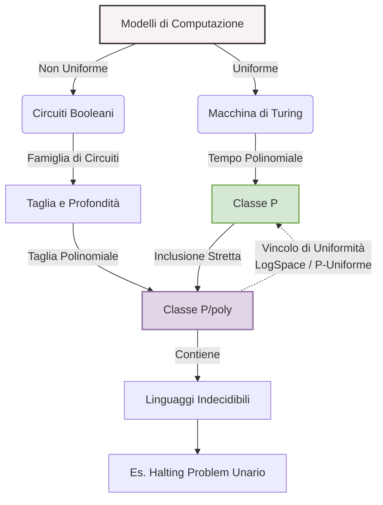
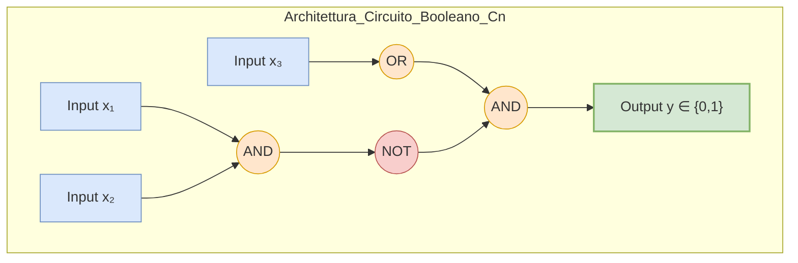
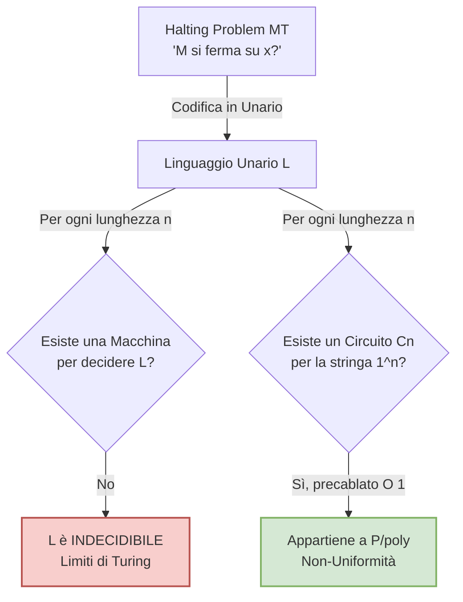

La complessità computazionale hardware-oriented studia l'efficienza degli algoritmi tramite il modello dei **circuiti booleani**. Questo modello sposta l'asse d'indagine dall'esecuzione algoritmica sequenziale alla sintesi di reti logiche, introducendo una dicotomia tra calcolo **uniforme** e calcolo **non uniforme**.

A differenza della MT che elabora input di lunghezza arbitraria, il modello circuitale impiega una *famiglia di circuiti* $\{C_n\}_{n \in \mathbb{N}}$, in cui viene definito un circuito topologicamente distinto per ogni specifica taglia di input $n$. La complessità in questo dominio si misura tramite due metriche: la **Taglia** (il numero totale di porte logiche) e la **Profondità** (la lunghezza del cammino critico input-output, correlata al tempo parallelo).

L'indagine su queste famiglie di circuiti conduce alla definizione della classe **P/poly**, uno spazio computazionale anomalo in cui le limitazioni polinomiali si fondono con capacità oracolari, permettendo al modello non uniforme di trascendere le barriere della calcolabilità di Turing e di estendersi fino ai domini dell'indecidibilità.

***

## Cos'è la classe di complessità P/poly?

La classe **P/poly** è l'insieme dei linguaggi (o problemi decisionali) che possono essere riconosciuti da una famiglia di circuiti booleani di **taglia polinomiale**. Questo significa che, per ogni dimensione di input $n$, esiste un circuito $C_n$ dedicato, la cui quantità di porte logiche (AND, OR, NOT) è limitata superiormente da una funzione polinomiale rispetto a $n$.

Concettualmente, questa classe modella i limiti di ciò che è computabile impiegando risorse hardware fisicamente e asintoticamente ragionevoli. Tuttavia, P/poly presenta una profonda deviazione sistemica rispetto alle classiche misure di tempo temporale (come la classe P): essa si basa sull'assunto della **non-uniformità**. La classe richiede esclusivamente che tale famiglia di circuiti asintoticamente limitata *esista* dal punto di vista matematico, senza imporre alcun requisito o vincolo costruttivo algoritmico. Non è richiesta l'esistenza di una Macchina di Turing capace di "disegnare" o generare il circuito per un dato $n$.

Questo scollamento tra esistenza matematica e costruibilità algoritmica permette alla famiglia di circuiti di incorporare (o "hardcodare") al proprio interno informazioni esterne esterne non computabili, spesso definite in teoria della complessità come "advice" (suggerimento) della dimensione polinomiale. Di conseguenza, è assodato che la classe P è interamente e banalmente contenuta in P/poly, ma tale inclusione è strettamente propria ($P \subsetneq P/poly$), in quanto la non-uniformità dota i circuiti di un potere espressivo nettamente superiore a qualsiasi elaboratore standard.

**Formalismo:**
Un linguaggio $L \in P/poly$ se esiste una famiglia di circuiti booleani $\{C_n\}_{n \in \mathbb{N}}$ e un polinomio $p: \mathbb{N} \to \mathbb{N}$ tali che:
1. $\forall n \in \mathbb{N}$, la taglia del circuito $C_n$ è limitata: $size(C_n) \le p(n)$.
2. $\forall x \in \{0,1\}^n$, l'input $x$ viene accettato se e solo se $C_n(x) = 1$.

***

## Dimostra formalmente che un qualsiasi linguaggio unario appartiene alla classe P/poly.

Un linguaggio si definisce unario se il suo alfabeto è composto da un unico simbolo (convenzionalmente '1'), per cui le stringhe appartenenti al linguaggio assumono la forma $1^k$. Per comprendere l'appartenenza automatica di questi linguaggi alla classe P/poly, occorre analizzare la struttura stessa dell'input elaborato dai circuiti.

Un circuito $C_n$ appartenente a una famiglia è progettato specificamente ed unicamente per stringhe di lunghezza esatta pari a $n$. Se il dominio è unario, per ogni dimensione spaziale $n$ fissata, esiste **una sola ed unica stringa possibile** che può essere presentata all'ingresso del circuito: $1^n$.

Dal punto di vista sistemico, l'informazione necessaria per decidere l'appartenenza di questa stringa al linguaggio collassa in un singolo bit di informazione. Il circuito non deve svolgere alcuna computazione o analisi condizionale complessa sui dati, poiché i dati per una lunghezza $n$ sono statici. Il circuito deve semplicemente "conoscere" a priori se quell'unica stringa $1^n$ fa parte del linguaggio oppure no. Siccome la classe P/poly tollera la non-uniformità e non vincola la generazione dell'hardware è perfettamente lecito postulare l'esistenza di un circuito la cui topologia sia una banale risposta costante pre-cablata. Questa topologia minimale, richiedendo al massimo un numero lineare di porte logiche (o anche un numero costante $O(1)$), soddisfa ampiamente il vincolo della taglia polinomiale richiesto da P/poly.

**Dimostrazione Formale:**
Sia $L$ un linguaggio unario arbitrario, tale che $L \subseteq \{1\}^*$. 
Si definisca la famiglia di circuiti $\{C_n\}_{n \in \mathbb{N}}$ nel seguente modo :
1. **Caso 1:** Se la stringa unaria $1^n \notin L$, allora $C_n$ è un circuito composto da una porta costante che restituisce `0`. La taglia è $size(C_n) = O(1)$.
2. **Caso 2:** Se la stringa unaria $1^n \in L$, allora $C_n$ è un circuito che verifica banalmente l'input, ad esempio una singola porta costante che restituisce `1` oppure una cascata di porte `AND` collegate agli $n$ terminali di input. Nel caso peggiore, la taglia è $size(C_n) = O(n)$.

Poiché per ogni $n \in \mathbb{N}$, il circuito costruito $C_n$ restituisce il valore corretto di appartenenza ed ha una taglia massima limitata asintoticamente da una funzione lineare $p(n) = c \cdot n$ (che è un sotto-caso dei polinomi), si dimostra rigorosamente che l'intero linguaggio unario $L \in P/poly$.

***

## È vero che la classe P/poly contiene anche linguaggi indecidibili? Spiega il motivo.

Sì, l'affermazione è vera: la classe P/poly si estende nei domini dell'indecidibilità. Il motivo strutturale risiede nell'interazione tra la prova logica espressa nella risposta precedente e le anomalie della **non-uniformità**.

Come dimostrato, la classe P/poly include *qualsiasi* linguaggio unario. Non vi è alcun vincolo sulla semantica o sul significato che tale linguaggio unario possa codificare. Sfruttando la tecnica della codifica numerica (Gödelizzazione), è possibile prendere un problema intrinsecamente indecidibile per una Macchina di Turing, come l'**Halting Problem** (Problema della Fermata), e trasformarlo in un linguaggio unario. 

Definiamo il linguaggio $L = \{1^k \mid \text{la } k\text{-esima MT termina su uno specifico input}\}$. La Macchina di Turing si scontra contro l'impossibilità di risolvere questo problema poiché non può simulare in tempo finito tutte le divergenze o loop infiniti. Tuttavia, per l'architettura dei circuiti non uniformi, l'indecidibilità algoritmica è irrilevante. Fissato un $n$, la risposta alla domanda "La macchina $n$ si ferma?" è una verità ontologica: o è `Vero` o è `Falso`. Siccome P/poly non impone che esista un "costruttore" logico in grado di calcolare *come* assemblare il circuito noi postuliamo semplicemente che per ogni $n$ la natura "conosca" la risposta e la inserisca come "oracolo fisico" o "advice" (suggerimento) direttamente nella struttura del circuito (un filo verso la massa per il `Falso` o verso l'alimentazione per il `Vero`). 

L'assenza del vincolo di costruibilità fa sì che P/poly incorpori funzioni che nessuna entità algoritmica potrebbe mai enumerare o calcolare attivamente.

***

## Qual è il legame strutturale tra la complessità circuitale e la complessità temporale nel riconoscimento dei linguaggi?

Il legame teorico che congiunge la flessibilità spuria dei circuiti booleani (complessità circuitale) alla rigidità sequenziale delle Macchine di Turing (complessità temporale/spaziale) risiede nel concetto di **Uniformità dei Circuiti**. 

Senza l'uniformità, la classe dei circuiti rimane un'astrazione matematica inutilizzabile per la programmazione pratica (in quanto invasa dall'indecidibilità descritta sopra). Per ricondurre il calcolo circuitale all'interno dell'ambito della fattibilità algoritmica vera e propria, si deve imporre che la famiglia di circuiti $\{C_n\}$ sia algoritmicamente costruibile. Si decreta che una famiglia è uniforme se esiste una Macchina di Turing (un trasduttore) in grado di ricevere in input la codifica $1^n$ e stampare sul nastro di output la topologia (la descrizione logica) del circuito $C_n$ corrispondente.

L'imposizione di questa limitazione sulle risorse concesse al trasduttore generatore crea un solido isomorfismo tra le classi:
1. **LogSpace-Uniforme / P-Uniforme:** Se il trasduttore è limitato a operare in tempo polinomiale $poly(n)$ o in spazio logaritmico $O(\log n)$, il tempo che impiegherà sarà limitato polinomialmente.
2. **Effetto a catena sulla Taglia:** Se la MT impiega tempo $poly(n)$ per generare il circuito, non potrà fisicamente tracciare sul nastro una descrizione di una rete più grande del tempo investito. Di conseguenza, il circuito generato avrà intrinsecamente una taglia $size(C_n) \le poly(n)$.
3. **Valutazione Temporale:** Una volta che la topologia hardware è stata generata, la valutazione (simulazione) del circuito per determinare l'output su un dato input costa a sua volta un tempo asintoticamente polinomiale rispetto alla taglia del circuito stesso.

Questo flusso logico culmina nel **Teorema di Collasso dell'Uniformità**: Un linguaggio $L$ appartiene alla classe temporale **P** se e solo se è riconosciuto da una famiglia di circuiti LogSpace-Uniforme (o alternativamente P-Uniforme, dato che a livello di generazione dei circuiti la distinzione si annulla). L'uniformità è dunque il ponte teorico definitivo tra le macchine a stati algoritmiche e i modelli a reti logiche stratificate.

Questo legame si riflette bidirezionalmente attraverso potenti meta-teoremi di relativizzazione che analizzano le conseguenze strutturali di eventuali cedimenti tra le classi:
* **Teorema di Karp-Lipton:** Dimostra che se per assurdo la classe delle decisioni temporali verificabili ($NP$) si appiattisse all'interno della complessità circuitale polinomiale ($NP \subseteq P/poly$), l'intera infinita e innestata Gerarchia Polinomiale (PH) subirebbe un catastrofico collasso arrestandosi al suo secondo livello ($PH = \Sigma_2^P$).
* **Teorema di Meyer:** Parimenti, qualora la complessità temporale esponenziale venisse dominata dai circuiti polinomiali ($EXP \subseteq P/poly$), si verificherebbe l'implosione strutturale $EXP = \Sigma_2^P$, esito valutato come supremamente inverosimile in informatica teorica.