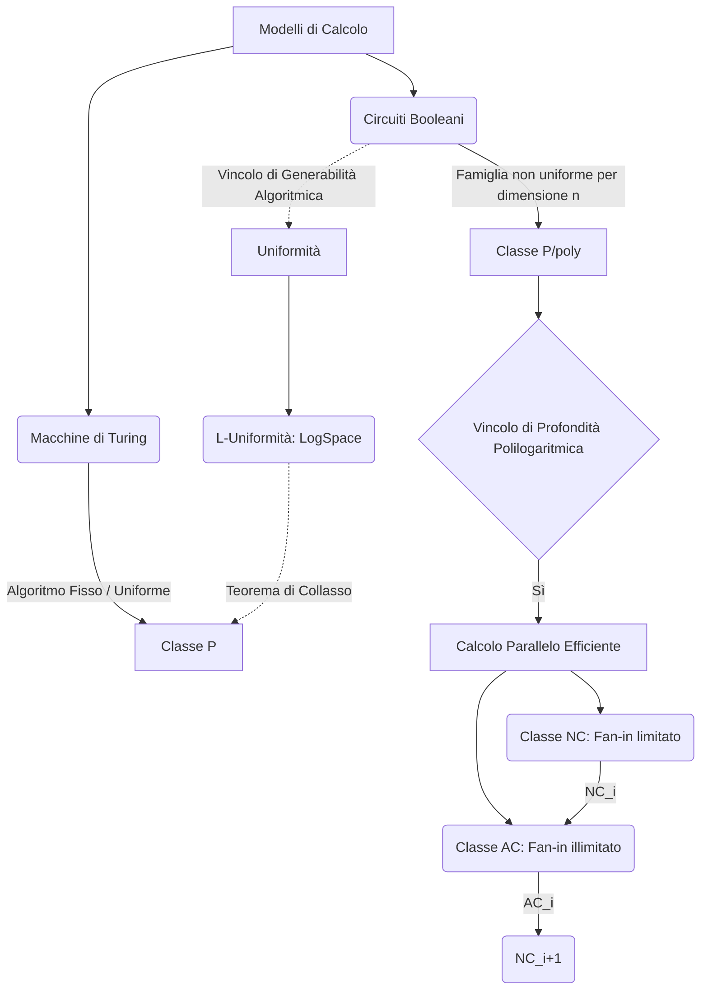
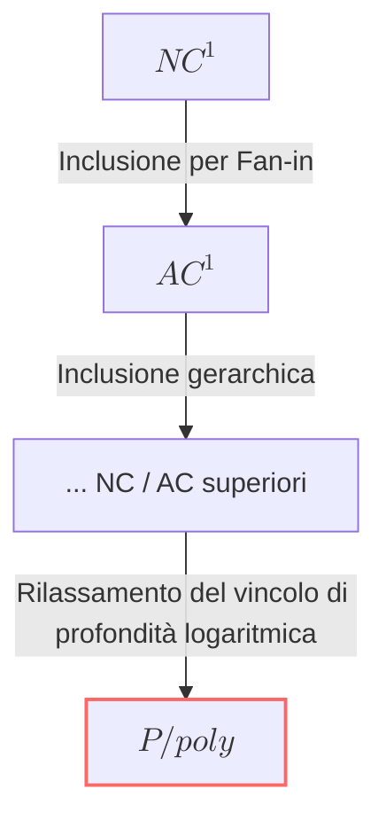

### Panoramica Teorica

Nello studio avanzato della complessità computazionale, il modello standard delle Macchine di Turing (MT) viene affiancato e confrontato con il modello dei **circuiti booleani**. A differenza di una MT, che rappresenta un algoritmo sequenziale universale capace di processare input di lunghezza arbitraria, una famiglia di circuiti $\{C_n\}_{n \in \mathbb{N}}$ è intrinsecamente "non uniforme": fornisce una specifica topologia hardware (un grafo diretto aciclico di porte logiche) per ogni singola dimensione dell'input $n$. 

In questo dominio, la complessità temporale e spaziale classica viene trasposta in metriche strutturali: la **Taglia (Size)** quantifica il numero totale di porte logiche (modellando la quantità di processori o hardware necessari), mentre la **Profondità (Depth)** identifica la lunghezza del cammino più lungo tra input e output, fungendo da misura formale del tempo di calcolo in un regime di parallelismo puro. Questo framework permette non solo di esplorare i limiti inferiori (lower bounds) dell'incomprimibilità algoritmica ma definisce anche rigorosamente cosa significhi parallelizzare in modo efficiente un problema decisionale, portando all'introduzione delle gerarchie $NC$ e $AC$, mitigate dal concetto sistemico di *uniformità* per ricondurre il modello all'effettiva calcolabilità algoritmica.

---

## Definisci la classe di parallelismo NC (Nick's Class)

La classe **NC** (Nick's Class) formalizza la nozione di calcolo parallelo efficiente. Strutturalmente, essa raccoglie i problemi "efficientemente parallelizzabili", ovvero risolvibili da famiglie di circuiti booleani sottoposte a due vincoli simultanei:
1. **Taglia Polinomiale:** Il numero di porte logiche del circuito (e quindi il numero di processori impiegati) deve essere limitato superiormente da un polinomio rispetto alla dimensione dell'input $n$.
2. **Profondità Polilogaritmica:** Il cammino più lungo all'interno del circuito (il tempo parallelo) deve essere confinato entro l'ordine di $O(\log^k n)$ per una qualche costante $k$.

Una caratteristica topologica dirimente della classe NC è il vincolo sulle porte logiche: i circuiti in NC utilizzano esclusivamente porte logiche con **fan-in limitato** (costante, tipicamente pari a 2). A livello gerarchico macrosistemico, la classe si innesta perfettamente nelle classi di complessità classiche, rispettando la relazione di inclusione: $NC \subseteq L \subseteq NL \subseteq P$. La parallelizzazione efficiente è concettualmente l'antitesi della P-completezza: se un problema P-completo appartenesse a NC, l'intera computazione sequenziale polinomiale subirebbe un'accelerazione parallela esponenziale, portando all'improbabile collasso $P = NC$.

## Dimostra l'inclusione della classe $AC^i$ nella classe $NC^{i+1}$

L'inclusione gerarchica formale all'interno delle classi di parallelismo stabilisce che $NC_i \subseteq AC_i \subseteq NC_{i+1}$. Per dimostrare la validità della relazione causale $AC^i \subseteq NC^{i+1}$, occorre analizzare la differenza strutturale del *fan-in* (il numero di ingressi per singola porta logica) tra i due modelli.

Mentre la classe $NC$ impone porte logiche con fan-in limitato (costante, es. 2), la classe $AC$ consente l'utilizzo di porte logiche con **fan-in illimitato** (unbounded). Questa concessione topologica in $AC$ permette di comprimere massivamente la profondità del circuito, risolvendo problemi complessi in strati più brevi (ad esempio, consentendo calcoli a profondità costante come in $AC_0$).

**Dimostrazione strutturale:**
Se assumiamo un circuito appartenente alla classe $AC^i$, esso possiede, per definizione, una profondità pari a $O(\log^i n)$ e impiega porte con fan-in potenziale proporzionale all'input $n$. Per simulare questo stesso circuito all'interno della classe $NC$ (dove il fan-in massimo è vincolato a 2), ogni singola porta ad ingressi multipli di $AC$ deve essere de-costruita e sostituita da un **albero binario** di porte logiche equivalenti. 
Dal punto di vista matematico della teoria dei grafi, un albero binario necessario per processare $n$ ingressi richiede intrinsecamente una profondità pari a $\log n$. Poiché l'operazione di sostituzione deve essere applicata all'intera struttura del circuito $AC^i$, la profondità globale subisce un fattore di dilatazione moltiplicativo pari a $\log n$. 
Dunque, la nuova profondità simulata diventa:
$$ O(\log^i n) \times O(\log n) = O(\log^{i+1} n) $$
Avendo convertito la topologia in porte a fan-in limitato operanti in profondità $O(\log^{i+1} n)$, il circuito ricade esattamente nella definizione della classe $NC^{i+1}$. Questo dimostra formalmente che $AC^i \subseteq NC^{i+1}$.

## Confronta dettagliatamente le capacità computazionali della classe $NC^1$ con quelle della classe $AC^1$

La comparazione tra $NC^1$ e $AC^1$ evidenzia come l'hardware logico influenzi direttamente l'espressività computazionale a parità di vincolo temporale (profondità).

Entrambe le classi sono vincolate a una taglia polinomiale e condividono il medesimo asintoto di profondità: $O(\log^1 n)$, ovvero una profondità strettamente logaritmica. 
Tuttavia, differiscono radicalmente per l'infrastruttura delle porte logiche:
* **$NC^1$:** Obbliga l'uso di porte con fan-in costante (a 2 ingressi). Il flusso delle informazioni deve attraversare una stratificazione logaritmica in cui ogni "nodo elaborativo" processa solo due segnali alla volta.
* **$AC^1$:** Permette l'uso di porte con fan-in illimitato. In un singolo livello di profondità, una porta in $AC^1$ può valutare un numero polinomiale di variabili simultaneamente.

**Confronto delle capacità:**
L'architettura di $AC^1$ garantisce un *throughput* computazionale intrinsecamente superiore rispetto a $NC^1$. Poiché $AC^1$ può processare massivi operandi in un singolo passo, esso è in grado di completare valutazioni booleane complesse all'interno dello spazio temporale $\log n$ che $NC^1$, limitato al fan-in 2, non farebbe in tempo a completare (essendo costretto a serializzare l'aggregazione su un albero aggiuntivo). Di conseguenza, la classe $AC^1$ copre un insieme strettamente più ampio di funzioni booleane parallelizzabili rispetto a $NC^1$, posizionandosi gerarchicamente un gradino al di sopra in termini di potenza espressiva e consolidando la relazione $NC_1 \subseteq AC_1$.

## Qual è la relazione di inclusione tra P/poly e le classi circuitali ristrette $NC^1$ e $AC^1$?

La classe **P/poly** è la classe generale (o "ombrello") che racchiude tutti i linguaggi riconoscibili da famiglie di circuiti booleani la cui taglia è polinomiale ($size(C_n) \leq p(n)$), ma che **non presentano alcun vincolo asintotico stringente sulla profondità** (ammesso che non superi la taglia stessa).

Le classi **$NC^1$** e **$AC^1$** sono invece sotto-classi strutturalmente *ristrette*, create per modellare specificamente l'accelerazione parallela. Esse impongono non solo il vincolo di taglia polinomiale tipico di P/poly, ma impongono in aggiunta la severa limitazione di profondità polilogaritmica (in questo caso specifico $O(\log n)$).

Di conseguenza, dal punto di vista dell'inclusione insiemistica, la relazione è di sub-ordinazione strutturale:
$$ NC^1 \subseteq AC^1 \subset P/poly $$
$NC^1$ e $AC^1$ costituiscono una frazione specifica e altamente efficiente dell'hardware definito da P/poly, escludendo tutti quei circuiti di taglia polinomiale che richiedono profondità lineari o super-lineari (ossia i problemi intrinsecamente sequenziali e non parallelizzabili, come il P-completo Circ-Eval).

## Cosa si intende per L-uniformità (Log-Space Uniformity) nella generazione di famiglie di circuiti booleani?

Per comprendere l'uniformità, bisogna prima isolare l'anomalia fondativa dei circuiti booleani: la loro natura **non uniforme**. Permettendo l'esistenza di un circuito diverso per ogni dimensione di input $n$, il modello acquisisce la capacità di agire come un oracolo pre-programmato, arrivando a decidere in $P/poly$ persino linguaggi formalmente indecidibili dalle Macchine di Turing (come varianti dell'Halting Problem unario codificato in costanti hardware).

Affinché la teoria dei circuiti abbia un impatto realistico sull'informatica algoritmica, è necessario imporre un "ponte" teorico che forzi i circuiti a essere algoritmicamente costruibili: il **vincolo di uniformità**. Una famiglia di circuiti si dice uniforme se ne non ci si limita a postularne l'esistenza astratta, ma si garantisce l'esistenza di una Macchina di Turing (un generatore o trasduttore) che, dato l'input unario $1^n$, produce e restituisce in output l'esatta descrizione topologica del circuito $C_n$.

**La L-Uniformità (Log-Space Uniformity):**
La L-Uniformità è un grado estremamente stringente di questa generazione. Si intende che il trasduttore di Turing incaricato di progettare la topologia del circuito $C_n$ debba portare a termine il suo calcolo utilizzando una memoria di lavoro estremamente contratta, limitata asintoticamente allo **spazio logaritmico $O(\log n)$**.

L'impatto di questo concetto è cristallizzato nel **Teorema di Collasso**: la costrizione imposta dalla LogSpace Uniformity annulla il "magico" potere di pre-calcolo della non-uniformità. Il teorema dimostra infatti che un linguaggio $L$ appartiene alla classe sequenziale polinomiale pura $P$ se e solo se è riconosciuto da una famiglia di circuiti che sia specificatamente LogSpace-Uniforme (oppure P-Uniforme, risultando le due metriche equivalenti come generatori hardware). La L-uniformità rappresenta dunque il cordone ombelicale algoritmico che riconduce la vasta architettura in parallelo dei circuiti alla ferrea rigidità sequenziale deterministica della Macchina di Turing classica.