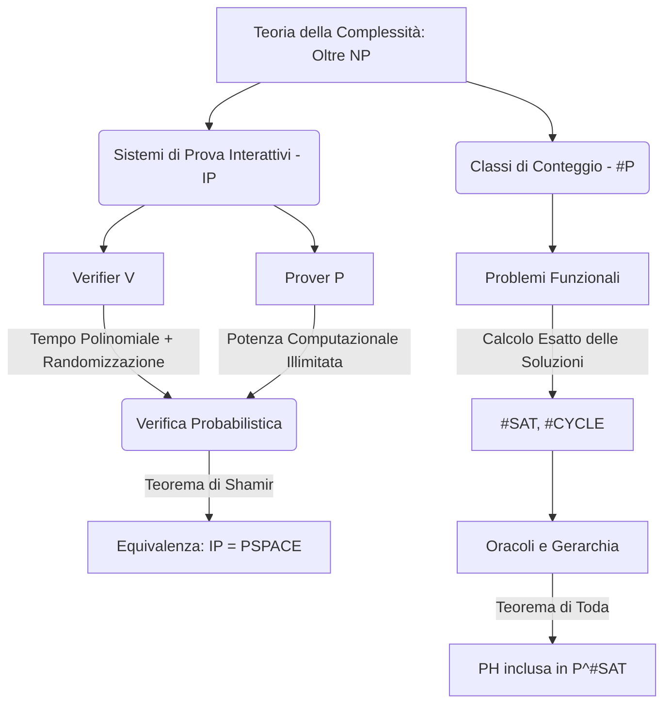
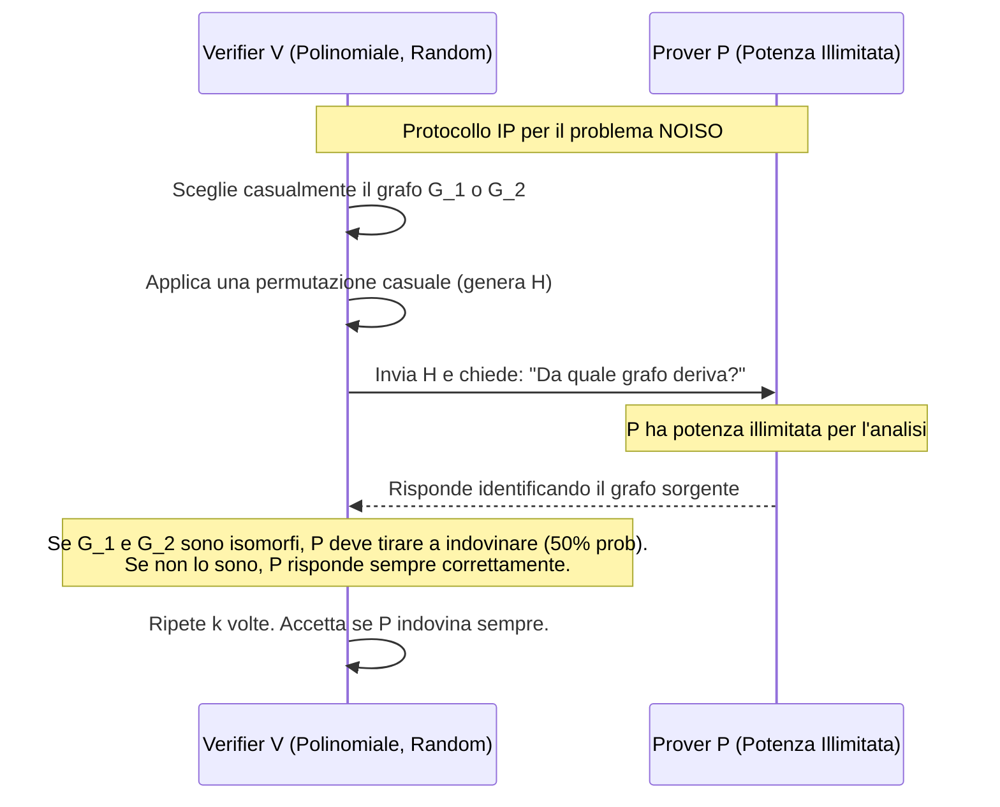

# 4.3 Sistemi Interattivi e Conteggio

### Diagramma Concettuale

### Panoramica Teorica
Nell'architettura classica della complessità computazionale, l'appartenenza a classi come $NP$ viene definita attraverso l'esistenza di un "certificato" statico, verificabile in tempo polinomiale da una macchina deterministica. Tuttavia, l'indagine teorica moderna estende questo paradigma superando i limiti del verificatore passivo e introducendo due concetti sistemici avanzati: l'**interattività probabilistica** e il **conteggio computazionale**. 

Nel primo caso, il concetto di "dimostrazione" (o prova) viene elevato a un protocollo di rete dinamico tra due entità astratte, permettendo di risolvere problemi apparentemente intrattabili scaricando il carico computazionale sull'interazione e sull'aleatorietà. Nel secondo caso, si abbandona il dominio dei problemi decisionali (la mera *esistenza* di una soluzione) per addentrarsi nei problemi funzionali, indagando la complessità necessaria per calcolare l'esatta *molteplicità* delle soluzioni. Questi due domini rivelano connessioni strutturali inaspettate con le classi spaziali ($PSPACE$) e con la Gerarchia Polinomiale ($PH$).

---

## Cos'è la classe dei Sistemi di Prova Interattivi (IP)? Spiega l'enunciato del Teorema di Shamir e l'equivalenza IP = PSPACE.

**Spiegazione Concettuale**
La classe dei Sistemi di Prova Interattivi ($IP$) modella un protocollo di comunicazione in cui due entità, il **Prover** ($P$) e il **Verifier** ($V$), dialogano per stabilire l'appartenenza di una stringa a un linguaggio. 

La relazione si basa su due figure asimmetriche:
* **Verificatore ($V$):** Macchina deterministica polinomiale che opera in tempo polinomiale e possiede un nastro randomico per le scelte casuali.
* **Il Prover ($P$):** Rappresenta un "oracolo" teorico. È una macchina totale dotata di potenza di calcolo illimitata, il cui obiettivo è esibire la prova corretta per convincere il verificatore. A differenza di $V$, il Prover non è probabilistico.

Il protocollo si sviluppa come un'alternanza di messaggi tra le due entità. Affinché il sistema sia valido, l'interazione deve rispettare severi vincoli strutturali: la dimensione di ogni messaggio e il numero totale di scambi devono essere limitati polinomialmente rispetto all'input, e l'elaborazione di $V$ deve rimanere in tempo polinomiale. 

Il paradigma decisionale non è assoluto, ma **probabilistico**. L'obiettivo di $P$ è convincere $V$ con una probabilità elevata (convenzionalmente $\ge 2/3$). Questo meccanismo permette di risolvere problemi che non si sa se appartengano ad $NP$. L'esempio paradigmatico è il problema del **Non Isomorfismo dei Grafi ($NOISO$)**, che appartiene alla classe $coNP$. 
In $NOISO$, il verificatore $V$ sceglie segretamente uno dei due grafi in input, ne permuta i nodi casualmente, e chiede al Prover $P$ da quale grafo derivi. Poiché $P$ ha potenza illimitata, se i grafi *non* sono isomorfi, riconoscerà sempre l'origine esatta della permutazione. Se invece sono isomorfi, essi sono indistinguibili, e $P$ sarà costretto a tirare a indovinare (fallendo il 50% delle volte). Ripetendo il test, la probabilità che un Prover disonesto inganni il Verificatore crolla asintoticamente a zero, permettendo a $V$ di decidere l'appartenenza al linguaggio $NOISO$.

Il **Teorema di Shamir** stabilisce l'uguaglianza tra le classi $IP$ e $PSPACE$. Esso dimostra che la classe dei problemi risolvibili tramite un'interazione polinomiale probabilistica ($IP$) coincide esattamente con la classe dei problemi risolvibili in spazio polinomiale ($PSPACE$).

**Formalismo Matematico**
* **Funzione del Verifier:** $V: \Sigma^* \times \Sigma^* \times \Sigma^* \rightarrow \Sigma^* \cup \{\text{"sì"}, \text{"no"}\}$. $V \in \text{FPTIME}$. Prende in input la stringa $w$, la stringa casuale $r$ (con $|r| \in \text{POLY}(|w|)$) e la storia dei messaggi $m_1\# \dots \#m_i$.
* **Funzione del Prover:** $P: \Sigma^* \times \Sigma^* \rightarrow \Sigma^*$. Computabile con potenza illimitata, riceve l'input $w$ e la storia dei messaggi per generare $m_{i+1}$.
* **Probabilità di Accettazione:** $Pr[V \leftrightarrow P \text{ accetta } w] = Pr[(V \leftrightarrow P)(w,r) = \text{"sì"}]$.
* **Definizione formale della Classe IP:** Un linguaggio $A \in IP$ se esiste un $V \in FPTIME$ e un prover onesto $p$ tali che, per ogni prover disonesto $\tilde{p}$ :
 1. *Completeness:* $w \in A \iff Pr[(V \leftrightarrow p) \text{ accetta } w] \geq 2/3$.
 2. *Soundness:* $w \notin A \iff Pr[(V \leftrightarrow \tilde{p}) \text{ accetta } w] \leq 1/3$.
* **Teorema di Shamir:** $IP = PSPACE$.

---

## Definisci formalmente la classe di conteggio #P.

**Spiegazione Concettuale**
La classe di conteggio **#P** (pronunciata *Sharp-P*) introduce un cambio di paradigma radicale: sposta l'analisi dai problemi decisionali (la cui risposta è un binario "Sì/No") ai **problemi di calcolo funzionali**. Mentre una classe decisionale come $NP$ si interroga sull'esistenza di *almeno un* percorso computazionale accettante (o certificato valido), la classe #P modella l'esatta quantificazione di *tutti* i percorsi computazionali accettanti. 

I problemi paradigmatici di questa classe derivano dalle controparti decisionali in $NP$, elevandone intrinsecamente la difficoltà:
* **#SAT (COUNT-SAT):** Non si limita a chiedere se una formula booleana sia soddisfacibile, ma esige di calcolare il numero esatto di assegnamenti di verità che la rendono vera. Questo problema è **#P-completo** e generalizza sia SAT che problemi in $coNP$ (come UNSAT, che corrisponde a imporre il conteggio uguale a zero).
* **#CYCLE:** Richiede di contare l'esatto numero di cicli semplici in un grafo non orientato. Anche questo è intrinsecamente arduo (NP-Hard) e una sua risoluzione polinomiale implicherebbe il collasso strutturale $P=NP$.

L'enorme complessità racchiusa nel puro atto del "contare" è magistralmente codificata dal **Teorema di Toda**. Questo meta-teorema di relativizzazione dimostra che possedere un oracolo per il problema #SAT conferisce a una macchina deterministica polinomiale una potenza computazionale tale da poter simulare, e quindi risolvere, l'intera e infinita Gerarchia Polinomiale ($PH$). Un singolo problema di conteggio contiene una ricchezza algoritmica superiore a infiniti annidamenti di quantificatori booleani alternati ($\exists$ e $\forall$).

La controparte decisionale stretta della classe funzionale #P è la classe **PP** (Polynomial Parity Problems), la quale richiede che la condizione di accettazione si verifichi in *almeno la metà* dei percorsi computazionali possibili. L'architettura logica di questi sistemi si chiude con un teorema di equivalenza: se i problemi decisionali probabilistici di parità fossero risolvibili in tempo polinomiale deterministico ($PP = P$), allora tutte le funzioni di conteggio sarebbero a loro volta calcolabili in tempo polinomiale ($#P = FP$).

**Formalismo Matematico**
* **Definizione formale di #P:** Una funzione $f: \{0,1\}^* \rightarrow \mathbb{N}$ appartiene alla classe $\#P$ se esiste un polinomio $p$ e una Macchina di Turing deterministica polinomiale $M$ tali che, per ogni input $x$ :
 $$f(x) = |\{ y \in \{0,1\}^{p(|x|)} : M(x, y) = 1 \}|$$
 Dove $y$ rappresenta il certificato di taglia polinomiale.
* **Definizione formale di PP:** $L \in PP$ se esiste $M$ polinomiale e un polinomio $p$ tali che :
 $$(x \in L) \iff |\{ u \in \{0,1\}^{p(|x|)} : M(x, u) = 1 \}| \geq \frac{1}{2} 2^{p(|x|)}$$
* **Relazione FP-PP:** $PP = P \iff \#P = FP$.
* **Enunciato del Teorema di Toda:** 
 $$PH \subseteq P^{\#SAT}$$
 Il che attesta che l'unione di tutti i livelli della Gerarchia Polinomiale è contenuta nella classe dei problemi decidibili in tempo polinomiale con chiamate oracolari al conteggio di SAT.