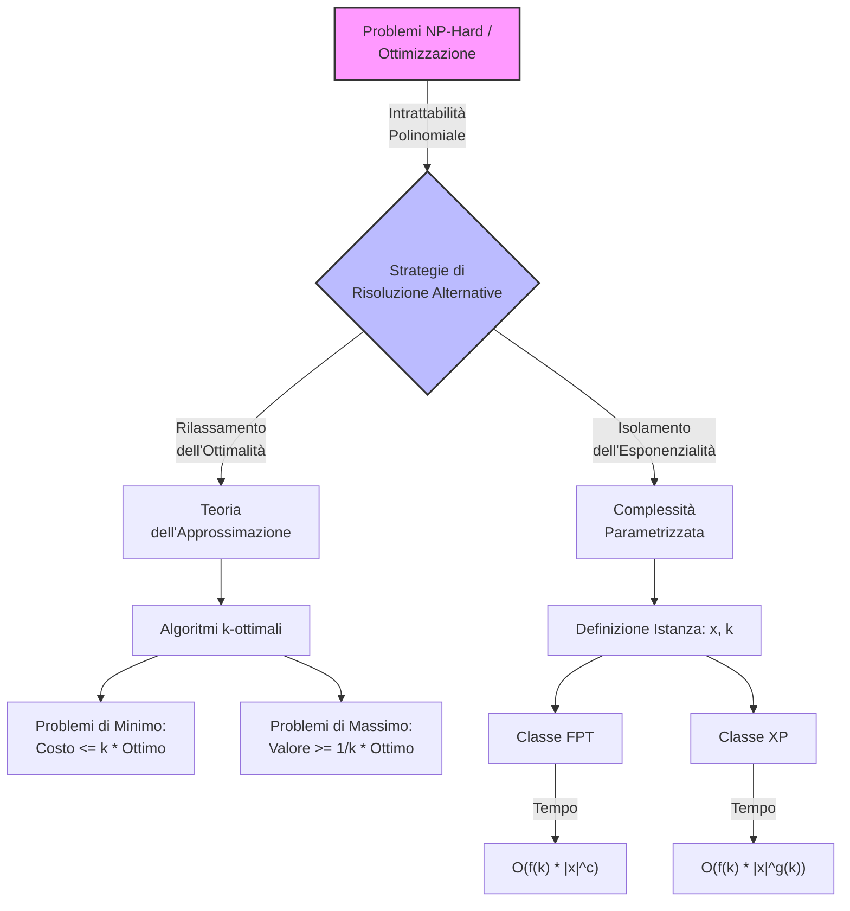
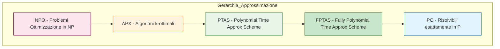
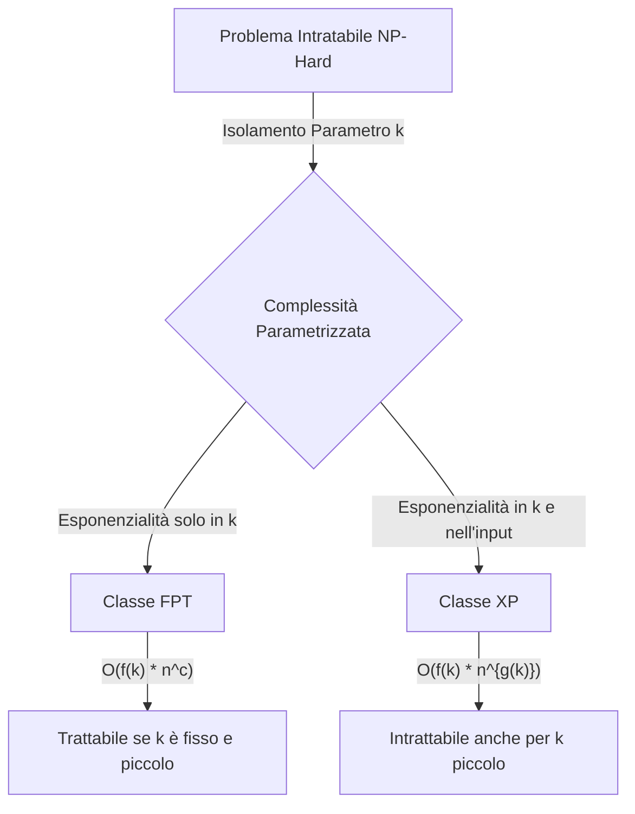

## 5.1 Approssimabilità e Parametrizzazione

### Diagramma Concettuale

### Panoramica Teorica

I problemi di ottimizzazione la cui controparte decisionale è **NP-Completa** si classificano come **NP-Hard**. Assumendo $P \neq NP$, è impossibile calcolare l'ottimo globale in tempo polinomiale; la ricerca esatta richiede un costo temporale esponenziale.

Di fronte a questo limite, si adottano due approcci per mitigare l'esplosione combinatoria:
1. **L'Approssimabilità:** Si rinuncia all'esattezza assoluta della soluzione. In molti scenari applicativi non è imperativo ottenere il risultato perfetto; si ricerca piuttosto una soluzione "buona", calcolabile in tempi polinomiali, che offra precise **garanzie matematiche (bound)** sulla sua distanza dalla soluzione ottima ideale.
2. **La Complessità Parametrizzata:** Si rinuncia a considerare la dimensione dell'input (la taglia $n$) come l'unica variabile di analisi temporale. L'esponenzialità viene segregata e "confinata" all'interno di un parametro specifico e isolato $k$. Se tale parametro è limitato o piccolo, il problema può collassare in un tempo di risoluzione polinomiale rispetto alla dimensione dell'input, permettendo una classificazione più fine della reale difficoltà pratica dei problemi NP-Hard.

---

## Spiega il concetto e lo scopo dell'approssimabilità nella teoria degli algoritmi.

L'approssimabilità nasce come risposta pragmatica e formale all'intrattabilità dei problemi NP-Hard nel campo dell'ottimizzazione (minimizzazione di costi o massimizzazione di profitti). 

Lo **scopo dell'approssimabilità** non è semplicemente trovare un'euristica che funzioni "spesso", ma progettare algoritmi che operino rigorosamente in **tempo polinomiale** e che garantiscano una soluzione la cui qualità sia limitata e certificata matematicamente rispetto all'ottimo ideale irraggiungibile. In altre parole, l'algoritmo approssimato stabilisce un "caso pessimo relativo" sulla bontà della soluzione: fornisce un limite invalicabile su quanto il risultato finale possa discostarsi dalla perfezione.

Dal punto di vista sistemico, l'approssimazione introduce un compromesso deterministico tra tempo e accuratezza: si abbatte la complessità temporale da esponenziale a polinomiale al costo di un errore massimo garantito a priori.

**Formalismo:**
Si definisce la bontà di un algoritmo di approssimazione mediante un fattore numerico $k$ :
* Per i **problemi di minimo**, un algoritmo è $k$-ottimale se produce una soluzione di costo $C \le k \cdot C_{ottimo}$.
* Per i **problemi di massimo**, un algoritmo è $k$-ottimale (o $1/k$-ottimale) se produce una soluzione di valore $V \ge \frac{1}{k} \cdot V_{ottimo}$.

## Tutti i problemi NP-Hard sono approssimabili con un certo margine di garanzia?

Sebbene la formulazione esplicita della domanda appaia tra i quesiti d'esame l'impianto teorico fornito permette di dedurre che **no, non tutti i problemi NP-Hard esibiscono lo stesso comportamento rispetto all'approssimazione o alla parametrizzazione**. 

Il fondamento di questa risposta risiede nell'analisi strutturale introdotta dalla complessità parametrizzata: i problemi NP-Hard, pur appartenendo alla medesima classe decisionale superiore, *non possiedono lo stesso grado pratico di difficoltà*. Esistono problemi intrinsecamente dissimili: ad esempio, il problema della K-Cricca (Clique) o del K-Independent Set (K-IndSet) presentano una resistenza strutturale alla risoluzione efficiente profondamente diversa e più severa rispetto a problemi come il K-Vertex Cover. 

Mentre per alcuni problemi è possibile estrapolare algoritmi con forti garanzie di approssimazione (come l'algoritmo 2-ottimale per il MAX-CUT o l'algoritmo 2-ottimale per il Minimum Vertex-Cover ), la possibilità di trovare un fattore di garanzia valido per *ogni* problema NP-Hard non è universalmente garantita dalla loro appartenenza alla classe. È esattamente questa disomogeneità strutturale che ha reso necessaria la nascita di nuove branche, come lo studio dell'approssimabilità e delle classi FPT e XP, per distinguere i problemi NP-Hard "addomesticabili" da quelli che oppongono una resistenza combinatoria totale.

## Cosa significa affermare che un algoritmo di approssimazione garantisce un fattore 1/k della soluzione ottima per un problema di massimizzazione?

Affermare che un algoritmo garantisce un fattore $1/k$ (spesso detto anche $k$-ottimale nel contesto duale) per un problema di massimizzazione, significa assicurare matematicamente che il valore della soluzione trovata in tempo polinomiale non scenderà mai al di sotto di una specifica frazione del valore della soluzione perfetta.

Procedendo per analogia strutturale: se il massimo profitto teorico ottenibile (la soluzione esatta, calcolabile solo in tempo esponenziale) è pari a $M$, l'algoritmo approssimato costruirà sempre, nel peggiore dei casi, una soluzione di valore almeno pari a $\frac{1}{k} \cdot M$. 

**Esempio e Formalismo applicato (MAX-CUT):**
Nel problema del Taglio Massimo (MAX-CUT), l'obiettivo è partizionare i nodi di un grafo in due insiemi $S$ e $T$ per massimizzare il numero di archi interconnessi. L'algoritmo polinomiale 2-ottimale discusso nella teoria garantisce un fattore $1/2$ della soluzione ottima.
* *Dato formale:* L'algoritmo sposta iterativamente i nodi finché il taglio aumenta. Al termine, il numero di archi nel taglio è tale che la loro somma raddoppiata supera il numero degli archi totali: $2 \cdot |taglio(S, T)| \ge |E|$.
* *Deduzione logica:* Poiché l'ottimo assoluto non può mai superare il numero totale di archi $|E|$, avere un taglio di almeno $\frac{|E|}{2}$ dimostra matematicamente la garanzia del fattore $1/2$ rispetto alla soluzione ottima.

## Cos'è la Fixed Parameter Tractability (FPT) nell'ambito della complessità parametrizzata?

La **Fixed Parameter Tractability (FPT)**, o *Trattabilità a Parametro Fisso*, è la classe di complessità cardine all'interno della teoria parametrizzata, ideata per isolare la causa dell'esplosione esponenziale dei problemi NP-Hard. 

In questo ambito, un problema non viene più valutato solo in base all'input standard $x$ (di taglia $n$), ma viene formalizzato come una coppia $(x, k)$, dove $k \in \mathbb{N}$ è un **parametro indipendente** che quantifica una specifica proprietà strutturale dell'istanza (es. la *Tree-width* di un grafo).

Si afferma che un problema appartiene alla classe **FPT** se l'esponenzialità del calcolo può essere interamente scaricata e segregata su una funzione dipendente esclusivamente dal parametro $k$, lasciando che il cuore dell'elaborazione rimanga rigorosamente polinomiale rispetto alla dimensione dell'input $x$. 

La differenza cruciale rispetto ad altre classi parametrizzate (come la classe **XP**) è che in FPT il parametro $k$ non deve mai comparire all'esponente della dimensione dell'input. Se $k$ è mantenuto piccolo o costante, il problema collassa in una complessità pienamente trattabile, rendendo efficienti algoritmi che altrimenti sarebbero inapplicabili.

**Formalismo:**
* **Classe FPT:** Un problema parametrizzato $L \subseteq \Sigma^* \times \mathbb{N}$ è in FPT se esiste un algoritmo che lo decide in tempo al massimo $f(k) \cdot |x|^c$, dove $f$ è una funzione calcolabile arbitraria (anche pesantemente esponenziale) e $c$ è una costante indipendente da $k$.
* **Classe XP (per contrasto):** Il tempo limite è $f(k) \cdot |x|^{g(k)}$. Qui $k$ influisce direttamente sul grado del polinomio, rendendo il problema non-FPT (es. K-Cricca).
* **Meta-teorema di Courcelle:** Un potente formalismo che garantisce l'appartenenza a FPT. Ogni problema esprimibile nella Logica Monadica del Secondo Ordine (MSOC) su grafi è risolvibile in tempo FPT $f(tw) \cdot m$, dove $tw$ è la *Tree-width* (il parametro) e $m$ è la dimensione dell'input.