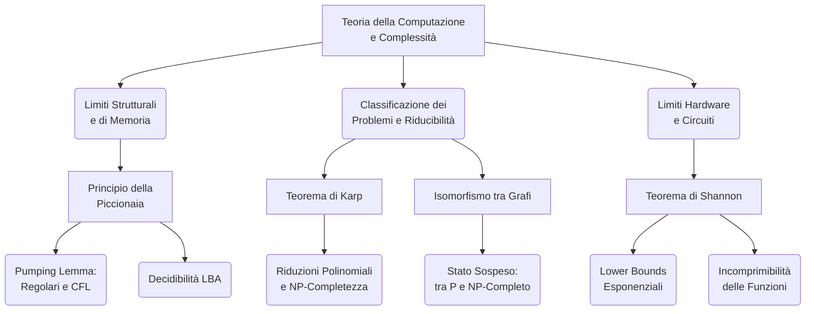
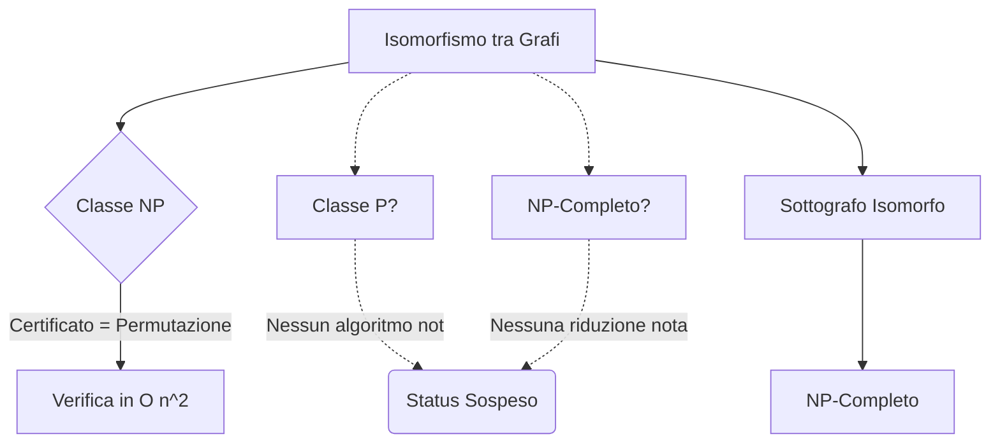

### Panoramica Teorica
Lo studio dell'Informatica Teorica e della Complessità Computazionale non si esaurisce nella mera classificazione tassonomica delle classi temporali e spaziali, ma si nutre di teoremi strutturali e principi matematici che definiscono i confini stessi di ciò che è computabile ed efficientemente risolvibile. Il macro-argomento in esame esplora i meccanismi trasversali che governano la disciplina: dalle fondamenta combinatorie che limitano la memoria degli automi (Principio della Piccionaia), passando per le architetture di riduzione che mappano la difficoltà intrinseca dei problemi (Teorema di Karp), fino all'analisi delle anomalie classificatorie (Isomorfismo tra grafi) e ai limiti fisici insormontabili del parallelismo e della computazione non uniforme (Teorema di Shannon).

---

## Descrivi il problema dell'isomorfismo tra grafi e il suo stato attuale di classificazione tra le classi P e NP-completo.

Dati due grafi $G$ e $H$, il problema dell'Isomorfismo tra Grafi richiede di stabilire se essi siano identici a meno di una ridenominazione (permutazione) dei loro vertici.

Da un punto di vista sistemico, l'appartenenza di questo problema alla classe **NP** è pacifica e rigorosamente dimostrata: il certificato polinomiale è costituito esattamente dalla permutazione (la funzione biunivoca di mappatura tra i nodi dei due grafi). Una Macchina di Turing verificatrice deterministica può validare tale certificato in un tempo quadratico $O(n^2)$, controllando semplicemente la conservazione delle adiacenze.

Tuttavia, lo stato attuale della sua classificazione è "sospeso": **non è noto se il problema sia NP-Completo, né è noto se ammetta un algoritmo deterministico polinomiale che lo collochi in P**. Fino a questo momento, la comunità scientifica non è riuscita a produrre alcuna riduzione polinomiale da un problema accertato come NP-Hard verso l'Isomorfismo tra grafi. 

Per comprendere la delicatezza di questo posizionamento, è utile analizzare problemi strutturalmente affini:
* Il problema del **Sottografo Isomorfo** (stabilire se un grafo contiene un sottografo isomorfo a un altro) è, al contrario, accertato come NP-Completo.
* Il problema complementare, ovvero **NOISO** (stabilire se due grafi *non* sono isomorfi), non è noto appartenere ad NP, poiché il certificato richiederebbe l'esibizione di tutte le permutazioni possibili (numero esponenziale). Ciononostante, NOISO appartiene alla classe **IP** (Interactive Proof Systems): l'assenza di isomorfismo può essere dimostrata in tempo polinomiale tramite un protocollo probabilistico tra un *Prover* (con potenza illimitata) e un *Verifier* (probabilistico polinomiale). Se i grafi non sono isomorfi, il Prover riconoscerà sempre da quale grafo originario deriva una permutazione casuale sottopostagli dal Verifier.

## In cosa consiste il Principio della Piccionaia e in quali contesti teorici risulta fondamentale?

Il Principio della Piccionaia (o *Pigeonhole Principle*) è un assioma logico-combinatorio di disarmante semplicità ma dalle implicazioni teoriche devastanti per la dimostrazione dei limiti di memoria nei modelli computazionali. Il principio stabilisce che, dati $k$ contenitori (fori) e $c$ oggetti (colombe), se $c > k$, allora per necessità logica almeno un contenitore dovrà ospitare rigorosamente più di un oggetto (almeno due colombe).

Nell'Informatica Teorica, questo principio funge da base assiomatica per le dimostrazioni per assurdo e per l'individuazione di ciclicità nei sistemi a stati finiti. Risulta fondamentale in tre contesti primari:

1. **Pumping Lemma per i Linguaggi Regolari (Livello $L_3$):**
 Il principio convalida il Pumping Lemma dimostrando l'inevitabilità dei loop negli Automi a Stati Finiti (DFA). Assumendo un DFA minimale con $n$ stati fisici che processa una stringa di lunghezza $m \ge n$, la computazione attraverserà esattamente $m+1$ stati (incluso lo stato iniziale $q_0$). Poiché gli stati visitati ($m+1$) sono strettamente superiori agli stati fisici disponibili nell'hardware ($n$), il Principio della Piccionaia impone che la macchina debba transitare almeno due volte per il medesimo stato. Questo "ritorno" forma un anello (loop) che può essere pompato indefinitamente ($y^k$), garantendo la scomposizione della stringa in $w = xyz$.
2. **Pumping Lemma per i Linguaggi Liberi da Contesto (Livello $L_2$):**
 Nelle Grammatiche Libere da Contesto (CFG) poste in Forma Normale di Chomsky (CNF), l'albero sintattico è strettamente binario. Se la grammatica possiede $m$ variabili (non terminali), la stringa più lunga generabile senza ripetizioni su un cammino è $2^m - 1$. Forzando la derivazione di una stringa di lunghezza $\ge 2^m$, l'altezza dell'albero sarà tale per cui, lungo un cammino radice-foglia, il numero di nodi supererà il numero $m$ delle variabili disponibili. Per il Principio della Piccionaia, almeno un simbolo non terminale $A$ dovrà ripetersi su quel cammino, permettendo la rigenerazione ricorsiva del sotto-albero e la scomposizione della stringa in $uvwxy$.
3. **Decidibilità del Problema della Fermata per i Linear Bounded Automata (LBA):**
 Mentre per le Macchine di Turing generali il problema della fermata è indecidibile, per gli LBA è decidibile proprio grazie alla Piccionaia. Un LBA che elabora un input di taglia $n$ possiede un limite superiore rigido al numero di configurazioni (ID) possibili, dato da $C_M(n) = m^n \cdot q \cdot n$ (dove $m$ è l'alfabeto e $q$ gli stati). Se si simula l'LBA tenendo traccia dei passi, qualora il contatore superi il valore limite $C_M(n)$, il Principio della Piccionaia garantisce inequivocabilmente che la macchina è ripassata per una configurazione già visitata. L'LBA è dunque entrato in un loop infinito; la macchina simulatrice può quindi fermarsi e rigettare, rendendo la terminazione sempre decidibile.

## Enunciato del Teorema di Karp in merito alle riduzioni polinomiali.

Il Teorema di Karp (che fa riferimento alla celebre formalizzazione delle riduzioni polinomiali per la classificazione dei problemi) è il perno metodologico che struttura la classe della complessità computazionale dei problemi intrattabili. Esso si fonda sul concetto di **P-Riducibilità** (o riducibilità in tempo polinomiale, $\le_p$).

**Enunciato concettuale:**
Un linguaggio $L \subseteq \{0,1\}^*$ si dice P-riducibile a un linguaggio $L' \subseteq \{0,1\}^*$ (denotato come $L \le_p L'$) se esiste una funzione $f$, calcolabile da una Macchina di Turing deterministica in tempo polinomiale, tale che un'istanza $x$ appartiene ad $L$ se e solo se la sua trasformazione $f(x)$ appartiene a $L'$.
La potenza di questo teorema risiede nel fatto che la relazione di riduzione propaga la difficoltà computazionale: se $L \le_p L'$, allora $L'$ è *almeno tanto difficile* quanto $L$. 

Le proprietà sistemiche derivanti dalle riduzioni di Karp sono:
* **Transitività:** Se $L \le_p L'$ e $L' \le_p L''$, ne consegue che $L \le_p L''$. La composizione di due funzioni di costo polinomiale produce un'ulteriore funzione limitata polinomialmente.
* **Chiusura e NP-Completezza:** La riduzione definisce lo standard aureo per dimostrare l'appartenenza alla classe NP-Completo. Una volta che il Teorema di Cook-Levin ha sancito l'esistenza di un "problema primordiale" (SAT o TMSAT), il metodo di Karp permette di classificare innumerevoli altri problemi. Per dimostrare che un nuovo problema $L$ è NP-Completo, è sufficiente:
 1. Dimostrare che $L \in NP$ (esibendo il certificato polinomiale).
 2. Dimostrare la NP-Hardness costruendo una riduzione polinomiale di Karp da un problema *già noto* per essere NP-Completo verso $L$ (es. $3SAT \le_p Clique$ oppure $3SAT \le_p 01\text{-}ILP$). Se esistesse un algoritmo polinomiale per $L$, a causa della transitività della riduzione, crollerebbe l'intera architettura implicando $P = NP$.

**Formalismo della Riduzione:**
$$ \forall x \in \{0,1\}^*, \quad x \in L \iff f(x) \in L' $$
Dove la computazione di $f(x)$ è rigorosamente vincolata da un limite temporale $O(|x|^k)$.

## Spiega il Teorema di Shannon riguardante i limiti inferiori esiziali della dimensione per i circuiti booleani.

Nell'ambito della complessità dei **circuiti booleani** e del parallelismo, l'approccio non si focalizza sul tempo di esecuzione sequenziale di una Macchina di Turing, ma sulle risorse hardware (Taglia e Profondità) richieste da una famiglia non-uniforme di circuiti $\{C_n\}$ per processare un input di dimensione $n$.

Mentre gran parte della teoria della complessità si concentra sui *limiti superiori* (Upper Bounds, ovvero la complessità del miglior algoritmo noto per risolvere un problema), il Teorema di Shannon si concentra sui **limiti inferiori (Lower Bounds)** esiziali (catastrofici).

Il teorema di Shannon affronta la "complessità di circuito" valutando quante porte logiche siano strettamente necessarie per sintetizzare funzioni booleane arbitrarie. Egli dimostrò che la stragrande maggioranza delle funzioni booleane esistenti possiede un limite inferiore strutturale elevatissimo: esse sono intrinsecamente "difficili" e richiedono una quantità di hardware puramente esponenziale per essere calcolate.

La spiegazione sistemica di questo fenomeno si traduce nel concetto di **impossibilità di compressione**. La stragrande maggioranza delle funzioni non ammette una descrizione algoritmica o circuitale "breve" o elegante (cioè di taglia polinomiale e appartenente alla classe P/Poly); esse si comportano come entità casuali, essenzialmente incomprimibili. Il fatto che, nella pratica informatica quotidiana, ci interfacciamo con funzioni che godono di implementazioni circuitali piccole ed efficienti rappresenta l'assoluta eccezione logica, non la regola.

**Formalismo del Lower Bound di Shannon:**
Shannon ha provato matematicamente l'esistenza di funzioni booleane la cui taglia circuitale minima cresce asintoticamente con:
$$ \Omega\left(\frac{2^n}{10n}\right) $$
Questo lower bound esponenziale certifica formalmente la resistenza combinatoria dell'universo computazionale, ponendo un limite fisico invalicabile alla costruzione di hardware in grado di generalizzare qualsiasi operazione.