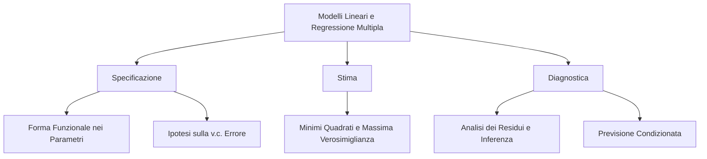

## Introduzione: 1. Modelli Lineari e Regressione Multipla

**Spiegazione Concettuale e Panoramica concettuale del capitolo** Il capitolo analizza lo studio matematico-statistico della relazione intercorrente tra una variabile dipendente, o variabile risposta $y$, e un insieme di $k$ variabili indipendenti (regressori o variabili esplicative), identificate come $X_1, X_2, \dots, X_k$.
Il passaggio da un sistema deterministico a un modello statistico si fonda sull'introduzione di una variabile casuale di errore, $\varepsilon$, che ne qualifica l'imprevedibilità intrinseca.
L'impalcatura teorica ruota attorno all'equazione del modello lineare $\mathbf{y} = \mathbf{X}\boldsymbol{\beta} + \boldsymbol{\varepsilon}$, in cui $\mathbf{y}$ è il vettore delle osservazioni, $\mathbf{X}$ la matrice nota dei regressori e $\boldsymbol{\beta}$ il vettore dei parametri incogniti sui quali condurre l'inferenza.
Il nucleo teorico richiede che il modello sia specificamente lineare nei parametri o, in alternativa, linearizzabile a seguito di opportune trasformazioni algebriche (modelli log-lin, lin-log, doppio-logaritmo).

**Contesto accademico** L'argomento costituisce il nucleo centrale e la naturale evoluzione dei pre-requisiti di Inferenza Statistica all'interno dell'insegnamento di "Modelli Statistici e Statistical Learning".
La teoria qui esposta rappresenta il modello parametrico fondante ($\mathcal{M} = \{\mathcal{P}, \mathcal{X}\}$), ovvero la base metodologica essenziale per avviare qualsivoglia processo inferenziale.
La perfetta assimilazione della regressione multipla è propedeutica alle sezioni metodologiche avanzate del corso, le quali includono la gestione della violazione delle ipotesi fondamentali (multicollinearità, eteroschedasticità, autocorrelazione e utilizzo dei Minimi Quadrati Generalizzati), le metodiche di selezione automatica, la regolarizzazione (Ridge, LASSO) e l'estensione ai modelli di Regressione Beta per variabili limitate.

**Macro argomenti affrontati**

- **Fasi di Costruzione Modello:** Iterazione analitica sequenziale sviluppata in tre step rigorosi, ovvero Specificazione, Stima e Diagnostica.
- **Specificazione Funzionale e Stocastica:** Definizione della linearità dei coefficienti e fissazione delle "ipotesi fondamentali" sulla variabile casuale di errore (media nulla, varianza costante o omoschedasticità, non correlazione tra gli errori e distribuzione normale multivariata).
- **Stima Parametrica:** Derivazione puntuale dei coefficienti di regressione sfruttando proprietà e costrutti matematici del Metodo dei Minimi Quadrati e della Massima Verosimiglianza, unitamente al calcolo del vettore di stimatori non distorti e della relativa matrice di varianze e covarianze.
- **Flessibilità e Arricchimento del Modello:** Espansione delle potenzialità regressive tramite combinazioni lineari e specificazioni polinomiali, superando l'assunto di proporzionalità lineare nelle variabili esplicative, nonché l'inclusione di variabili qualitative (variabili dummy), con successiva analisi del rischio di perfetta collinearità ("trappola delle dummy").
- **Previsione Predittiva:** Utilizzo strutturato del modello di regressione per prevedere nuovi valori della variabile dipendente, calcolando il valore atteso condizionato $E(Y_0 | \mathbf{x}_0) = \mathbf{x}_0^t \boldsymbol{\beta}$ in base a combinazioni inedite delle variabili esplicative.
