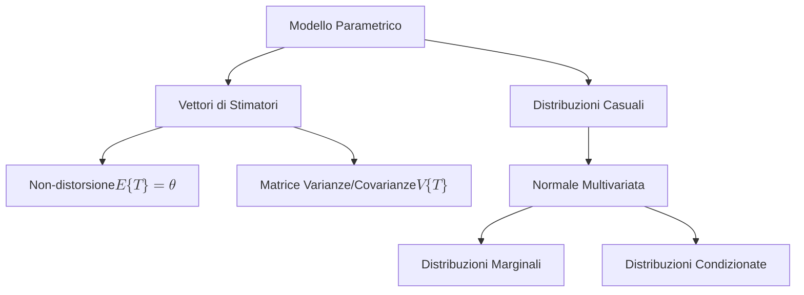
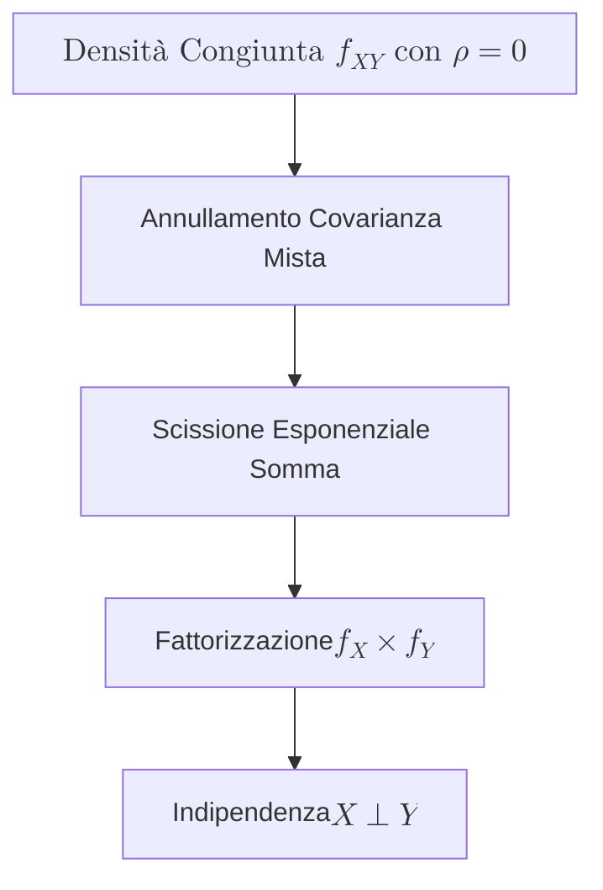

## 1.1 Vettori di stimatori e Normale Multivariata

**Spiegazione:** La trattazione inerente i vettori di stimatori e la variabile casuale Normale Multivariata costituisce il fondamento matematico-statistico per l'inferenza nei modelli di regressione multipla.
L'obiettivo inferenziale prevede la stima di un vettore di parametri ignoti attraverso una collezione di variabili casuali campionarie (i vettori di stimatori), di cui si rende necessario definire il valore atteso per valutarne la correttezza e la matrice di varianze e covarianze per quantificarne l'efficienza.
Tale impostazione matriciale si integra alla distribuzione Normale Multivariata, la quale modella congiuntamente più componenti stocastiche correlate, fornendo gli strumenti teorici su cui si fonda la successiva validazione dei test statistici e degli intervalli di confidenza.

#### Vettori di stimatori

**Definizione:** Un vettore di stimatori $\mathbf{T}(\mathbf{X})$ di dimensione $r \times 1$ è un vettore matematico utilizzato per stimare un vettore di parametri incogniti $\boldsymbol{\theta}$ di dimensione $r$.
La sua costruzione è tale per cui ogni elemento $T_j(\mathbf{X})$ stimi in modo ordinato il corrispondente elemento $\theta_j$ del vettore dei parametri.

**Spiegazione:** La validità di un vettore di stimatori viene valutata in primis tramite la proprietà di **non-distorsione** (o correttezza).
Si afferma che $\mathbf{T}(\mathbf{X})$ è non-distorto per $\boldsymbol{\theta}$ se l'aspettativa matematica del vettore coincide con il vettore dei parametri: $E\{\mathbf{T}(\mathbf{X})\} = \boldsymbol{\theta}$.
Questo equivale a richiedere marginalmente che $E\{T_j(\mathbf{X})\} = \theta_j$ per ogni $j=1,\dots,r$.
Per valutare la dispersione e le relazioni lineari reciproche degli stimatori viene definita la **matrice delle varianze e delle covarianze** $\mathbf{V}(\mathbf{T})$.
Essendo formulata come $E\{[\mathbf{T} - E(\mathbf{T})][\mathbf{T} - E(\mathbf{T})]^t\}$, essa è una matrice simmetrica di dimensione $r \times r$.
Sulla diagonale principale si trovano le varianze dei singoli stimatori, indicate come $V[T_j]$, mentre al di fuori della diagonale principale figurano le covarianze per ogni coppia, indicate come $\text{cov}[T_j, T_h]$.
In notazione compatta si esprime come $\mathbf{V}(\mathbf{T}) = \{\text{cov}(T_j, T_h)\}_{j,h}$ per $j,h=1,\dots,r$.

#### La Normale Multivariata

**Definizione:** Il vettore casuale $\mathbf{W}=(W_1,\dots,W_d)$ di dimensione $d$ segue una distribuzione **Normale Multivariata**, usualmente indicata con $\mathbf{W} \sim \mathbf{N}_d(\boldsymbol{\mu}, \boldsymbol{\Sigma})$, se presenta la seguente funzione di densità congiunta:
$$f_{\mathbf{W}}(\mathbf{w}; \boldsymbol{\mu}, \boldsymbol{\Sigma}) = (2\pi)^{-\frac{d}{2}} |\boldsymbol{\Sigma}|^{-\frac{1}{2}} \exp \left\{ -\frac{1}{2} (\mathbf{w} - \boldsymbol{\mu})^t \boldsymbol{\Sigma}^{-1} (\mathbf{w} - \boldsymbol{\mu}) \right\}$$.

**Spiegazione:** La Normale Multivariata rappresenta la generalizzazione matematica multidimensionale della Normale Univariata.
Essa è univocamente definita da due parametri principali:

- $\boldsymbol{\mu} = E(\mathbf{W})$, che è il **vettore delle medie** di dimensione $(d \times 1)$.

- $\boldsymbol{\Sigma} = V(\mathbf{W})$, che è la **matrice di varianze e covarianze** di dimensione $(d \times d)$.
  Una proprietà fondamentale concerne le **componenti marginali**: ogni variabile contenuta nel vettore è ancora distribuita normalmente, risultando in $W_j \sim N(\mu_j, \sigma_{jj}^2)$.
  Analogamente, si dimostra la normalità delle **distribuzioni condizionate**: il comportamento di $W_j$ dato un valore noto $W_h = w_h$ segue la distribuzione $N(\mu_{j|h}, \sigma_{j|h}^2)$.
  Il suo valore atteso condizionato risulta modificato dalla struttura di correlazione secondo la relazione $\mu_{j|h} = \mu_j + \rho_{jh} \frac{\sigma_{jj}^2}{\sigma_{hh}^2} (w_h - \mu_h)$, mentre la varianza condizionata si riduce a $\sigma_{j|h}^2 = \sigma_{jj}^2 (1 - \rho_{jh}^2)$.

- **Dimostrazioni:** Caratteristica di Indipendenza Stocastica in assenza di Correlazione (caso bivariato).
  Si dimostra che se per una v.c.
  Normale Bidimensionale $(X,Y)$ il coefficiente di correlazione è nullo, $\rho(X,Y) = 0$, allora $X$ ed $Y$ sono variabili indipendenti, ovvero $X \perp Y$.

**Diagrammi:**

**Spiegazione della dimostrazione:** Si imposta la dimostrazione analizzando la funzione di densità congiunta per il caso bidimensionale $(X,Y)$.

Se si pone $\rho = 0$, il termine centrale misto all'interno dell'esponenziale scompare (essendo moltiplicato per $\rho$).

La formula della densità congiunta si semplifica e si riduce a:
$$f(x, y; \mu_X, \mu_Y, \sigma_X, \sigma_Y) = \frac{1}{2\pi\sigma_X\sigma_Y} \exp\left\{-\frac{1}{2} \left[ \left(\frac{x - \mu_X}{\sigma_X}\right)^2 + \left(\frac{y - \mu_Y}{\sigma_Y}\right)^2 \right] \right\}$$
Questa espressione algebrica si presta ad essere scissa in due componenti moltiplicative distinte.

Tale operazione coincide matematicamente ed esattamente con la fattorizzazione del prodotto delle due singole funzioni di densità marginali di $X$ ed $Y$, ossia $f(x; \mu_X, \sigma_X) \times f(y; \mu_Y, \sigma_Y)$.

Poiché la densità congiunta è il prodotto esatto delle marginali, risulta rigorosamente provata l'indipendenza delle due variabili.
