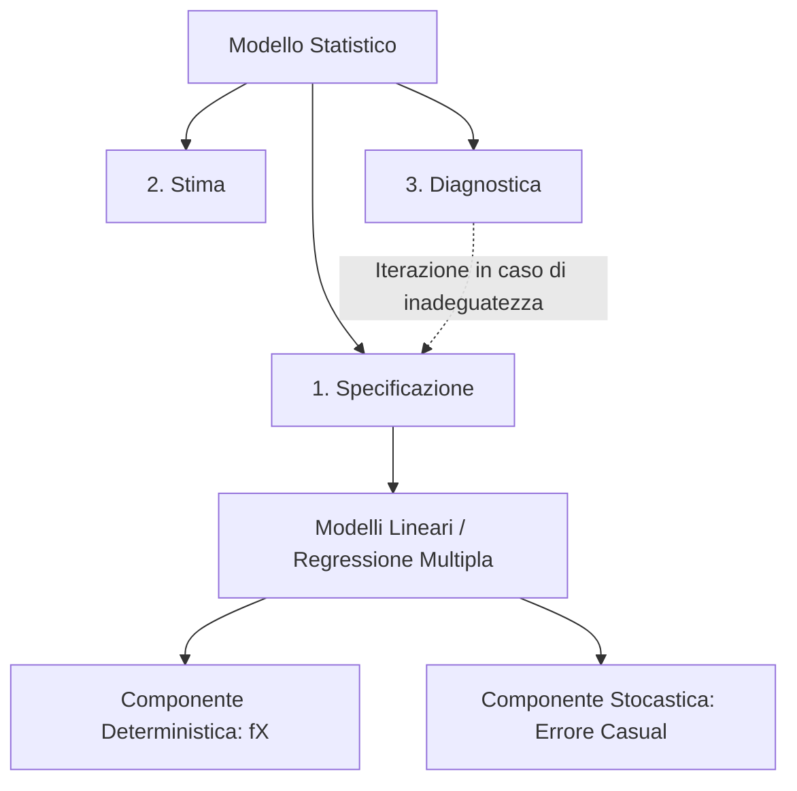

## 1.2 Fasi di costruzione di un Modello Statistico e Modelli Lineari

**Diagramma Paragrafo:**

**Spiegazione:** La costruzione di un modello statistico è un procedimento logico e metodologico iterativo che permette di studiare fenomeni reali attraverso formulazioni matematiche arricchite da componenti stocastiche.
Tale processo si articola in fasi sequenziali volte a definire, quantificare e validare empiricamente la relazione tra variabili.
Un'applicazione cardine di tale processo è rappresentata dai Modelli Lineari e dalla Regressione Multipla, i quali mirano a formalizzare il legame tra una variabile dipendente e un insieme di variabili esplicative (o regressori), includendo l'imprevedibilità e gli scarti accidentali intrinseci alla realtà osservata tramite l'inserimento di una variabile casuale di errore.

#### Fasi di costruzione di un Modello Statistico

**Definizione:** La costruzione di un modello statistico si articola essenzialmente in tre fasi iterative interdipendenti: Specificazione, Stima e Diagnostica.

**Spiegazione:**

1. **Specificazione:** Consiste nella formulazione di un modello matematico volto a descrivere la realtà fenotipica osservata, a cui si aggiungono le componenti stocastiche.
   Essendo la realtà complessa, si procede formulando ipotesi circa la forma funzionale esatta $f(\cdot)$ della relazione e le caratteristiche probabilistiche della variabile casuale di errore $\varepsilon$.

2. **Stima:** Rappresenta la fase propriamente inferenziale.
   Poiché all'interno della specificazione funzionale figurano parametri incogniti, l'obiettivo è ricavarne valutazioni numeriche (stime) avvalendosi dei dati campionari osservati, mediante l'impiego di idonei metodi di stima, quali il Metodo dei Minimi Quadrati o il Metodo della Massima Verosimiglianza.

3. **Diagnostica:** Prevede l'utilizzo di strumenti analitici e inferenziali, come i test d'ipotesi, volti a stabilire se il modello stimato rappresenti una valida e robusta approssimazione della realtà osservata.
   Qualora i risultati della diagnostica palesino un disadattamento o la violazione delle assunzioni di base, il processo logico impone una re-iterazione, ritornando alla fase di specificazione per correggere e raffinare il modello.

#### I Modelli Lineari / La Regressione Multipla

**Definizione:** Un modello lineare è formalmente definito dall'equazione vettoriale e matriciale:
$\mathbf{y} = \mathbf{X}\boldsymbol{\beta} + \boldsymbol{\varepsilon}$
dove:

- $\mathbf{y}$ è un vettore casuale osservabile di dimensione $(n \times 1)$.
- $\mathbf{X}$ è una matrice (matrice disegno) di elementi noti di dimensione $(n \times p)$, con $p < n$, le cui colonne contengono le $n$ osservazioni afferenti alle variabili indipendenti o regressori.
- $\boldsymbol{\beta}$ è un vettore di parametri incogniti di dimensione $(p \times 1)$.
- $\boldsymbol{\varepsilon}$ è un vettore casuale di variabili non osservabili (componente stocastica o errori) di dimensione $(n \times 1)$.

**Spiegazione:** Lo scopo della regressione multipla è studiare in termini statistici la relazione intercorrente tra una variabile di risposta, definita variabile dipendente $Y$, e un insieme di $k$ variabili indipendenti esplicative $X_1, X_2, \dots, X_k$.
Si distingue formalmente tra:

- **Modello deterministico:** $\large y = h(X_1, X_2, \dots, X_k)$.
- **Modello statistico:** $\large Y = h(X_1, X_2, \dots, X_k) + \varepsilon$.
  La variabile casuale $\varepsilon$ qualifica intimamente il modello: essa racchiude e sintetizza gli scarti accidentali, gli errori di misurazione e ogni altra perturbazione aleatoria che impedisce alla relazione tra $X$ e $Y$ di ridursi a un puro costrutto matematico.
  In virtù dell'additività di $\varepsilon$, la variabile $Y$ acquisisce natura stocastica.
  In sede di specificazione di un modello lineare, la linearità è assunta limitatamente ai parametri e non necessariamente alle variabili esplicative.
  Le forme funzionali trattate comprendono:
- Specificazioni lineari nei parametri (es. $y = \beta_0 + \beta_1 x_1 + \dots + \beta_k x_k + \varepsilon$).
- Modelli linearizzabili a seguito di opportune trasformazioni algebriche (es. log-log o log-lin).
  Per consentire proprietà ottimali per gli stimatori, il Modello Lineare classico (Assunzioni di Gauss-Markov) poggia su rigorose ipotesi fondamentali relative al termine di errore :

1. **Media Zero:** $E(\boldsymbol{\varepsilon} \mid \mathbf{X}) = \mathbf{0}$, ovvero non vi è evidenza di errori sistematici.

2. **Omoschedasticità:** $V(\varepsilon_i \mid \mathbf{X}) = \sigma^2$.
   La varianza degli errori è costante al variare delle osservazioni.

3. **Incorrelazione:** $Cov(\varepsilon_i, \varepsilon_j) = 0$ per $i \neq j$.
   Le ipotesi 2 e 3 si sintetizzano nella matrice di varianze e covarianze: $V(\boldsymbol{\varepsilon}) = \sigma^2 \mathbf{I}$.

4. **Rango Pieno:** Il rango della matrice $\mathbf{X}$ deve essere pari al numero dei parametri stimati ($rank(\mathbf{X}) = p < n$), eludendo l'occorrenza di multicollinearità perfetta.
   Infine, per edificare una solida architettura di test d'ipotesi e intervalli di confidenza, l'inferenza parametrica richiede una quinta e indipendente assunzione, ovverosia l'ipotesi di **normalità** degli errori accidentali: $\varepsilon \sim N(0, \sigma^2 \mathbf{I})$.
