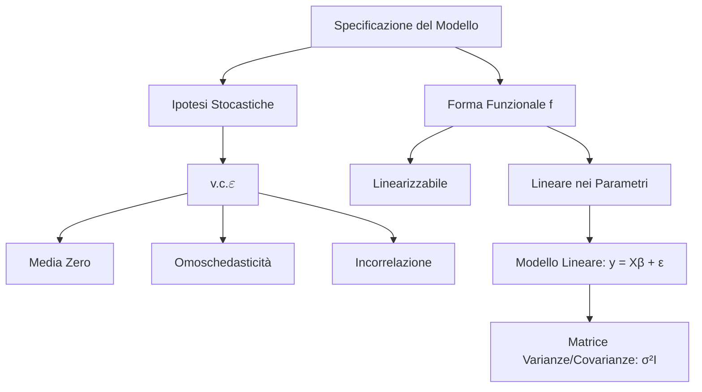

## 1.3 La Specificazione e Definizione ed Ipotesi Fondamentali

**Diagramma Paragrafo:**

**Spiegazione:** La costruzione di un modello statistico richiede una rigorosa fase di specificazione, che traduce l'astrazione teorica di un fenomeno in un impianto matematico e probabilistico.
Questo processo definisce la natura della relazione tra la variabile dipendente e le variabili esplicative separandola in due componenti: una componente deterministica strutturale e una componente stocastica, rappresentata dalla variabile casuale errore.
L'impianto formale del modello lineare multiplo poggia su specifiche assunzioni matematiche (linearità) e probabilistiche (distribuzione dell'errore) che sono propedeutiche e vincolanti per le successive fasi di stima dei parametri e di inferenza.

#### La Specificazione

**Definizione:** La specificazione del modello statistico si articola in due elementi essenziali: la scelta della forma funzionale $f(\cdot)$ per la componente deterministica e la formulazione delle ipotesi probabilistiche sulla variabile casuale $\varepsilon$ (errore stocastico).

**Spiegazione:** La forma funzionale definisce come i regressori spiegano la variabile dipendente.
Nel contesto in esame, le forme funzionali ammesse sono strettamente lineari nei parametri (es. $y = \beta_0 + \beta_1 x_1 + \dots + \beta_k x_k + \varepsilon$) oppure linearizzabili a seguito di opportune trasformazioni algebriche.
Un esempio classico di linearizzazione è la trasformazione logaritmica: partendo da $y = e^{\beta_0} x_1^{\beta_1} x_2^{\beta_2} \dots x_k^{\beta_k} \varepsilon$, si ottiene il modello linearizzato $\ln(y) = \beta_0 + \beta_1 \ln(x_1) + \dots + \beta_k \ln(x_k) + \ln(\varepsilon)$.

#### Definizione ed Ipotesi Fondamentali

**Definizione:** Il modello lineare è definito formalmente dall'equazione matriciale $\mathbf{y} = \mathbf{X}\boldsymbol{\beta} + \boldsymbol{\varepsilon}$.
In tale struttura, $\mathbf{y}$ è un vettore casuale osservabile di dimensione $(n \times 1)$; $\mathbf{X}$ è una matrice di elementi noti di dimensione $(n \times p)$, con $p < n$, le cui colonne contengono le $n$ osservazioni sulle variabili indipendenti (regressori); $\boldsymbol{\beta}$ è un vettore di parametri incogniti di dimensione $(p \times 1)$; $\boldsymbol{\varepsilon}$ è un vettore casuale di variabili non osservabili di dimensione $(n \times 1)$.

**Spiegazione:** Questa equazione scinde il fenomeno in studio in due parti.
La componente $\mathbf{X}\boldsymbol{\beta}$ è di natura deterministica e rappresenta l'impatto atteso delle variabili esplicative.
La variabile casuale $\boldsymbol{\varepsilon}$ qualifica invece il modello come statistico: essa riassume l'insieme degli effetti e delle cause (variabili omesse, scarti accidentali, errori di misurazione) che impediscono al legame tra variabili dipendenti e indipendenti di essere una relazione matematica esatta.

#### Ipotesi fondamentali sulla v.c. $\varepsilon$

**Definizione:** Affinché il modello sia validamente specificato (Assunzioni di Gauss-Markov), il vettore casuale $\boldsymbol{\varepsilon}$ deve soddisfare tre ipotesi fondamentali condizionate alla matrice $\mathbf{X}$:

1. Errore in media zero: $E(\boldsymbol{\varepsilon}|\mathbf{X}) = \mathbf{0}$.
2. Omoschedasticità: la varianza degli errori è costante, ovvero $V(\varepsilon_i|\mathbf{X}) = \sigma^2$ per $i=1,\dots,n$.
3. Incorrelazione: la covarianza tra gli errori è nulla, ovvero $Cov(\varepsilon_i, \varepsilon_j) = 0$ per ogni $i \neq j$.

**Spiegazione:** L'ipotesi di media nulla indica l'assenza di errori sistematici nel modello.
L'omoschedasticità e l'incorrelazione definiscono congiuntamente la matrice di varianze e covarianze del vettore degli errori, che assume la struttura scalare diagonale $V(\boldsymbol{\varepsilon}) = \boldsymbol{\Sigma} = \sigma^2 \mathbf{I}$.
Inoltre, per consentire l'inferenza statistica (intervalli di confidenza e test d'ipotesi), si introduce successivamente l'ipotesi forte che gli errori seguano una distribuzione Normale multivariata: $\boldsymbol{\varepsilon} \sim N(\mathbf{0}, \sigma^2 \mathbf{I})$.
Affinché la soluzione ai minimi quadrati sia unica e calcolabile, si assume anche che la matrice $\mathbf{X}^t\mathbf{X}$ abbia rango pieno, $r(\mathbf{X}^t\mathbf{X}) = p$.

- **Dimostrazioni:** Sotto le ipotesi fondamentali, per ogni $i=1,\dots,n$, si dimostra che:

1. $E(Y_i | x_{i1}, x_{i2}, \dots, x_{ik}) = E(\beta_0 + \beta_1 x_{i1} + \dots + \beta_k x_{ik} + \varepsilon_i) = \beta_0 + \beta_1 x_{i1} + \dots + \beta_k x_{ik} + E(\varepsilon_i) = \beta_0 + \beta_1 x_{i1} + \dots + \beta_k x_{ik}$.
2. $V(Y_i | x_{i1}, x_{i2}, \dots, x_{ik}) = V(\beta_0 + \beta_1 x_{i1} + \dots + \beta_k x_{ik} + \varepsilon_i) = V(\varepsilon_i) = \sigma^2$.

**Spiegazione della dimostrazione:** Poiché la matrice dei regressori $\mathbf{X}$ è considerata fissa (elementi noti o condizionati), l'operatore valore atteso si applica linearmente.
Il valore atteso di $Y_i$ diviene esattamente pari al predittore lineare, in quanto $E(\varepsilon_i) = 0$ annulla il termine stocastico.
Parallelamente, poiché le costanti non hanno varianza, l'intera variabilità della variabile risposta $Y_i$ condizionata ai regressori dipende unicamente dalla varianza dell'errore $\varepsilon_i$, che per l'ipotesi di omoschedasticità è pari alla costante $\sigma^2$.
