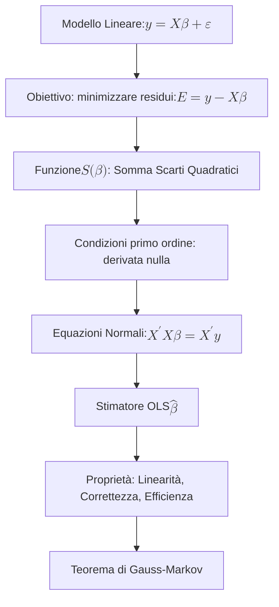
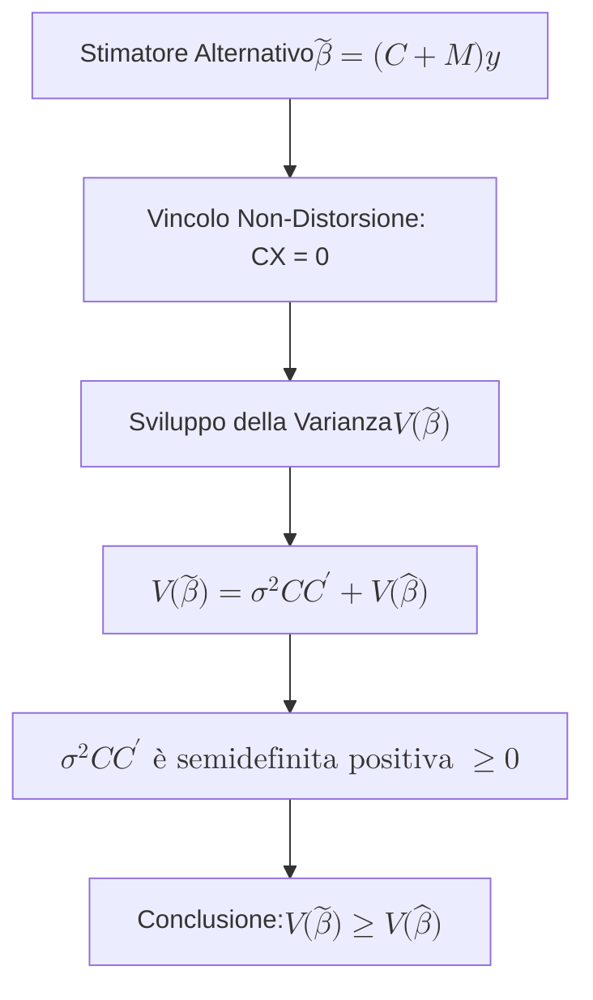

## 1.4 Stima dei parametri con il Metodo dei Minimi Quadrati

**Spiegazione:** Il metodo più frequentemente utilizzato per la stima dei parametri di un modello lineare $\mathbf{y} = \mathbf{X}\boldsymbol{\beta} + \boldsymbol{\varepsilon}$ è il Metodo dei Minimi Quadrati (OLS - Ordinary Least Squares).
A livello logico e deduttivo, se il modello rappresentasse in modo perfetto la variabile dipendente $\mathbf{y}$, i valori osservati coinciderebbero con la componente deterministica $\mathbf{X}\boldsymbol{\beta}$.
Nella realtà empirica si osserva la variabile $\mathbf{y}$, e la rilevanza del modello è inversamente proporzionale al "peso" della componente stocastica o accidentale $\boldsymbol{\varepsilon}$.
Il fondamento teorico del metodo si basa, pertanto, sulla ricerca del vettore incognito $\boldsymbol{\beta}$ che minimizzi l'entità degli scarti $\boldsymbol{\varepsilon} = \mathbf{y} - \mathbf{X}\boldsymbol{\beta}$, ovvero le differenze tra i valori empiricamente osservati e quelli teorici previsti dal modello.

______________________________________________________________________

#### Derivazione analitica dello Stimatore ai Minimi Quadrati

**Definizione:** La funzione obiettivo del metodo dei minimi quadrati, definita come "funzione somma degli scarti al quadrato", è espressa matematicamente come $S(\boldsymbol{\beta}) = \sum_{i=1}^n \varepsilon_i^2 = \boldsymbol{\varepsilon}^t \boldsymbol{\varepsilon} = (\mathbf{y} - \mathbf{X}\boldsymbol{\beta})^t (\mathbf{y} - \mathbf{X}\boldsymbol{\beta})$.

**Spiegazione:** Lo stimatore del vettore $\boldsymbol{\beta}$ viene individuato mediante la minimizzazione formale della funzione $S(\boldsymbol{\beta})$, la quale quantifica l'errore complessivo del modello.
L'obiettivo dell'ottimizzazione è determinare il punto di minimo globale di questa funzione quadratica in funzione dello spazio parametrico.

**Dimostrazione:** Sviluppando il prodotto matriciale, la funzione può essere riscritta come:
$S(\boldsymbol{\beta}) = (\mathbf{y}^t - \boldsymbol{\beta}^t \mathbf{X}^t) (\mathbf{y} - \mathbf{X}\boldsymbol{\beta}) = \mathbf{y}^t \mathbf{y} - \boldsymbol{\beta}^t \mathbf{X}^t \mathbf{y} - \mathbf{y}^t \mathbf{X}\boldsymbol{\beta} + \boldsymbol{\beta}^t \mathbf{X}^t \mathbf{X}\boldsymbol{\beta}$.
Dato che la trasposta di uno scalare è uguale allo scalare stesso ($(\mathbf{y}^t\mathbf{X}\boldsymbol{\beta})^t = \boldsymbol{\beta}^t\mathbf{X}^t\mathbf{y}$), l'equazione si semplifica in:
$S(\boldsymbol{\beta}) = \mathbf{y}^t \mathbf{y} - 2\boldsymbol{\beta}^t \mathbf{X}^t \mathbf{y} + \boldsymbol{\beta}^t \mathbf{X}^t \mathbf{X}\boldsymbol{\beta}$.
Per calcolare il punto di minimo, si impongono le condizioni del primo ordine derivando $S(\boldsymbol{\beta})$ rispetto a $\boldsymbol{\beta}$ e uguagliando il risultato al vettore nullo:
$\frac{\partial S(\boldsymbol{\beta})}{\partial \boldsymbol{\beta}} = -2\mathbf{X}^t \mathbf{y} + 2\mathbf{X}^t \mathbf{X}\boldsymbol{\beta} = \mathbf{0}$.

**Spiegazione della dimostrazione:** Riordinando l'equazione del primo ordine si perviene al sistema delle p-equazioni normali: $\mathbf{X}^t \mathbf{X}\boldsymbol{\beta} = \mathbf{X}^t \mathbf{y}$.
Questo sistema lineare ammette una e una sola soluzione a condizione che la matrice di progetto possieda rango pieno, ovvero se $r(\mathbf{X}^t \mathbf{X}) = p$.
La condizione di rango pieno garantisce la non singolarità e, di conseguenza, l'esistenza della matrice inversa $(\mathbf{X}^t \mathbf{X})^{-1}$.
Pre-moltiplicando le equazioni normali per tale inversa, si definisce analiticamente lo stimatore ai minimi quadrati:
$\hat{\boldsymbol{\beta}} = (\mathbf{X}^t \mathbf{X})^{-1} \mathbf{X}^t \mathbf{y}$.

______________________________________________________________________

#### Proprietà Algebriche e Statistiche degli Stimatori OLS

**Definizione:** Lo stimatore ai minimi quadrati $\hat{\boldsymbol{\beta}}$ gode di specifiche proprietà statistiche subordinate alla validità delle ipotesi fondamentali sulla variabile casuale errore $\boldsymbol{\varepsilon}$.
Tali proprietà riguardano la linearità, la correttezza (o non-distorsione) e l'efficienza quantificata dalla varianza.

**Spiegazione:** Queste proprietà sono la base per l'affidabilità inferenziale del modello di regressione, permettendo allo statistico di impiegare i risultati per interpretare in modo non distorto l'effetto dei regressori sulla variabile dipendente e calcolarne l'affidabilità campionaria.

**Dimostrazione:**

1. **Linearità:** Lo stimatore è lineare rispetto al vettore delle variabili dipendenti $\mathbf{Y}$.
   Si osserva infatti che $\hat{\boldsymbol{\beta}} = (\mathbf{X}^t \mathbf{X})^{-1} \mathbf{X}^t \mathbf{Y} = \mathbf{M}\mathbf{Y}$, dove $\mathbf{M} = (\mathbf{X}^t \mathbf{X})^{-1} \mathbf{X}^t$ rappresenta una matrice di costanti note e fisse nel campionamento condizionato.

2. **Correttezza (Non-distorsione):** Uno stimatore è non-distorto se il suo valore atteso converge al vero parametro incognito della popolazione ($E(\hat{\boldsymbol{\beta}}) = \boldsymbol{\beta}$).
   $E(\hat{\boldsymbol{\beta}}) = E[(\mathbf{X}^t \mathbf{X})^{-1} \mathbf{X}^t \mathbf{Y}] = E[(\mathbf{X}^t \mathbf{X})^{-1} \mathbf{X}^t (\mathbf{X}\boldsymbol{\beta} + \boldsymbol{\varepsilon})]$.
   Sviluppando il valore atteso e tenendo conto delle matrici fisse:
   $= (\mathbf{X}^t \mathbf{X})^{-1} \mathbf{X}^t \mathbf{X}\boldsymbol{\beta} + (\mathbf{X}^t \mathbf{X})^{-1} \mathbf{X}^t E(\boldsymbol{\varepsilon})$.
   Sotto l'ipotesi fondamentale $E(\boldsymbol{\varepsilon}) = \mathbf{0}$, il secondo termine si annulla e $(\mathbf{X}^t \mathbf{X})^{-1} \mathbf{X}^t \mathbf{X} = \mathbf{I}$, restituendo esattamente $\boldsymbol{\beta}$.

3. **Varianza e Covarianza:** Basandosi sulle proprietà degli operatori, si ricava la matrice di varianze e covarianze di una combinazione lineare: $V(\hat{\boldsymbol{\beta}}) = V(\mathbf{M}\mathbf{Y}) = \mathbf{M}V(\mathbf{Y})\mathbf{M}^t$.
   Sostituendo $V(\mathbf{Y}) = \sigma^2 \mathbf{I}$ (in accordo all'ipotesi di omoschedasticità e incorrelazione), si ha:
   $= \mathbf{M} (\sigma^2 \mathbf{I}) \mathbf{M}^t = \sigma^2 \mathbf{M}\mathbf{M}^t$.
   Sostituendo $\mathbf{M}$:
   $= \sigma^2 [(\mathbf{X}^t \mathbf{X})^{-1} \mathbf{X}^t][(\mathbf{X}^t \mathbf{X})^{-1} \mathbf{X}^t]^t = \sigma^2 (\mathbf{X}^t \mathbf{X})^{-1} \mathbf{X}^t \mathbf{X} (\mathbf{X}^t \mathbf{X})^{-1} = \sigma^2 (\mathbf{X}^t \mathbf{X})^{-1}$.

**Spiegazione della dimostrazione:** Le dimostrazioni presentate evidenziano come la struttura analitica di $\hat{\boldsymbol{\beta}}$ lo renda a tutti gli effetti una combinazione lineare delle osservazioni.
La non-distorsione è rigidamente vincolata all'assenza di un errore sistematico nel modello ($E(\boldsymbol{\varepsilon}) = \mathbf{0}$), mentre la varianza dipende dalla precisione intrinseca dei dati (tramite $\sigma^2$) e dalla dispersione e interazione dei predittori codificati nella matrice $(\mathbf{X}^t \mathbf{X})^{-1}$.

______________________________________________________________________

#### Teorema di Gauss-Markov

**Definizione:** Il Teorema di Gauss-Markov è un postulato fondamentale dell'Inferenza Statistica applicata ai modelli lineari, il quale sancisce che, sotto le ipotesi fondamentali del modello classico, lo stimatore ai minimi quadrati del vettore $\boldsymbol{\beta}$ è il più efficiente all'interno della ristretta classe degli stimatori lineari e non-distorti (stimatore BLUE: Best Linear Unbiased Estimator).

**Spiegazione:** Con l'espressione "il più efficiente", ci si riferisce al fatto che tale stimatore è caratterizzato, rispetto a tutti i suoi equivalenti lineari e centrati, dalla minima Varianza (o Matrice di Varianza-Covarianza in ottica vettoriale), massimizzando la precisione inferenziale e la concentrazione delle stime attorno al vero valore del parametro.

**Diagramma Logico della Dimostrazione:**

**Dimostrazione:** Si proceda considerando un generico stimatore alternativo del parametro, lineare nei dati $\mathbf{y}$, definito da:
$\tilde{\boldsymbol{\beta}} = (\mathbf{C} + \mathbf{M})\mathbf{y}$
dove $\mathbf{C}$ è una matrice arbitraria di costanti note e $\mathbf{M} = (\mathbf{X}^t \mathbf{X})^{-1} \mathbf{X}^t$ è la matrice associata ai minimi quadrati.
Per far sì che $\tilde{\boldsymbol{\beta}}$ appartenga alla classe degli stimatori non distorti, è tassativo che:
$E(\tilde{\boldsymbol{\beta}}) = \boldsymbol{\beta}$
$E[(\mathbf{C} + \mathbf{M})\mathbf{y}] = E[(\mathbf{C} + \mathbf{M})(\mathbf{X}\boldsymbol{\beta} + \boldsymbol{\varepsilon})] = (\mathbf{C} + \mathbf{M})\mathbf{X}\boldsymbol{\beta} = \mathbf{C}\mathbf{X}\boldsymbol{\beta} + \mathbf{M}\mathbf{X}\boldsymbol{\beta}$.
Poiché per l'OLS $\mathbf{M}\mathbf{X} = \mathbf{I}$, l'equazione restituisce $\mathbf{C}\mathbf{X}\boldsymbol{\beta} + \boldsymbol{\beta}$.
Affinché questo sia equivalente al solo parametro target $\boldsymbol{\beta}$, è imperativo imporre la restrizione:
$\mathbf{C}\mathbf{X} = \mathbf{0}$.
Sotto tale vincolo, si calcoli la varianza di $\tilde{\boldsymbol{\beta}}$:
$V(\tilde{\boldsymbol{\beta}}) = \sigma^2 (\mathbf{C} + \mathbf{M})(\mathbf{C} + \mathbf{M})^t = \sigma^2 (\mathbf{C}\mathbf{C}^t + \mathbf{M}\mathbf{C}^t + \mathbf{C}\mathbf{M}^t + \mathbf{M}\mathbf{M}^t)$.
Verificando i prodotti incrociati, notiamo che $\mathbf{C}\mathbf{M}^t = \mathbf{C} \mathbf{X} (\mathbf{X}^t \mathbf{X})^{-1}$.
Poiché $\mathbf{C}\mathbf{X} = \mathbf{0}$, i termini misti si elidono e l'equazione diviene:
$V(\tilde{\boldsymbol{\beta}}) = \sigma^2 \mathbf{C}\mathbf{C}^t + \sigma^2 \mathbf{M}\mathbf{M}^t$.
Sostituendo $\sigma^2 \mathbf{M}\mathbf{M}^t$ con la nota espressione della varianza di $\hat{\boldsymbol{\beta}}$, si formula la relazione:
$V(\tilde{\boldsymbol{\beta}}) = \sigma^2 \mathbf{C}\mathbf{C}^t + V(\hat{\boldsymbol{\beta}})$.

**Spiegazione della dimostrazione:** L'algebra matriciale garantisce che il costrutto $\sigma^2 \mathbf{C}\mathbf{C}^t$ identifica una matrice semidefinita positiva.
Di conseguenza, la differenza $V(\tilde{\boldsymbol{\beta}}) - V(\hat{\boldsymbol{\beta}}) = \sigma^2 \mathbf{C}\mathbf{C}^t$ porta, sulla diagonale principale, valori rigorosamente non negativi.
Viene quindi incontrovertibilmente provato che la varianza dello stimatore $\hat{\boldsymbol{\beta}}$ di qualsiasi elemento del modello lineare non sarà mai superiore alla varianza di qualsivoglia altro stimatore che rispetti simultaneamente i requisiti della linearità e della non-distorsione
