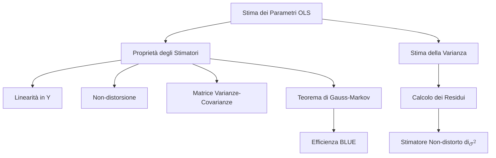
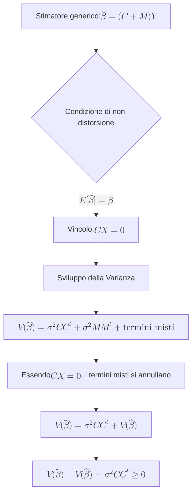

## 1.5 Proprietà degli stimatori e Stima della varianza

**Spiegazione:** A seguito dell'applicazione del metodo dei minimi quadrati (OLS) per l'individuazione del vettore dei parametri $\hat{\boldsymbol{\beta}}$ nel modello lineare $\mathbf{y} = \mathbf{X}\boldsymbol{\beta} + \boldsymbol{\varepsilon}$, risulta necessario analizzare le proprietà statistiche di tale stimatore.
Assumendo come valide le ipotesi fondamentali sulla variabile casuale errore (media nulla, omoschedasticità e incorrelazione), lo stimatore OLS assume caratteristiche di ottimalità teorica.
Contestualmente, poiché la matrice di varianze e covarianze dello stimatore dipende dal parametro incognito $\sigma^2$ (varianza della popolazione degli errori), si rende indispensabile definire una procedura per la stima corretta di tale quantità a partire dai dati campionari.

#### Proprietà degli stimatori ai minimi quadrati

**Definizione** Lo stimatore ai minimi quadrati del vettore dei parametri, definito come $\hat{\boldsymbol{\beta}} = (\mathbf{X}^t \mathbf{X})^{-1} \mathbf{X}^t \mathbf{y}$, è una statistica le cui proprietà dipendono dalla validità delle assunzioni di base del modello lineare (Assunzioni di Gauss-Markov).
Nello specifico, tale stimatore si definisce lineare, non distorto e pienamente efficiente all'interno della propria classe.

**Spiegazione** Le proprietà fondamentali dello stimatore OLS $\hat{\boldsymbol{\beta}}$ sono tre:

1. **Linearità:** Lo stimatore è lineare nel vettore delle osservazioni $\mathbf{Y}$, potendo essere espresso come $\hat{\boldsymbol{\beta}} = \mathbf{M}\mathbf{Y}$, dove la matrice $\mathbf{M} = (\mathbf{X}^t \mathbf{X})^{-1} \mathbf{X}^t$ è costituita da costanti note, posto che la matrice $\mathbf{X}$ sia deterministica.

2. **Non-distorsione:** Se l'aspettativa dell'errore è nulla ($E[\boldsymbol{\varepsilon}] = \mathbf{0}$), il valore atteso dello stimatore coincide con il vero vettore dei parametri $\boldsymbol{\beta}$.

3. **Efficienza (Teorema di Gauss-Markov):** Sotto le ipotesi di omoschedasticità e incorrelazione degli errori ($V(\boldsymbol{\varepsilon}) = \sigma^2\mathbf{I}$), lo stimatore ai minimi quadrati è il più efficiente (ovvero possiede varianza minima) nella classe degli stimatori lineari e non-distorti per $\boldsymbol{\beta}$, divenendo l'estimatore BLUE (Best Linear Unbiased Estimator).
   Inoltre, la sua matrice di varianze e covarianze è data da $V(\hat{\boldsymbol{\beta}}) = \sigma^2(\mathbf{X}^t \mathbf{X})^{-1}$; tale matrice, di dimensione $p \times p$, non è necessariamente diagonale, implicando che gli stimatori dei singoli coefficienti possano essere tra loro correlati.

**Dimostrazioni**
*Dimostrazione 1: Non-distorsione*
$$E[\hat{\boldsymbol{\beta}}] = E[(\mathbf{X}^t \mathbf{X})^{-1} \mathbf{X}^t \mathbf{Y}] = E[(\mathbf{X}^t \mathbf{X})^{-1} \mathbf{X}^t (\mathbf{X}\boldsymbol{\beta} + \boldsymbol{\varepsilon})]= (\mathbf{X}^t \mathbf{X})^{-1} \mathbf{X}^t \mathbf{X}\boldsymbol{\beta} + (\mathbf{X}^t \mathbf{X})^{-1} \mathbf{X}^t E[\boldsymbol{\varepsilon}] = \boldsymbol{\beta}$$
*Dimostrazione 2: Matrice di Varianze e Covarianze*
Posto $\mathbf{M} = (\mathbf{X}^t \mathbf{X})^{-1} \mathbf{X}^t$:
$$V(\hat{\boldsymbol{\beta}}) = \mathbf{M} V(\mathbf{Y}) \mathbf{M}^t = \mathbf{M} (\sigma^2 \mathbf{I}) \mathbf{M}^t = \sigma^2 \mathbf{M} \mathbf{M}^t= \sigma^2 (\mathbf{X}^t \mathbf{X})^{-1} \mathbf{X}^t \mathbf{X} (\mathbf{X}^t \mathbf{X})^{-1} = \sigma^2 (\mathbf{X}^t \mathbf{X})^{-1}$$
*Dimostrazione 3: Teorema di Gauss-Markov*
Sia $\mathbf{C}$ una matrice di costanti note e si consideri un generico stimatore lineare alternativo $\tilde{\boldsymbol{\beta}} = (\mathbf{C} + \mathbf{M})\mathbf{y}$, con $\mathbf{M} = (\mathbf{X}^t \mathbf{X})^{-1} \mathbf{X}^t$.
Affinché $\tilde{\boldsymbol{\beta}}$ sia non distorto, deve valere:
$$E[\tilde{\boldsymbol{\beta}}] = E[(\mathbf{C} + \mathbf{M})(\mathbf{X}\boldsymbol{\beta} + \boldsymbol{\varepsilon})] = (\mathbf{C} + \mathbf{M})\mathbf{X}\boldsymbol{\beta} + (\mathbf{C} + \mathbf{M})E[\boldsymbol{\varepsilon}]= \mathbf{C}\mathbf{X}\boldsymbol{\beta} + (\mathbf{X}^t \mathbf{X})^{-1}\mathbf{X}^t\mathbf{X}\boldsymbol{\beta} = \mathbf{C}\mathbf{X}\boldsymbol{\beta} + \boldsymbol{\beta}$$
L'uguaglianza $E[\tilde{\boldsymbol{\beta}}] = \boldsymbol{\beta}$ è verificata se e solo se $\mathbf{C}\mathbf{X} = \mathbf{0}$.
Calcolando la varianza di tale stimatore alternativo:
$$V(\tilde{\boldsymbol{\beta}}) = V[(\mathbf{C} + \mathbf{M})\mathbf{y}] = \sigma^2(\mathbf{C} + \mathbf{M})(\mathbf{C} + \mathbf{M})^t= \sigma^2(\mathbf{C}\mathbf{C}^t + \mathbf{M}\mathbf{C}^t + \mathbf{C}\mathbf{M}^t + \mathbf{M}\mathbf{M}^t)$$
Poiché $\mathbf{C}\mathbf{X} = \mathbf{0}$, i doppi prodotti si annullano: $\mathbf{M}\mathbf{C}^t = (\mathbf{X}^t \mathbf{X})^{-1}\mathbf{X}^t\mathbf{C}^t = (\mathbf{X}^t \mathbf{X})^{-1}(\mathbf{C}\mathbf{X})^t = \mathbf{0}$.
Pertanto:
$$V(\tilde{\boldsymbol{\beta}}) = \sigma^2\mathbf{C}\mathbf{C}^t + \sigma^2\mathbf{M}\mathbf{M}^t = \sigma^2\mathbf{C}\mathbf{C}^t + V(\hat{\boldsymbol{\beta}})$$

**Diagrammi**

**Spiegazione della dimostrazione** La dimostrazione della non-distorsione si ottiene applicando l'operatore valore atteso all'equazione dello stimatore; sfruttando la linearità dell'operatore e l'ipotesi di errore medio nullo, l'espressione collassa algebricamente sul vero parametro $\boldsymbol{\beta}$.
La determinazione della varianza dello stimatore $\hat{\boldsymbol{\beta}}$ sfrutta le proprietà della varianza di una combinazione lineare di variabili, da cui l'estrazione delle costanti pre e post moltiplicate algebricamente.
Infine, la dimostrazione del Teorema di Gauss-Markov si basa sulla costruzione di un generico stimatore alternativo $\tilde{\boldsymbol{\beta}}$, forzato ad essere lineare e non distorto.
L'imposizione della non-distorsione obbliga la matrice ausiliaria $\mathbf{C}$ a soddisfare la condizione di ortogonalità $\mathbf{C}\mathbf{X} = \mathbf{0}$.
Sviluppando l'operatore varianza e applicando tale vincolo di ortogonalità, i prodotti incrociati svaniscono, evidenziando che la varianza dello stimatore alternativo è pari a quella dello stimatore OLS sommata alla quantità $\sigma^2\mathbf{C}\mathbf{C}^t$.
Essendo quest'ultima una matrice semidefinita positiva, i valori sulla sua diagonale principale sono certamente non negativi, confermando che nessun altro stimatore lineare e corretto può possedere una varianza inferiore a quella prodotta dai minimi quadrati.

#### Stima della varianza $\sigma^2$

**Definizione** La stima della varianza $\sigma^2$ della popolazione degli errori viene effettuata mediante l'utilizzo dei residui del modello, ovvero la differenza tra i valori osservati e i valori teorici stimati dal modello di regressione.
Lo stimatore finale, corretto per i gradi di libertà, è definito come $\hat{\sigma}^2 = \frac{1}{n-p} \hat{\boldsymbol{\varepsilon}}^t \hat{\boldsymbol{\varepsilon}}$.

**Spiegazione** Poiché la matrice di varianze e covarianze dello stimatore dipendente dal parametro ignoto $\sigma^2$ è logicamente fondato ricavare una stima di quest'ultimo attraverso gli scarti residui empirici $\hat{\varepsilon}_i = y_i - \hat{y}_i$.
Per costruzione algebrica, la somma dei residui ottenuti tramite OLS è nulla, implicando una media dei residui pari a zero.
Lo stimatore "naturale" della varianza assume la forma $S^2 = \frac{1}{n} \sum_{i=1}^n \hat{\varepsilon}_i^2$.
Tuttavia, tale quantificatore risulta essere distorto per le stime su base campionaria.
Per correggere tale distorsione, si adotta una normalizzazione calcolata in funzione dei gradi di libertà residui, ottenuti decurtando dalla numerosità campionaria $n$ il numero totale di parametri stimati nel modello $p$.
