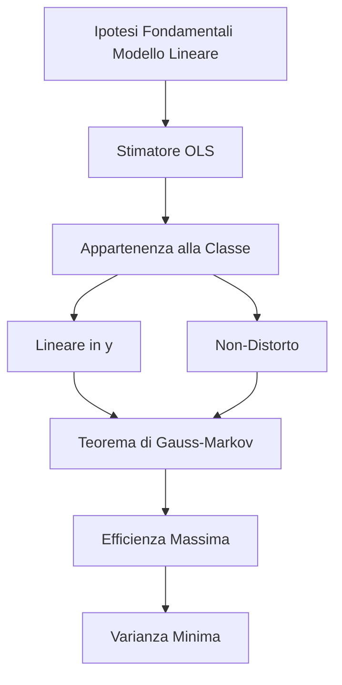
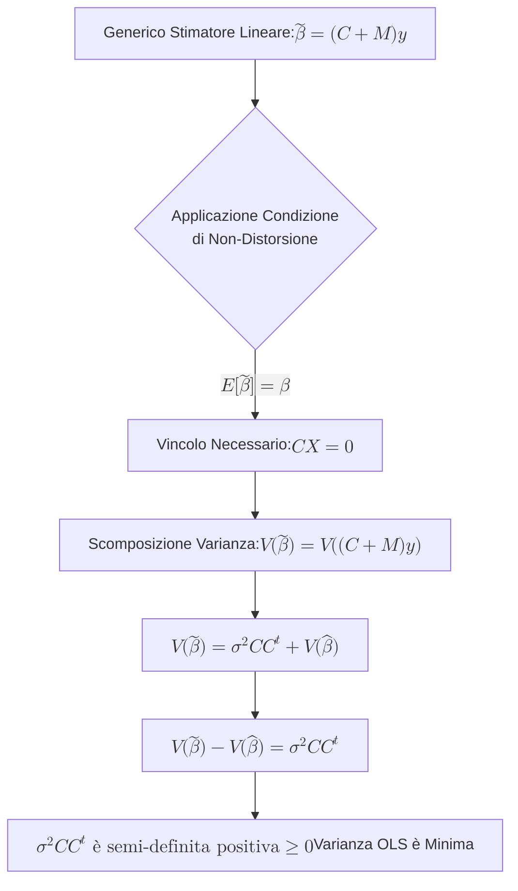

## 1.6 Teorema di Gauss-Markov

**Diagramma Paragrafo:**

**Spiegazione:** Il Teorema di Gauss-Markov costituisce il risultato teorico centrale a giustificazione dell'utilizzo del metodo dei Minimi Quadrati Ordinari (OLS) nell'ambito della regressione multipla.
Tale teorema dimostra che, se la componente stocastica del modello lineare rispetta le ipotesi fondamentali (ovvero aspettativa nulla, omoschedasticità e incorrelazione degli errori), lo stimatore ottenuto gode di proprietà ottimali, risultando il più efficiente tra gli stimatori che condividono le medesime caratteristiche funzionali e di correttezza.

#### Teorema di Gauss-Markov

**Definizione** Sotto le ipotesi fondamentali del modello lineare, lo stimatore ai minimi quadrati del vettore $\boldsymbol{\beta}$ è il più efficiente nella classe degli stimatori lineari e non-distorti per $\boldsymbol{\beta}$.

**Spiegazione** Il teorema stabilisce che lo stimatore OLS è il BLUE (*Best Linear Unbiased Estimator*).
Questo significa che, confinando la ricerca agli stimatori che sono combinazioni lineari della variabile dipendente $\mathbf{y}$ (linearità) e il cui valore atteso coincide con il vero parametro $\boldsymbol{\beta}$ (non-distorsione), lo stimatore ai minimi quadrati presenta la matrice di varianze e covarianze "minima".
Avere la varianza minima assicura la massima precisione possibile nella stima dei coefficienti, a parità di assunzioni valide.

**Dimostrazioni** Sia $\mathbf{C}$ una matrice di costanti note.
Ricordando che $\mathbf{M} = (\mathbf{X}^t \mathbf{X})^{-1} \mathbf{X}^t$, consideriamo il seguente generico stimatore lineare in $\mathbf{y}$ del vettore $\boldsymbol{\beta}$:
$$\tilde{\boldsymbol{\beta}} = (\mathbf{C} + \mathbf{M})\mathbf{y}$$.
Lo stimatore considerato è non distorto per $\boldsymbol{\beta}$ se: $E[\tilde{\boldsymbol{\beta}}] = \boldsymbol{\beta}$.
Sviluppando il valore atteso:
$$E[\tilde{\boldsymbol{\beta}}] = E[(\mathbf{C} + \mathbf{M})\mathbf{y}] = E\{(\mathbf{C} + \mathbf{M})(\mathbf{X}\boldsymbol{\beta} + \boldsymbol{\varepsilon})\}= (\mathbf{C} + \mathbf{M})\mathbf{X}\boldsymbol{\beta} + (\mathbf{C} + \mathbf{M})E(\boldsymbol{\varepsilon})$$
Sapendo che $E(\boldsymbol{\varepsilon}) = \mathbf{0}$, otteniamo:
$$= \mathbf{C}\mathbf{X}\boldsymbol{\beta} + \mathbf{M}\mathbf{X}\boldsymbol{\beta} = \mathbf{C}\mathbf{X}\boldsymbol{\beta} + (\mathbf{X}^t \mathbf{X})^{-1} \mathbf{X}^t \mathbf{X}\boldsymbol{\beta} = \mathbf{C}\mathbf{X}\boldsymbol{\beta} + \boldsymbol{\beta}$$
Affinché sia verificata la non distorsione ($E[\tilde{\boldsymbol{\beta}}] = \boldsymbol{\beta}$), deve necessariamente valere il vincolo:
$$\mathbf{C}\mathbf{X} = \mathbf{0}$$.
Calcoliamo ora la matrice di varianze e covarianze di $\tilde{\boldsymbol{\beta}}$:
$$V(\tilde{\boldsymbol{\beta}}) = V[(\mathbf{C} + \mathbf{M})\mathbf{y}] = (\mathbf{C} + \mathbf{M})V(\mathbf{y})(\mathbf{C} + \mathbf{M})^t = (\mathbf{C} + \mathbf{M})\sigma^2 \mathbf{I}(\mathbf{C} + \mathbf{M})^t = \sigma^2(\mathbf{C} + \mathbf{M})(\mathbf{C} + \mathbf{M})^t$$.
Sviluppando il prodotto matriciale:
$$(\mathbf{C} + \mathbf{M})(\mathbf{C} + \mathbf{M})^t = \mathbf{C}\mathbf{C}^t + \mathbf{C}\mathbf{M}^t + \mathbf{M}\mathbf{C}^t + \mathbf{M}\mathbf{M}^t$$.
Valutiamo le singole componenti sfruttando il vincolo $\mathbf{C}\mathbf{X} = \mathbf{0}$ :

- $\mathbf{C}\mathbf{M}^t = \mathbf{C}[(\mathbf{X}^t\mathbf{X})^{-1}\mathbf{X}^t]^t = \mathbf{C}\mathbf{X}(\mathbf{X}^t\mathbf{X})^{-1} = \mathbf{0}$.
- $\mathbf{M}\mathbf{M}^t = (\mathbf{X}^t\mathbf{X})^{-1}\mathbf{X}^t\mathbf{X}(\mathbf{X}^t\mathbf{X})^{-1} = (\mathbf{X}^t\mathbf{X})^{-1}$.
  Sostituendo questi risultati nell'espressione della varianza, otteniamo:
  $$V(\tilde{\boldsymbol{\beta}}) = \sigma^2[\mathbf{C}\mathbf{C}^t + (\mathbf{X}^t \mathbf{X})^{-1}] = \sigma^2\mathbf{C}\mathbf{C}^t + \sigma^2(\mathbf{X}^t \mathbf{X})^{-1} = \sigma^2\mathbf{C}\mathbf{C}^t + V(\hat{\boldsymbol{\beta}})$$.
  Quindi, calcolando la differenza tra le matrici di varianze e covarianze dei due stimatori si ha:
  $$V(\tilde{\boldsymbol{\beta}}) - V(\hat{\boldsymbol{\beta}}) = \sigma^2\mathbf{C}\mathbf{C}^t$$.

**Diagrammi**

**Spiegazione della dimostrazione** La dimostrazione parte dalla costruzione di un generico stimatore alternativo $\tilde{\boldsymbol{\beta}}$, forzandolo ad appartenere alla classe degli stimatori lineari e non distorti.
L'imposizione della non distorsione genera matematicamente il vincolo fondamentale $\mathbf{C}\mathbf{X} = \mathbf{0}$.
Sviluppando la varianza di questo nuovo stimatore, emergono due componenti additive: la varianza dello stimatore OLS classico $V(\hat{\boldsymbol{\beta}})$ e il termine $\sigma^2\mathbf{C}\mathbf{C}^t$.
Poiché la matrice $\sigma^2\mathbf{C}\mathbf{C}^t$ è semi-definita positiva per definizione, i termini sulla sua diagonale principale sono certamente non negativi.
Ne consegue logicamente che la varianza del generico stimatore alternativo non potrà mai essere inferiore a quella dello stimatore ai minimi quadrati, confermando l'efficienza massima di quest'ultimo all'interno della propria classe.
