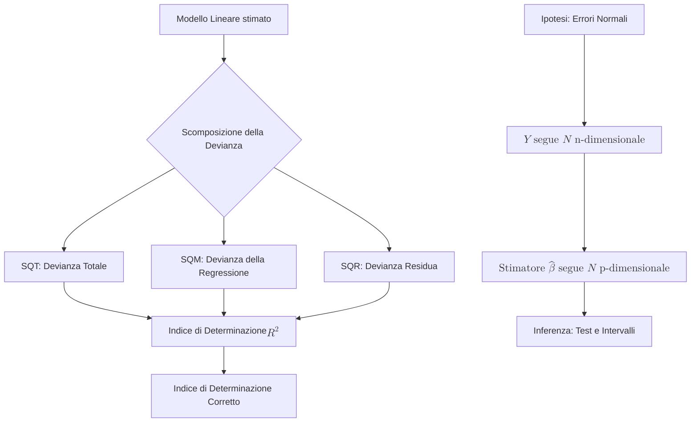

## 1.7 Somme di Quadrati, $R^2$ e Ipotesi di Normalità

**Spiegazione:** Il presente paragrafo approfondisce le metriche per la valutazione della bontà di adattamento del modello lineare ai dati empirici e definisce le basi distribuzionali necessarie all'inferenza.
Viene analizzata la scomposizione della devianza totale in devianza spiegata e devianza residua, dalle quali scaturiscono le misurazioni sintetiche dell'indice di determinazione ($R^2$) e della sua forma corretta ($\bar{R}^2$).
Infine, si formalizza l'ipotesi di normalità della componente stocastica, prerequisito indispensabile per estendere la stima puntuale alla costruzione di intervalli di confidenza e test statistici sui parametri incogniti.

#### Somme di Quadrati – Indice di Determinazione

**Definizione:** L'indice di determinazione ($R^2$) è una misura sintetica che quantifica la frazione di variabilità della variabile dipendente spiegata dal modello di regressione lineare stimato.
Esso origina dalla scomposizione additiva della somma dei quadrati totali (SQT) nella somma dei quadrati del modello (SQM) e nella somma dei quadrati dei residui (SQR).

**Spiegazione:** La variabilità complessiva della variabile risposta viene scissa in due componenti ortogonali.
La Somma dei Quadrati Totali (SQT), o devianza totale, quantifica la dispersione delle osservazioni rispetto alla propria media: $\text{SQT} = y^t y - n\bar{y}^2$.
Tale devianza si decompone in:

- **SQM (Somma dei Quadrati del Modello):** la devianza spiegata dai regressori, $\text{SQM} = \hat{y}^t \hat{y} - n\bar{y}^2 = y^t H y - n\bar{y}^2$, con $H = X(X^t X)^{-1}X^t$ matrice simmetrica e idempotente.
- **SQR (Somma dei Quadrati dei Residui):** la devianza accidentale non colta dal modello, $\text{SQR} = y^t (I - H) y$.
  Dalla relazione $SQT = SQM + SQR$, derivabile algebricamente, discende che la varianza osservata è somma della varianza spiegata e della varianza residua: $V(y) = V(\hat{y}) + V(\hat{\varepsilon})$.
  L'indice di determinazione è pertanto calcolato come:
  $$R^2 = \frac{\text{SQM}}{\text{SQT}} = 1 - \frac{\text{SQR}}{\text{SQT}}$$
  Esso assume valori nell'intervallo $ $ e, moltiplicato per 100, fornisce la percentuale esatta di variabilità della dipendente sussunta dalle esplicative inserite nel modello.

**Dimostrazioni:** La dimostrazione algebrica delle proprietà delle somme di quadrati deriva dalle equazioni del sistema normale $\mathbf{X}^t \mathbf{X}\hat{\boldsymbol{\beta}} = \mathbf{X}^t \mathbf{y}$.
Sostituendo alla matrice trasposta $\mathbf{X}^t$ il vettore unitario $\mathbf{1}^t$, si ottiene l'uguaglianza $\mathbf{1}^t \hat{\mathbf{y}} = \mathbf{1}^t \mathbf{y}$, da cui $\sum_{i=1}^n \hat{y}_i = \sum_{i=1}^n y_i$.
Di conseguenza, dividendo per $n$, si dimostra che la retta di regressione stimata passa per il baricentro dei dati empirici.
Ulteriormente, si verifica l'identità tra la somma dei quadrati delle ordinate stimate e la somma dei prodotti incrociati tra ordinate stimate e osservate:
$\sum_{i=1}^n \hat{y}_i^2 = \hat{\mathbf{y}}^t \hat{\mathbf{y}} = (\mathbf{H}\mathbf{y})^t (\mathbf{H}\mathbf{y}) = \mathbf{y}^t \mathbf{H}^t \mathbf{H} \mathbf{y}$.
Data l'idempotenza e simmetria di $\mathbf{H}$, si giunge a $\mathbf{y}^t \mathbf{H} \mathbf{y} = \sum_{i=1}^n \hat{y}_i y_i$.

**Spiegazione della dimostrazione:** La validità della scomposizione in devianze poggia rigorosamente sull'impiego del metodo dei minimi quadrati.
La matrice complice del modello lineare (matrice $H$ o "hat matrix") proietta ortogonalmente i dati originali sul sottospazio generato dalle colonne di $X$. È proprio l'idempotenza di tale matrice ($H \times H = H$) ad assorbire i termini misti nel calcolo dei quadrati, stabilendo in maniera chiara l'uguaglianza tra il quadrato della proiezione e il suo prodotto interno col vettore originario.

#### L'indice di determinazione corretto

**Definizione:** L'indice di determinazione corretto, denotato come $\bar{R}^2$, è una misura sintetica ricalibrata di accostamento al modello, ottenuta relativizzando devianza residua e totale per i rispettivi gradi di libertà.
La formula è:
$$\bar{R}^2 = 1 - \frac{\text{SQR}/(n-p)}{\text{SQT}/(n-1)} = 1 - \left[ \frac{n-1}{n-p} (1-R^2) \right]$$

**Spiegazione:** L'utilizzo esclusivo dell'indice $R^2$ classico incontra un grave limite analitico: incrementando il numero dei regressori nel modello lineare (ovvero il parametro $p$), il valore di $R^2$ subisce una crescita meccanica, che permane anche nell'ipotesi in cui le variabili aggiunte manchino di qualsiasi senso logico ai fini esplicativi del fenomeno esaminato.
L'indice corretto $\bar{R}^2$ funge da fattore di penalizzazione verso la sovraparametrizzazione, ponderando la stima in funzione dell'ampiezza campionaria e del numero di esplicative stimate.
Questo implica un'alterazione metodologica notevole: l'indice di determinazione corretto perde la facoltà di essere inteso come una rigida "percentuale di variabilità spiegata", consentendo di giungere, in determinati scenari perentori, ad assumere magnitudini di segno negativo.

#### Ipotesi di Normalità degli Errori

**Definizione:** L'assunzione distribuzionale terminale nella specificazione del modello statistico lineare impone che il vettore causale degli errori inosservabili obbedisca ad una legge Normale di dimensione $n$, tale per cui $\boldsymbol{\varepsilon} \sim N(\mathbf{0}, \sigma^2 \mathbf{I})$.

**Spiegazione:** La semplice determinazione geometrica delle stime dei parametri $\boldsymbol{\beta}$ secondo l'applicazione degli OLS (Minimi Quadrati Ordinari) non esige specificazioni di distribuzione; invero il Teorema di Gauss-Markov stabilisce che lo stimatore m.q. goda della varianza minima (efficienza) all'interno degli stimatori lineari non distorti, limitandosi ad appoggiarsi unicamente sui due momenti primi (media nulla) e secondi (varianza costante e covarianze inesistenti).
Tuttavia, la sola stima puntuale non esaurisce l'oggetto induttivo: è imperativo poterne estrarre deduzioni circa l'universo originario di riferimento.
Per consentire la fondazione probabilistica degli intervalli confidenziali e la formulazione di test statistici sui parametri (quali il test T per i singoli coefficienti e il test F per ipotesi generali sul modello), diviene irrinunciabile postulare per intero il modello stocastico.
Ammessa l'ipotesi $\boldsymbol{\varepsilon} \sim N(\mathbf{0}, \sigma^2 \mathbf{I})$, subentrano due implicazioni teoriche, derivate dalle proprietà della variabile aleatoria Normale Multivariata :

1. Visto che la parte $\mathbf{X}\boldsymbol{\beta}$ incarna esclusivamente una funzione matematica e una componente costante nel campione, il vettore $\mathbf{Y}$, generato da trasformazione affine, assume egualmente e di per sé densità N-variata Normale: $\mathbf{Y} = \mathbf{X}\boldsymbol{\beta} + \boldsymbol{\varepsilon} \sim N_n(\mathbf{X}\boldsymbol{\beta}, \sigma^2 \mathbf{I})$.
2. Parallelamente lo stimatore OLS incognito $\hat{\boldsymbol{\beta}}$, essendo a tutti gli effetti un prodotto lineare in $\mathbf{Y}$ nella forma $(\mathbf{X}^t \mathbf{X})^{-1} \mathbf{X}^t \mathbf{Y}$, si distribuisce in via definitiva come Normalità di grado $p$: $\hat{\boldsymbol{\beta}} \sim N_p(\boldsymbol{\beta}, \sigma^2 (\mathbf{X}^t \mathbf{X})^{-1})$.
