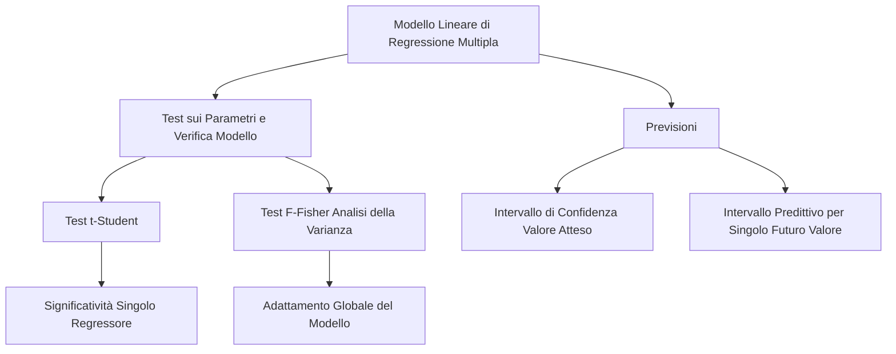

## 1.8 Test sui parametri (t ed F-Fisher) e Previsioni

**Spiegazione:** Una volta completata la specificazione e ottenuta la stima dei parametri del modello di regressione lineare multipla con il metodo dei minimi quadrati, l'introduzione dell'ipotesi di normalità degli errori stocastici, ovvero $\boldsymbol{\varepsilon} \sim N(0, \sigma^2 \mathbf{I})$ consente di concludere il processo inferenziale.
In tale fase è possibile determinare le distribuzioni campionarie esatte per costruire gli intervalli di confidenza, attuare procedure di test di significatività d'ipotesi sui parametri valutare l'adattamento globale del modello e formulare previsioni supportate da metriche di incertezza predittiva o condizionale.

#### Test sui parametri del modello lineare (test t)

**Definizione:** Procedura statistica impiegata per verificare in modo marginale le ipotesi riguardanti la significatività di un singolo coefficiente di regressione incognito $\beta_j$.

**Spiegazione:** Assumendo valida l'ipotesi di normalità della componente d'errore, discende che lo stimatore ai minimi quadrati $\hat{\boldsymbol{\beta}}$ ha distribuzione normale multivariata.
Da tale proprietà consegue che la distribuzione marginale dello stimatore $\hat{\beta}_j$ del $j$-esimo coefficiente risulta normale: $\hat{\beta}_j \sim N(\beta_j, \sigma^2 s_{jj})$, dove l'elemento $s_{jj}$ corrisponde all'elemento $j$-esimo posto sulla diagonale principale della matrice $(\mathbf{X}^t \mathbf{X})^{-1}$.
Se il sistema di ipotesi viene posto come $H_0: \beta_j = \beta_{j0}$ contro $H_1: \beta_j \neq \beta_{j0}$, la standardizzazione dello stimatore origina la statistica $T = \frac{\hat{\beta}_j - \beta_{j0}}{\hat{\sigma} \sqrt{s_{jj}}}$.
Sotto l'ipotesi nulla $H_0$, detta statistica $T$ consiste in una quantità pivot distribuita come una t di Student con $(n-p)$ gradi di libertà, dove $\hat{\sigma}$ rappresenta la radice della stima della varianza.
Dato un livello di significatività $\alpha$, si rifiuta rigorosamente l'ipotesi $H_0$ a favore dell'alternativa qualora il valore assoluto della statistica $T$ ecceda la regione di accettazione, ovvero se $\left| T \right| > t_{\frac{\alpha}{2}, (n-p)}$, o parimenti, se il *p-value* risulta strettamente inferiore ad $\alpha$.

#### Test F-Fisher (Analisi della Varianza)

**Definizione:** Test statistico globale orientato a verificare l'adattamento complessivo del modello ai dati analizzando la validità congiunta dei regressori adottati rispetto alla varianza residua.

**Spiegazione:** Il sistema di ipotesi globale pone $H_0: \beta_1 = \beta_2 = \dots = \beta_k = 0$ contro $H_1:$ almeno un $\beta_j \neq 0$.
L'accettazione dell'ipotesi nulla induce a ritenere che nessuno dei $k$-regressori sia utile per spiegare il comportamento della variabile dipendente, rendendo l'intercetta (costante) il suo miglior predittore.
La statistica di riferimento è impostata come il rapporto tra la devianza imputabile al modello spiegato (SQM) pesato per i suoi gradi di libertà $(p-1)$ e la devianza residua (SQR) pesata sui propri gradi di libertà $(n-p)$.
Essendo la statistica definita da $F = \frac{\text{SQM}/(p-1)}{\text{SQR}/(n-p)} \sim F(p-1; n-p)$ si respingerà l'ipotesi nulla $H_0$ se il valore computato di $F$ è superiore al valore limite tabulato $F(\alpha; p-1; n-p)$ oppure se si constata un *p-value* minore del livello critico prefissato $\alpha$.

#### Previsioni con il modello di regressione lineare multipla

**Definizione:** Applicazione metodologica del modello stimato, che utilizza i parametri $\hat{\boldsymbol{\beta}}$ finalizzata a prevedere la variabile dipendente isolata o misurarne il valore atteso in risposta a nuovi e distinti assetti delle variabili esplicative immessi in un vettore $\mathbf{x}_0$ o $\mathbf{x}_{n+1}$.

**Spiegazione:** La previsione si dirama in due obiettivi distinti.
Il primo consiste nell'istituire Test d'Ipotesi o Costruire Intervalli di Confidenza per il valore atteso condizionato, $E(Y_0 | \mathbf{x}_0)$.
In questo contesto, poiché lo stimatore $\hat{Y}_0 = \mathbf{x}_0^t \hat{\boldsymbol{\beta}}$ è una combinazione di distribuzioni normali ed esibisce distribuzione normale $N(\mathbf{x}_0^t \boldsymbol{\beta}, \sigma^2 \mathbf{x}_0^t (\mathbf{X}^t \mathbf{X})^{-1} \mathbf{x}_0)$ la quantità standardizzata risulta avere distribuzione t-Student $\frac{\hat{Y}_0 - E(Y_0 | \mathbf{x}_0)}{\hat{\sigma} \sqrt{\mathbf{x}_0^t (\mathbf{X}^t \mathbf{X})^{-1} \mathbf{x}_0}} \sim t(n-p)$.
Ciò rende esplicito l'intervallo di confidenza al $100(1-\alpha)\%$ in $\mathbf{x}_0^t \hat{\boldsymbol{\beta}} \pm t_{\frac{\alpha}{2}, (n-p)} \hat{\sigma} \sqrt{\mathbf{x}_0^t (\mathbf{X}^t \mathbf{X})^{-1} \mathbf{x_0}}$.
Il secondo scenario riguarda la previsione dell'effettivo futuro singolo valore associato a un vettore estraneo alle stime campionarie, $\mathbf{x}_{n+1}$.
Per individuare gli estremi dello scenario descritto e quantificare l'errore di previsione $\tau_{n+1} = \hat{Y}_{n+1} - Y_{n+1}$ si sviluppa il cosiddetto Intervallo Predittivo per una risposta ignota, avente confini determinati dalla variabilità combinata della stima parametrica e della componente casuale insita nel modello: $\hat{Y}_{n+1} \pm t_{\frac{\alpha}{2}, (n-p)} \hat{\sigma} \sqrt{1 + \mathbf{x}_{n+1}^t (\mathbf{X}^t \mathbf{X})^{-1} \mathbf{x}_{n+1}}$.

- **Dimostrazioni:** Varianza dell'errore di previsione per il valore futuro $Y_{n+1}$:
  $V(\tau_{n+1}) = V[\mathbf{x}_{n+1}^t (\hat{\boldsymbol{\beta}} - \boldsymbol{\beta}) - \varepsilon_{n+1}] = V[\mathbf{x}_{n+1}^t \hat{\boldsymbol{\beta}}] + V[\varepsilon_{n+1}] = \mathbf{x}_{n+1}^t V[\hat{\boldsymbol{\beta}}] \mathbf{x}_{n+1} + \sigma^2 = \mathbf{x}_{n+1}^t \sigma^2 (\mathbf{X}^t \mathbf{X})^{-1} \mathbf{x}_{n+1} + \sigma^2 = \sigma^2 [\mathbf{x}_{n+1}^t (\mathbf{X}^t \mathbf{X})^{-1} \mathbf{x}_{n+1} + 1]$.

**Spiegazione della dimostrazione:** Con l'assunzione di indipendenza della componente di errore $\varepsilon_{n+1}$ futura e non compresa nel fit campionario, ne consegue che il valore d'attesa dell'errore di previsione è nullo, $E(\tau_{n+1}) = 0$.
Applicando l'operatore Varianza e tenendo in forza l'indipendenza, il termine trasversale decade.
L'espansione della varianza unisce la varianza condizionata della stima dei coefficienti (data da $\sigma^2 (\mathbf{X}^t \mathbf{X})^{-1}$) alla varianza stocastica insita del modello $\sigma^2$.
Tale scomposizione rileva come l'incertezza su una previsione singola debba inevitabilmente accumulare tanto l'imprecisione dell'iperpiano di stima quanto il rumore bianco incomprimibile ($\sigma^2$), conducendo al radicale aggiuntivo "1 +" nella varianza normalizzata.
Sostituendo al parametro incognito la deviazione standard stimata dei residui, si formalizza un intervallo la cui validità si esplica tramite la t-Student con i medesimi $(n-p)$ gradi di libertà.
