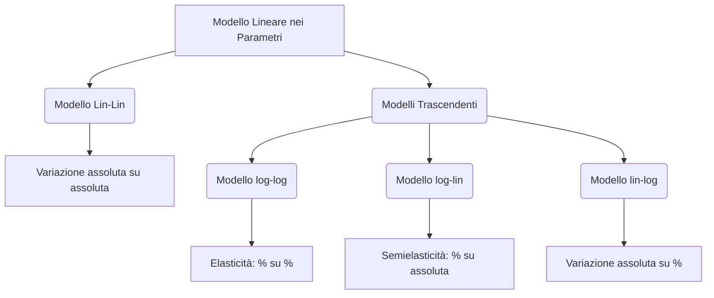

## 1.9 Interpretazione coefficienti e modelli log/lin

**Spiegazione:** Nel contesto del modello lineare, l'assunzione di linearità si riferisce rigorosamente ai parametri ($\beta$) e non alle variabili esplicative, permettendo così l'inclusione di trasformazioni non lineari delle variabili stesse.
L'interpretazione dei coefficienti di regressione dipende intimamente dalla specificazione funzionale adottata.
Quando si applicano trasformazioni logaritmiche alle variabili, il significato del coefficiente $\beta_j$ muta dal rappresentare una variazione marginale assoluta a rappresentare concetti di elasticità o semielasticità.

#### Interpretazione dei coefficienti di regressione

**Definizione:** Nel modello "Lin-Lin", caratterizzato da una specificazione lineare sia nei parametri che nelle variabili esplicative, il coefficiente di regressione $\beta_j$ indica la variazione attesa nella variabile dipendente $Y_i$ a fronte di un incremento unitario o infinitesimale del regressore $x_j$, mantenendo rigorosamente costanti gli altri regressori.

**Spiegazione:** Il segno assunto da $\beta_j$ determina la direzione della relazione causale (incremento o decremento di $Y_i$), mentre il suo valore assoluto ne quantifica l'entità.
Nel caso in cui le variabili subiscano trasformazioni, l'interpretazione diviene funzione della derivata della trasformazione applicata.

- **Dimostrazioni:** Data la specificazione lineare $Y_i = \mathbf{x}_i^t \boldsymbol{\beta} + \varepsilon_i = \beta_0 + \beta_1 x_1 + \dots + \beta_j x_j + \dots + \beta_k x_k + \varepsilon_i$, la derivata parziale rispetto al regressore j-esimo è:
  $$\frac{\partial Y_i}{\partial x_j} = \beta_j$$.
  In presenza di funzioni di trasformazione $h(Y)$ e $g_j(x_j)$, la relazione diviene:
  $$\frac{\partial h(Y)}{\partial x_j} = \beta_j \frac{\partial g_j(x_j)}{\partial x_j}$$.

**Spiegazione della dimostrazione:** La derivata parziale del predittore lineare rispetto a $x_j$ isola esclusivamente la costante moltiplicativa $\beta_j$, azzerando tutti gli altri addendi considerati costanti.
Nel caso generalizzato, l'impatto complessivo su $Y$ è mediato dal prodotto tra il coefficiente $\beta_j$ e la derivata prima della funzione di trasformazione $g_j(\cdot)$ calcolata in&nbsp;$x_j$.

#### Modello log-log

**Definizione:** Rappresenta una specificazione del modello in cui si applica una trasformazione logaritmica simultaneamente alla variabile dipendente e ai regressori.

**Spiegazione:** In questo costrutto, il parametro $\beta_j$ assume il significato economico di "elasticità".
Esso quantifica la variazione percentuale della variabile dipendente $Y$ associata a una variazione dell'1% del regressore $x_j$.
Tale variazione non è costante ma dipende dai valori di livello che assumono $Y$ e $x_j$.

- **Dimostrazioni:** Specificazione: $\ln(Y) = \beta_0 + \beta_1 \ln(x_1) + \dots + \beta_j \ln(x_j) + \dots + \beta_k \ln(x_k) + \varepsilon$.
  Derivazione del coefficiente:
  $$\beta_j = \frac{d \ln(Y)}{d \ln(x_j)} = \frac{\frac{d \ln(Y)}{d Y} (d Y)}{\frac{d \ln(x_j)}{d x_j} (d x_j)} = \frac{\frac{d Y}{Y}}{\frac{d x_j}{x_j}}$$.

**Spiegazione della dimostrazione:** Applicando la regola di derivazione delle funzioni composte (chain rule), la derivata di $\ln(Y)$ rispetto a $\ln(x_j)$ si scompone nel rapporto tra due differenziali relativi.
Il numeratore $\frac{dY}{Y}$ esprime la variazione infinitesima relativa di $Y$, e il denominatore $\frac{dx_j}{x_j}$ esprime la variazione infinitesima relativa di $x_j$, definendo matematicamente il concetto di elasticità.

#### Modello log-lin

**Definizione:** Specifica in cui la trasformazione logaritmica è ristretta unicamente alla variabile dipendente, mantenendo i regressori nella loro scala originaria.

**Spiegazione:** Il coefficiente $\beta_j$ è interpretato come una "semielasticità".
Esso esprime la variazione relativa (o percentuale) di $Y$ in corrispondenza di una variazione marginale unitaria del regressore $x_j$.

- **Dimostrazioni:** Specificazione: $\ln(Y) = \beta_0 + \beta_1 x_1 + \dots + \beta_j x_j + \dots + \beta_k x_k + \varepsilon$.
  Derivazione del coefficiente:
  $$\beta_j = \frac{d \ln(Y)}{d x_j} = \frac{\frac{d \ln(Y)}{d Y} (d Y)}{d x_j} = \frac{\frac{d Y}{Y}}{d x_j}$$.

**Spiegazione della dimostrazione:** La derivata della funzione $\ln(Y)$ rispetto a $x_j$ esplicita il differenziale esatto di un logaritmo, generando al numeratore il tasso di variazione relativo $\frac{dY}{Y}$.
Dividendo tale quantità per la variazione assoluta $dx_j$, si ottiene la variazione percentuale attesa per unità di variazione del regressore.

#### Modello lin-log

**Definizione:** Specifica che presenta la trasformazione logaritmica confinata ai soli regressori, lasciando inalterata la variabile dipendente.

**Spiegazione:** In tale contesto strutturale, il j-esimo coefficiente esprime la variazione assoluta subita da $Y$ in risposta a una variazione relativa (percentuale) di&nbsp;$x_j$.
Operativamente, l'incremento dell'1% di $x_j$ è associato ad una variazione unitaria di $Y$ pari a $0.01 \times \beta_j$.

- **Dimostrazioni:** Specificazione: $Y = \beta_0 + \beta_1 \ln(x_1) + \dots + \beta_j \ln(x_j) + \dots + \beta_k \ln(x_k) + \varepsilon$.
  Derivazione del coefficiente:
  $$\beta_j = \frac{d Y}{d \ln(x_j)} = \frac{d Y}{\frac{d \ln(x_j)}{d x_j} (d x_j)} = \frac{d Y}{d x_j} x_j$$.

**Spiegazione della dimostrazione:** Derivando la variabile dipendente $Y$ rispetto al regressore logaritmico $\ln(x_j)$, si espande il differenziale a denominatore ottenendo $\frac{dx_j}{x_j}$.
Si dimostra così che $\beta_j$ lega la variazione marginale in livelli misurata in $dY$ al tasso di variazione percentuale registrato nel regressore.
