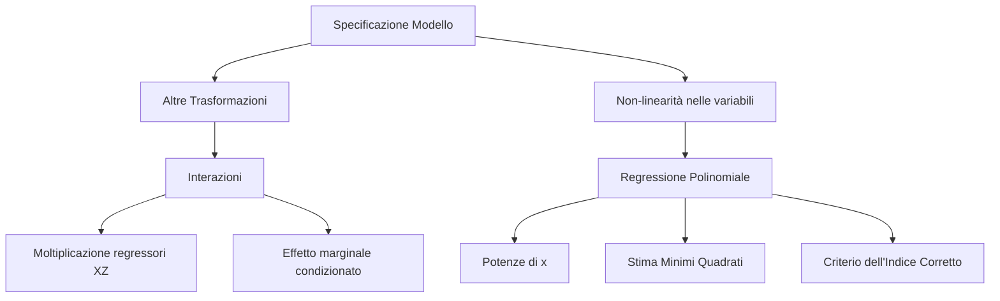
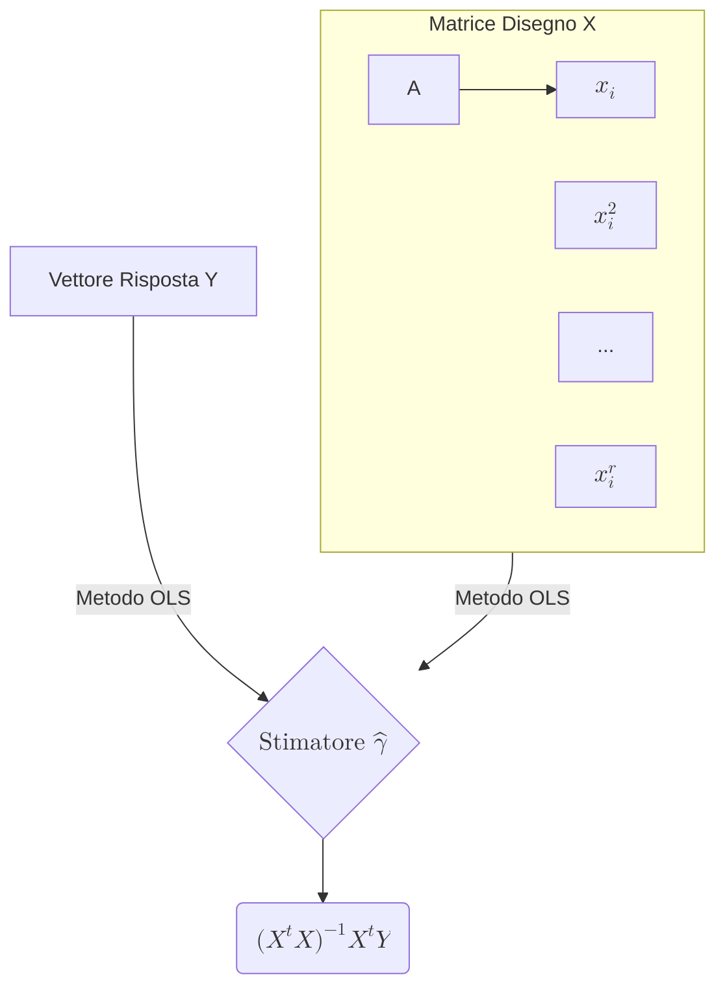

## 1.10 Interazioni e Regressione Polinomiale

**Spiegazione:** All'interno dei modelli lineari, l'ipotesi di linearità si riferisce ai parametri incogniti da stimare e non alle variabili esplicative.
Questo permette di includere nella specificazione trasformazioni delle variabili indipendenti qualora vi siano evidenze (es. analisi esplorativa) o teorie che suggeriscano relazioni non puramente lineari tra la variabile dipendente $Y$ e i regressori.
Due estensioni fondamentali della specificazione per catturare effetti complessi mantenendo la stima ai minimi quadrati sono l'introduzione di variabili d'interazione e l'uso di polinomi di grado superiore.

#### Altre trasformazioni: le Interazioni

**Una interazione è una particolare trasformazione ottenuta aggiungendo al modello lineare una variabile definita come il prodotto tra due regressori preesistenti**, ad esempio $X$ e $Z$.

**Spiegazione:** L'inserimento dell'interazione modifica l'equazione di regressione in $Y = \beta_0 + \beta_1 X + \beta_2 Z + \beta_3 XZ + \varepsilon$.
In questo scenario, **l'effetto esercitato da un regressore sulla risposta non è costante, ma dipende strettamente dal valore assunto dall'altro regressore**.
Nello specifico, un incremento unitario della variabile $X$ si traduce in una variazione della variabile dipendente $Y$ pari a $\beta_1 + \beta_3 Z$.
Quando ciò accade, le due variabili indipendenti interagiscono tra loro nel determinare la risposta finale.

- **Dimostrazioni:** Derivazione dell'effetto marginale per variazioni unitarie.

**Spiegazione della dimostrazione:** La derivata parziale (o variazione per incremento unitario) di $Y$ rispetto ad $X$ isola il termine $\beta_1$ e il termine associato al prodotto, portando algebricamente l'effetto marginale sulla risposta a dipendere dal livello della covarianza moltiplicativa misurata dal coefficiente $\beta_3$ abbinato a&nbsp;$Z$.

#### La regressione polinomiale

**Definizione:** La regressione polinomiale è un modello in cui **la variabile dipendente viene spiegata mediante le potenze successive di una singola variabile indipendente $x$**.

**Spiegazione:** Quando l'effetto su $Y$ di una variazione unitaria di $X$ non è costante e non soddisfa l'uguaglianza $\frac{\partial Y_i}{\partial x_j} = \beta_j$, si rende necessaria una specificazione **non-lineare nei regressori**.
Poiché l'equazione $Y_i = \gamma_0 + \gamma_1 x_i + \gamma_2 x_i^2 + \gamma_3 x_i^3 + \dots + \gamma_r x_i^r + \varepsilon_i$ rimane lineare nei coefficienti $\gamma$, **è ancora possibile applicare il metodo dei minimi quadrati per la stima dei parametri**.
Questa formulazione è comunemente impiegata per modellare il **trend di una serie storica**, descrivendo la componente deterministica tramite una funzione temporale di grado $r$: $Y_t = \alpha_0 + \alpha_1 t + \alpha_2 t^2 + \dots + \alpha_r t^r + \varepsilon_t$.

- **Dimostrazioni:** Impostazione matriciale del modello polinomiale e stimatore ai minimi quadrati.

**Diagrammi:**

**Spiegazione della dimostrazione:** Indicando con $r$ l'ordine del polinomio, si struttura la matrice dei dati (o matrice disegno) $\mathbf{X}$ con dimensione $n \times (r+1)$. **Ogni colonna della matrice contiene le osservazioni elevate alle potenze da $0$ (colonna di uni per l'intercetta) fino ad $r$**.
La soluzione analitica per la stima degli $(r+1)$ coefficienti di regressione procede mediante la risoluzione standard del sistema normale dei minimi quadrati: $\hat{\boldsymbol{\gamma}} = (\mathbf{X}^t \mathbf{X})^{-1} \mathbf{X}^t \mathbf{Y}$.
Nel contesto delle serie storiche, la matrice disegno basata sul tempo è tipicamente rinominata $\mathbf{P}$ ed il vettore di stima $\hat{\boldsymbol{\alpha}} = (\mathbf{P}^t \mathbf{P})^{-1} \mathbf{P}^t \mathbf{Y}$.

#### Criterio del confronto basato sull'indice di determinazione corretto

**Definizione:** È una procedura selettiva per determinare l'**ordine $r$ ottimale** in una regressione polinomiale, basata sulla **comparazione degli indici di determinazione corretti ($\bar{R}^2$)** calcolati per modelli di grado sequenziale.

**Spiegazione:** Inserire ordini $r$ molto elevati assicura un accostamento migliore delle ordinate stimate ai dati osservati, ma incrementa la complessità del modello e provoca una riduzione dei gradi di libertà.
Il criterio statuisce che **se l'indice di determinazione corretto di un modello di ordine $q$, denotato $\bar{R}_q^2$, risulta maggiore o uguale a quello del modello di ordine $q+1$ ($\bar{R}_{q+1}^2$), si interrompe l'iterazione e si seleziona il modello di ordine $q$**.
Ciò segnala oggettivamente che l'aggiunta della componente polinomiale $t^{q+1}$ non contribuisce in modo significativo a migliorare l'adattamento ai dati.
Altrimenti, si continua la stima e l'analisi con specificazioni di ordine via via superiore.
