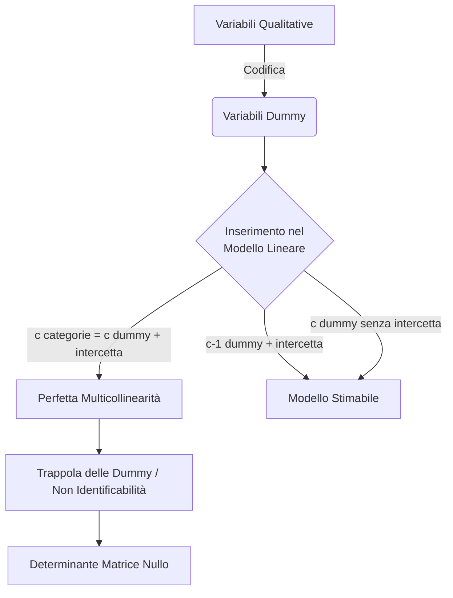

## 1.11 Modelli qualitativi e variabili Dummy (Trappola dummy)

**Spiegazione:** La specificazione di un modello di regressione lineare richiede particolare attenzione quando le variabili esplicative (regressori) non sono di natura quantitativa.
Nel modello di regressione lineare è infatti possibile inserire tra i regressori anche variabili qualitative, ma queste devono essere opportunamente codificate attraverso l'utilizzo di variabili binarie, note come variabili dummy.
Sebbene questa procedura consenta di quantificare l'effetto delle diverse categorie sulla variabile dipendente, un'errata specificazione del modello (inserendo simultaneamente l'intercetta e tante variabili dummy quante sono le categorie) genera una situazione di dipendenza lineare esatta, definita "Trappola delle dummy", che rende il modello non identificabile e i parametri impossibili da stimare con il metodo dei minimi quadrati.

#### Modelli di regressione lineare con regressori QUALITATIVI

**Definizione:** Un modello in cui una variabile qualitativa che assume categorie distinte viene inclusa tra le variabili esplicative attraverso la codifica in una o più variabili binarie, denominate variabili dummy.

**Spiegazione:** Se una variabile assume solo due categorie possibili (es. $a_1$ e $a_2$), la variabile dummy $D$ viene definita in modo dicotomico: assume valore $1$ se l'unità statistica presenta la categoria $a_1$, e valore $0$ se presenta la categoria $a_2$.
Nel modello risultante $Y = \beta_0 + \beta_1 x_1 + \delta D + \varepsilon$, il parametro $\delta$ associato alla dummy cattura l'effetto specifico della categoria codificata con&nbsp;$1$.

- **Dimostrazioni:** Calcolo dei valori attesi condizionati :

* Se $D=1$: $E(Y|D = 1) = (\beta_0 + \delta) + \beta_1 x_1$
* Se $D=0$: $E(Y|D = 0) = \beta_0 + \beta_1 x_1$
* Differenza: $E(Y|D = 1) - E(Y|D = 0) = \delta$

**Spiegazione della dimostrazione:** La dimostrazione algebrica dei valori attesi condizionati prova che il parametro $\delta$ rappresenta esattamente la differenza tra la media della variabile dipendente $Y$ quando l'unità appartiene alla categoria $1$ rispetto a quando appartiene alla categoria $0$, a parità del regressore $x_1$.

#### Modello di regressione lineare con Variabile qualitativa con più categorie

**Definizione:** L'estensione della codifica binaria per una variabile qualitativa $A$ che, per la $i$-esima unità statistica, può assumere $c$ categorie diverse ($a_1, a_2, \dots, a_c$).

**Spiegazione:** Non essendo possibile inserire direttamente la variabile qualitativa tra i regressori, si stima l'effetto di ciascuna categoria costruendo un insieme di variabili dummy $d_{j,i}$.
Ogni dummy vale $1$ se l'unità $i$-esima presenta la categoria $a_j$, e $0$ altrimenti.
Poiché le categorie sono mutuamente esclusive, se per una determinata unità $d_{j,i} = 1$, necessariamente tutte le altre dummy relative alla stessa variabile assumeranno valore zero.

#### Problema di identificabilità del modello

**Definizione:** L'impossibilità di stimare univocamente i parametri del modello poiché il Principio di Identificabilità non è soddisfatto.
Tale principio richiede che ogni punto dello spazio parametrico individui una e una sola funzione di densità: $f(\cdot; \theta_1) \neq f(\cdot; \theta_2) \ \forall \theta_1 \neq \theta_2$.

**Spiegazione:** Inserendo un'intercetta globale e contemporaneamente una variabile dummy per ciascuna delle $c$ categorie, si verifica che specificazioni diverse del vettore dei parametri conducono alla medesima equazione del valore atteso della variabile dipendente, rendendo impossibile isolare gli effetti univoci.

- **Dimostrazioni:** Data una variabile con tre categorie e il modello:
  $Y_i = \beta_0 + \beta_1 d_{1,i} + \beta_2 d_{2,i} + \beta_3 d_{3,i} + \varepsilon_i$.
  Aggiungendo una costante $a$ all'intercetta e sottraendola ai coefficienti delle dummy si ottiene:
  $Y_i = (\beta_0 + a) + (\beta_1 - a)d_{1,i} + (\beta_2 - a)d_{2,i} + (\beta_3 - a)d_{3,i} + \varepsilon_i$.
  I valori attesi rimangono inalterati.
  Ad esempio, se $d_{1,i} = 1$ (e le altre zero), nel primo modello $E(Y_i) = \beta_0 + \beta_1$.
  Nel secondo modello $E(Y_i) = (\beta_0 + a) + (\beta_1 - a) = \beta_0 + \beta_1$.

**Spiegazione della dimostrazione:** L'uguaglianza algebrica dei valori attesi, pur partendo da coefficienti $\beta$ alterati da una costante arbitraria $a$, dimostra che otteniamo gli stessi effetti sul valor medio anche se la specificazione strutturale dei parametri cambia.
Pertanto, le medie di $Y$ (e quindi il modello) non sono identificabili.

#### Trappola delle dummy

**Definizione:** L'insorgere di una situazione di **perfetta multicollinearità** causata dall'inserimento, in una regressione lineare multipla con intercetta, di tante variabili dummy quante sono le categorie della variabile qualitativa.

**Spiegazione:** Questa configurazione implica una dipendenza lineare esatta tra le colonne della matrice disegno.
Come conseguenza strutturale, la matrice $\mathbf{D}_0^t \mathbf{D}_0$ presenta un determinante rigorosamente nullo, precludendo l'invertibilità della matrice e impedendo di ottenere le stime dei parametri $\boldsymbol{\beta}$ tramite il metodo dei minimi quadrati.
Per evitare questo problema si adottano due soluzioni operative: 1) Eliminare l'intercetta globale dal modello, 2) Inserire solo $c-1$ variabili dummy (codificando le categorie rispetto a una di base).

#### Combinazione lineare

**Definizione:** Dati dei vettori $\mathbf{v}_1, \mathbf{v}_2, \dots, \mathbf{v}_m \in \mathbb{R}^n$ e numeri reali $k_1, k_2, \dots, k_m$, una combinazione lineare è il vettore formattato da $k_1 \mathbf{v}_1 + k_2 \mathbf{v}_2 + \dots + k_m \mathbf{v}_m$.
Tali vettori sono linearmente dipendenti se esistono scalari non tutti nulli per cui l'intera combinazione lineare è uguale al vettore nullo $\mathbf{0}$.

**Spiegazione:** Costruendo la matrice disegno $\mathbf{D}_0$ formata dal vettore unitario $\mathbf{1}$ (l'intercetta) e dai vettori colonna delle dummy $\mathbf{d}_1, \mathbf{d}_2, \mathbf{d}_3$, si osserva che la somma degli elementi sulle righe relative alle dummy restituisce sempre la costante $1$, originando una dipendenza algebrica vincolante con la colonna dell'intercetta.

- **Dimostrazioni:** Applicando la definizione algebrica, la somma vettoriale restituisce un vettore di costanti:
  $\mathbf{1} + \mathbf{d}_1 + \mathbf{d}_2 + \mathbf{d}_3 = \mathbf{2}$.
  Che può essere riorganizzato uguagliando a zero come:
  $-1\mathbf{1} + 1\mathbf{d}_1 + 1\mathbf{d}_2 + 1\mathbf{d}_3 = \mathbf{0}$.
  Si verifica l'esistenza di scalari non tutti nulli ($k_1 = -1$, $k_2 = 1$, $k_3 = 1$, $k_4 = 1$) che soddisfano l'equazione della dipendenza lineare.

**Spiegazione della dimostrazione:** Dalla formulazione matriciale risulta dimostrato che il vettore colonna dell'intercetta e i vettori delle variabili dummy non sono linearmente indipendenti.
Tale ridondanza strutturale prova l'esistenza di una perfetta collinearità, confermando l'impossibilità di invertire la matrice dei regressori, essenza analitica della "trappola delle dummy".
