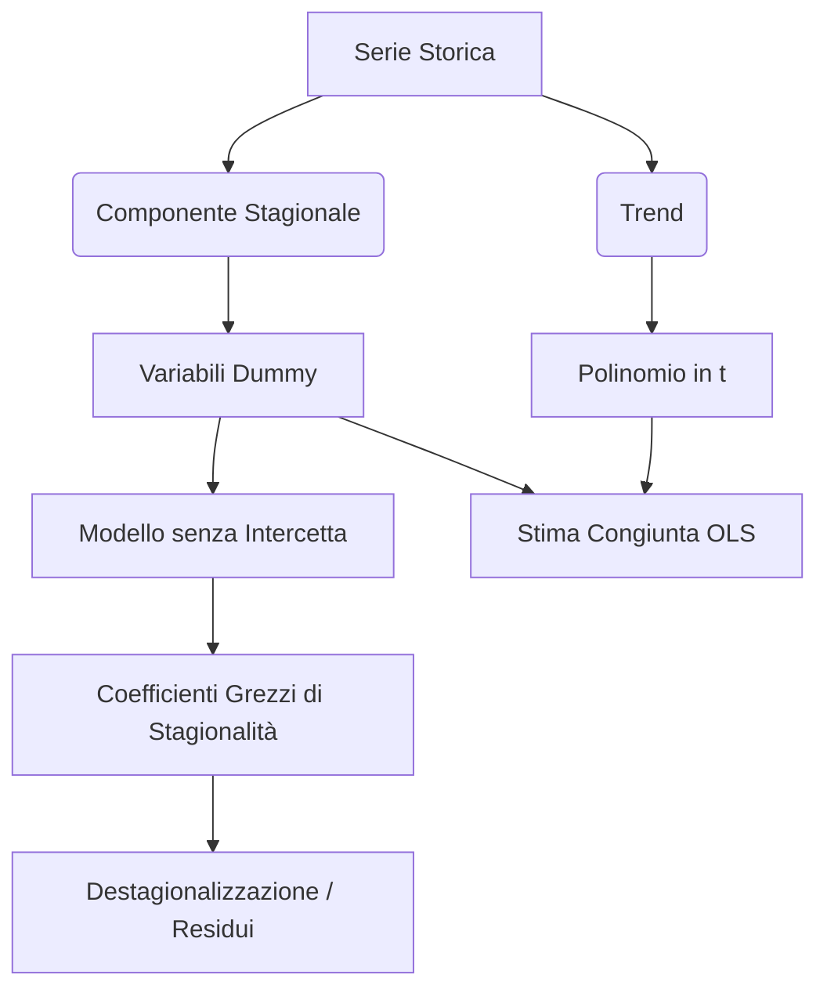

## 1.12 Stima Componente Stagionale e Trend

**Diagramma Paragrafo:**

**Spiegazione:** Nell'analisi delle serie storiche tramite l'approccio classico, si ipotizza che il fenomeno osservato sia la risultante di diverse componenti sottostanti, in particolar modo la tendenza di fondo (Trend) e le fluttuazioni periodiche fisse (Componente Stagionale).
L'impianto metodologico dei Modelli Lineari consente di stimare in modo rigoroso tali componenti sfruttando le proprietà del Metodo dei Minimi Quadrati.
Il trend viene tipicamente modellato mediante funzioni polinomiali del tempo, mentre la componente stagionale richiede l'introduzione di variabili categoriche codificate sotto forma di variabili dummy (indicatrici).
L'utilizzo simultaneo di questi regressori nel modello lineare richiede un'attenta specificazione per garantire l'identificabilità del vettore dei parametri.

#### Stima della Componente Stagionale (Variabili Dummy)

**Definizione:** La stagionalità (o componente stagionale) $S_t$ è costituita da movimenti di un fenomeno nel corso dell'anno che tendono a ripetersi in modo pressoché analogo nel medesimo periodo di anni successivi.
Essa è matematicamente rappresentata da una funzione periodica $g(t)$ il cui valore all'istante $t$ si riproduce esattamente ad intervalli costanti $s$, tale che $g(t) = g(t + s) = g(t + 2s) = \dots$ dove $s$ rappresenta la lunghezza del periodo (es. $s=4$ per dati trimestrali).

**Spiegazione:** Per inserire tale informazione qualitativa (il periodo dell'osservazione) all'interno di un modello di regressione, si effettua una codifica mediante variabili dummy.
La funzione periodica viene approssimata dalla combinazione lineare $g(t) = \sum_{j=1}^s \gamma_j d_{j,t}$.
In questa specificazione, la variabile indicatrice $d_{j,t}$ assume valore $1$ se ci si trova nel periodo $j$ dell'anno $t$, e valore $0$ altrimenti.

#### Modello con sole Dummy

**Definizione:** Un modello lineare di regressione per una serie storica depurata dal trend (o in cui si assume assenza di trend), che modella la variabile dipendente esplicitamente come somma della componente stagionale e di una componente di errore puramente casuale (White Noise): $Y_t = S_t + u_t$.

**Spiegazione:** Sostituendo la componente stagionale con la codifica a variabili indicatrici, il modello diviene $Y_t = \sum_{j=1}^s \gamma_j d_{j,t} + u_t$.
Assumendo un periodo di osservazione di $N$ anni completi, la forma matriciale del modello è $\mathbf{Y} = \mathbf{D} \boldsymbol{\gamma} + \mathbf{u}$, dove la matrice disegno $\mathbf{D}$ è costituita dai vettori colonna delle variabili dummy.
Si evidenzia in modo tassativo che **il modello NON contiene l'intercetta** ($\alpha_0$).
Tale accorgimento tecnico è necessario per evitare la "trappola delle dummy", che insorgerebbe a causa della perfetta dipendenza lineare tra il vettore unitario (intercetta) e la somma vettoriale delle variabili indicatrici introdotte.

#### Stima e Destagionalizzazione

**Definizione:** La destagionalizzazione è l'operazione analitica volta a depurare la serie storica originaria dalla sua componente stagionale, generando una nuova serie denominata "serie destagionalizzata".

**Spiegazione:** Applicando il Metodo dei Minimi Quadrati Ordinari (OLS) al modello con sole variabili dummy, lo stimatore del vettore dei parametri stagionali è dato da $\hat{\boldsymbol{\gamma}}^* = (\mathbf{D}^t \mathbf{D})^{-1} \mathbf{D}^t \mathbf{Y}$.
Tali coefficienti prendono il nome di **coefficienti grezzi di stagionalità**.
La stima della componente stagionale complessiva per il tempo $t$ è pari a $\hat{g}(t) = \sum_{j=1}^s \hat{\gamma}_j^* d_{j,t}$ e, conseguentemente, l'operazione di destagionalizzazione si risolve analiticamente sottraendo le ordinate stimate dai valori empirici osservati: $Y_t^{*,d} = Y_t - \hat{g}(t)$.
In questo specifico framework (modello contenente solo dummy stagionali), la serie destagionalizzata coincide vettorialmente con la serie dei residui del modello di regressione.

#### Stima Congiunta: Trend Polinomiale + Stagionalità

**Definizione:** Approccio modellistico che estende il modello lineare introducendo simultaneamente un polinomio della variabile tempo $t$ (per catturare il trend di lungo periodo) e una combinazione lineare di variabili dummy (per esplicare l'effetto di fluttuazioni infra-annuali ricorsive).

**Spiegazione:** Al fine di procedere ad un'inferenza simultanea su entrambe le macro-componenti della serie storica, la formulazione dell'equazione ingloba sia il blocco di regressori polinomiali, sia il blocco delle matrici indicatrici.
Formalmente, per una serie a periodicità trimestrale ($s=4$) e un trend polinomiale di grado $q$, la specificazione di estensione è la seguente:
$$Y_t = \underbrace{\alpha_0 + \alpha_1 t + \dots + \alpha_q t^q}_{\text{Trend}} + \underbrace{\gamma_1 d_{1,t} + \gamma_2 d_{2,t} + \gamma_3 d_{3,t} + \gamma_4 d_{4,t}}_{\text{Stagionalità}} + u_t$$.
La determinazione empirica dei coefficienti $\boldsymbol{\alpha}$ e $\boldsymbol{\gamma}$ procede con l'applicazione standard del Metodo dei Minimi Quadrati Ordinari sull'intera matrice del disegno estesa.
