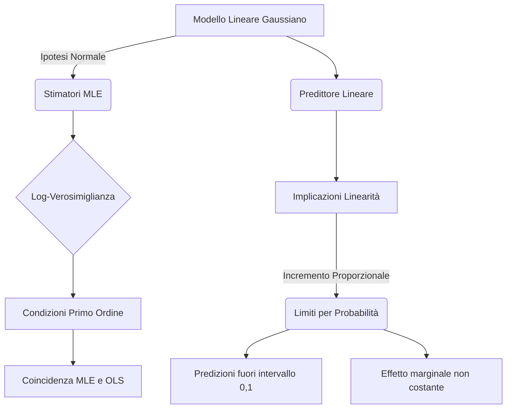

## 1.13 Stimatori MLE e Limiti Modello Lineare Gaussiano

**Spiegazione:** Il presente paragrafo analizza la stima dei parametri del modello lineare sotto l'ipotesi di normalità degli errori, introducendo il metodo della Massima Verosimiglianza (MLE) e la sua formulazione logaritmica.
Viene dimostrata la coincidenza teorica tra gli stimatori MLE e gli stimatori dei Minimi Quadrati Ordinari (OLS) nel contesto gaussiano.
Successivamente, si esamina la struttura del predittore lineare, evidenziando le implicazioni della linearità sui parametri e i conseguenti limiti strutturali del modello qualora si tenti di applicarlo per stimare variabili dipendenti limitate, come le probabilità.

______________________________________________________________________

#### Stimatori di Massima Verosimiglianza (MLE)

**Definizione:** Dato il modello parametrico $\mathcal{M} = \{\mathcal{X}, P\}$, e sia $L(\theta; \mathbf{x})$ la funzione di verosimiglianza del campione osservato $\mathbf{x}$, il valore $\hat{\theta} = \hat{\theta}(\mathbf{x})$ tale per cui $L[\hat{\theta}(\mathbf{x}); \mathbf{x}] = \sup_{\theta \in \Theta} L[\theta; \mathbf{x}]$ è detto stima di massima verosimiglianza.
Valutato nel campione casuale $\mathbf{X}$, esso fornisce lo stimatore di massima verosimiglianza $\hat{\theta} = \hat{\theta}(\mathbf{X})$.
Nel modello lineare con errori normali, la distribuzione assunta è $\mathbf{Y} \sim N_n(\mathbf{X}\boldsymbol{\beta}, \sigma^2 \mathbf{I})$.

**Spiegazione:** Il metodo si basa sul principio che funzioni di densità o probabilità diverse generino campioni diversi. È pertanto più plausibile che il campione osservato derivi da una distribuzione con determinati valori dei parametri piuttosto che da altre.
Massimizzare la funzione di verosimiglianza significa individuare il valore dei parametri che rende massima la probabilità di aver osservato lo specifico campione a disposizione.
Gli stimatori MLE, pur non essendo necessariamente non-distorti, godono delle proprietà asintotiche di consistenza, normalità ed efficienza piena.

#### Log-Verosimiglianza

**Definizione:** La Log-Verosimiglianza è il logaritmo naturale della funzione di verosimiglianza: $\ell(\theta; \mathbf{x}) = \ln L(\theta; \mathbf{x}) = \sum_{i=1}^{n} \ln f(x_i; \theta)$.
Per il modello lineare gaussiano, assume la forma specifica: $\ell(\boldsymbol{\beta}, \sigma; \mathbf{y}) = -\frac{n}{2} \ln(2\pi) - \frac{n}{2} \ln(\sigma^2) - \frac{1}{2\sigma^2} (\mathbf{y} - \mathbf{X} \boldsymbol{\beta})^t (\mathbf{y} - \mathbf{X} \boldsymbol{\beta})$.

**Spiegazione:** Poiché la trasformazione logaritmica è monotona strettamente crescente, il punto che massimizza la funzione di verosimiglianza $L$ massimizza contemporaneamente anche la funzione di Log-Verosimiglianza $\ell$.
Sotto l'ipotesi di indipendenza, questo passaggio trasforma la produttoria delle densità marginali in una sommatoria, semplificando notevolmente il calcolo delle derivate per l'ottimizzazione.

- **Dimostrazioni:** Si calcolano le derivate parziali (condizioni del primo ordine) della funzione $\ell(\boldsymbol{\beta}, \sigma; \mathbf{y})$ rispetto al vettore $\boldsymbol{\beta}$ e a $\sigma^2$, ponendole pari a zero :

1. Espansione del termine quadratico: $(\mathbf{y} - \mathbf{X} \boldsymbol{\beta})^t (\mathbf{y} - \mathbf{X} \boldsymbol{\beta}) = \mathbf{y}^t \mathbf{y} - 2 \boldsymbol{\beta}^t \mathbf{X}^t \mathbf{y} + \boldsymbol{\beta}^t \mathbf{X}^t \mathbf{X} \boldsymbol{\beta}$.
2. Derivata rispetto a $\boldsymbol{\beta}$: $\frac{\partial \ell(\boldsymbol{\beta}, \sigma; \mathbf{y})}{\partial \boldsymbol{\beta}} = -\frac{1}{2\sigma^2} (-2\mathbf{X}^t \mathbf{y} + 2\mathbf{X}^t \mathbf{X} \boldsymbol{\beta}) = \mathbf{0}$.
3. Risolvendo per $\boldsymbol{\beta}$, si ottiene: $\hat{\boldsymbol{\beta}} = (\mathbf{X}^t \mathbf{X})^{-1} \mathbf{X}^t \mathbf{y}$.
4. Derivata rispetto a $\sigma^2$: $\frac{\partial \ell(\boldsymbol{\beta}, \sigma; \mathbf{y})}{\partial \sigma^2} = -\frac{n}{2\sigma^2} + \frac{1}{2\sigma^4} (\mathbf{y} - \mathbf{X} \hat{\boldsymbol{\beta}})^t (\mathbf{y} - \mathbf{X} \hat{\boldsymbol{\beta}}) = 0$.
5. Risolvendo per $\sigma^2$, si ottiene: $\hat{\sigma}^2 = \frac{1}{n} (\mathbf{y} - \mathbf{X} \hat{\boldsymbol{\beta}})^t (\mathbf{y} - \mathbf{X} \hat{\boldsymbol{\beta}})$.

**Spiegazione della dimostrazione:** La derivazione mostra in modo inequivocabile che, imponendo le condizioni di massimo sulla funzione di Log-Verosimiglianza sotto ipotesi di normalità degli errori $\boldsymbol{\varepsilon}$, lo stimatore analitico ricavato per il vettore $\boldsymbol{\beta}$ è algebricamente identico allo stimatore ottenuto tramite il metodo dei Minimi Quadrati Ordinari (OLS).
Tale coincidenza è rigorosamente vincolata all'assunzione gaussiana; in assenza di normalità, la stima MLE non coincide in generale con quella OLS.

#### Osservazioni sul Modello Lineare Gaussiano

**Definizione:** Nel modello lineare $\mathbf{y} = \mathbf{X} \boldsymbol{\beta} + \boldsymbol{\varepsilon}$, il valore atteso (o media) della $i$-esima variabile dipendente condizionata ai regressori è posto uguale a una combinazione lineare dei valori dei regressori stessi: $\mu_i = E(Y_i) = \mathbf{x}_{i\cdot}^t \boldsymbol{\beta} = \beta_0 + \sum_{j=1}^k x_{ij} \beta_j$.
Tale quantità è denominata *predittore lineare*.

**Spiegazione:** La natura "lineare" del modello gaussiano si riferisce esclusivamente alla linearità nei parametri incogniti $\boldsymbol{\beta}$ e non impone restrizioni dirette sulle variabili esplicative $\mathbf{X}$.
Ciò consente di incorporare all'interno della struttura lineare anche trasformazioni matematiche complesse dei regressori (es. polinomi, logaritmi) mantenendo intatta l'architettura inferenziale di base.

#### Implicazioni della Linearità

**Definizione:** In un modello con specificazione lineare, un incremento in un regressore produce una variazione attesa nel predittore lineare che è costante e proporzionale al coefficiente associato.

**Spiegazione:** Considerando il valore medio $E(Y_i)$, qualora il $j$-esimo regressore subisca un incremento o variazione di entità $\Delta_j$, assumendo costanti gli altri regressori (ceteris paribus), la media $\mu_i$ della variabile dipendente subirà un incremento proporzionale matematicamente esprimibile come $\Delta \mu_i = \beta_j \Delta_j$.
Questo postula che l'effetto marginale sia strettamente costante lungo tutto il dominio della variabile.

#### Limiti per le Probabilità

**Definizione:** L'approccio lineare gaussiano, espresso dalla forma $\pi = \alpha + \beta X$, risulta strutturalmente inadeguato qualora la variabile dipendente rappresenti una probabilità ($\pi$), ovvero debba assumere valori strettamente definiti nell'intervallo continuo $ $.

**Spiegazione:** L'inadeguatezza del modello lineare per le probabilità si fonda su due ragioni matematiche e logiche principali:

1. **Mancanza di vincoli:** Il modello lineare (essendo definito in $\mathbb{R}$) può generare e restituire stime e predizioni per la probabilità $\pi$ esterne al dominio matematico ammissibile, ovvero producendo valori $< 0$ oppure $> 1$.

2. **Violazione della proporzionalità:** Assumere l'effetto marginale costante (come imposto dalla linearità) è irrealistico.
   Nelle probabilità ci si attende variazioni decrescenti all'avvicinarsi agli estremi 0 e 1, indicando un fisiologico effetto di saturazione (andamento non lineare ma sigmoidale).
