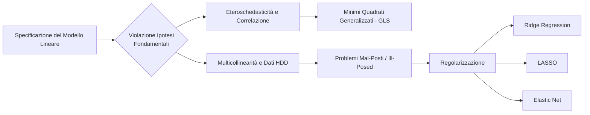

## Introduzione: 2. Regolarizzazione e Violazione Ipotesi

**Panoramica concettuale del capitolo**
Il capitolo in esame analizza il comportamento del modello lineare classico, formalizzato come $Y = X\beta + \varepsilon$, qualora vengano meno le ipotesi fondamentali poste alla base della sua specificazione, quali l'omoschedasticità, l'incorrelazione degli errori e il rango pieno della matrice dei dati $X$. Un'attenzione particolare è rivolta al fenomeno della multicollinearità, che si manifesta in presenza di dipendenze lineari tra i regressori, rendendo il determinante della matrice $X^tX$ prossimo o pari a zero. Tali dinamiche si esasperano nei Dati ad Alta Dimensionalità (HDD - High Dimensional Data), dove il numero di regressori supera la dimensione campionaria ($n < p$), impedendo l'inversione della matrice $X^tX$ e rendendo impossibile il calcolo delle stime ai minimi quadrati (OLS). Per far fronte a questi problemi, definiti in letteratura come "problemi mal-posti" (ill-posed problems), si introducono le tecniche di regolarizzazione di Tikhonov, le quali impongono una restrizione allo spazio delle soluzioni tramite l'aggiunta di una penalità alla funzione obiettivo, bilanciando l'adattamento ai dati con la complessità strutturale del modello.

**Contesto accademico**
I contenuti afferiscono al corso universitario di "Modelli Statistici e Statistical Learning", erogato nel Corso di Laurea Magistrale in Ingegneria Informatica (curriculum Artificial Intelligence & Machine Learning) presso il DIIMES dell'Università della Calabria, a cura del Prof. Filippo Domma. La trattazione si inserisce nel passaggio epistemologico tra l'Inferenza Statistica classica, volta a spiegare le relazioni strutturali tra variabili, e lo Statistical Learning, maggiormente orientato all'accuratezza predittiva e alla gestione di dataset ad alta dimensionalità tipici delle applicazioni moderne, quali gli studi sull'espressione genetica.

**Macro argomenti affrontati**

- **Violazione delle Ipotesi Strutturali:** Analisi delle ripercussioni legate al decadimento delle assunzioni di Gauss-Markov, con specifico riferimento alla perdita di omoschedasticità ($V(\varepsilon_i | X) = \sigma^2$) e all'assenza di correlazione seriale negli errori.
- **Multicollinearità:** Definizione della dipendenza lineare (esatta o quasi esatta) tra regressori, instabilità della varianza degli stimatori OLS, analisi della matrice di correlazione e impiego del Variance Inflation Factor (VIF) o del Condition Number per l'identificazione di tale anomalia.
- **Problemi Mal-Posti e High Dimensional Data (HDD):** Trattazione teorica del collasso degli stimatori classici quando il rango della matrice $X$ è inferiore a $p$ ($n < p$), condizione che rende la varianza degli stimatori degenere o la matrice di base non invertibile.
- **La Regolarizzazione:** Costruzione teorica della funzione obiettivo penalizzata ($PLS(\beta) = S(\beta) + \lambda \times pen(\beta)$), volta alla contrazione (shrinkage) dei coefficienti di regressione verso lo zero per stabilizzare il sistema.
- **Metodi di Shrinkage specifici:**
- *Ridge Regression:* Introduzione di una penalità L2 ($\lambda \sum \beta_j^2$) per forzare l'invertibilità della matrice $X^tX$ tramite l'operatore $(X^tX + \lambda I)$, diminuendo drasticamente la varianza a fronte di un lieve incremento della distorsione.
- *LASSO (Least Absolute Shrinkage and Selection Operator):* Applicazione di una penalità L1 ($\lambda \sum |\beta_j|$) che, oltre a stabilizzare il sistema, azzera specifici coefficienti agendo come operatore di selezione automatica delle variabili, garantendo la sparsità del modello.
- *Elastic Net:* Approccio ibrido che combina penalità L1 e L2, introdotto per gestire gruppi di variabili fortemente correlate (effetto grouping) laddove il LASSO si limiterebbe a selezionarne una in modo parzialmente arbitrario.
- **Minimi Quadrati Generalizzati (GLS):** Estensione formale per la stima ottimale dei parametri in scenari accertati di eteroschedasticità o correlazione seriale (es. schema Autoregressivo AR(1)), integrando nel calcolo matriciale la corretta matrice di varianze e covarianze $\Sigma = \sigma^2 \Omega$.
