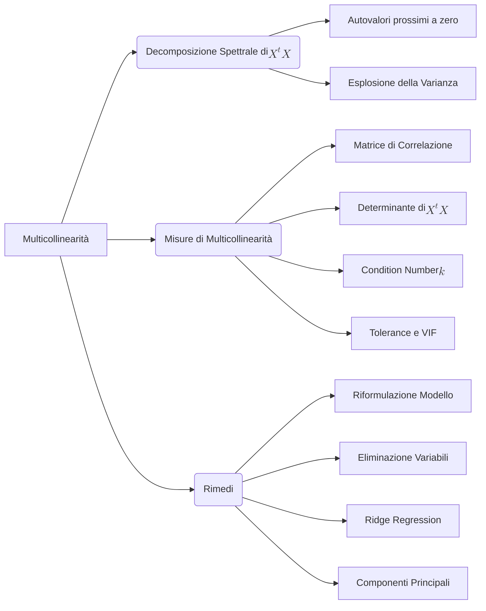

## 2.1 Multicollinearità, Misure e Decomposizione Spettrale

**Spiegazione:**
Il presente paragrafo analizza la violazione dell'ipotesi di indipendenza lineare tra i regressori in un modello di regressione multipla, nota come multicollinearità. Viene esaminato l'impatto geometrico e algebrico di tale fenomeno sulla matrice del sistema normale $X^t X$ attraverso la sua decomposizione spettrale, per poi definire le metriche diagnostiche atte a quantificare la gravità del problema e, infine, illustrare le tecniche risolutive adottabili per mitigare l'instabilità delle stime.

______________________________________________________________________

#### Multicollinearità

**Definizione:**
La multicollinearità si verifica quando due o più variabili esplicative (regressori) in un modello presentano dipendenze lineari, esatte o quasi esatte, tra loro.

**Spiegazione:**
Il fenomeno si articola in due casistiche principali:

1. **Collinearità perfetta (o esatta):** Esiste una relazione lineare esatta tra i regressori. Geometricamente, il rango della matrice $X$ è strettamente inferiore al numero delle sue colonne ($p+1$) e il determinante della matrice quadrata $X^t X$ è nullo. Poiché $X^t X$ non è invertibile, è matematicamente impossibile calcolare le stime ai minimi quadrati ordinari (OLS) tramite l'equazione $\hat{\beta} = (X^t X)^{-1} X^t y$.
2. **Multicollinearità quasi esatta (o alta):** I regressori sono fortemente correlati, ma la dipendenza non è perfetta. La matrice $X^t X$ mantiene rango pieno ed è teoricamente invertibile, in quanto definita positiva con autovalori strettamente positivi, ma il suo determinante risulta prossimo allo zero.

**Effetti:**
In presenza di multicollinearità quasi esatta, lo stimatore ai minimi quadrati ordinari ($\hat{\beta}$) mantiene la proprietà di essere il più efficiente tra gli stimatori lineari e non distorti (BLUE). Tuttavia, il modello subisce gravi conseguenze pratiche:

- Si registra un drastico aumento della variabilità (varianza) delle stime dei coefficienti, il che compromette l'affidabilità dei test d'ipotesi.
- Le statistiche test (es. t-Student) assumono valori ridotti, portando frequentemente all'accettazione dell'ipotesi nulla ($H_0: \beta_j = 0$) per regressori che individualmente sarebbero significativi. Spesso si osservano regressori non significativi a fronte di un coefficiente di determinazione ($R^2$) globale del modello molto elevato.
- Si verifica instabilità numerica: minime variazioni nei dati osservati generano forti oscillazioni nei coefficienti stimati, arrivando a produrre inversioni di segno rispetto alla logica del fenomeno studiato. Diventa inoltre arduo isolare l'effetto marginale netto di ciascun regressore.

**Spiegazione della dimostrazione:**

______________________________________________________________________

#### Decomposizione spettrale di&nbsp;$X^t X$

**Definizione:**
La decomposizione spettrale è una scomposizione algebrica della matrice simmetrica definita positiva $X^t X$, utile per quantificare l'esplosione della varianza degli stimatori OLS sotto l'effetto della multicollinearità. Si esprime come $X^t X = Q \Lambda Q^t$, dove $Q$ è la matrice degli autovettori ortogonali di norma unitaria e $\Lambda$ è la matrice diagonale degli autovalori.

**Spiegazione:**
Sfruttando le proprietà dell'algebra lineare, l'inversa della matrice del sistema normale è calcolabile come $(X^t X)^{-1} = Q \Lambda^{-1} Q^t$. In questa formulazione, $\Lambda^{-1}$ è una matrice diagonale che contiene i reciproci degli autovalori ($\frac{1}{\lambda_0}, \dots, \frac{1}{\lambda_p}$). Se i regressori sono quasi collineari, il determinante di $X^t X$ (che è pari al prodotto dei suoi autovalori $\prod_{h=0}^p \lambda_h$) è trascurabile, implicando che almeno un autovalore $\lambda_h$ è prossimo a zero.

**Dimostrazioni:**
**Derivazione della varianza dei coefficienti tramite Scomposizione Spettrale**
L'elemento $j$-esimo della diagonale principale di $(X^t X)^{-1}$, indicato con $s_{jj}$, si ottiene algebricamente come:
$$s_{jj} = \sum_{h=0}^{p} \frac{q_{jh}^2}{\lambda_h}$$
dove $q_{jh}$ è l'elemento in riga $j$ e colonna $h$ della matrice $Q$.
Assumendo validità delle ipotesi di omoschedasticità e incorrelazione degli errori, la varianza del singolo coefficiente stimato è:
$V(\hat{\beta}_j) = \sigma^2 s_{jj} = \sigma^2 \sum_{h=0}^{p} \frac{q_{jh}^2}{\lambda_h}$ per $j=0, 1, \dots, p$.

**Spiegazione della dimostrazione:**
La scomposizione mostra matematicamente perché la multicollinearità degrada la precisione. Dato che la varianza del parametro $V(\hat{\beta}_j)$ dipende dalla somma dei termini $\frac{q_{jh}^2}{\lambda_h}$, la presenza di un solo autovalore $\lambda_h \to 0$ fa tendere all'infinito il reciproco $\frac{1}{\lambda_h}$. Di riflesso, questo termine domina la sommatoria causandone l'esplosione, producendo una varianza elevata, stime imprecise e instabilità numerica strutturale.

______________________________________________________________________

#### Misure di multicollinearità

**Definizione:**
Insieme di strumenti diagnostici, metriche e indici numerici impiegati per identificare l'esistenza e la severità delle relazioni di dipendenza lineare tra i predittori in una matrice di dati.

**Spiegazione:**
La diagnostica si affida a quattro strumenti principali:

1. **Coefficiente di correlazione tra coppie di regressori:** L'analisi della matrice di correlazione individua collinearità bivariata. Valori superiori a $0.8 - 0.9$ (in modulo) confermano il problema. **Limite:** Metodo inefficace se la dipendenza coinvolge congiuntamente più di due variabili contemporaneamente.
2. **Determinante della matrice $X^t X$:** Un determinante molto vicino a zero funge da spia. **Limite:** Segnala la presenza generale della problematica, ma non determina il tipo né il numero esatto dei legami e in alcuni software/contesti empirici può non apparire immediatamente critico.
3. **Numero di condizionamento (Condition Number, $k$):** Basato sull'analisi degli autovalori di $X^t X$. È definito come il rapporto sotto radice tra l'autovalore massimo e minimo:
   $$k = \sqrt{\frac{\max\{\lambda_h\}}{\min\{\lambda_h\}}}$$
   Questo valore è sempre $k \ge 1$. Indici $k \ge 30$ denotano un severo rischio di instabilità numerica e multicollinearità.
4. **Indice di determinazione $R_{j0}^2$, Tolleranza e VIF:** Si adatta un modello di regressione ausiliario per spiegare il regressore $X_j$ usando i rimanenti $k-1$ predittori.

- Se $R_{j0}^2 > 0.9$, la collinearità è alta.
- **Tolleranza (Tolerance):** $\text{Tolerance} = 1 - R_{j0}^2$.
- **Fattore di Accrescimento della Varianza (VIF):** $VIF_j = \frac{1}{1 - R_{j0}^2}$. Un $VIF_j > 10$ (equivalente a Tolleranza $< 0.1$) suggerisce intervento immediato sul regressore coinvolto.

**Spiegazione della dimostrazione:**

______________________________________________________________________

#### Rimedi per la multicollinearità

**Definizione:**
Tecniche metodologiche, operative e di regolarizzazione che mitigano o eliminano gli effetti negativi di una matrice mal condizionata.

**Spiegazione:**
Quando la diagnosi impone un intervento, esistono approcci consolidati per ripristinare stabilità:

1. **Specificare un modello diverso:** Trasformare le variabili dipendenti tra loro sintetizzandole in un'unica variabile derivata (ad es., un rapporto $X = (X_1 + X_2) / X_3$). Questo mantiene l'informazione originale pur distruggendo la correlazione lineare spuria.
2. **Eliminare una o più variabili:** Si rimuove fisicamente dal modello il predittore causa della collinearità. Tale approccio è perentorio nella collinearità esatta. Comporta però un rischio intrinseco: l'analista potrebbe incorrere nella perdita volontaria di potere esplicativo rilevante per la variabile dipendente $Y$.
3. **Regolarizzazione tramite Ridge Regression:** Modifica diretta al calcolo del parametro di regressione, introducendo una penalità. Sostituendo $X^t X$ con la sua versione regolarizzata $X^t X + \lambda I$ (con $\lambda \in [0,\infty)$ parametro di penalità), la matrice diviene forzatamente invertibile e l'esplosione della varianza cessa. Il costo da pagare è teoretico: la Ridge regression rinuncia alla proprietà di non-distorsione (produce un parametro stimato parzialmente distorto) in cambio di una stabilità numerica (varianza nettamente più piccola) altrimenti irraggiungibile nel modello OLS.
4. **Regressione su Componenti Principali (PCR):** Procede estraendo le Componenti Principali dello spazio dei regressori per poi impiegarle come nuove variabili esplicative all'interno del modello, svincolate dal problema poiché reciprocamente ortogonali.
