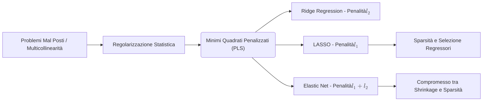

## 2.2 La Regolarizzazione Statistica e Tecniche



**Spiegazione**
La regolarizzazione statistica comprende un insieme di tecniche applicate ai modelli lineari con l'obiettivo di risolvere i problemi mal condizionati, noti anche come problemi mal-posti. Tali problematiche emergono tipicamente in situazioni di multicollinearità estrema o di elevata dimensionalità (quando il numero di predittori supera le osservazioni campionarie, $p > n$), dove la matrice del disegno $X^tX$ risulta singolare o quasi singolare. La metodologia supera il limite degli stimatori ai Minimi Quadrati Ordinari (OLS) integrandovi un'informazione aggiuntiva a priori sotto forma di penalità per la complessità del modello. La funzione obiettivo minimizzata diventa una somma dei quadrati dei residui unita ad un termine di regolarizzazione, ottenendo lo stimatore ai minimi quadrati penalizzati (PLS).

#### La Regolarizzazione

- **Definizione:** L'introduzione di ulteriori informazioni allo scopo di risolvere un problema mal condizionato (o problema mal-posto), inserendo nella funzione obiettivo una penalità per tenere conto della complessità del sistema e ridurre la varianza delle stime.
- **Spiegazione:** Affonda le radici nella regolarizzazione di Tikhonov, e implementa la funzione obiettivo dei minimi quadrati penalizzati: $PLS(\beta) = (y - X\beta)^t(y - X\beta) + \lambda \times pen(\beta)$, in cui $pen(\beta)$ è il termine di penalizzazione e $\lambda$ è un parametro di tuning (o smoothing) che governa il bilanciamento tra fedeltà ai dati ed entità della restrizione dell'insieme delle possibili soluzioni.

#### Regolarizzazione Statistica: modelli lineari

- **Definizione:** Approccio impiegato nel modello lineare classico $Y = X\beta + \epsilon$ quando la matrice $X^tX$ non soddisfa l'ipotesi di rango pieno, impedendo l'inversione necessaria per il calcolo della stima esplicita $\hat{\beta} = (X^tX)^{-1}X^tY$.
- **Spiegazione:** Nelle circostanze in cui la matrice $X^tX$ ha determinante prossimo o uguale a zero, lo stimatore ai minimi quadrati può non esistere o possedere una varianza estremamente elevata, denotando un'eccessiva sensibilità al training set. La regolarizzazione ovvia al problema forzando un restringimento (shrinkage) sui parametri attraverso l'ottimizzazione vincolata della funzione convessa dei minimi quadrati.

#### Tecniche di Regolarizzazione

- **Definizione:** Metodologie applicative, accomunate dall'utilizzo della penalizzazione, mirate a prevenire l'overfitting. Si distinguono tre tecniche principali in base alla norma impiegata per il termine di complessità: Ridge Regression, LASSO e Elastic Net.
- **Spiegazione:** La Ridge Regression applica una penalità in norma $l_2$ ($\lambda \sum_{j=1}^{k} \beta_j^2$), operando un restringimento ma mantenendo tutti i predittori nel modello. Il LASSO sfrutta la norma $l_1$ ($\lambda \sum_{j=1}^{k} |\beta_j|$) per indurre, oltre al restringimento, un azzeramento esatto di alcuni coefficienti. L'Elastic Net le combina introducendo contemporaneamente le penalità $l_1$ ed $l_2$ ponderate. A causa della diversa entità dei regressori originari, l'applicazione di queste tecniche impone tipicamente una fase di pre-processing dei dati per ottenere variabili esplicative standardizzate e adimensionali, al fine di focalizzarsi interamente sulla prestazione predittiva.

#### LASSO e Elastic Net panoramica

- **Definizione:** Il LASSO (Least Absolute Shrinkage and Selection Operator) è una regolarizzazione in norma $l_1$ che produce sparsità. L'Elastic Net è un'estensione ibrida che pondera le penalità $l_1$ ed $l_2^2$ tramite due coefficienti lambda o un parametro di bilanciamento $\alpha$.
- **Spiegazione:** Il LASSO risolve i problemi OLS limitandone la variabilità ed effettuando intrinsecamente una "subset selection". Tale penalità $l_1$ non è differenziabile nel punto zero e non ammette, a differenza della Ridge, una formula chiusa generale: produce vettori di stima con numerosi zeri, definendo il cosiddetto fenomeno della "sparsità" che migliora l'interpretabilità espellendo regressori ininfluenti. L'Elastic Net aggira talune fragilità operative del LASSO inserendovi il meccanismo di sparsità unito alla stabilizzazione Ridge. Essa è governata dal parametro $\alpha = \frac{\lambda_1}{\lambda_1 + \lambda_2}$: con $\alpha = 1$ si degenera nel LASSO, con $\alpha = 0$ si degenera in Ridge Regression.
- **Dimostrazioni:** Teorema di Osborne et al. (2000): "Se $p > n$ e $\hat{\beta}(\lambda_1)$ è il vettore che minimizza la funzione di perdita della regressione LASSO, allora $\hat{\beta}(\lambda_1)$ ha al più $n$ parametri diversi da zero". Inoltre, nel caso semplificato di ortonormalità della matrice disegno ($X^tX = I$), il problema per ogni $\hat{\beta}_j$ segue la regola del "soft-thresholding" in cui le componenti inferiori a un dato valore assoluto sprofondano a zero.
- **Diagrammi:**
  ```mermaid
graph LR
 A[Matrice X Ortonormale] --> B{Modulo stima OLS}
 B -- "< Soglia Minima $$ \lambda/2 $$" --> C[Azzera il coefficiente LASSO]
 B -- "> Soglia Minima $$ \lambda/2 $$" --> D[Restringimento proporzionale verso zero]
```
- **Spiegazione della dimostrazione:** Il Teorema di Osborne delinea matematicamente la radicale riduzione di dimensione eseguita dal LASSO, rivelando però un suo limite oggettivo in configurazioni $p > n$: il numero di coefficienti salvati non può superare la dimensione del campione. La dimostrazione concettuale del soft-thresholding per una matrice ortonormale indica come la regione dei vincoli a forma di poliedro (con "spigoli") tocchi più frequentemente i minimi sugli assi cardinali (determinando l'azzeramento), rispetto alle regioni circolari Ridge prive di spigoli che causano solo un rimpicciolimento proporzionale continuo senza generare zeri.
