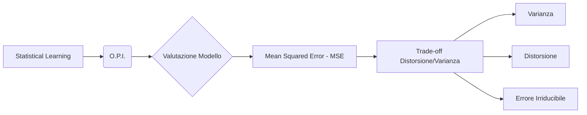
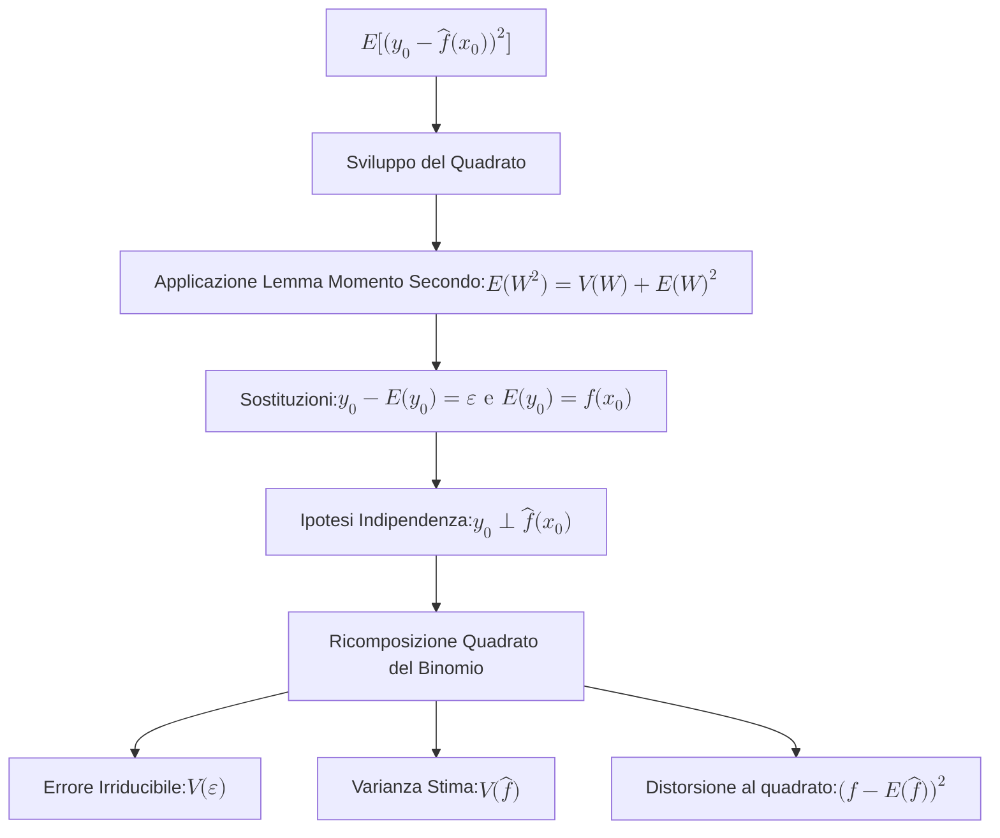

## 2.4 O.P.I. e Trade-off Distorsione/Varianza

**Spiegazione:**
Il presente capitolo si focalizza sui principi di valutazione e selezione dei modelli all'interno dello *Statistical Learning*. L'accuratezza di un modello predittivo richiede la definizione a priori di criteri di misurazione oggettivi (O.P.I.), primariamente rappresentati dall'Errore Quadratico Medio (MSE). Lo studio analitico dell'errore di test conduce all'identificazione di un conflitto strutturale, il trade-off tra distorsione (bias) e varianza, che domina il comportamento di qualsiasi algoritmo di apprendimento al variare della sua flessibilità.

#### O.P.I.

**Definizione:**
Nel contesto dello *Statistical Learning*, non esiste una tecnica di apprendimento universalmente superiore per qualsivoglia set di dati; l'efficacia del modello è strettamente dipendente dal dataset analizzato. L'acronimo/concetto fa riferimento all'imposizione di definire il criterio (Obiettivo/Previsione/Inferenza) per valutare un modello prima di procedere alla sua scelta. Le tecniche affrontate in tale ambito sono precipuamente predittive; ergo, un metodo è definito "migliore" se in grado di prevedere con maggiore precisione.

**Spiegazione:**
Per misurare formalmente la bontà di un modello predittivo, si utilizzano indicatori di accuratezza che quantificano lo scostamento tra le stime del modello e i valori reali che si osserveranno. La metrica di elezione è l'Errore Quadratico Medio (MSE), formulato come:
$$MSE = \frac{1}{n} \sum_{i=1}^{n} [y_i - \hat{f}(x_i)]^2$$
dove $\hat{f}(x_i)$ rappresenta la previsione. Un MSE calcolato su un *test set* (dati non osservati durante l'addestramento) che risulti di entità ridotta attesta una robusta e generalizzabile capacità di previsione del modello.

#### Trade-off tra Distorsione e Varianza

**Definizione:**
Il Trade-off tra Distorsione e Varianza descrive la natura a "U" della curva del MSE calcolato sul *test set*, risultante da due effetti concorrenti nei metodi di apprendimento. Il MSE atteso si scompone analiticamente in tre addendi: la **varianza** della stima, il quadrato della **distorsione** (bias) della stima e la **varianza dell'errore irriducibile**.

- **Varianza** $Var[\hat{f}(x_0)]$: Definisce l'entità della fluttuazione della funzione stimata $\hat{f}$ qualora venisse calibrata su *training set* differenti. Metodi caratterizzati da elevata flessibilità possiedono intrinsecamente un'alta varianza.
- **Distorsione** $[f(x_0) - E(\hat{f}(x_0))]^2$: Costituisce l'errore sistematico insito nell'approssimazione di un fenomeno reale, tendenzialmente complesso, mediante un modello semplificato. Metodi di elevata flessibilità comportano una minore distorsione.

**Spiegazione:**
Per minimizzare l'errore di test atteso, è imperativo selezionare una tecnica di apprendimento in grado di mantenere contestualmente contenuti sia la varianza che la distorsione. Poiché l'errore irriducibile $V(\varepsilon)$ è una costante di fondo eliminabile, il tentativo di abbattere la distorsione incrementando la flessibilità del modello provocherà, a un certo punto, una repentina crescita della varianza, generando il tipico comportamento a "U" della curva del MSE totale.

**Dimostrazioni:**
Si dimostra che l'errore quadratico medio di test atteso, per una coordinata $x_0$, obbedisce alla seguente scomposizione non rigorosa :

Partendo dallo sviluppo del quadrato e dalla linearità del valore atteso:
$$E[y_0 - \hat{f}(x_0)]^2 = E\{y_0^2 - 2y_0\hat{f}(x_0) + \hat{f}(x_0)^2\} = E\{y_0^2\} - 2 E[y_0\hat{f}(x_0)] + E[\hat{f}(x_0)^2]$$

Facendo ricorso al Lemma sul momento secondo ($E(W^2) = E[(W - E(W))^2] + [E(W)]^2 = V(W) + [E(W)]^2$), i termini quadratici divengono:
$$= E\{[y_0 - E(y_0)]^2\} + [E(y_0)]^2 - 2 E[y_0\hat{f}(x_0)] + V[\hat{f}(x_0)] + [E(\hat{f}(x_0))]^2$$

Sapendo che $E(y_0) = E(f(x_0) + \varepsilon) = f(x_0)$ e che $y_0 - E(y_0) = \varepsilon$:
$$= E\{\varepsilon^2\} + [f(x_0)]^2 - 2 E[y_0\hat{f}(x_0)] + V[\hat{f}(x_0)] + [E(\hat{f}(x_0))]^2$$

Introducendo l'assunto di indipendenza tra l'osservazione e la stima, $y_0 \perp \hat{f}(x_0)$, si scompone il momento misto in $E[y_0\hat{f}(x_0)] = f(x_0) E[\hat{f}(x_0)]$:
$$= V(\varepsilon) + V[\hat{f}(x_0)] + \underbrace{[f(x_0)]^2 - 2f(x_0) E[\hat{f}(x_0)] + [E(\hat{f}(x_0))]^2}_{\text{Quadrato del binomio}}$$

Condensando il quadrato di binomio, giungiamo alla tesi:
$$E\left[ (y_0 - \hat{f}(x_0))^2 \right] = V(\varepsilon) + V[\hat{f}(x_0)] + [f(x_0) - E(\hat{f}(x_0))]^2$$

**Diagrammi:**

**Spiegazione della dimostrazione:**
L'architettura logica della dimostrazione mira a isolare le entità che generano l'errore di predizione. Il procedimento esordisce con la naturale espansione dell'errore quadratico atteso, cui segue l'applicazione cruciale di un Lemma statistico basilare: ogni momento non centrato di ordine due si scompone nella varianza sommata all'aspettativa al quadrato. In seguito, si inseriscono nel calcolo le assunzioni fondamentali della modellistica: l'errore accidentale $\varepsilon$ emerge dalla centratura dell'osservazione ($y_0 - E(y_0)$) identificando il termine d'errore incomprimibile $V(\varepsilon)$. L'ipotesi portante, affinché il risultato si chiuda, è l'assoluta indipendenza statistica tra il dato nuovo in fase di test ($y_0$) e la funzione fittata sul set di addestramento ($\hat{f}(x_0)$). Questa indipendenza spezza il valore atteso congiunto, producendo algebricamente lo sviluppo di un quadrato perfetto per l'errore sistematico. L'equazione di chiusura sancisce che ogni scarto atteso futuro sia la rigida somma di tre elementi: l'accidentabilità intrinseca del fenomeno, l'instabilità algoritmica (Varianza) e la fallacia approssimativa della specificazione (Distorsione).
