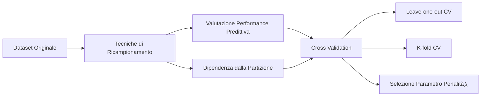

## 2.5 Cross Validation (LOOCV e K-fold)



**Spiegazione:**
La valutazione dell'errore quadratico medio (MSE) sui dati di addestramento (*training data*) non fornisce una stima affidabile dell'effettiva capacità predittiva di un modello su dati nuovi. Per stimare accuratamente le prestazioni in condizioni di generalizzazione e minimizzare l'errore di test atteso, è necessario bilanciare la varianza e la distorsione del metodo di apprendimento. La Cross Validation nasce specificamente per verificare se la validità del modello di apprendimento sia dipendente dalla singola e particolare partizione del dataset originale in *training set* e *test set*, o se l'eventuale presenza di valori anomali stia influenzando le stime. Per ottenere valutazioni stabili, si ricorre a tecniche di ricampionamento che impiegano ripetutamente il campione osservato.

#### CROSS VALIDATION

- **Definizione:**
  La Cross Validation è una tecnica di ricampionamento statistico utilizzata per valutare in modo affidabile la performance predittiva di un modello e verificare la robustezza della scelta del metodo di apprendimento rispetto a specifiche suddivisioni del dataset.

- **Spiegazione:**
  Il principio cardine della Cross Validation si fonda sull'utilizzo ripetuto del campione di dati a disposizione per generare stime multiple dell'errore di test. Questa procedura consente di superare i limiti di una singola suddivisione in *training set* (utilizzato per la stima) e *test set* (utilizzato per la valutazione), mitigando l'impatto della variabilità campionaria e di eventuali dati anomali (outliers). Le strategie implementate differiscono in base al criterio di partizionamento dei dati e annoverano metodologie tra cui la Leave-one-out cross validation (LOOCV), la K-fold cross validation e la Stratified cross validation.

#### Leave-one-out cross validation (LOOCV)

- **Definizione:**
  La Leave-one-out cross validation (LOOCV) è una strategia di ricampionamento in cui il dataset di $n$ osservazioni viene suddiviso $n$ volte: in ogni iterazione, il *test set* è composto da una singola osservazione, mentre le restanti $n-1$ osservazioni costituiscono il *training set*.

- **Spiegazione:**
  Il processo genera iterativamente $n$ modelli di apprendimento distinti. Ciascun modello viene valutato sulla singola osservazione esclusa, calcolando il corrispondente $MSE_i$ per $i = 1, \dots, n$. La stima dell'errore predittivo complessivo è data dalla media degli $n$ valori di MSE ottenuti:
  $$CV_{(n)} = \frac{1}{n} \sum_{i=1}^{n} MSE_i$$.
  Poiché la suddivisione esclude progressivamente ogni singola riga in modo deterministico, la LOOCV non prevede una partizione casuale e restituisce sempre lo stesso risultato in applicazioni ripetute sullo stesso campione. Il limite principale di questa tecnica risiede nell'onere computazionale in termini di tempo quando applicata a dataset di grandi dimensioni ($n$ elevato).

- **Diagrammi:**
  ```mermaid
graph TD
 Im[Escludi Obs i]
 subgraph Iterazione 1
 T1["Training: Obs $$ 2, 3, \dots, n $$"] --> M1(Modello Stimato 1)
 M1 -->|Test su Obs 1| MSE1(MSE 1)
 end
 subgraph Iterazione 2
 T2["Training: Obs $$ 1, 3, \dots, n $$"] --> M2(Modello Stimato 2)
 M2 -->|Test su Obs 2| MSE2(MSE 2)
 end
 subgraph Iterazione n
 Tn["Training: Obs $$ 1, 2, \dots, n-1 $$"] --> Mn(Modello Stimato n)
 Mn -->|Test su Obs n| MSEn(MSE n)
 end
 MSE1 --> CV
 MSE2 --> CV
 MSEn --> CV
 CV{"Media: $$ CV_{(n)} $$"}
```

#### K-fold cross validation

- **Definizione:**
  La K-fold cross validation è una tecnica che suddivide casualmente il dataset originario in $K$ gruppi (blocchi) di dimensioni approssimativamente uguali e non sovrapposti. A turno, ciascun gruppo viene impiegato come *test set*, mentre i rimanenti $K-1$ blocchi formano il *training set*.

- **Spiegazione:**
  La procedura iterativa si ripete $K$ volte. Ad ogni passo $k$, si stima il modello di apprendimento sui $K-1$ gruppi e si valuta la performance predittiva calcolando il $MSE_k$ sul gruppo di validazione. L'errore medio di predizione è calcolato come la media aritmetica degli errori dei $K$ modelli stimati:
  $$CV_{(K)} = \frac{1}{K} \sum_{k=1}^{K} MSE_k$$.
  La letteratura scientifica e gli studi empirici suggeriscono generalmente l'adozione di un valore $K$ compreso tra 5 e 10, fornendo un buon bilanciamento e risultando meno oneroso computazionalmente rispetto al metodo LOOCV.

- **Diagrammi:**
  ```mermaid
graph TD
 A["Dataset Casualmente Suddiviso in $$ K $$ Gruppi"] --> B1
 A --> B2
 A --> BK
 subgraph Iterazione 1
 B1["Test: Gruppo 1 / Train: Gruppi $$ 2 \dots K $$"] --> C1(Stima MSE 1)
 end
 subgraph Iterazione 2
 B2["Test: Gruppo 2 / Train: Gruppi $$ 1, 3 \dots K $$"] --> C2(Stima MSE 2)
 end
 subgraph Iterazione K
 BK["Test: Gruppo K / Train: Gruppi $$ 1 \dots K-1 $$"] --> CK(Stima MSE K)
 end
 C1 --> CV
 C2 --> CV
 CK --> CV
 CV{"Media: $$ CV_{(K)} $$"}
```

#### Selezione del parametro di penalità ($\lambda$)

- **Definizione:**
  La selezione del parametro di smoothing $\lambda$ nei minimi quadrati penalizzati (come nella Ridge Regression) è la procedura finalizzata a individuare il valore scalare che garantisce il bilanciamento ottimale tra l'adattamento ai dati (complessità) e la limitazione dell'overfitting, massimizzando l'accuratezza predittiva del modello.

- **Spiegazione:**
  Poiché $\lambda$ regola l'impatto della penalità, influenzando il restringimento dei coefficienti $\beta$ verso lo zero, la sua determinazione ottima si ottiene empiricamente impiegando tecniche di Cross-Validation, valutando un insieme discreto di valori candidati reali positivi contenuti in uno spazio $N_\lambda$.
  L'algoritmo basato sulla **LOOCV** prevede:

1. Definizione di una griglia discretizzata di valori $N_\lambda$.
2. Per ogni osservazione $i = 1, \dots, n$, isolamento dell'unità come test set e delle $n-1$ rimanenti come training set.
3. Stima del modello di Ridge Regression per ogni $\lambda \in N_\lambda$ sul training set privato della i-esima riga:
   $$\hat{\beta}_{-i}(\lambda) = (X_{-i}^tX_{-i} + \lambda I)^{-1} X_{-i}^tY_{-i}$$.
4. Calcolo del $MSE$ sul test set per il rispettivo parametro $\lambda$.
5. Calcolo dell'errore predittivo di cross-validation come media sui campioni per ogni iterazione: $CV(\lambda_j) = \frac{1}{n} \sum_{i=1}^{n} MSE_{i,\lambda_j}$.
6. Selezione del valore $\lambda$ che restituisce il $CV(\lambda)$ minimo.

Se estesa alla **K-fold cross-validation**, la matrice dei regressori e delle ordinate ($X_{-G_j}$, $Y_{-G_j}$) viene privata del blocco test $G_j$, stimando i coefficienti su ciascun blocco e ottimizzando $\lambda$ in base al $MSE$ medio per i $K$ partizionamenti.

- **Diagrammi:**
  ```mermaid
graph TD
 A["Insieme Valori Discreti di $$ \lambda $$"] --> B["Per ogni $$ \lambda_j $$"]
 B --> C[Applica Partizionamento LOOCV o K-Fold]
 C --> D[Stima Modello Penalizzato su Training Set]
 D --> E[Calcola MSE su Test Set]
 E --> F[Aggrega MSE su tutte le Iterazioni]
 F --> G["Calcola CV_Error medio per $$ \lambda_j $$"]
 G --> H{Cerca Minimo CV_Error}
 H --> I["Identifica $$ \lambda $$ Ottimo"]
```
