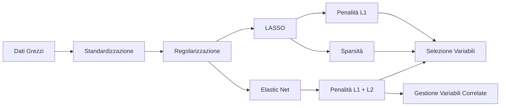
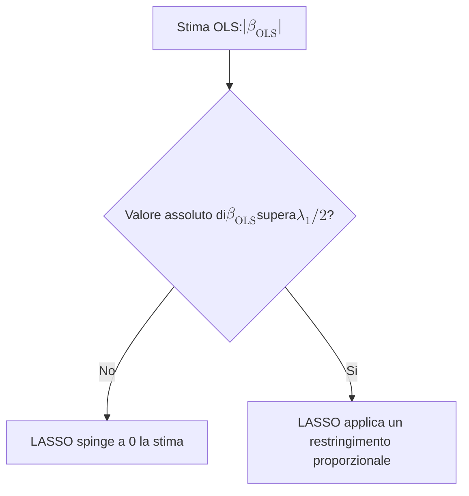
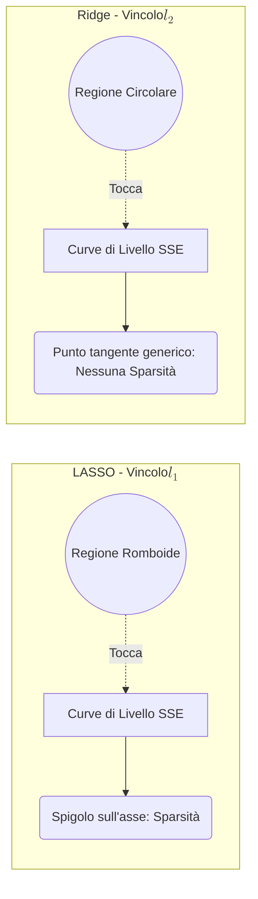

## 2.6 Standardizzazione, LASSO e Elastic Net

**Spiegazione:**
Il presente paragrafo affronta le metodologie avanzate di regolarizzazione impiegate nell'ambito dello Statistical Learning per far fronte a problemi mal-posti, tipici dei dati ad alta dimensionalità ($p > n$) o in presenza di multicollinearità. Dopo una necessaria fase di pre-processing dei dati tramite standardizzazione, vengono introdotte le tecniche LASSO ed Elastic Net. Tali metodi si distinguono dalla Ridge Regression per l'impiego della norma $l_1$ (o una combinazione di $l_1$ e $l_2$), che non solo contrae i coefficienti di regressione, ma induce sparsità nel modello operando un'intrinseca selezione delle variabili esplicative.

#### Standardizzazione

**Definizione:**
La standardizzazione è un'operazione di pre-processing dei dati applicata ai regressori quantitativi continui, volta a trasformare le osservazioni in unità standardizzate e adimensionali.

**Spiegazione:**
L'applicazione di modelli di regolarizzazione richiede tipicamente dataset pre-elaborati, specialmente quando i regressori sono espressi in scale o unità di misura eterogenee. Formalmente, la trasformazione per ciascun regressore si ottiene tramite la seguente espressione:
$$z_{ij} = \frac{x_{ij} - M_1(x_j)}{\sqrt{\frac{1}{n} \sum_{i=1}^{n}(x_{ij} - M_1(x_j))^2}} \quad \text{per } j=1,...,k$$.
Nell'analisi dei dati ad alta dimensionalità, dove il significato causale dei regressori non è sempre noto o rilevante e l'obiettivo primario risiede nella performance predittiva, la standardizzazione risulta fortemente raccomandata. È necessario tuttavia prestare cautela nell'interpretazione dei coefficienti di regressione associati alle variabili trasformate.

#### LASSO (Least Absolute Shrinkage and Selection Operator)

**Definizione:**
Il LASSO, introdotto da Tibshirani (1996), è una tecnica di regolarizzazione che stima i coefficienti del modello lineare minimizzando la somma dei quadrati dei residui soggetta a un vincolo basato sulla norma $l_1$ dei parametri.

**Spiegazione:**
La tecnica nasce per superare le limitazioni dei Minimi Quadrati Ordinari (OLS), in particolare l'elevata variabilità delle stime e le difficoltà interpretative nei modelli con molti regressori. A differenza della Ridge Regression, il LASSO applica come penalità la norma $l_1$, ovvero la somma dei valori assoluti dei coefficienti: $pen(\beta) = \sum_{j=1}^k |\beta_j| = ||\beta||_1$.
La funzione obiettivo (funzione di perdita) diviene pertanto:
$$\mathcal{L}_{LASSO} (\beta; \lambda_1) = ||Y – X\beta||_2^2 + \lambda_1||\beta||_1$$.
Il parametro $\lambda_1$ governa l'impatto della penalità: per $\lambda_1 \to 0$ lo stimatore LASSO $\hat{\beta}(\lambda_1)$ converge allo stimatore OLS, mentre al crescere di $\lambda_1$ i coefficienti subiscono una contrazione verso lo zero, annullandosi esattamente per valori sufficientemente ampi. L'insieme delle stime al variare di $\lambda_1$ costituisce il *regularization path*.

**Dimostrazioni:**
Comportamento dello stimatore LASSO nel caso particolare in cui la matrice $X$ è ortonormale ($X^tX = I$).

**Diagrammi:**

**Spiegazione della dimostrazione:**
La penalità $l_1$ possiede un punto di non differenziabilità nell'origine, il che rende l'analisi delle proprietà dello stimatore matematicamente più complessa e impedisce, in generale, l'esistenza di una soluzione analitica in forma chiusa. Tuttavia, si può analizzare il caso notevole di una matrice $X$ ortonormale ($X^tX = I$). In questo scenario, la soluzione LASSO corrisponde all'operatore di *soft-thresholding* :
se il valore assoluto dello stimatore ai minimi quadrati, $|\hat{\beta}_j|$, risulta inferiore a una specifica **soglia minima** pari a $\frac{1}{2}\lambda_1$, la tecnica LASSO azzera il coefficiente in modo esatto. Al di fuori dell'intervallo $(-\frac{1}{2}\lambda_1, \frac{1}{2}\lambda_1)$, il LASSO opera invece un restringimento di entità costante.

#### Sparsità

**Definizione:**
La sparsità è la proprietà di un vettore di stime in cui una frazione rilevante dei parametri è esattamente pari a zero. Nel contesto del LASSO, deriva direttamente dall'adozione della norma $l_1$.

**Spiegazione:**
L'introduzione della norma $l_1$ altera profondamente l'interpretabilità del modello statistico. Un coefficiente azzerato indica che il corrispondente regressore non esercita alcun effetto sulla variabile dipendente e deve essere escluso dal modello. Il LASSO agisce quindi come un metodo di *selezione automatica delle variabili*, riducendo la complessità strutturale del modello.

**Dimostrazioni:**
La dimostrazione della genesi della sparsità nel LASSO è di natura geometrica. Inoltre, il numero di regressori non nulli è limitato dal Teorema di Osborne et al. (2000).

**Diagrammi:**

**Spiegazione della dimostrazione:**
Dal punto di vista geometrico dell'ottimizzazione vincolata, la soluzione dei minimi quadrati penalizzati si trova nel primo punto di intersezione tra le curve di livello (contorni) della somma dei residui al quadrato (SSE) e la regione spaziale definita dal vincolo imposto.
Nella Ridge regression, il vincolo della norma $l_2$ ($\beta_1^2 + \beta_2^2 \leq t$) descrive una regione circolare priva di spigoli, motivo per cui i contatti in punti con coordinate nulle sono rari.
Nel LASSO, il vincolo della norma $l_1$ ($|\beta_1| + |\beta_2| \leq t$) definisce geometricamente un "diamante" (un rombo) provvisto di spigoli situati esattamente in corrispondenza degli assi cartesiani. Sussiste una probabilità molto elevata che le curve ellittiche dell'SSE entrino per la prima volta in contatto con la regione del vincolo proprio in corrispondenza di tali spigoli, obbligando la stima del parametro a valere esattamente zero.
A corollario teorico delle capacità in alta dimensionalità ($p > n$), il **Teorema di Osborne et al. (2000)** stabilisce rigorosamente che il vettore minimizzante $\hat{\beta}(\lambda_1)$ del LASSO ammetterà al massimo $n$ parametri diversi da zero, limitando superiormente la dimensione del modello finale sulla base del disegno campionario.

#### Elastic Net

**Definizione:**
L'Elastic Net è una metodologia di regolarizzazione che combina simultaneamente, nella funzione obiettivo, la penalità della norma di ordine 1 ($l_1$) e la penalità della norma di ordine 2 al quadrato ($l_2^2$).

**Spiegazione:**
La funzione di perdita dell'Elastic Net è costruita per integrare il meccanismo di sparsità peculiare della regressione LASSO all'interno del framework di stabilità della Ridge Regression. È formulata esplicitamente come:
$$\mathcal{L}_{Elastic\ Net} (\beta; \lambda_1, \lambda_2) = (y – X\beta)^t(y – X\beta) + \lambda_1 \sum_{j=1}^k |\beta_j| + \lambda_2 \sum_{j=1}^k \beta_j^2$$.
In letteratura, tale penalità è sovente espressa mediante una riparametrizzazione basata su un parametro di bilanciamento $\alpha = \frac{\lambda_1}{\lambda_1 + \lambda_2}$ :
$$\mathcal{L}_{Elastic\ Net} (\beta; \lambda, \alpha) = (y – X\beta)^t(y – X\beta) + \lambda \left\{ \alpha \sum_{j=1}^k |\beta_j| + (1 - \alpha) \sum_{j=1}^k \beta_j^2 \right\}$$.
Il tuning del parametro $\alpha$ determina la natura del modello: per $\alpha = 0$ si ottiene la funzione di perdita della Ridge Regression, mentre per $\alpha = 1$ il modello collassa nel LASSO. L'Elastic Net risulta particolarmente proficuo qualora vi siano interi gruppi di regressori fortemente correlati fra loro: il LASSO tende a selezionare arbitrariamente un singolo regressore dal gruppo tralasciando gli altri, l'Elastic Net invece è in grado di includerli o escluderli congiuntamente, esprimendo il cosiddetto *grouping effect*.
