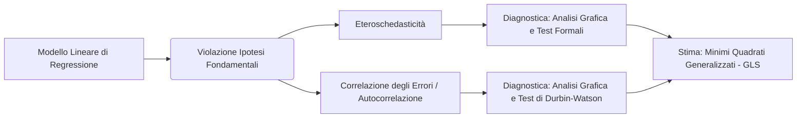

**Spiegazione Concettuale e Panoramica del Capitolo**
Il capitolo analizza le casistiche in cui il modello lineare di regressione multipla viola due delle ipotesi fondamentali assunte per la componente stocastica $\varepsilon$: l'omoschedasticità e l'incorrelazione degli errori. Nel modello classico, si assume che la matrice di varianze e covarianze degli errori sia diagonale e a varianza costante, ovvero $V(\varepsilon | X) = \sigma^2 I$. Il capitolo estende tale costrutto introducendo una situazione più generale in cui la matrice di varianze e covarianze assume la struttura $V(\varepsilon | X) = \sigma^2 \Omega$, dove $\Omega$ è una matrice simmetrica e definita positiva che quantifica l'eterogeneità o la correlazione tra gli errori. 

La prima violazione trattata è l'**eteroschedasticità**, che si verifica quando la variabilità della variabile dipendente (e di conseguenza la varianza dell'errore) non è costante, ma assume valori diversi in funzione dei regressori. In questo caso, la matrice $\Omega$ rimane diagonale ma con elementi $\lambda_1, \dots, \lambda_n$ differenti sulla diagonale principale. La seconda violazione è la **correlazione tra gli errori**, in particolare la **correlazione seriale**, un fenomeno tipico dei dati tratti da serie storiche in cui la covarianza tra gli errori al tempo $i$ e al tempo $j$ non è nulla e dipende dalla distanza temporale $|i-j|$. Per ovviare all'inefficienza degli stimatori ai Minimi Quadrati Ordinari in tali scenari, il capitolo introduce il metodo di stima dei Minimi Quadrati Generalizzati (GLS).

**Contesto Accademico**
L'argomento si posiziona all'interno della teoria dell'Inferenza Statistica e dello Statistical Learning come estensione avanzata e fase diagnostica del Modello Lineare Classico. La costruzione di un modello statistico segue un processo iterativo composto da tre fasi: specificazione, stima e diagnostica. Il presente capitolo si colloca esattamente all'intersezione tra la diagnostica (valutazione della validità delle ipotesi di Gauss-Markov tramite analisi dei residui e test statistici) e la re-specificazione del metodo di stima (transizione da OLS a GLS/WLS). La comprensione di queste violazioni è propedeutica allo studio di modelli più complessi, come i Modelli Lineari Generalizzati.

**Macro Argomenti Affrontati**
* **Formulazione Matematica della Violazione:** Generalizzazione della matrice di varianze e covarianze degli errori ($V(\boldsymbol{\varepsilon}) = \sigma^2 \boldsymbol{\Omega}$).
* **Eteroschedasticità:**
 * Definizione e rappresentazione matriciale.
 * Diagnostica tramite analisi grafica dei residui rispetto alle ordinate stimate ($\hat{Y}_i$) o ai regressori.
 * Test di verifica d'ipotesi: INFORMAZIONE NON PRESENTE NELLE FONTI (nel dettaglio completo, le fonti menzionano esplicitamente solo l'esistenza di test come Breusch-Pagan e White e formulazioni generali dell'ipotesi alternativa $H_1$ ).
 * Stima tramite Minimi Quadrati Pesati (WLS) applicati ai dati trasformati.
* **Autocorrelazione (Correlazione Seriale):**
 * Definizione matematica e applicazione nel contesto delle serie storiche.
 * Schema autoregressivo del primo ordine $AR(1)$ espresso come $\varepsilon_i = \rho \varepsilon_{i-1} + v_i$.
 * Diagnostica tramite analisi grafica dei residui sfasati $(\hat{\varepsilon}_i, \hat{\varepsilon}_{i-1})$.
 * Test statistico formale: Test di Durbin-Watson basato sulla statistica $d$ per la verifica dell'incorrelazione.
* **Minimi Quadrati Generalizzati (GLS):** Formalizzazione dello stimatore $\hat{\boldsymbol{\beta}}^* = (\mathbf{X}^t \boldsymbol{\Omega}^{-1} \mathbf{X})^{-1} \mathbf{X}^t \boldsymbol{\Omega}^{-1} \mathbf{Y}$ come soluzione efficiente per la stima dei parametri in presenza di matrice $\Omega$ nota o preventivamente stimata.