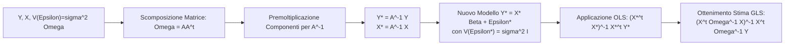

## 3.1 Minimi Quadrati Generalizzati (GLS)

**Diagramma Paragrafo:**

**Spiegazione:**
Il paragrafo affronta le conseguenze teoriche della violazione delle ipotesi fondamentali del modello lineare classico relative alla matrice di varianze e covarianze degli errori. Qualora gli errori non risultino omoschedastici e/o incorrelati, la stima ai minimi quadrati ordinari (OLS) perde la proprietà di massima efficienza nella classe degli stimatori lineari e non distorti. Per ristabilire le condizioni previste dal teorema di Gauss-Markov, si introduce una trasformazione lineare della matrice dei dati che genera un nuovo modello in cui gli errori soddisfano le ipotesi standard. L'applicazione degli OLS su tale modello trasformato origina la classe degli stimatori ai Minimi Quadrati Generalizzati (GLS).

#### Violazione Ipotesi Fondamentali

**Definizione:**
Nel modello lineare classico $\mathbf{y} = \mathbf{X}\boldsymbol{\beta} + \boldsymbol{\varepsilon}$, le ipotesi fondamentali assumono che il valore atteso condizionato degli errori sia nullo, $E(\boldsymbol{\varepsilon} | \mathbf{X}) = \mathbf{0}$, e che la matrice di varianze e covarianze sia sferica, ovvero $V(\boldsymbol{\varepsilon} | \mathbf{X}) = \sigma^2 \mathbf{I}$. La violazione di quest'ultima ipotesi si verifica quando la matrice assume la struttura generale $V(\boldsymbol{\varepsilon} | \mathbf{X}) = \boldsymbol{\Sigma} = \sigma^2 \boldsymbol{\Omega}$, dove $\boldsymbol{\Omega}$ è una matrice simmetrica e definita positiva nota (ad eccezione dello scalare incognito $\sigma^2$).

**Spiegazione:**
L'ipotesi $V(\boldsymbol{\varepsilon} | \mathbf{X}) = \sigma^2 \mathbf{I}$ implica omoscedasticità, ovvero varianza costante $\sigma^2$ per ogni errore, e incorrelazione, ovvero covarianza nulla tra errori distinti. La forma $V(\boldsymbol{\varepsilon} | \mathbf{X}) = \sigma^2 \boldsymbol{\Omega}$ formalizza il caso di eterogeneità e/o correlazione seriale tra gli errori del modello. In questo contesto di violazione, lo stimatore ai minimi quadrati ordinari (OLS) rimane uno stimatore non distorto per il vettore $\boldsymbol{\beta}$, ma cessa di essere il più efficiente all'interno della sua classe (non è più l'estimatore BLUE - Best Linear Unbiased Estimator).

**Dimostrazioni:**
INFORMAZIONE NON PRESENTE NELLE FONTI.

**Diagrammi:**
INFORMAZIONE NON PRESENTE NELLE FONTI.

**Spiegazione della dimostrazione:**
INFORMAZIONE NON PRESENTE NELLE FONTI.

#### Minimi Quadrati Generalizzati (Generalized Least Square – GLS)

**Definizione:**
Lo stimatore ai minimi quadrati generalizzati (GLS) è definito dall'equazione $\hat{\boldsymbol{\beta}}^* = (\mathbf{X}^t \boldsymbol{\Omega}^{-1} \mathbf{X})^{-1} \mathbf{X}^t \boldsymbol{\Omega}^{-1} \mathbf{Y}$, e rappresenta lo stimatore lineare e non distorto più efficiente per i coefficienti $\boldsymbol{\beta}$ sotto l'ipotesi che $V(\boldsymbol{\varepsilon}) = \sigma^2 \boldsymbol{\Omega}$.

**Spiegazione:**
Il metodo GLS trasforma il modello originale mal specificato in uno che soddisfa rigorosamente le ipotesi classiche di Gauss-Markov. Poiché la matrice $\boldsymbol{\Omega}$ è simmetrica e definita positiva, ammette una scomposizione $\boldsymbol{\Omega} = \mathbf{A}\mathbf{A}^t$, ottenibile ad esempio tramite la scomposizione spettrale $\boldsymbol{\Omega} = \mathbf{Q}\boldsymbol{\Lambda}\mathbf{Q}^t$ ponendo $\mathbf{A} = \mathbf{Q}\boldsymbol{\Lambda}^{1/2}$. Premoltiplicando l'intero modello lineare per la matrice inversa $\mathbf{A}^{-1}$, si isolano le variabili trasformate $\mathbf{Y}^* = \mathbf{A}^{-1}\mathbf{Y}$, $\mathbf{X}^* = \mathbf{A}^{-1}\mathbf{X}$ ed $\boldsymbol{\varepsilon}^* = \mathbf{A}^{-1}\boldsymbol{\varepsilon}$. Il modello risultante $\mathbf{Y}^* = \mathbf{X}^* \boldsymbol{\beta} + \boldsymbol{\varepsilon}^*$ possiede per costruzione errori omoscedastici e incorrelati, rendendo applicabile e ottimale la stima ai minimi quadrati.

**Dimostrazioni:**
1. *Proprietà del Modello Trasformato:*
Il valore atteso degli errori trasformati risulta nullo: $E(\boldsymbol{\varepsilon}^*) = \mathbf{A}^{-1}E(\boldsymbol{\varepsilon}) = \mathbf{0}$.
La matrice di varianze e covarianze degli errori trasformati si riconduce a una struttura sferica:
$V(\boldsymbol{\varepsilon}^*) = E(\boldsymbol{\varepsilon}^* (\boldsymbol{\varepsilon}^*)^t) = E[\mathbf{A}^{-1}\boldsymbol{\varepsilon} (\mathbf{A}^{-1}\boldsymbol{\varepsilon})^t] = \mathbf{A}^{-1}E[\boldsymbol{\varepsilon}\boldsymbol{\varepsilon}^t](\mathbf{A}^{-1})^t = \mathbf{A}^{-1}V(\boldsymbol{\varepsilon})(\mathbf{A}^{-1})^t$.
Essendo per ipotesi $V(\boldsymbol{\varepsilon}) = \sigma^2\boldsymbol{\Omega}$ e sapendo che $\boldsymbol{\Omega} = \mathbf{A}\mathbf{A}^t$, si ricava che $\mathbf{A}^{-1}\boldsymbol{\Omega}(\mathbf{A}^{-1})^t = \mathbf{A}^{-1}(\mathbf{A}\mathbf{A}^t)(\mathbf{A}^t)^{-1} = \mathbf{I}$.
Pertanto: $V(\boldsymbol{\varepsilon}^*) = \sigma^2 \mathbf{I}$.

2. *Derivazione dello stimatore GLS:*
L'applicazione degli OLS ai dati trasformati $\mathbf{X}^*$ ed $\mathbf{Y}^*$ produce:
$\hat{\boldsymbol{\beta}}^* = ((\mathbf{X}^*)^t \mathbf{X}^*)^{-1} (\mathbf{X}^*)^t \mathbf{Y}^*$.
Sostituendo $\mathbf{X}^* = \mathbf{A}^{-1}\mathbf{X}$ e $\mathbf{Y}^* = \mathbf{A}^{-1}\mathbf{Y}$:
$\hat{\boldsymbol{\beta}}^* = ((\mathbf{A}^{-1}\mathbf{X})^t \mathbf{A}^{-1}\mathbf{X})^{-1} (\mathbf{A}^{-1}\mathbf{X})^t \mathbf{A}^{-1}\mathbf{Y} = (\mathbf{X}^t(\mathbf{A}^{-1})^t \mathbf{A}^{-1}\mathbf{X})^{-1} \mathbf{X}^t(\mathbf{A}^{-1})^t \mathbf{A}^{-1}\mathbf{Y}$.
Dalla scomposizione $\boldsymbol{\Omega} = \mathbf{A}\mathbf{A}^t$, si deduce che $\boldsymbol{\Omega}^{-1} = (\mathbf{A}^t)^{-1}\mathbf{A}^{-1} = (\mathbf{A}^{-1})^t \mathbf{A}^{-1}$. Sostituendo questa identità, si estrapola la formula finale: $\hat{\boldsymbol{\beta}}^* = (\mathbf{X}^t\boldsymbol{\Omega}^{-1}\mathbf{X})^{-1}\mathbf{X}^t\boldsymbol{\Omega}^{-1}\mathbf{Y}$.

3. *Matrice di Varianze e Covarianze dello Stimatore GLS:*
$V(\hat{\boldsymbol{\beta}}^*) = V [(\mathbf{X}^t \boldsymbol{\Omega}^{-1} \mathbf{X})^{-1} \mathbf{X}^t \boldsymbol{\Omega}^{-1} \mathbf{Y}] = (\mathbf{X}^t \boldsymbol{\Omega}^{-1} \mathbf{X})^{-1} \mathbf{X}^t \boldsymbol{\Omega}^{-1} V(\mathbf{Y}) [(\mathbf{X}^t \boldsymbol{\Omega}^{-1} \mathbf{X})^{-1} \mathbf{X}^t \boldsymbol{\Omega}^{-1}]^t$.
Sostituendo $V(\mathbf{Y}) = \sigma^2 \boldsymbol{\Omega}$:
$V(\hat{\boldsymbol{\beta}}^*) = (\mathbf{X}^t \boldsymbol{\Omega}^{-1} \mathbf{X})^{-1} \mathbf{X}^t \boldsymbol{\Omega}^{-1} \sigma^2 \boldsymbol{\Omega} \boldsymbol{\Omega}^{-1} \mathbf{X} (\mathbf{X}^t \boldsymbol{\Omega}^{-1} \mathbf{X})^{-1} = \sigma^2 (\mathbf{X}^t \boldsymbol{\Omega}^{-1} \mathbf{X})^{-1}$.

**Diagrammi:**

**Spiegazione della dimostrazione:**
Il flusso dimostrativo si articola in tre fondamentali passaggi algebrici ed inferenziali. Nel primo passaggio, si dimostra formalmente che l'operazione di trasformazione lineare sulle variabili del sistema originario mediante la matrice $\mathbf{A}^{-1}$ è in grado di normalizzare la matrice di covarianza degli errori, conducendo il termine accidentale trasformato $\boldsymbol{\varepsilon}^*$ ad avere aspettativa nulla e invarianza scalare pari a $\sigma^2 \mathbf{I}$, eliminando quindi gli effetti perturbatori dell'eterogeneità di varianza o della correlazione.
Nel secondo passaggio, l'applicazione canonica dello stimatore dei minimi quadrati sulle nuove matrici generate ($\mathbf{X}^*$ ed $\mathbf{Y}^*$) consente l'estrazione analitica dell'equazione risolutiva di GLS; il cuore matematico consiste nell'impiego della decomposizione dell'inversa di $\boldsymbol{\Omega}$ come elemento di raccordo tra le forme isolate della formula OLS.
L'ultimo passaggio determina il livello di efficienza della stima, manipolando l'operatore Varianza e dimostrando la validità del teorema di Aitken; tramite semplificazioni algebriche interne dell'identità $\boldsymbol{\Omega} \boldsymbol{\Omega}^{-1}$, si giunge all'espressione della varianza campionaria $\sigma^2 (\mathbf{X}^t \boldsymbol{\Omega}^{-1} \mathbf{X})^{-1}$. Per impieghi pratici, si calcola lo stimatore della varianza residua non distorta $\sigma^2$ utilizzando il vettore dei residui trasformati $\mathbf{e} = \mathbf{y} - \mathbf{X}\hat{\boldsymbol{\beta}}_{GLS}$ rapportato ai gradi di libertà, risultando nell'espressione $\hat{\sigma}^2_{GLS} = \frac{\mathbf{e}^t \boldsymbol{\Omega}^{-1} \mathbf{e}}{n-p}$.