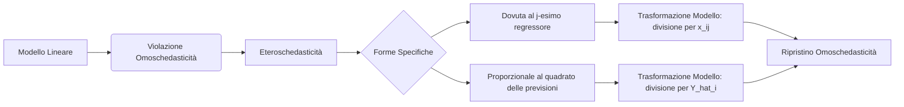

**Spiegazione:** 
L'eteroschedasticità rappresenta una violazione di una delle ipotesi fondamentali del modello lineare classico: l'omoschedasticità. Quando tale ipotesi cade, la variabilità della variabile dipendente e dell'errore stocastico non è costante, ma muta al variare delle osservazioni. Il quadro teorico per la risoluzione di questo problema si inquadra nei Minimi Quadrati Generalizzati (GLS), in cui si ricorre a specifiche trasformazioni sui dati iniziali per ricondurre la matrice di varianze e covarianze degli errori a una forma proporzionale alla matrice identità, consentendo di ottenere stimatori corretti ed efficienti. In ambito statistico-econometrico, la diagnosi dell'eteroschedasticità avviene prima in forma esplorativa tramite l'analisi grafica dei residui e successivamente in forma rigorosa attraverso test d'ipotesi, formalizzando scenari in cui la varianza degli errori è una specifica funzione matematica dei regressori o della variabile dipendente.

#### Eteroschedasticità
* **Definizione:** L'eteroschedasticità si verifica quando la variabilità della variabile dipendente, o in maniera equivalente la varianza della componente d'errore casuale $\boldsymbol{\varepsilon}$, assume valori diversi a seconda dei valori assunti da uno o più regressori. 
* **Spiegazione:** Sotto eteroschedasticità, l'ipotesi $V(\varepsilon_i) = \sigma^2$ cade. Ipotizzando che gli errori rimangano incorrelati (nessuna dipendenza seriale), la matrice di varianze e covarianze assume una forma diagonale $V(\boldsymbol{\varepsilon} \mid \mathbf{X}) = \sigma^2 \boldsymbol{\Omega}$, in cui gli elementi sulla diagonale principale non sono unitari ma pari a determinati coefficienti $\lambda_1, \lambda_2, \dots, \lambda_n$. Conseguentemente, per la singola unità $i$-esima, si ottiene $V(\varepsilon_i) = E(\varepsilon_i^2) = \sigma^2 \lambda_i$. Per rilevare questa violazione in modo rigoroso, si pone un'ipotesi nulla di omoschedasticità $H_0: V(\varepsilon_1) = V(\varepsilon_2) = \dots = V(\varepsilon_n) = \sigma^2$ e un'ipotesi alternativa $H_1$ in cui la varianza dipende da una funzione che include i regressori e/o i valori stimati, descritta genericamente come $V(\varepsilon_i) = g \left( \alpha_0 + \sum_{j=1}^r \alpha_j h(x_{ij}) + k(\hat{Y}_i) \right)$.
* **Dimostrazioni:** INFORMAZIONE NON PRESENTE NELLE FONTI.
* **Diagrammi:** INFORMAZIONE NON PRESENTE NELLE FONTI.
* **Spiegazione della dimostrazione:** INFORMAZIONE NON PRESENTE NELLE FONTI.

#### Eteroschedasticità dovuta al j-esimo regressore
* **Definizione:** È una forma specifica di eteroschedasticità in cui la varianza dell'errore accidentale subisce un'influenza diretta da parte di uno specifico regressore ($j$-esimo) del modello.
* **Spiegazione:** In tale occorrenza, si definisce $\lambda_i = x_{ij}^2$ in modo che la varianza diventi esplicitamente dipendente dal quadrato del regressore: $V(\varepsilon_i) = \sigma^2 x_{ij}^2$. Sotto la cornice tecnica dei Minimi Quadrati Generalizzati, la matrice di ponderazione $\mathbf{A}^{-1} = \boldsymbol{\Lambda}^{-1/2}$ risulta essere una matrice diagonale i cui elementi sono $\frac{1}{x_{1j}}, \frac{1}{x_{2j}}, \dots, \frac{1}{x_{nj}}$. Si procede dunque a trasformare ogni termine del modello lineare originario dividendolo per il valore di $x_{ij}$.
* **Dimostrazioni:** 
Dato il modello trasformato: 
$$\frac{Y_i}{x_{ij}} = \frac{\beta_0}{x_{ij}} + \beta_1 \frac{x_{1i}}{x_{ij}} + \dots + \beta_k \frac{x_{ki}}{x_{ij}} + \frac{\varepsilon_i}{x_{ij}} \quad \text{per } i=1,\dots,n$$
Calcolo della varianza del nuovo termine stocastico:
$$V \left( \frac{\varepsilon_i}{x_{ij}} \right) = \frac{V(\varepsilon_i)}{x_{ij}^2} = \frac{\sigma^2 \lambda_i}{x_{ij}^2} = \frac{\sigma^2 x_{ij}^2}{x_{ij}^2} = \sigma^2$$.
* **Diagrammi:** INFORMAZIONE NON PRESENTE NELLE FONTI.
* **Spiegazione della dimostrazione:** La dimostrazione mostra la derivazione formale dell'assunto dei Minimi Quadrati Ponderati. Sostituendo al numeratore il termine di varianza ipotizzata sotto $H_1$, ossia $V(\varepsilon_i) = \sigma^2 x_{ij}^2$, i fattori $x_{ij}^2$ presenti al numeratore e al denominatore si semplificano. Questa operazione restituisce $\sigma^2$ garantendo che gli errori del modello trasformato siano tornati in una condizione di stretta omoschedasticità e, conseguentemente, si possano stimare efficientemente i parametri tramite Minimi Quadrati.

#### Eteroschedasticità proporzionale al quadrato delle previsioni
* **Definizione:** È il caso in cui il problema di eteroschedasticità deriva da una proporzionalità tra la varianza degli errori casuali e le ordinate stimate generate dal modello originario.
* **Spiegazione:** In questo contesto strutturale si pone formalmente $\lambda_i = \hat{Y}_i^2$, indicando che la varianza associata alla generica variabile si espande al crescere delle ordinate stimate: $V(\varepsilon_i) = \sigma^2 \hat{Y}_i^2$. Pertanto, la matrice inversa delle perturbazioni $\mathbf{A}^{-1} = \boldsymbol{\Lambda}^{-1/2}$ conterrà i reciproci delle previsioni ($\frac{1}{\hat{Y}_1}, \frac{1}{\hat{Y}_2}, \dots, \frac{1}{\hat{Y}_n}$) lungo la diagonale principale. Per stabilizzare la varianza, l'intero modello lineare originario viene diviso iterativamente per i valori previsti ($\hat{Y}_i$).
* **Dimostrazioni:** 
Dato il modello trasformato:
$$\frac{Y_i}{\hat{Y}_i} = \frac{\beta_0}{\hat{Y}_i} + \beta_1 \frac{x_{1i}}{\hat{Y}_i} + \dots + \beta_k \frac{x_{ki}}{\hat{Y}_i} + \frac{\varepsilon_i}{\hat{Y}_i} \quad \text{per } i=1,\dots,n$$
La varianza del termine di errore riparametrato è definita da:
$$V \left( \frac{\varepsilon_i}{\hat{Y}_i} \right) = \frac{V(\varepsilon_i)}{\hat{Y}_i^2} = \frac{\sigma^2 \lambda_i}{\hat{Y}_i^2} = \frac{\sigma^2 \hat{Y}_i^2}{\hat{Y}_i^2} = \sigma^2$$.
* **Diagrammi:** INFORMAZIONE NON PRESENTE NELLE FONTI.
* **Spiegazione della dimostrazione:** Questa relazione algebrica convalida l'efficacia del metodo per ripristinare il rispetto delle ipotesi di Gauss-Markov. Quando si rielabora la frazione estraendo la costante dal momento secondo tramite la proprietà della varianza $V\left(\frac{W}{c}\right) = \frac{V(W)}{c^2}$, e sostituendo $\sigma^2 \hat{Y}_i^2$ nel numeratore, le quantità dipendenti dalla previsione si elidono perfettamente, rivelando una perturbazione $\sigma^2$ stabilizzata e indipendente.