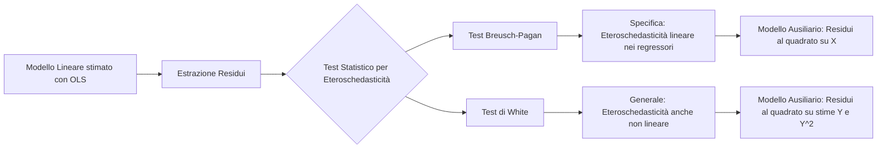

## 3.3 Test Breusch-Pagan e White

**Diagramma Paragrafo:**

**Spiegazione:**
L'esame grafico dei residui può fornire unicamente indicazioni preliminari circa la presenza di eteroschedasticità, ma non è sufficiente per trarre conclusioni rigorose. Si rende pertanto necessario il ricorso a test statistici formali. In letteratura econometrica e statistica, l'ipotesi nulla comune a tali test è l'assunzione di omoschedasticità, in cui la varianza degli errori si assume costantemente uguale a $\sigma^2$, ossia $H_0: V(\varepsilon_1) = V(\varepsilon_2) = \dots = V(\varepsilon_n) = \sigma^2$. L'ipotesi alternativa, $H_1$, rappresenta l'allontanamento dall'omoschedasticità e prevede generalmente che le varianze siano funzioni di un sottoinsieme dei regressori e/o della variabile dipendente stimata. I test di Breusch-Pagan e di White rappresentano due metodologie basate su modelli lineari ausiliari atti a verificare la dipendenza della varianza dell'errore (approssimata dai residui campionari al quadrato) da altre variabili del modello.

---

#### Test Breusch-Pagan

* **Definizione:**
 Il test di Breusch-Pagan (BP) è un test statistico che consente di verificare l'ipotesi di omoschedasticità contro un'ipotesi alternativa specifica in cui si ipotizza che gli errori (o meglio, la loro varianza) dipendano in media linearmente dai regressori del modello.

* **Spiegazione:**
 Il sistema d'ipotesi del test è strutturato come segue:
 $H_0: \text{omoschedasticità}$ contro $H_1: \boldsymbol{\varepsilon}^2 \text{ è in media funzione lineare dei regressori}$.
 
 Il test si basa sulla stima di un modello lineare ausiliario:
 $\varepsilon_i^2 = \delta_0 + \delta_1 x_{1i} + \dots + \delta_k x_{ki} + u_i \quad \text{per } i=1,\dots,n$.
 L'errore $u_i$ di tale modello soddisfa le ipotesi fondamentali e possiede varianza costante $V(u)=k$. Il sistema d'ipotesi si traduce quindi in un test di significatività congiunta sui parametri del modello ausiliario:
 $H_0: \delta_1 = \dots = \delta_k = 0 \quad \text{contro} \quad H_1: \text{almeno un } \delta \text{ diverso da zero}$.
 
 La procedura operativa richiede l'estrazione dei residui OLS $\hat{\varepsilon}_i$ dal modello lineare principale e la successiva stima OLS dei parametri $\delta_0, \delta_1, \dots, \delta_k$ del modello ausiliario $\hat{\varepsilon}_i^2 = \delta_0 + \delta_1 x_{1i} + \dots + \delta_k x_{ki} + u_i$. 
 
 La statistica test calcolata è la statistica $F$ di Fisher:
 $F = \frac{SQM/(p-1)}{SQR/(n-p)} \sim F(p-1, n-p)$.
 Se $F > F_{\alpha}$, l'ipotesi nulla viene rifiutata.
 In alternativa, il test può basarsi sulla statistica asintotica del moltiplicatore di Lagrange (LM):
 $\chi^2 = n R^2_{\hat{\varepsilon}^2} \sim \chi^2(p-1)$ (o $\chi^2(k)$), rifiutando l'ipotesi nulla se $\chi^2 > \chi^2_{\alpha}$. Il test risulta tuttavia sensibile alla scelta specifica dei regressori inseriti nel modello ausiliario.

* **Dimostrazioni:**
 INFORMAZIONE NON PRESENTE NELLE FONTI.

* **Diagrammi:**
 INFORMAZIONE NON PRESENTE NELLE FONTI.

* **Spiegazione della dimostrazione:**
 INFORMAZIONE NON PRESENTE NELLE FONTI.

---

#### Test di White

* **Definizione:**
 Il test di White è un test generale per la diagnosi di eteroschedasticità che non richiede di specificarne a priori l'esatta forma funzionale, risultando in grado di cogliere anche allontanamenti non lineari dall'assunzione di varianza costante.

* **Spiegazione:**
 Il test impiega un modello ausiliario che fa regredire i residui al quadrato $\hat{\varepsilon}_i^2$ sui regressori originari, i loro quadrati e i loro prodotti incrociati (interazioni). Tuttavia, in applicazioni pratiche con campioni di dimensione non elevata, l'inserimento di tutti i regressori, dei loro quadrati e delle loro interazioni a coppie produrrebbe un drammatico calo dei gradi di libertà, rendendo l'utilizzo asintotico del test invalido (es. 7 regressori generano 35 variabili esplicative nel modello ausiliario). 
 
 Per ovviare a ciò, si utilizza una versione semplificata che prevede che la varianza dipenda dal quadrato delle previsioni, ossia $V(\varepsilon_i) = E(\varepsilon_i^2) = \sigma^2 \hat{Y}_i^2$. Il modello lineare ausiliario semplificato diventa:
 $\hat{\varepsilon}_i^2 = \delta_0 + \delta_1 \hat{Y}_i + \delta_2 \hat{Y}_i^2 + u_i$.
 
 Il sistema delle ipotesi è:
 $H_0: \delta_1 = \delta_2 = 0 \quad \text{contro} \quad H_1: \text{almeno un } \delta \text{ diverso da zero}$.
 L'accettazione dell'ipotesi nulla implica che gli errori sono omoschedastici.
 
 Le statistiche test impiegabili sono:
 - Test F di Fisher: $F \sim F(2, n-3)$. Si rifiuta $H_0$ se $F > F_{\alpha}(2, n-3)$.
 - Statistica asintotica $\chi^2 = n R^2 \sim \chi^2(2)$ (dove i gradi di libertà coincidono con il numero di regressori nel modello ausiliario, o $\chi^2(q)$ nel caso generale). Si rifiuta l'ipotesi nulla se $\chi^2 > \chi^2_{\alpha}(2)$.

* **Dimostrazioni:**
 INFORMAZIONE NON PRESENTE NELLE FONTI.

* **Diagrammi:**
 INFORMAZIONE NON PRESENTE NELLE FONTI.

* **Spiegazione della dimostrazione:**
 INFORMAZIONE NON PRESENTE NELLE FONTI.